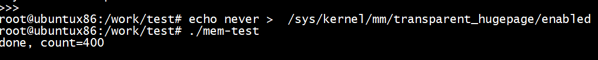

```
root@ubuntux86:/home/ubuntu# ps -elf | grep mem-test
0 S root        2471    2353  0  80   0 - 205425 hrtime 11:16 pts/1   00:00:00 ./mem-test
0 S root        2473    2402  0  80   0 -  3029 pipe_r 11:16 pts/2    00:00:00 grep --color=auto mem-test
root@ubuntux86:/home/ubuntu# pmap -x   2471 
2471:   ./mem-test
Address           Kbytes     RSS   Dirty Mode  Mapping
00005633e0462000       4       4       0 r---- mem-test
00005633e0463000       4       4       0 r-x-- mem-test
00005633e0464000       4       0       0 r---- mem-test
00005633e0465000       4       4       4 r---- mem-test
00005633e0466000       4       4       4 rw--- mem-test
00005633e0e3f000     132       4       4 rw---   [ anon ]
00007fb33f828000  819204       4       4 rw---   [ anon ]
00007fb371829000     136     136       0 r---- libc-2.31.so
00007fb37184b000    1504     652       0 r-x-- libc-2.31.so
00007fb3719c3000     312      64       0 r---- libc-2.31.so
00007fb371a11000      16      16      16 r---- libc-2.31.so
00007fb371a15000       8       8       8 rw--- libc-2.31.so
00007fb371a17000      24      20      20 rw---   [ anon ]
00007fb371a32000       4       4       0 r---- ld-2.31.so
00007fb371a33000     140     140       0 r-x-- ld-2.31.so
00007fb371a56000      32      32       0 r---- ld-2.31.so
00007fb371a5f000       4       4       4 r---- ld-2.31.so
00007fb371a60000       4       4       4 rw--- ld-2.31.so
00007fb371a61000       4       4       4 rw---   [ anon ]
00007ffda2310000     132      12      12 rw---   [ stack ]
00007ffda2349000      16       0       0 r----   [ anon ]
00007ffda234d000       8       4       0 r-x--   [ anon ]
ffffffffff600000       4       0       0 --x--   [ anon ]
---------------- ------- ------- ------- 
total kB          821704    1124      84
```


输出***done, count=400后***，占用的内存增大了

```
root@ubuntux86:/home/ubuntu# pmap -x   2471 
2471:   ./mem-test
Address           Kbytes     RSS   Dirty Mode  Mapping
00005633e0462000       4       4       0 r---- mem-test
00005633e0463000       4       4       0 r-x-- mem-test
00005633e0464000       4       4       0 r---- mem-test
00005633e0465000       4       4       4 r---- mem-test
00005633e0466000       4       4       4 rw--- mem-test
00005633e0e3f000     132       4       4 rw---   [ anon ]
00007fb33f828000  819204    3200    3200 rw---   [ anon ]
00007fb371829000     136     136       0 r---- libc-2.31.so
00007fb37184b000    1504     908       0 r-x-- libc-2.31.so
00007fb3719c3000     312     124       0 r---- libc-2.31.so
00007fb371a11000      16      16      16 r---- libc-2.31.so
00007fb371a15000       8       8       8 rw--- libc-2.31.so
00007fb371a17000      24      20      20 rw---   [ anon ]
00007fb371a32000       4       4       0 r---- ld-2.31.so
00007fb371a33000     140     140       0 r-x-- ld-2.31.so
00007fb371a56000      32      32       0 r---- ld-2.31.so
00007fb371a5f000       4       4       4 r---- ld-2.31.so
00007fb371a60000       4       4       4 rw--- ld-2.31.so
00007fb371a61000       4       4       4 rw---   [ anon ]
00007ffda2310000     132      12      12 rw---   [ stack ]
00007ffda2349000      16       0       0 r----   [ anon ]
00007ffda234d000       8       4       0 r-x--   [ anon ]
ffffffffff600000       4       0       0 --x--   [ anon ]
---------------- ------- ------- ------- 
total kB          821704    4640    3280
root@ubuntux86:/home/ubuntu#  
```