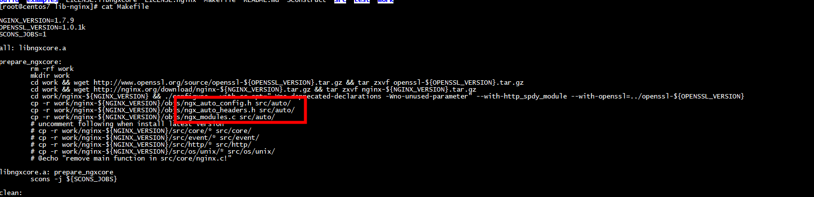
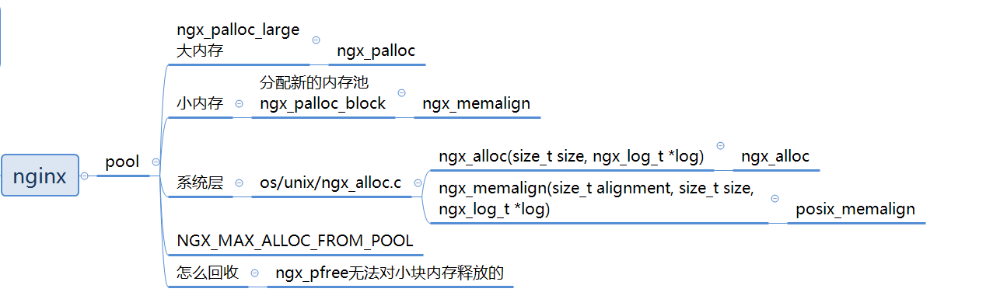

#  ngx_auto_headers.h

```C
find ./ -name ngx_auto_headers.h
./src/auto/ngx_auto_headers.h
./work/nginx-1.7.9/objs/ngx_auto_headers.h
```


ngx_auto_headers.h  ngx_auto_config.h ngx_modules.c的生成




