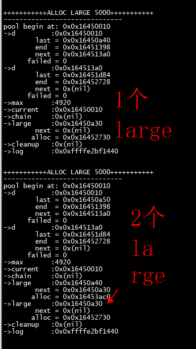

```
[root@centos7 demos]# ./mycc 
+++++++++++CREATE NEW POOL++++++++++++
------------------------------
pool begin at: 0x0x16450010
->d         :0x0x16450010
        last = 0x0x16450060
        end  = 0x0x16451398
        next = 0x(nil)
      failed = 0
->max       :4920
->current   :0x0x16450010
->chain     :0x(nil)
->large     :0x(nil)
->cleanup   :0x(nil)
->log       :0x0xffffe2bf1440


+++++++++++ALLOC 2500+++++++++++++++++
------------------------------
pool begin at: 0x0x16450010
->d         :0x0x16450010
        last = 0x0x16450a24
        end  = 0x0x16451398
        next = 0x(nil)
      failed = 0
->max       :4920
->current   :0x0x16450010
->chain     :0x(nil)
->large     :0x(nil)
->cleanup   :0x(nil)
->log       :0x0xffffe2bf1440


+++++++++++ALLOC 2500+++++++++++++++++
------------------------------
pool begin at: 0x0x16450010
->d         :0x0x16450010
        last = 0x0x16450a24
        end  = 0x0x16451398
        next = 0x0x164513a0
      failed = 0
->d         :0x0x164513a0
        last = 0x0x16451d84
        end  = 0x0x16452728
        next = 0x(nil)
      failed = 0
->max       :4920
->current   :0x0x16450010
->chain     :0x(nil)
->large     :0x(nil)
->cleanup   :0x(nil)
->log       :0x0xffffe2bf1440


+++++++++++ALLOC LARGE 5000+++++++++++
------------------------------
pool begin at: 0x0x16450010
->d         :0x0x16450010
        last = 0x0x16450a40
        end  = 0x0x16451398
        next = 0x0x164513a0
      failed = 0
->d         :0x0x164513a0
        last = 0x0x16451d84
        end  = 0x0x16452728
        next = 0x(nil)
      failed = 0
->max       :4920
->current   :0x0x16450010
->chain     :0x(nil)
->large     :0x0x16450a30
        next = 0x(nil)
       alloc = 0x0x16452730
->cleanup   :0x(nil)
->log       :0x0xffffe2bf1440


+++++++++++ALLOC LARGE 5000+++++++++++
------------------------------
pool begin at: 0x0x16450010
->d         :0x0x16450010
        last = 0x0x16450a50
        end  = 0x0x16451398
        next = 0x0x164513a0
      failed = 0
->d         :0x0x164513a0
        last = 0x0x16451d84
        end  = 0x0x16452728
        next = 0x(nil)
      failed = 0
->max       :4920
->current   :0x0x16450010
->chain     :0x(nil)
->large     :0x0x16450a40
        next = 0x0x16450a30
       alloc = 0x0x16453ac0
->large     :0x0x16450a30
        next = 0x(nil)
       alloc = 0x0x16452730
->cleanup   :0x(nil)
->log       :0x0xffffe2bf1440
```
 




 