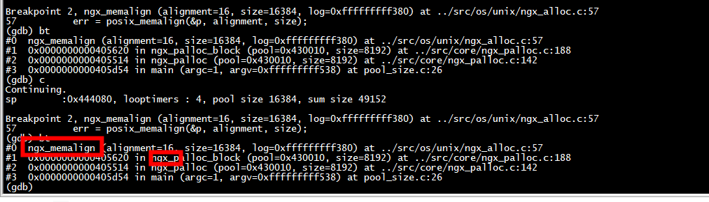

```
[root@centos7 examples]# ./mycc 
sp        :0x12690060, looptimers : 9, pool size 16384, sum size 8192 
sp        :0x12694040, looptimers : 8, pool size 16384, sum size 16384 
sp        :0x12698050, looptimers : 7, pool size 16384, sum size 24576 
sp        :0x1269c060, looptimers : 6, pool size 16384, sum size 32768 
sp        :0x126a0070, looptimers : 5, pool size 16384, sum size 40960 
sp        :0x126a4080, looptimers : 4, pool size 16384, sum size 49152 
sp        :0x126a8090, looptimers : 3, pool size 16384, sum size 57344 
sp        :0x126ac0a0, looptimers : 2, pool size 16384, sum size 65536 
sp        :0x126b00b0, looptimers : 1, pool size 16384, sum size 73728 
[root@centos7 examples]# 
```

除了在`ngx_create_pool`创建pool的时候会调用`ngx_memalign`分配内存，而且ngx_palloc->ngx_palloc_block->ngx_memalign也会调用`ngx_memalign`分配内存





# CFLAGS = -Wall -g -DNGX_DEBUG=1

```
[root@centos7 examples]# ./mycc 
sp        :0x36550060, looptimers : 9, pool size 16384, sum size 8192 
sp        :0x36554040, looptimers : 8, pool size 16384, sum size 16384 
sp        :0x36558050, looptimers : 7, pool size 16384, sum size 24576 
sp        :0x3655c060, looptimers : 6, pool size 16384, sum size 32768 
sp        :0x36560070, looptimers : 5, pool size 16384, sum size 40960 
sp        :0x36564080, looptimers : 4, pool size 16384, sum size 49152 
sp        :0x36568090, looptimers : 3, pool size 16384, sum size 57344 
sp        :0x3656c0a0, looptimers : 2, pool size 16384, sum size 65536 
sp        :0x365700b0, looptimers : 1, pool size 16384, sum size 73728 
nginxErr: ngx pool destroy
```