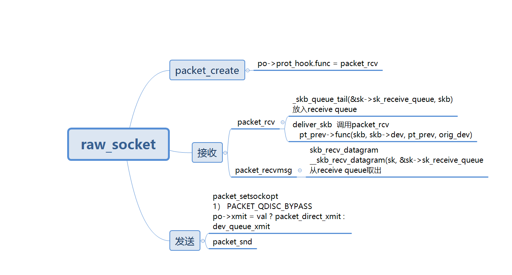
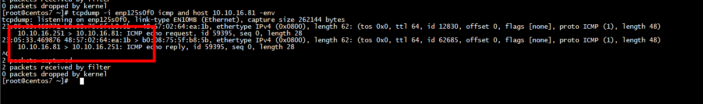
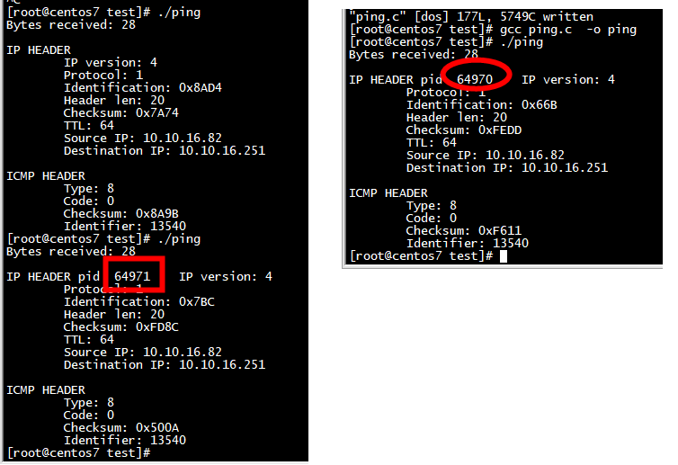
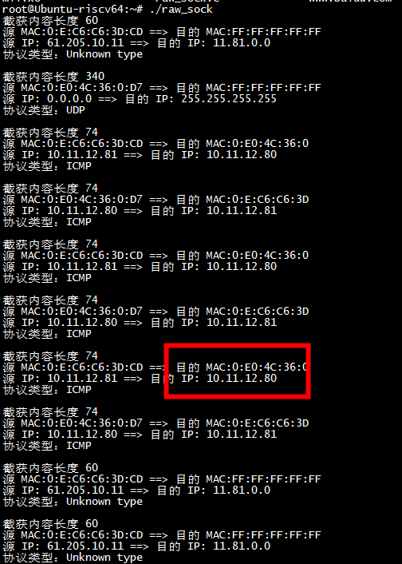
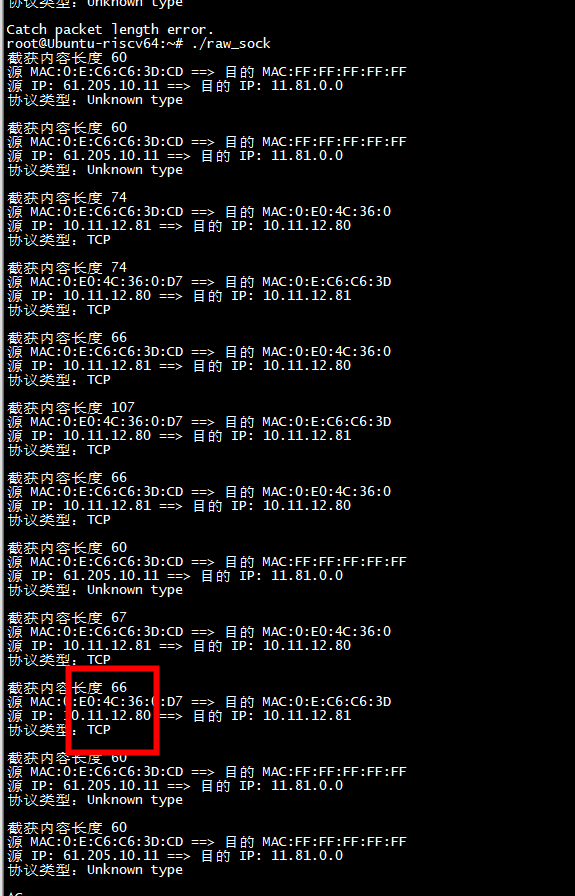

# ping 

```
[root@centos7 test]# gcc ping.c  -o ping
[root@centos7 test]# ./ping 
Bytes received: 28

IP HEADER
        IP version: 4
        Protocol: 1
        Identification: 0xE37B
        Header len: 20
        Checksum: 0x61F2
        TTL: 64
        Source IP: 10.10.16.81
        Destination IP: 10.10.16.251

ICMP HEADER
        Type: 0
        Code: 2
        Checksum: 0xBDBB
        Identifier: 1000
[root@centos7 test]# ./ping 
Bytes received: 28

IP HEADER
        IP version: 4
        Protocol: 1
        Identification: 0xF4DD
        Header len: 20
        Checksum: 0x5090
        TTL: 64
        Source IP: 10.10.16.81
        Destination IP: 10.10.16.251

ICMP HEADER
        Type: 0
        Code: 2
        Checksum: 0x3BDE
        Identifier: 1000
```




# 多个进程ping

***关闭发送***

```

#if 0
        if (sendto(sd, packet, sizeof(struct icmp)+sizeof(struct ip), 0, (struct sockaddr *)&sin, sizeof(struct sockaddr)) < 0)  {
                perror("sendto");
                exit(1);
        }
#endif
```



# raw socket 

//所有报文

```
	if( (sock = socket(PF_PACKET, SOCK_RAW, htons(ETH_P_ALL))) < 0 ){
		printf("Create socket error.\n");
		exit(0);
	}
```




