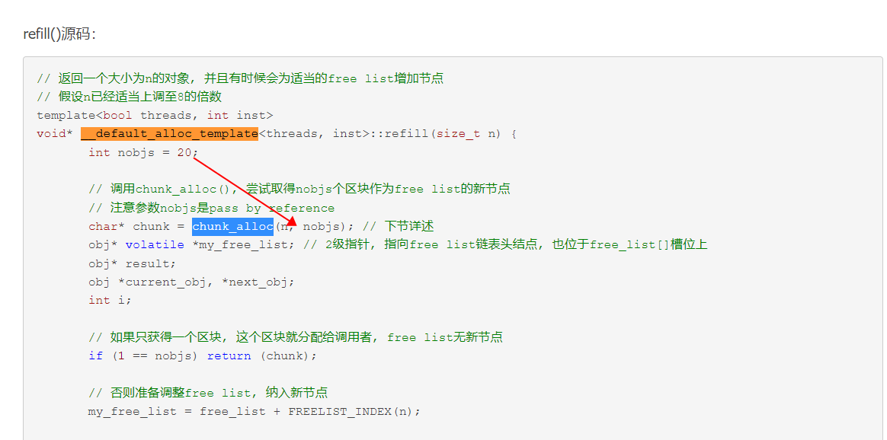
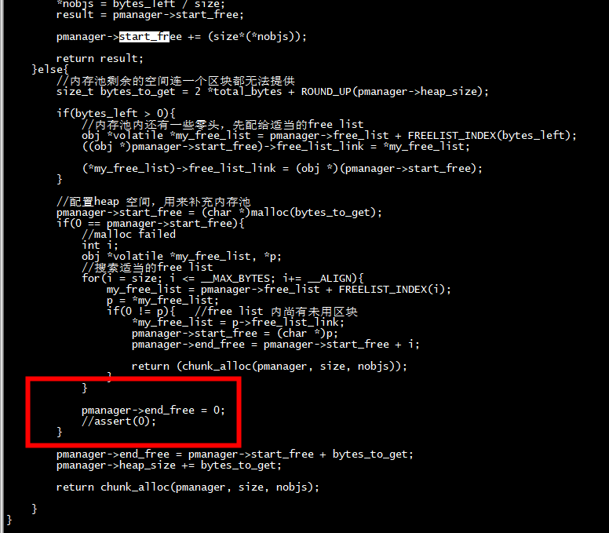

# stl_mempool

 gcc  myMemPool.c test.c  -o stl
------------

# index test

```
int main(void){

    int index = 1;
    while(index < 17)
    {
           printf("size %d, index %d \n", index*8, FREELIST_INDEX(index*8));
           ++ index;
    }
}
```

```
root@centos7 stl_mempool]# gcc myMemPool.c test.c  -o test
[root@centos7 stl_mempool]# ./test 
size 8, index 0 
size 16, index 1 
size 24, index 2 
size 32, index 3 
size 40, index 4 
size 48, index 5 
size 56, index 6 
size 64, index 7 
size 72, index 8 
size 80, index 9 
size 88, index 10 
size 96, index 11 
size 104, index 12 
size 112, index 13 
size 120, index 14 
size 128, index 15 
```

# refill

## refill 调用 chunk_alloc 申请20个obj




# 没有实现的功能



# 内存释放

整个stl仅仅使用一个alloc，16个free_list上的内存块，所有的容器都可以使用。***只有等程序结束时***，这些内存才会正真被释放。

# references


[SGI STL空间配置器allocator/alloc](https://www.cnblogs.com/fortunely/p/16219743.html)
