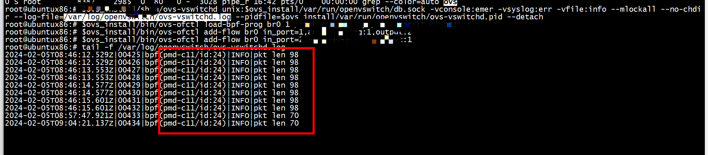

# ubpf

[iovisor/ubpf](https://github.com/iovisor/ubpf)

```
git clone https://github.com/iovisor/ubpf.git
git submodule update --init --recursive
```

iovisor的ubpf无法编译vm,rlane/ubpf可以编译  

[rlane/ubpf](https://github.com/rlane/ubpf.git)


```
root@ubuntux86:# clang -O2 -target bpf -c hello.c -o hello.o
root@ubuntux86:# ../vm/test hello.o
0x0
root@ubuntux86:# 
```

ubpf和ovs   

   


# make

  
+ 1) 编译 libbpf
```
./scripts/build-libbpf.sh
root@ubuntux86:# find ./ -name libbpf.a
./libbpf/src/libbpf.a
root@ubuntux86:# find ./ -name libbpf.h
./libbpf/src/libbpf.h
```

```
cmake -S . -B build -DUBPF_ENABLE_TESTS=true
```

# make M=samples/bpf
apt-get install libbfd-dev libcap-dev libzstd-dev libperl-dev libpython2-dev  libunwind-dev lzma libnuma-dev  
apt-get install llvm-9   
apt install llvm   
 make M=samples/bpf V=1    
```
make headers_install
```
+ 1 No libelf found （依赖tools/lib/bpf）

```
tools/lib/bpf/Makefile

elfdep:
        @if [ "$(feature-libelf)" != "1" ]; then echo "No libelf found"; exit 1 ; fi

bpfdep:
        @if [ "$(feature-bpf)" != "1" ]; then echo "BPF API too old"; exit 1 ; fi


```
注释掉  
```

#elfdep:
#       @if [ "$(feature-libelf)" != "1" ]; then echo "No libelf found"; exit 1 ; fi
#
#bpfdep:
#       @if [ "$(feature-bpf)" != "1" ]; then echo "BPF API too old"; exit 1 ; fi

# Declare the contents of the .PHONY variable as phony.  We keep that
# information in a variable so we can use it in if_changed and friends.
```

> ## 编译error  will not be visible outside of this function [-Werror,-Wvisibility]

[ will not be visible outside of this function](https://cloud.tencent.com/developer/ask/sof/115330366)


 试着添加struct XXXXX;

> ## 编译运行自己的BPF程序

如果你想利用Linux内核环境来编译自己的BPF程序，是非常方便的。只要对samples/bpf/目录下的Makefile进行一点点自定义改造即可，如果你仔细阅读了上面的分析，那么改造的原理就显而易见了：   

```Text
# 假设你自己BPF程序如下所示：
# 内核空间代码：my_bpf_101_kern.c
# 用户空间代码：my_bpf_101_user.c
# 从上之下，添加新的代码行
# 1. 追加新的一行至hostprogs-y开头的代码块最后，保证自己的BPF程序能够生成可执行文件
hostprogs-y += my_bpf_101
# 2. 一般BPF程序使用以下命令即可，具体取决于你的程序是否依赖其他特殊头文件
my_bpf_101-objs := bpf_load.o $(LIBBPF) my_bpf_101_user.o
# 3. 追加新的一行至always开头的代码块最后，保证触发生成可执行文件的任务
always += my_bpf_101_kern.o
一般的BPF程序只需要通过如上3处更新加入到Makefile中，就可以使用make samples/bpf/命令，生成你自己程序的可执行文件了。
```
# docker
Docker 容器无法启动问题，始终Exit(0),在创建容器的时候执行命令加一个 -d 参数   
```
root@ubuntux86:# docker run -it -d --name p4rt-ovs 135fe224bbb1 
d0fd3cd4d10ca1a34482859fad9512bf07a9a358edeece8bf749edb52d829b51
root@ubuntux86:# docker exec -it  p4rt-ovs bash
root@d0fd3cd4d10c:/# ip a
1: lo: <LOOPBACK,UP,LOWER_UP> mtu 65536 qdisc noqueue state UNKNOWN group default qlen 1000
    link/loopback 00:00:00:00:00:00 brd 00:00:00:00:00:00
    inet 127.0.0.1/8 scope host lo
       valid_lft forever preferred_lft forever
43: eth0@if44: <BROADCAST,MULTICAST,UP,LOWER_UP> mtu 1500 qdisc noqueue state UP group default 
    link/ether 02:42:ac:11:00:02 brd ff:ff:ff:ff:ff:ff link-netnsid 0
    inet 172.17.0.2/16 brd 172.17.255.255 scope global eth0
       valid_lft forever preferred_lft forever
root@d0fd3cd4d10c:/# 
```

# vm
[ubuntu-18.04-server-cloudimg-amd64.img ](https://cloud-images.ubuntu.com/releases/bionic/release-20230607/)

```
root@ubuntu:/boot# uname -a
Linux ubuntu 4.15.0-212-generic #223-Ubuntu SMP Tue May 23 13:09:22 UTC 2023 x86_64 x86_64 x86_64 GNU/Linux
root@ubuntu:/boot# 
```
