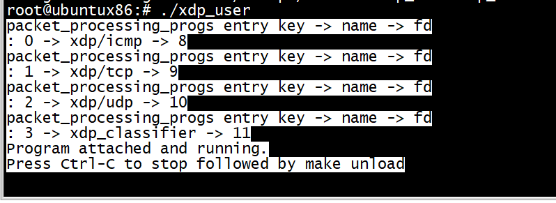

# 查看日志

```
 cat /sys/kernel/debug/tracing/trace
```

# run


```
root@ubuntux86:# ./xdp_user 
packet_processing_progs entry key -> name -> fd
: 0 -> xdp/icmp -> 8
packet_processing_progs entry key -> name -> fd
: 1 -> xdp/tcp -> 9
packet_processing_progs entry key -> name -> fd
: 2 -> xdp/udp -> 10
packet_processing_progs entry key -> name -> fd
: 3 -> xdp_classifier -> 11
Error: making entry for xdp_classifier
root@ubuntux86:# 
```
这是因为有4个程序，但是_uint(max_entries, 3);

```
struct {
        __uint(type, BPF_MAP_TYPE_PROG_ARRAY);
        __type(key, __u32);
        __type(value, __u32);
        __uint(max_entries, 3);
        __array(values, int());
} packet_processing_progs SEC(".maps");
```
 应该将max_entries设置为4   
 
 
 