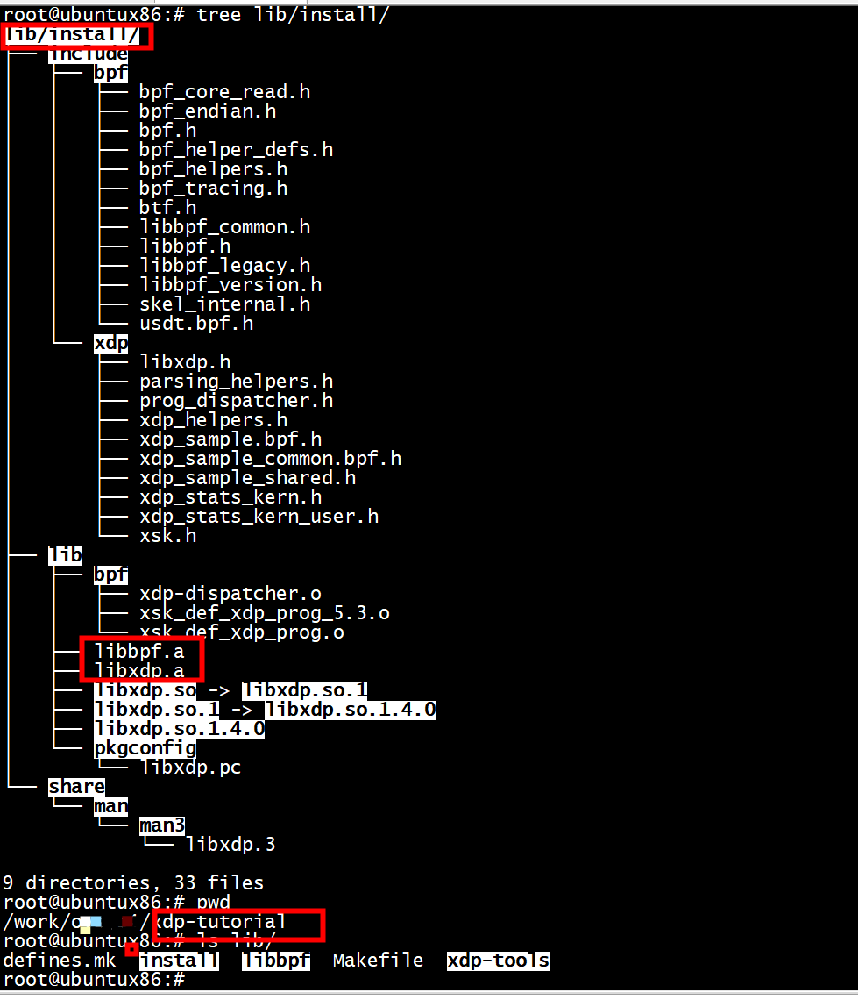

# AF_XDP技术详解

[AF_XDP技术详解](https://rexrock.github.io/post/af_xdp1/)

# make

 configure和lib/xdp-tools/configure的${CLANG=clang} 改为${CLANG=clang-11}
 

+ 1 单独编译bpf   

```
OBJDIR=../build DESTDIR=../../install/lib/ make -j16 install
```

+ 2 编译xdp   

```
/usr/bin/ld: /usr/lib/gcc/x86_64-linux-gnu/8/../../../x86_64-linux-gnu/libbpf.a(libbpf.o): relocation R_X86_64_PC32 against symbol `stderr@@GLIBC_2.2.5' can not be used when making a shared object; recompile with -fPIC
```


```
    echo "SYSTEM_LIBBPF:=n" >> $CONFIG
    echo "LIBBPF_VERSION=$LIBBPF_VERSION" >>$CONFIG
    echo "CFLAGS += -I${LIBBPF_INCLUDE_DIR}" >>$CONFIG
    echo "BPF_CFLAGS += -I${LIBBPF_INCLUDE_DIR}" >>$CONFIG
    echo "LDFLAGS += -L${LIBBPF_LIB_DIR}" >>$CONFIG
    echo 'LDLIBS += -L /work/xdp-tutorial/lib/install/lib/usr/lib64 -l:libbpf.a' >>$CONFIG
    #echo 'LDLIBS += -l:libbpf.a' >>$CONFIG
    echo "OBJECT_LIBBPF = ${OBJECT_LIBBPF}" >>$CONFIG
```
更改congfigure   

```
 echo 'LDLIBS += -L /work/xdp-tutorial/lib/install/lib/usr/lib64 -l:libbpf.a' >>$CONFIG
```
/work/xdp-tutorial/lib/install/lib/usr/lib64是libbpf的路径   
```
root@ubuntux86:# ls /work/xdp-tutorial/lib/install/lib/usr/lib64
libbpf.a  libbpf.so  libbpf.so.1  libbpf.so.1.2.0  pkgconfig
root@ubuntux86:# 
```

+ 2.1 install 目录

```
root@ubuntux86:# ls lib/libxdp/
bpf_instr.h  libxdp_internal.h   libxdp.so        README.org        xdp-dispatcher.c.in     xsk_def_xdp_prog_5.3.c        xsk_def_xdp_prog.embed.o
compat.h     libxdp.map          libxdp.so.1      sharedobjs        xdp-dispatcher.embed.o  xsk_def_xdp_prog_5.3.embed.o  xsk_def_xdp_prog.h
libxdp.3     libxdp.mk           libxdp.so.1.4.0  staticobjs        xdp-dispatcher.ll       xsk_def_xdp_prog_5.3.ll       xsk_def_xdp_prog.ll
libxdp.a     libxdp.pc           Makefile         tests             xdp-dispatcher.o        xsk_def_xdp_prog_5.3.o        xsk_def_xdp_prog.o
libxdp.c     libxdp.pc.template  protocol.org     xdp-dispatcher.c  xsk.c                   xsk_def_xdp_prog.c
root@ubuntux86:# 
```

+ 3 整理 lib ,最终xdp-tutorial/lib/install如下      

```
root@ubuntux86:# tree 
.
├── include
│   ├── bpf
│   │   ├── bpf_core_read.h
│   │   ├── bpf_endian.h
│   │   ├── bpf.h
│   │   ├── bpf_helper_defs.h
│   │   ├── bpf_helpers.h
│   │   ├── bpf_tracing.h
│   │   ├── btf.h
│   │   ├── libbpf_common.h
│   │   ├── libbpf.h
│   │   ├── libbpf_legacy.h
│   │   ├── libbpf_version.h
│   │   ├── skel_internal.h
│   │   └── usdt.bpf.h
│   └── xdp
│       ├── libxdp.h
│       ├── parsing_helpers.h
│       ├── prog_dispatcher.h
│       ├── xdp_helpers.h
│       ├── xdp_sample.bpf.h
│       ├── xdp_sample_common.bpf.h
│       ├── xdp_sample_shared.h
│       ├── xdp_stats_kern.h
│       ├── xdp_stats_kern_user.h
│       └── xsk.h
├── lib
│   ├── bpf
│   │   ├── xdp-dispatcher.o
│   │   ├── xsk_def_xdp_prog_5.3.o
│   │   └── xsk_def_xdp_prog.o
│   ├── libbpf.a
│   ├── libxdp.a
│   └── pkgconfig
│       └── libxdp.pc
└── share
    └── man
        └── man3
            └── libxdp.3

9 directories, 30 files
root@ubuntux86:# 
```

      

+ 4 mount -t bpf bpf /sys/fs/bpf/（可以跳过）
```
root@xdp:~# ls /sys/f
firmware/ fs/       
root@xdp:~# ls /sys/fs/
bpf  cgroup  ecryptfs  ext4  fuse  pstore
root@xdp:~# ls /sys/fs/bpf/
root@xdp:~# 

```

# 部署测试环境 
创建veth-adv03测试网络接口，同时不断ping虚拟机
```
$ eval $(../testenv/testenv.sh alias)
$ t setup --name veth-adv03
$ t ping
```
 

# references   

[如何使用XDP在网卡和WIFI之间转发数据包](https://cloud.tencent.com/developer/ask/sof/108592605)   
[Building an XDP (eXpress Data Path) based BGP peering router](https://toonk.io/building-an-xdp-express-data-path-based-bgp-peering-router/index.html)   
[实验](https://blog.csdn.net/hbhgyu/article/details/108854070)  