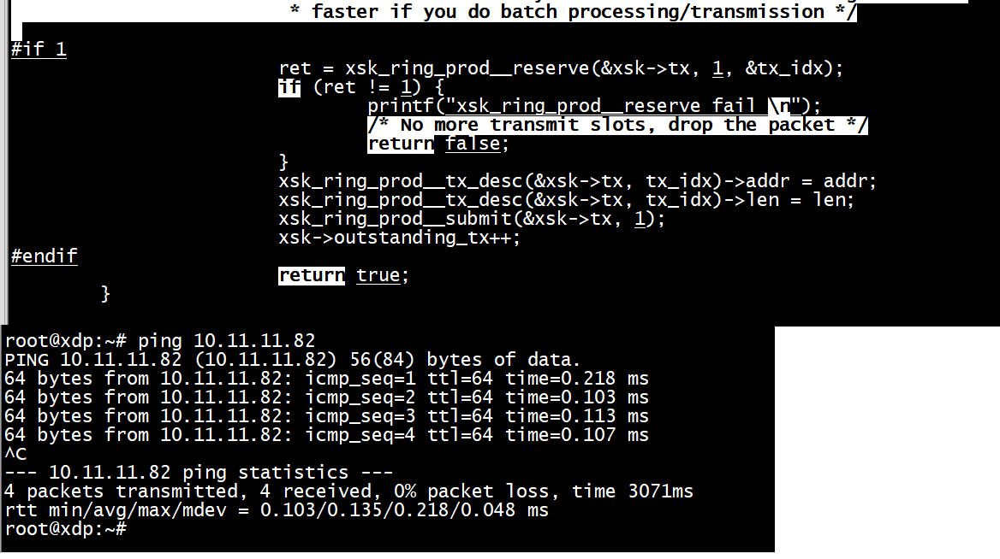

# af_xdp_user
```
./af_xdp_user -d enx00e04c3662aa -S --filename af_xdp_kern.o
```


+ 1 日志输出

+ 1.1 bpf_trace_printk最多只能带 3 个参数，即 bpf_printk(fmt, arg1, arg2, arg3)。  
+ 1.2 bpf_printk日志方式最终都会输出到 debugfs 路径 /sys/kernel/debug/tracing/trace


#  示例的笔记

```Text
xdp 没有完全绕过内核，但是可以让包跳过内核的网络栈，直接从用户空间读取，可以通过 AF_XDP 的 XDP_REDIRECT 语义实现。

首先简要记录一下 AF_XDP 套接字。AF_XDP socket， 缩写为 XSK，可以通过系统调用 socket() 创建。每个 XSK 都有两个环来存储数据，一个 RX ring 和一个 TX ring。套接字能够用 RX ring 接收包，通过 TX ring 发送包。这些环是通过 setsockopts 中的选项 XDP_RX_RING 和 XDP_TX_RING 设置的。每个套接字至少需要其中的一个（以作为单侧的 source/sink node）。RX/TX ring 指向内存中一块叫做 UMEM 的数据。RX 和 TX 能够共享同一块 UMEM 区域，以防在 RX 和 TX 之间频繁地进行数据拷贝。另外，如果由于潜在的重传，一个包需要被保存一段时间，这些指针也能暂时指向别的包，避免拷贝数据。

在 BPF 侧的 AF_XDP 程序，参数是 struct xdp_md，包含原始 frame 的数据。可以返回一些状态来表示对该 frame 的处理意见，比如：

XDP_PASS：继续传递到 Linux 后续的协议栈中处理。
XDP_REDIRECT：将包通过 UMEM 传递到用户空间处理。
XDP_DROP：直接丢弃这个包。
XDP_TX 可以直接发回给网卡，可以用来在内核中做快速的回复。比如下面 Advance03 中做的事情，去交换 ICMP 报文的发送方和接收方。该例子其实可以在内核中完成，然后用 XDP_TX 发回去，不是必须 redirect 到用户空间再做。
```

> ## AF_XDP socket
[AF_XDP技术详解](https://rexrock.github.io/post/af_xdp1/)

```Text
此外需要注意的事，AF_XDP socket不再通过 send()/recv()等函数实现报文收发，而实通过直接操作ring来实现报文收发。

FILL RING
fill_ring 的生产者是用户态程序，消费者是内核态中的XDP程序；

用户态程序通过 fill_ring 将可以用来承载报文的 UMEM frames 传到内核，然后内核消耗 fill_ring 中的元素（后文统一称为 desc），并将报文拷贝到desc中指定地址（该地址即UMEM frame的地址）；

COMPLETION RING
completion_ring 的生产者是XDP程序，消费者是用户态程序；

当内核完成XDP报文的发送，会通过 completion_ring 来通知用户态程序，哪些报文已经成功发送，然后用户态程序消耗 completion_ring 中 desc(只是更新consumer计数相当于确认)；

RX RING
rx_ring的生产者是XDP程序，消费者是用户态程序；

XDP程序消耗 fill_ring，获取可以承载报文的 desc并将报文拷贝到desc中指定的地址，然后将desc填充到 rx_ring 中，并通过socket IO机制通知用户态程序从 rx_ring 中接收报文；

TX RING
tx_ring的生产者是用户态程序，消费者是XDP程序；

用户态程序将要发送的报文拷贝 tx_ring 中 desc指定的地址中，然后 XDP程序 消耗 tx_ring 中的desc，将报文发送出去，并通过 completion_ring 将成功发送的报文的desc告诉用户态程序
```

> ##  advanced03-AF_XDP/af_xdp_kern.c

+ 1 内核代码    

```C
struct {
        __uint(type, BPF_MAP_TYPE_XSKMAP);
        __type(key, __u32);
        __type(value, __u32);
        __uint(max_entries, 64);
} xsks_map SEC(".maps");

struct {
        __uint(type, BPF_MAP_TYPE_PERCPU_ARRAY);
        __type(key, __u32);
        __type(value, __u32);
        __uint(max_entries, 64);
} xdp_stats_map SEC(".maps");

SEC("xdp")
int xdp_sock_prog(struct xdp_md *ctx)
{
    int index = ctx->rx_queue_index;
    __u32 *pkt_count;

    pkt_count = bpf_map_lookup_elem(&xdp_stats_map, &index);
    if (pkt_count) {

        /* We pass every other packet */
        if ((*pkt_count)++ & 1)
            return XDP_PASS;
    }

    /* A set entry here means that the correspnding queue_id
     * has an active AF_XDP socket bound to it. */
    if (bpf_map_lookup_elem(&xsks_map, &index))
        return bpf_redirect_map(&xsks_map, index, 0);

    return XDP_PASS;
}
```

首先定义了两个 bpf map，一个存储 XSK，一个存储包的数量数据。然后定义了一个 bpf 程序，它的参数是 struct xdp_md，所以它是一个 BPF_PROG_TYPE_XDP 类型的 BPF 程序。这段程序通过 SEC() 宏放在了xdp_sock 段中，用 bpf helper 函数来和定义好的 bpf map 交互。注意其中的代码  

```
/* We pass every other packet */
if ((*pkt_count)++ & 1) 
	return XDP_PASS;
```

是间隔一个地直接返回 XDP_PASS，下一个包才会用 bpf_redirect_map 去转发。也就是说，过滤掉了一半的包。   

+ 2 用户空间代码   
在用户空间代码 advanced03-AF_XDP/af_xdp_user.c 中。首先是做了 bpf 用户空间程序必要的一些工作，比如 setrlimit(RLIMIT_MEMLOCK, &rlim) 去释放内存限制。这也是为什么必须用 sudo 权限运行 bpf 程序。   

xsk_socket_info 结构体包装 xsk_socket，xsk_umem_info 结构体包装 xsk_umem。这部分代码会反复用到缩写 PROD 代表 producer，也就是发送端 tx；缩写 CONS 代表 consumer，也就是接收端 rx。因为 XSK 默认是 Single-Producer-Single-Consumer 的。   

xsk_configure_socket() 初始化了 XSK，注意这里初始化发送端和接收端时，是传设置项 xsk_cfg 给库函数 xsk_socket__create()。xsk_cfg.rx_size 和 xsk_cfg.tx_size 分别初始化成了 XSK_RING_CONS__DEFAULT_NUM_DESCS 和 XSK_RING_PROD__DEFAULT_NUM_DESCS，他们会在库函数 xsk_socket__create() 中传递给系统调用 setsockopt() 去完成 XSK 中的 tx 和 rx 的创建。他们是定义在 xsk.h 中的宏，值都是 2048。事实上，只能被初始化成2的幂次。   

创建好 XSK，就可以监听了，这部分逻辑写在 rx_and_process() 中，用 poll(struct pollfd *__fds, nfds_t __nfds, -1) 系统调用去监听之前创建好的 XSK，在没有触发事件时阻塞。收到包后，调用 handle_receive_packets() 在 XSK 对应的 umem 中读取 rx 端，也就是 consumer 接收到的包。   


```
int main(int argc, char **argv)
{
    ...
    bpf_obj = load_bpf_and_xdp_attach(&cfg);
    map = bpf_object__find_map_by_name(bpf_obj, "xsks_map");
    ...
    xsks_map_fd = bpf_map__fd(map);
    ...
    umem = configure_xsk_umem(packet_buffer, packet_buffer_size);
    ...
    xsk_socket = xsk_configure_socket(&cfg, umem);
    ...
    rx_and_process(&cfg, xsk_socket);
    ...
}

static struct xsk_socket_info *xsk_configure_socket(struct config *cfg,
                            struct xsk_umem_info *umem)
{
    ...
    ret = xsk_socket__create(&xsk_info->xsk, cfg->ifname,
                 cfg->xsk_if_queue, umem->umem, &xsk_info->rx,
                 &xsk_info->tx, &xsk_cfg);
    ...

```

+ 1) bpf_obj = load_bpf_and_xdp_attach(&cfg): 加载bpf程序，并绑定到网卡   
+ 2) map = bpf_object__find_map_by_name(bpf_obj, "xsks_map")： 查找bpf程序内定义的xsks_map   
+ 3) umem = configure_xsk_umem(packet_buffer, packet_buffer_size)： 为XDP Scoket准备UMEM   
+ 4) xsk_configure_socket()通过调用bpf helper函数xsk_socket__create（）创建XDP Scoket并绑定到cfg->ifname网卡的cfg->   xsk_if_queue队列，默认情况下将该【cfg->xsk_if_queue， xsk_info->xsk fd】添加到xsks_map, 这样bpf程序就可以重定向到该XDP Scoket   


## 用户态映射

```
                /* We also need to load the xsks_map */
                map = bpf_object__find_map_by_name(xdp_program__bpf_obj(prog), "xsks_map");
                xsk_map_fd = bpf_map__fd(map);
                if (xsk_map_fd < 0) {
                        fprintf(stderr, "ERROR: no xsks map found: %s\n",
                                strerror(xsk_map_fd));
                        exit(EXIT_FAILURE);
                }
```

# icmp 测试

`./af_xdp_user -d xx  --filename af_xdp_kern.o`

+ 1 不回复icmp   


+ 1 回复icmp  

