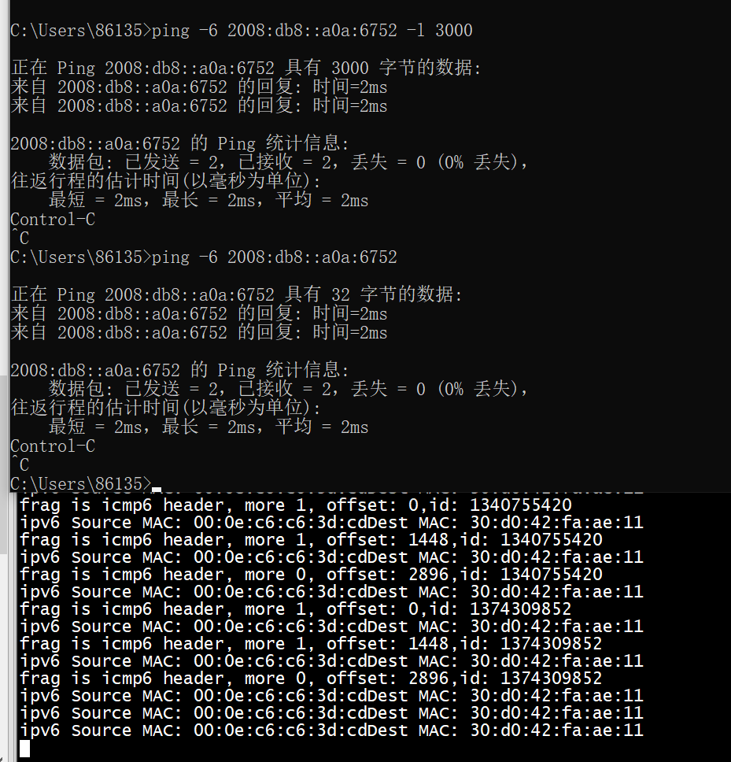

# trace log

```
:cat /sys/kernel/debug/tracing/trace
```

# server   


 
对端 ip a add 2008:db8::a0a:6751/96 dev enp0s31f3

ip a add 2008:db8::10.10.103.81/96 dev enp0s31f3


```
./af_xdp_user -d enp0s31f6 -S --filename af_xdp_kern.o
```

```
root@ubuntux86:# ip a add 2008:db8::a0a:6752/96 dev enp0s31f6
root@ubuntux86:# ping6 2008:db8::a0a:6751
PING 2008:db8::a0a:6751(2008:db8::a0a:6751) 56 data bytes
64 bytes from 2008:db8::a0a:6751: icmp_seq=1 ttl=128 time=5.04 ms
64 bytes from 2008:db8::a0a:6751: icmp_seq=2 ttl=128 time=2.14 ms
^C
--- 2008:db8::a0a:6751 ping statistics ---
2 packets transmitted, 2 received, 0% packet loss, time 1001ms
rtt min/avg/max/mdev = 2.137/3.586/5.036/1.449 ms
root@ubuntux86:# 
```

# client   
```
C:\Users\86130>ping -6 2008:db8::a0a:6752

正在 Ping 2008:db8::a0a:6752 具有 32 字节的数据:
来自 2008:db8::a0a:6752 的回复: 时间=2ms
来自 2008:db8::a0a:6752 的回复: 时间=2ms

2008:db8::a0a:6752 的 Ping 统计信息:
    数据包: 已发送 = 2，已接收 = 2，丢失 = 0 (0% 丢失)，
往返行程的估计时间(以毫秒为单位):
    最短 = 2ms，最长 = 2ms，平均 = 2ms
Control-C
^C
```

# error


```
; if(IPPROTO_FRAGMENT == currenthdr && (IPPROTO_ICMP6 == ip6_frag->next_header))
23: (71) r1 = *(u8 *)(r3 +0)
invalid access to packet, off=54 size=1, R3(id=0,off=54,r=54)
R3 offset is outside of the packet
processed 24 insns (limit 1000000) max_states_per_insn 0 total_states 2 peak_states 2 mark_read 1
-- END PROG LOAD LOG --
```

加上这条语句OVER(icmp, data_end)做个检查      
```

        if (OVER(icmp, data_end))
             return XDP_DROP;
```

# run

