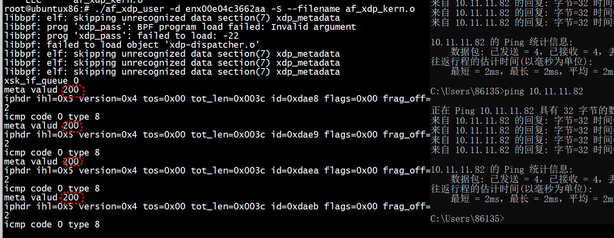

```
struct xdp_buff {
    void *data;
    void *data_end;
    void *data_meta;
    void *data_hard_start;
    struct xdp_rxq_info *rxq;
};
```

data 指向页面中数据包数据的起始位置，正如其名称所示，data_end 指向数据包数据的末尾。由于XDP允许有一些头部空间，data_hard_start 指向页面中最大可能的头部空间起始位置，这意味着当数据包需要封装时，通过 bpf_xdp_adjust_head() 将 data 移动到更靠近 data_hard_start。同样的BPF辅助函数也允许进行去封装，此时 data 会从 data_hard_start 进一步移开。

data_meta 最初指向与 data 相同的位置，但 bpf_xdp_adjust_meta() 也可以将指针移动到 data_hard_start，以提供用于自定义元数据的空间，这些元数据对于正常的内核网络堆栈是不可见的，但可以被 tc BPF 程序读取，因为它是从 XDP 传递到 skb 中的。反之，通过将 data_meta 从 data_hard_start 移开，相同的BPF辅助函数也可以移除或减小自定义元数据的大小。data_meta 也可以仅用于在尾调用之间传递状态，类似于 tc BPF 程序中可以访问的 skb->cb[] 控制块情况。

这为 struct xdp_buff 数据包指针提供了以下关系或不变式：data_hard_start <= data_meta <= data < data_end。

rxq 字段指向一些额外的每个接收队列元数据，这些元数据在环设置时（而不是在XDP运行时）填充：
```
struct xdp_rxq_info {
    struct net_device *dev;
    u32 queue_index;
    u32 reg_state;
} ____cacheline_aligned;
```

# 用户空间获取meta

```
SEC("xdp")
int rx(struct xdp_md *ctx) {
 bpf_xdp_adjust_meta(-sizeof(u64));
 bpf_xdp_metadata_rx_timestamp(ctx, &ctx->data_meta);
 return bpf_redirect_map(&xsk, ctx->rx_queue_index, XDP_PASS);
}
// in userspace AF_XDP consumer, when the frame is received
payload = xsk_umem__get_data(...);
__u64 *timestamp = payload - sizeof(u64);
```


# test 

用户空间   
```
#if 1

         uint32_t * meta;
         meta = (uint32_t *)(pkt - sizeof(uint32_t));
         printf("meta valud %u \n",*meta);
#endif
```

kern    
```
// Check if the packet is an ICMP echo request
    if (icmp->type != ICMP_ECHO) {
        return XDP_PASS;
    }
    __u32 *val;
    const int siz = sizeof(*val);
    if (bpf_xdp_adjust_meta(ctx, -siz) != 0)
         return XDP_PASS;
    data = ctx_ptr(ctx, data); // required to re-obtain data pointer
    void *data_meta = ctx_ptr(ctx, data_meta);
    val = (typeof(val))data_meta;

    if ((void *)(val + 1) > data)
          return XDP_PASS;

    *val = LATENCY_MS;
    /* A set entry here means that the correspnding queue_id
     * has an active AF_XDP socket bound to it. */
    if (bpf_map_lookup_elem(&xsks_map, &index))
        return bpf_redirect_map(&xsks_map, index, 0);

    return XDP_PASS;
```

> ## run

```
./af_xdp_user -d enx00e04c3662aa -S --filename af_xdp_kern.o
```

 