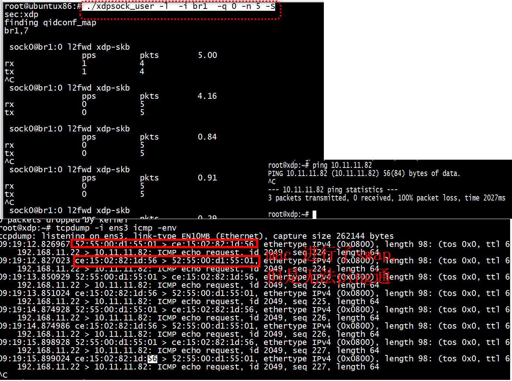
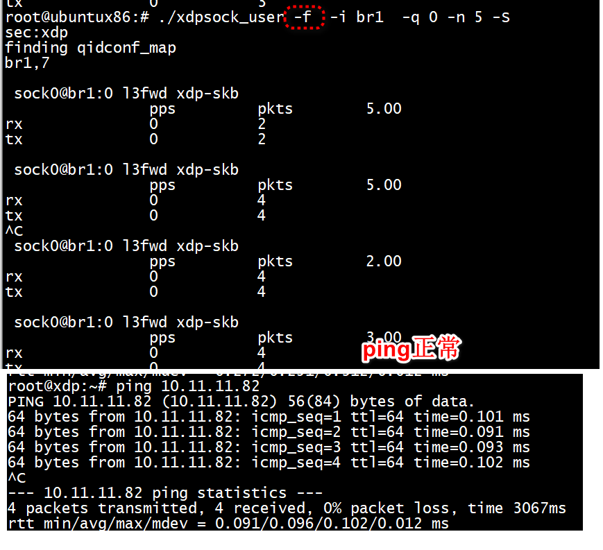

# make

arm平台   
```
#ifdef __aarch64__
#define u_smp_rmb() __asm__ __volatile__("dmb ishld": : :"memory")
#define u_smp_wmb() __asm__ __volatile__("dmb ishst": : :"memory")
#else
#define u_smp_rmb() barrier()
#define u_smp_wmb() barrier()
#endif
```

```
static struct xdp_umem *xdp_umem_configure(int sfd)
{
	int fq_size = FQ_NUM_DESCS, cq_size = CQ_NUM_DESCS;
	struct xdp_mmap_offsets off;
	struct xdp_umem_reg mr;
	struct xdp_umem *umem;
	socklen_t optlen;
	void *bufs;
	umem = calloc(1, sizeof(*umem));
	lassert(umem);
	lassert(posix_memalign(&bufs, getpagesize(), /* PAGE_SIZE aligned */
			       NUM_FRAMES * FRAME_SIZE) == 0);
	mr.addr = (__u64)bufs;
	mr.len = NUM_FRAMES * FRAME_SIZE;
	mr.chunk_size = FRAME_SIZE;
	mr.headroom = FRAME_HEADROOM;
	lassert(setsockopt(sfd, SOL_XDP, XDP_UMEM_REG, &mr, sizeof(mr)) == 0);
	lassert(setsockopt(sfd, SOL_XDP, XDP_UMEM_FILL_RING, &fq_size,
			   sizeof(int)) == 0);
	lassert(setsockopt(sfd, SOL_XDP, XDP_UMEM_COMPLETION_RING, &cq_size,
			   sizeof(int)) == 0);
	optlen = sizeof(off);
	lassert(getsockopt(sfd, SOL_XDP, XDP_MMAP_OFFSETS, &off,
			   &optlen) == 0);
	umem->fq.map = mmap(0, off.fr.desc +
			    FQ_NUM_DESCS * sizeof(u64),
			    PROT_READ | PROT_WRITE,
			    MAP_SHARED | MAP_POPULATE, sfd,
			    XDP_UMEM_PGOFF_FILL_RING);
	lassert(umem->fq.map != MAP_FAILED);
	umem->fq.mask = FQ_NUM_DESCS - 1;
	umem->fq.size = FQ_NUM_DESCS;
	umem->fq.producer = umem->fq.map + off.fr.producer;
	umem->fq.consumer = umem->fq.map + off.fr.consumer;
	umem->fq.ring = umem->fq.map + off.fr.desc;
	umem->fq.cached_cons = FQ_NUM_DESCS;
	umem->cq.map = mmap(0, off.cr.desc +
			     CQ_NUM_DESCS * sizeof(u64),
			     PROT_READ | PROT_WRITE,
			     MAP_SHARED | MAP_POPULATE, sfd,
			     XDP_UMEM_PGOFF_COMPLETION_RING);
	lassert(umem->cq.map != MAP_FAILED);
	umem->cq.mask = CQ_NUM_DESCS - 1;
	umem->cq.size = CQ_NUM_DESCS;
	umem->cq.producer = umem->cq.map + off.cr.producer;
	umem->cq.consumer = umem->cq.map + off.cr.consumer;
	umem->cq.ring = umem->cq.map + off.cr.desc;
	umem->frames = bufs;
	umem->fd = sfd;
	if (opt_bench == BENCH_TXONLY) {
		int i;
		for (i = 0; i < NUM_FRAMES * FRAME_SIZE; i += FRAME_SIZE)
			(void)gen_eth_frame(&umem->frames[i]);
	}
	return umem;
}
```
+ 1 xdp_umem_configure umem->fq.map = mmap    

```
static struct xdpsock *xsk_configure(struct xdp_umem *umem)
{
	struct sockaddr_xdp sxdp = {};
	struct xdp_mmap_offsets off;
	int sfd, ndescs = NUM_DESCS;
	struct xdpsock *xsk;
	bool shared = true;
	socklen_t optlen;
	u64 i;
	sfd = socket(PF_XDP, SOCK_RAW, 0);
	lassert(sfd >= 0);
	xsk = calloc(1, sizeof(*xsk));
	lassert(xsk);
	xsk->sfd = sfd;
	xsk->outstanding_tx = 0;
	if (!umem) {
		shared = false;
		xsk->umem = xdp_umem_configure(sfd);
	} else {
		xsk->umem = umem;
	}
	lassert(setsockopt(sfd, SOL_XDP, XDP_RX_RING,
			   &ndescs, sizeof(int)) == 0);
	lassert(setsockopt(sfd, SOL_XDP, XDP_TX_RING,
			   &ndescs, sizeof(int)) == 0);
	optlen = sizeof(off);
	lassert(getsockopt(sfd, SOL_XDP, XDP_MMAP_OFFSETS, &off,
			   &optlen) == 0);
	/* Rx */
	xsk->rx.map = mmap(NULL,
			   off.rx.desc +
			   NUM_DESCS * sizeof(struct xdp_desc),
			   PROT_READ | PROT_WRITE,
			   MAP_SHARED | MAP_POPULATE, sfd,
			   XDP_PGOFF_RX_RING);
	lassert(xsk->rx.map != MAP_FAILED);
	if (!shared) {
		for (i = 0; i < NUM_DESCS * FRAME_SIZE; i += FRAME_SIZE)
			lassert(umem_fill_to_kernel(&xsk->umem->fq, &i, 1)
				== 0);
	}
	/* Tx */
	xsk->tx.map = mmap(NULL,
			   off.tx.desc +
			   NUM_DESCS * sizeof(struct xdp_desc),
			   PROT_READ | PROT_WRITE,
			   MAP_SHARED | MAP_POPULATE, sfd,
			   XDP_PGOFF_TX_RING);
	lassert(xsk->tx.map != MAP_FAILED);
	xsk->rx.mask = NUM_DESCS - 1;
	xsk->rx.size = NUM_DESCS;
	xsk->rx.producer = xsk->rx.map + off.rx.producer;
	xsk->rx.consumer = xsk->rx.map + off.rx.consumer;
	xsk->rx.ring = xsk->rx.map + off.rx.desc;
	xsk->tx.mask = NUM_DESCS - 1;
	xsk->tx.size = NUM_DESCS;
	xsk->tx.producer = xsk->tx.map + off.tx.producer;
	xsk->tx.consumer = xsk->tx.map + off.tx.consumer;
	xsk->tx.ring = xsk->tx.map + off.tx.desc;
	xsk->tx.cached_cons = NUM_DESCS;
	sxdp.sxdp_family = PF_XDP;
	sxdp.sxdp_ifindex = opt_ifindex;
	sxdp.sxdp_queue_id = opt_queue;
	if (shared) {
		sxdp.sxdp_flags = XDP_SHARED_UMEM;
		sxdp.sxdp_shared_umem_fd = umem->fd;
	} else {
		sxdp.sxdp_flags = opt_xdp_bind_flags;
	}
	lassert(bind(sfd, (struct sockaddr *)&sxdp, sizeof(sxdp)) == 0);
	return xsk;
}
```
+ 1 xsk->rx.map = mmap   

+ 2 xsk->tx.map = mmap    

# run 

```
./xdpsock_user -l  -i br1  -q 0 -n 5 -S
./xdpsock_user -f  -i br1  -q 0 -n 5 -S
./xdpsock_user -r  -i br1  -q 0 -n 5 -S
```

+ 1 运行 fwd 模式   


```
 ./xdpsock_user -l  -i br1  -q 0 -n 5 -S
```

    
   
+ 2 运行 l3 fwd 模式   


   