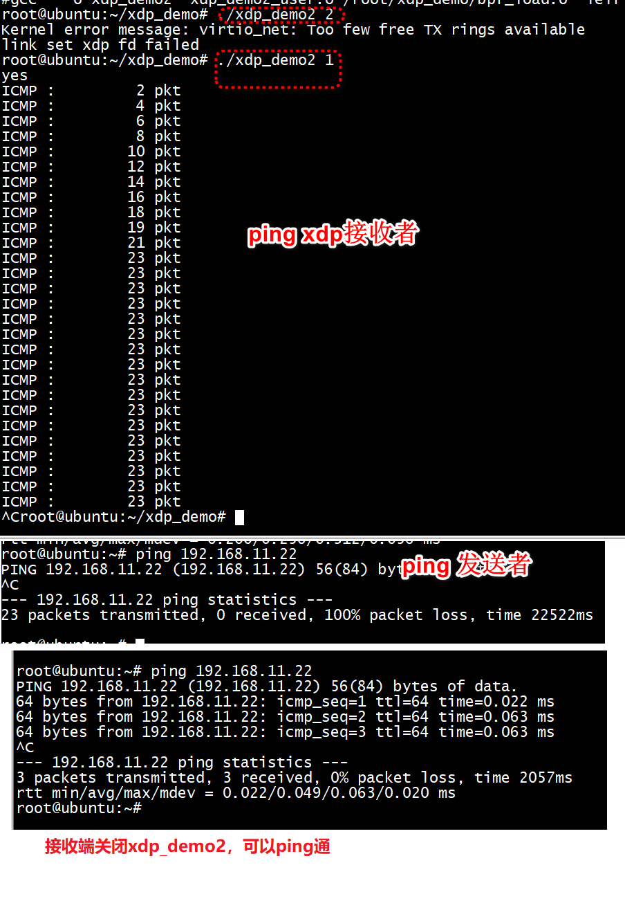
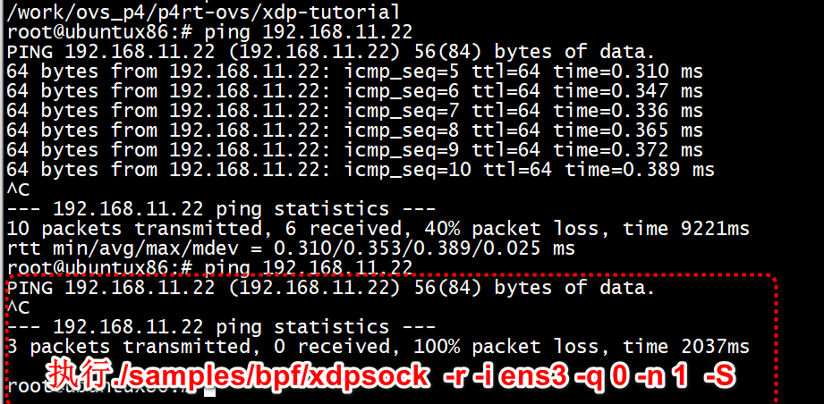

# kernel

```
Feature              kernel version
------------------------------------
BPF_MAPS               3.18
XDP support            4.8
AF_XDP                 4.18
```

```
ACTION                 Kernel Version
--------------------------------------
XDP_ABORTED               4.8
XDP_DROP                  4.8
XDP_PASS                  4.8
XDP_TX                    4.8
XDP_REDIRECT              4.14
```
Kernel Configs   

```
CONFIG_BPF=y
CONFIG_BPF_SYSCALL=y
CONFIG_BPF_JIT=y
CONFIG_HAVE_EBPF_JIT=y
```

# /tools/lib/bpf
```
/tools/lib/bpf# export DESTDIR=/opt/bpf
make && make install
make install_headers
root@ubuntu:~/linux-4.18.9/tools/lib/bpf# ls /opt/bpf/usr/local/
include  lib64
```

```
root@ubuntu:~/xdp_demo# clang -O2 -target bpf -c xdp_demo1.c -o xdp_demo1.o
In file included from xdp_demo1.c:1:
In file included from /usr/include/linux/bpf.h:11:
/usr/include/linux/types.h:5:10: fatal error: 'asm/types.h' file not found
```


#  XDP Demo1
XDP程序除了可以上述系统调用的方式加载外，还可以通过iproute2中提供的ip命令，该命令具有充当XDP前端的能力，可以将XDP程序加载到HOOK点。下文会采用两种方式分别进行加载。本demo使用ip命令进行加载到HOOK点，没有使用到用户态展示XDP处理详情
+ 1 下面将使用ip命令将编译好的xdp程序进行加载
```
root@ubuntu:~/xdp_demo# ip link set dev ens3 xdp obj xdp_demo1.o sec xdp verbose

Prog section 'xdp' loaded (5)!
 - Type:         6
 - Instructions: 11 (0 over limit)
 - License:      GPL

Verifier analysis:

0: (b7) r0 = 1
1: (61) r2 = *(u32 *)(r1 +4)
2: (61) r1 = *(u32 *)(r1 +0)
3: (bf) r3 = r1
4: (07) r3 += 34
5: (2d) if r3 > r2 goto pc+4
 R0=inv1 R1=pkt(id=0,off=0,r=34,imm=0) R2=pkt_end(id=0,off=0,imm=0) R3=pkt(id=0,off=34,r=34,imm=0) R10=fp0,call_-1
6: (71) r1 = *(u8 *)(r1 +23)
7: (b7) r0 = 1
8: (15) if r1 == 0x1 goto pc+1
 R0=inv1 R1=inv(id=0,umax_value=255,var_off=(0x0; 0xff)) R2=pkt_end(id=0,off=0,imm=0) R3=pkt(id=0,off=34,r=34,imm=0) R10=fp0,call_-1
9: (b7) r0 = 2
10: (95) exit

from 8 to 10: R0=inv1 R1=inv1 R2=pkt_end(id=0,off=0,imm=0) R3=pkt(id=0,off=34,r=34,imm=0) R10=fp0,call_-1
10: (95) exit

from 5 to 10: safe
processed 13 insns (limit 131072), stack depth 0

Error: virtio_net: Too few free TX rings available.
root@ubuntu:~/xdp_demo# 
```

h换个物理网卡

```
root@ubuntux86:# ethtool -i enp0s31f6
driver: e1000e
version: 5.13.0-39-generic
firmware-version: 0.4-4
expansion-rom-version: 
bus-info: 0000:00:1f.6
supports-statistics: yes
supports-test: yes
supports-eeprom-access: yes
supports-register-dump: yes
supports-priv-flags: yes
root@ubuntux86:# 
```

```
root@ubuntux86:# clang -O2 -target bpf -c xdp_demo1.c -o xdp_demo1.o
root@ubuntux86:# ip link set dev enp0s31f6 xdp obj xdp_demo1.o sec xdp verbose

Prog section 'xdp' loaded (5)!
 - Type:         6
 - Instructions: 11 (0 over limit)
 - License:      GPL

Verifier analysis:

processed 13 insns (limit 1000000) max_states_per_insn 0 total_states 1 peak_states 1 mark_read 1
```


+ 2 验证

> + 2.1、首先使用 ip address命令查看所挂载的网卡

```
root@ubuntux86:# ip a show enp0s31f6
2: enp0s31f6: <BROADCAST,MULTICAST,UP,LOWER_UP> mtu 1500 xdpgeneric/id:19 qdisc fq_codel state UP group default qlen 1000
    link/ether 30:d0:42:fa:ae:11 brd ff:ff:ff:ff:ff:ff
    inet 192.168.5.82/24 brd 192.168.5.255 scope global noprefixroute enp0s31f6
       valid_lft forever preferred_lft forever
    inet 10.11.12.82/24 brd 10.11.12.255 scope global noprefixroute enp0s31f6
       valid_lft forever preferred_lft forever
    inet6 fe80::a222:d618:3432:22df/64 scope link noprefixroute 
       valid_lft forever preferred_lft forever
```
可以看到在enp0s31f6网卡接口的MTU字段后面，显示了 xxdpgeneric/id:19，它显示了两个有用的信息。
已使用的驱动程序为xdpgeneric 19

> 2.2 查看XDP程序的效果
ping 10.11.12.81，结果如下，丢包为100%

```
root@ubuntux86:# ping 10.11.12.81
PING 10.11.12.81 (10.11.12.81) 56(84) bytes of data.
^C
--- 10.11.12.81 ping statistics ---
3 packets transmitted, 0 received, 100% packet loss, time 2034ms

root@ubuntux86:# 
```

> 2.3 卸载xdp程序与验证

```
root@ubuntux86:# ip link set dev enp0s31f6 xdp off
root@ubuntux86:# ping 10.11.12.81
PING 10.11.12.81 (10.11.12.81) 56(84) bytes of data.
64 bytes from 10.11.12.81: icmp_seq=1 ttl=64 time=2.54 ms
64 bytes from 10.11.12.81: icmp_seq=2 ttl=64 time=2.34 ms
^C
--- 10.11.12.81 ping statistics ---
2 packets transmitted, 2 received, 0% packet loss, time 1002ms
rtt min/avg/max/mdev = 2.339/2.437/2.535/0.098 ms
root@ubuntux86:# 
```

#  XDP Demo2
本demo使用bpf的系统调用进行加载到HOOK点，并使用MAP映射，用户态读取Map并展示XDP处理详情。

由于我们要采用bpf系统调用的方式加载xdp程序，并且想要读取MAP中的信息，所以编写用户态进行对编译好的xdp进行加载与展示xdp处理数据的详情。xdp_demo2_user.c

+ 1 编译
在BPF 编程环境中，我们可以很便利地使用现成的Makefile进行编程，在Makefile中添加如下：


```
....
hostprogs-y += xdp_demo2
....
xdp_demo2-objs := bpf_load.o $(LIBBPF) xdp_demo2_user.o
...
always += xdp_demo2_kern.o
...
HOSTLOADLIBES_xdp_demo2 += -lelf
...
```
+ 1 kernel 编译  
```
clang  -nostdinc -isystem /usr/lib/gcc/x86_64-linux-gnu/8/include -I./arch/x86/include -I./arch/x86/include/generated  -I./include -I./arch/x86/include/uapi -I./arch/x86/include/generated/uapi -I./include/uapi -I./include/generated/uapi -include ./include/linux/kconfig.h  -Isamples/bpf \
        -I./tools/testing/selftests/bpf/ \
        -D__KERNEL__ -D__BPF_TRACING__ -Wno-unused-value -Wno-pointer-sign \
        -D__TARGET_ARCH_x86 -Wno-compare-distinct-pointer-types \
        -Wno-gnu-variable-sized-type-not-at-end \
        -Wno-address-of-packed-member -Wno-tautological-compare \
        -Wno-unknown-warning-option  \
        -O2 -emit-llvm -c samples/bpf/xdp_demo2_kern.c -o -| llc -march=bpf -filetype=obj -o samples/bpf/xdp_demo2_kern.o
```
+ error1  use of undeclared identifier 'KBUILD_MODNAME'  
文件开头添加  
```
#define KBUILD_MODNAME "xdp_demo2"
```

+ user编译   

>  + bpf_load编译   
```
gcc -Wp,-MD,samples/bpf/.bpf_load.o.d -Wall -Wmissing-prototypes -Wstrict-prototypes -O2 -fomit-frame-pointer -std=gnu89  -I./usr/include -I./tools/lib/ -I./tools/testing/selftests/bpf/ -I./tools/lib/ -I./tools/include -I./tools/perf    -I./usr/include -Wno-unused-variable -c -o samples/bpf/bpf_load.o samples/bpf/bpf_load.c
```

>  + 生成map_perf_test_user.o   

```
  gcc -Wp,-MD,samples/bpf/.map_perf_test_user.o.d -Wall -Wmissing-prototypes -Wstrict-prototypes -O2 -fomit-frame-pointer -std=gnu89  -I./usr/include -I./tools/lib/ -I./tools/testing/selftests/bpf/ -I./tools/lib/ -I./tools/include -I./tools/perf     -c -o samples/bpf/map_perf_test_user.o samples/bpf/map_perf_test_user.c
```

>  + 生成可执行   
```
root@ubuntu:~/linux-4.18.9#  gcc  -o samples/bpf/map_perf_test samples/bpf/bpf_load.o samples/bpf/map_perf_test_user.o  /root/linux-4.18.9/samples/bpf/../../tools/lib/bpf/libbpf.a -lelf -lrt
root@ubuntu:~/linux-4.18.9# 
```


> + error1  bpf_load.c:(.text+0x8d): undefined reference to `bpf_map_update_elem'   

```
root@ubuntu:~/xdp_demo# gcc   -o xdp_demo2 -lelf /opt/bpf/usr/local/lib64/libbpf.a xdp_demo2_user.o bpf_load.o
xdp_demo2_user.o: In function `int_exit':
xdp_demo2_user.c:(.text+0x179): undefined reference to `bpf_set_link_xdp_fd'
xdp_demo2_user.o: In function `poll_stats':
xdp_demo2_user.c:(.text+0x24a): undefined reference to `bpf_map_lookup_elem'
xdp_demo2_user.o: In function `main':
xdp_demo2_user.c:(.text+0x562): undefined reference to `bpf_set_link_xdp_fd'
bpf_load.o: In function `populate_prog_array':
bpf_load.c:(.text+0x8d): undefined reference to `bpf_map_update_elem'
bpf_load.o: In function `load_and_attach':
bpf_load.c:(.text+0x472): undefined reference to `bpf_load_program'
bpf_load.c:(.text+0x5ef): undefined reference to `bpf_raw_tracepoint_open'
bpf_load.o: In function `load_maps':
bpf_load.c:(.text+0xefc): undefined reference to `bpf_create_map_in_map_node'
bpf_load.c:(.text+0x1004): undefined reference to `bpf_create_map_node'
bpf_load.o: In function `get_sec':
bpf_load.c:(.text+0x113d): undefined reference to `elf_getscn'
bpf_load.c:(.text+0x1165): undefined reference to `gelf_getshdr'
bpf_load.c:(.text+0x1197): undefined reference to `elf_strptr'
bpf_load.c:(.text+0x11d2): undefined reference to `elf_getdata'
bpf_load.c:(.text+0x11fe): undefined reference to `elf_getdata'
bpf_load.o: In function `parse_relo_and_apply':
bpf_load.c:(.text+0x1280): undefined reference to `gelf_getrel'
bpf_load.c:(.text+0x12a7): undefined reference to `gelf_getsym'
bpf_load.o: In function `load_elf_maps_section':
bpf_load.c:(.text+0x14a2): undefined reference to `elf_getscn'
bpf_load.c:(.text+0x14be): undefined reference to `elf_getdata'
bpf_load.c:(.text+0x156c): undefined reference to `gelf_getsym'
bpf_load.c:(.text+0x1675): undefined reference to `elf_strptr'
bpf_load.o: In function `do_load_bpf_file':
bpf_load.c:(.text+0x18ff): undefined reference to `elf_version'
bpf_load.c:(.text+0x195b): undefined reference to `elf_begin'
bpf_load.c:(.text+0x198c): undefined reference to `gelf_getehdr'
collect2: error: ld returned 1 exit status
```
但是在内核目录(linux-4.18.9)生成没这个bug     
```
root@ubuntu:~/linux-4.18.9# gcc  -o /root/xdp_demo/xdmo_demo2 /root/xdp_demo/bpf_load.o /root/xdp_demo/xdp_demo2_user.o /opt/bpf/usr/local/lib64/libbpf.a  -lelf -lrt
root@ubuntu:~/linux-4.18.9# 
```
采用绝对路径也通过   
```
root@ubuntu:~/xdp_demo# gcc  -o xdp_demo2 /root/xdp_demo/bpf_load.o /root/xdp_demo/xdp_demo2_user.o /opt/bpf/usr/local/lib64/libbpf.a  -lelf -lrt
root@ubuntu:~/xdp_demo# 
```
只对bpf_load.o采用绝对路径也通过   
```
root@ubuntu:~/xdp_demo# gcc  -o xdp_demo2 /root/xdp_demo/bpf_load.o xdp_demo2_user.o /opt/bpf/usr/local/lib64/libbpf.a  -lelf -lrt
root@ubuntu:~/xdp_demo# 

```
调换位置也通过   
```
root@ubuntu:~/xdp_demo# gcc   -o xdp_demo2  xdp_demo2_user.o bpf_load.o -lelf /opt/bpf/usr/local/lib64/libbpf.a
root@ubuntu:~/xdp_demo#
```
> + error2  In function `get_sec':

```
root@ubuntu:~/xdp_demo# gcc  -o xdp_demo2 /root/xdp_demo/bpf_load.o xdp_demo2_user.o /opt/bpf/usr/local/lib64/libbpf.a
/root/xdp_demo/bpf_load.o: In function `get_sec':
bpf_load.c:(.text+0x113d): undefined reference to `elf_getscn'
bpf_load.c:(.text+0x1165): undefined reference to `gelf_getshdr'
bpf_load.c:(.text+0x1197): undefined reference to `elf_strptr'
bpf_load.c:(.text+0x11d2): undefined reference to `elf_getdata'
bpf_load.c:(.text+0x11fe): undefined reference to `elf_getdata'
/root/xdp_demo/bpf_load.o: In function `parse_relo_and_apply':
bpf_load.c:(.text+0x1280): undefined reference to `gelf_getrel'
bpf_load.c:(.text+0x12a7): undefined reference to `gelf_getsym'
/root/xdp_demo/bpf_load.o: In function `load_elf_maps_section':
bpf_load.c:(.text+0x14a2): undefined reference to `elf_getscn'
bpf_load.c:(.text+0x14be): undefined reference to `elf_getdata'
bpf_load.c:(.text+0x156c): undefined reference to `gelf_getsym'
bpf_load.c:(.text+0x1675): undefined reference to `elf_strptr'
/root/xdp_demo/bpf_load.o: In function `do_load_bpf_file':
bpf_load.c:(.text+0x18ff): undefined reference to `elf_version'
bpf_load.c:(.text+0x195b): undefined reference to `elf_begin'
bpf_load.c:(.text+0x198c): undefined reference to `gelf_getehdr'
```
需要先编译make M=samples/bpf 再链接生成xdp_demo2   
```
root@ubuntu:~/xdp_demo# gcc  -o xdp_demo2 /root/xdp_demo/bpf_load.o xdp_demo2_user.o /opt/bpf/usr/local/lib64/libbpf.a  -lelf -lrt
root@ubuntu:~/xdp_demo# 
```

+ 2 加载、运行
从xdp_demo2_user.c中就可以看出，xdp_demo2_kern.o是在执行用户态程序实时加载的：

```
snprintf(filename, sizeof(filename), "%s_kern.o", argv[0]);
    //调用load_bpf_file函数，继而调用bpf系统调用将编辑的xdp程序进行加载
 if (load_bpf_file(filename)) {
  printf("%s", bpf_log_buf);
  return 1;
 }
```
> ## run
```
root@ubuntu:~/xdp_demo# ./xdp_demo2 2
Kernel error message: virtio_net: Too few free TX rings available
link set xdp fd failed
root@ubuntu:~/xdp_demo#
```
Too few free TX rings available,这是因为系统没有xpd ifdex=2的网卡      
虽然/sys/class/net/ens3/ifindex等于2
```
root@ubuntu:~/xdp_demo# cat /sys/class/net/ens3/ifindex 
2
root@ubuntu:~/xdp_demo#
```



# xdp-tutorial forwarding:
[xdp-project/xdp-tutorial](https://github.com/xdp-project/xdp-tutorial) 
```
 ./xdp_loader -d eth2 -N -F --progsec xdp_router
```

# xdpsock

```
root@ubuntu:~/linux-4.18.9# ./samples/bpf/xdpsock  -r -i ens3 -q 0 -n 1  -S

 sock0@ens3:0 rxdrop xdp-skb 
                pps         pkts        1.00       
rx              0           0          
tx              0           0          
client_loop: send disconnect: Broken pipe
```
不能在ssh终端执行，会断开ssh连接   

换成 -N
```
root@ubuntu:~/linux-4.18.9# ./samples/bpf/xdpsock  -r -i ens3 -q 0 -n 5 -N
Kernel error message: virtio_net: Too few free TX rings available
ERROR: link set xdp fd failed
root@ubuntu:~# dmesg | tail -n 1
[  351.018406] virtio_net virtio0 ens3: request 5 queues but max is 1
root@ubuntu:~# 
```

>> test2 
下面是一个 xdpsock测试应用程序，演示如何将 AF_XDP 套接字与私有 UMEM 一起使用。假设你希望来自端口 4242 的 UDP 流量最终进入队列 16，使用 ethtool启用 AF_XDP：   
```
ethtool -N p3p2 rx-flow-hash udp4 fn
ethtool -N p3p2 flow-type udp4 src-port 4242 dst-port 4242 \
    action 16
```
然后可以使用以下命令在 XDP_DRV 模式下运行 rxdrop 基准测试：
samples/bpf/xdpsock -i p3p2 -q 16 -r -N
对于 XDP_SKB 模式，使用开关“-S”而不是“-N”。
```
./samples/bpf/xdpsock  -r -i ens3 -q 0 -n 5 -S
```

# xsk_socket__create
xsk_socket__create头文件   
[xdp-project](https://github.com/xdp-project/xdp-tools.git)


#  bpf-examples
apt-get install -y libmnl-dev   
```
Submodule 'lib/libbpf' (https://github.com/xdp-project/libbpf.git) registered for path 'lib/libbpf'
Submodule 'lib/xdp-tools' (https://github.com/xdp-project/xdp-tools) registered for path 'lib/xdp-tools'
```


```
root@ubuntux86:# ls ../lib/install/include/xdp/
libxdp.h           prog_dispatcher.h  xdp_sample.bpf.h         xdp_sample_shared.h  xdp_stats_kern_user.h
parsing_helpers.h  xdp_helpers.h      xdp_sample_common.bpf.h  xdp_stats_kern.h     xsk.h
root@ubuntux86:# ls ../lib/install/lib/bpf/
xdp-dispatcher.o  xsk_def_xdp_prog_5.3.o  xsk_def_xdp_prog.o
root@ubuntux86:# ls ../lib/install/lib/
bpf  libbpf.a  libxdp.a  pkgconfig
root@ubuntux86:# ls ../lib/install/include/bpf/
bpf_core_read.h  bpf.h              bpf_helpers.h  btf.h            libbpf.h         libbpf_version.h  usdt.bpf.h
bpf_endian.h     bpf_helper_defs.h  bpf_tracing.h  libbpf_common.h  libbpf_legacy.h  skel_internal.h
root@ubuntux86:# 
```

```
root@ubuntux86:# ./xdpsock -i wlxe0e1a91deeb2 -q 0 -l -S -B -b 256
libbpf: elf: skipping unrecognized data section(8) .xdp_run_config
libbpf: elf: skipping unrecognized data section(9) xdp_metadata
libbpf: elf: skipping unrecognized data section(7) xdp_metadata
libbpf: prog 'xdp_pass': BPF program load failed: Invalid argument
libbpf: prog 'xdp_pass': failed to load: -22
libbpf: failed to load object 'xdp-dispatcher.o'
libbpf: elf: skipping unrecognized data section(7) xdp_metadata
libbpf: elf: skipping unrecognized data section(7) xdp_metadata
libbpf: elf: skipping unrecognized data section(7) xdp_metadata

 sock0@wlxe0e1a91deeb2:0 l2fwd xdp-skb 
                   pps            pkts           1.00          
rx                 56             56            
tx                 56             56            
^C
 sock0@wlxe0e1a91deeb2:0 l2fwd xdp-skb 
                   pps            pkts           1.00          
rx                 23             79            
tx                 23             79            

 sock0@wlxe0e1a91deeb2:0 l2fwd xdp-skb 
                   pps            pkts           0.00          
rx                 0              79            
tx                 0              79
```

```
strace -e bpf ./xdpsock -i enx00e04c3662aa -S  -t -q0
```

## run error

+ error1 Invalid argument
```
root@ubuntux86:# ./xdpsock -i enx00e04c3662aa  -q 1  -S -r
xdpsock.c:xsk_configure_socket:1068: errno: 22/"Invalid argument"
root@ubuntux86:# ./xdpsock -i enx00e04c3662aa  -q 0  -S -r
libbpf: elf: skipping unrecognized data section(8) .xdp_run_config
libbpf: elf: skipping unrecognized data section(9) xdp_metadata
libbpf: elf: skipping unrecognized data section(7) xdp_metadata
libbpf: prog 'xdp_pass': BPF program load failed: Invalid argument
libbpf: prog 'xdp_pass': failed to load: -22
libbpf: failed to load object 'xdp-dispatcher.o'
libbpf: elf: skipping unrecognized data section(7) xdp_metadata
libbpf: elf: skipping unrecognized data section(7) xdp_metadata
libbpf: elf: skipping unrecognized data section(7) xdp_metadata

```


## 单独编译libbpf
```
root@ubuntux86:# mkdir build
root@ubuntux86:# mkdir install
root@ubuntux86:# BUILD_STATIC_ONLY=y OBJDIR=build DESTDIR=install make 
BUILD_STATIC_ONLY=y OBJDIR=build DESTDIR=install make install
root@ubuntux86:# ls install/usr/include/
bpf
root@ubuntux86:# ls install/usr/lib64/
libbpf.a  pkgconfig
root@ubuntux86:# 
```

## 单独编译xdp-tools
xdp-tools依赖libbpf   

apt-get install clang-11   
```
*** ERROR: Need LLVM version 11+, 'clang' is version 10
```
将${CLANG=clang} 改为${CLANG=clang-11}


### libbpf依赖(采用clang < clang-11)

```
lib: config.mk check_submodule
        @echo; echo $@; $(MAKE) -C $@
```

```
OBJDIR=build DESTDIR=install make install
root@ubuntux86:# ls /work/ovs_p4/bpf-examples/lib/libbpf/src/install/usr/lib64/
libbpf.a  libbpf.so  libbpf.so.1  libbpf.so.1.3.0  pkgconfig
root@ubuntux86:# 
```

+ 1 undefined reference to `fcntl64'
需要采用低版本clang，

+ 1.1 更改configure,不进行clang检查
```
    echo "Found clang binary '$CLANG' with version $clang_version (from '$($CLANG --version | head -n 1)')"
    #if [ "$clang_version" -lt "10" ]; then
    #    echo "*** ERROR: Need LLVM version 10+, '$CLANG' is version $clang_version"
    #    [ -n "$RELAXED_LLVM_VERSION" ] || exit 1
    #fi
```

+ 1.2 更改config.mk
```

CLANG:=clang-10
```

## 编译error

```
fatal error: sys/capability.h: No such file or directory
 #include <sys/capability.h>
```
apt-get install libcap-dev

```
xdp-bench
make[1]: Entering directory '/work/ovs_p4/xdp_proj/xdp-tools/xdp-bench'
clang-11 -S \
    -target bpf \
    -D __BPF_TRACING__ \
    -Wno-visibility -fno-stack-protector -DBPF_DIR_MNT=\"/sys/fs/bpf\" -DBPF_OBJECT_PATH=\"/work/ovs_p4/bpf-examples/lib/libbpf/src/build/\" -DMAX_DISPATCHER_ACTIONS=10 -DTOOLS_VERSION=\""1.4.2"\" -DLIBBPF_VERSION=\"1.4.0\" -DRUNDIR=\"/run\" -DHAVE_BPFTOOL -DHAVE_LIBBPF_PERF_BUFFER__CONSUME -DHAVE_LIBBPF_BTF__LOAD_FROM_KERNEL_BY_ID -DHAVE_LIBBPF_BTF__TYPE_CNT -DHAVE_LIBBPF_BPF_OBJECT__NEXT_MAP -DHAVE_LIBBPF_BPF_OBJECT__NEXT_PROGRAM -DHAVE_LIBBPF_BPF_PROGRAM__INSN_CNT -DHAVE_LIBBPF_BPF_PROGRAM__TYPE -DHAVE_LIBBPF_BPF_PROGRAM__FLAGS -DHAVE_LIBBPF_BPF_PROGRAM__EXPECTED_ATTACH_TYPE -DHAVE_LIBBPF_BPF_MAP_CREATE -DHAVE_LIBBPF_PERF_BUFFER__NEW_RAW -DHAVE_LIBBPF_BPF_XDP_ATTACH -DHAVE_LIBBPF_BPF_MAP__SET_AUTOCREATE -DHAVE_LIBBPF_BPF_PROG_TEST_RUN_OPTS -DHAVE_LIBBPF_BPF_XDP_QUERY -DHAVE_SECURE_GETENV -DDEBUG -DLIBBPF_DYNAMIC -D_LARGEFILE64_SOURCE -D_FILE_OFFSET_BITS=64  -I/usr/include/x86_64-linux-gnu/  -DBPF_DIR_MNT=\"/sys/fs/bpf\" -DBPF_OBJECT_PATH=\"/usr/local/lib/bpf\" -DMAX_DISPATCHER_ACTIONS=10 -DTOOLS_VERSION=\""1.4.2"\" -DLIBBPF_VERSION=\"1.4.0\" -DRUNDIR=\"/run\" -DHAVE_BPFTOOL -DHAVE_LIBBPF_PERF_BUFFER__CONSUME -DHAVE_LIBBPF_BTF__LOAD_FROM_KERNEL_BY_ID -DHAVE_LIBBPF_BTF__TYPE_CNT -DHAVE_LIBBPF_BPF_OBJECT__NEXT_MAP -DHAVE_LIBBPF_BPF_OBJECT__NEXT_PROGRAM -DHAVE_LIBBPF_BPF_PROGRAM__INSN_CNT -DHAVE_LIBBPF_BPF_PROGRAM__TYPE -DHAVE_LIBBPF_BPF_PROGRAM__FLAGS -DHAVE_LIBBPF_BPF_PROGRAM__EXPECTED_ATTACH_TYPE -DHAVE_LIBBPF_BPF_MAP_CREATE -DHAVE_LIBBPF_PERF_BUFFER__NEW_RAW -DHAVE_LIBBPF_BPF_XDP_ATTACH -DHAVE_LIBBPF_BPF_MAP__SET_AUTOCREATE -DHAVE_LIBBPF_BPF_PROG_TEST_RUN_OPTS -DHAVE_LIBBPF_BPF_XDP_QUERY -DHAVE_SECURE_GETENV -DDEBUG -DLIBBPF_DYNAMIC -D_LARGEFILE64_SOURCE -D_FILE_OFFSET_BITS=64  -I/usr/include/x86_64-linux-gnu/  -I../lib/../headers -I/usr/include/x86_64-linux-gnu/  \
    -Wall \
    -Wno-unused-value \
    -Wno-pointer-sign \
    -Wno-compare-distinct-pointer-types \
    -Werror \
    -O2 -emit-llvm -c -g -o xdp_redirect_cpumap.bpf.ll xdp_redirect_cpumap.bpf.c
llc -march=bpf -filetype=obj -o xdp_redirect_cpumap.bpf.o xdp_redirect_cpumap.bpf.ll
bpftool gen skeleton xdp_redirect_cpumap.bpf.o name xdp_redirect_cpumap > xdp_redirect_cpumap.skel.h
libbpf: map 'rx_cnt': unexpected def kind var.
Error: failed to open BPF object file: Invalid argument
make[1]: *** [../lib/common.mk:124: xdp_redirect_cpumap.skel.h] Error 255
make[1]: Leaving directory '/work/ovs_p4/xdp_proj/xdp-tools/xdp-bench'
make: *** [Makefile:40: xdp-bench] Error 
```

`/usr/local/lib/bpf`
`/usr/local/lib/bpf`

