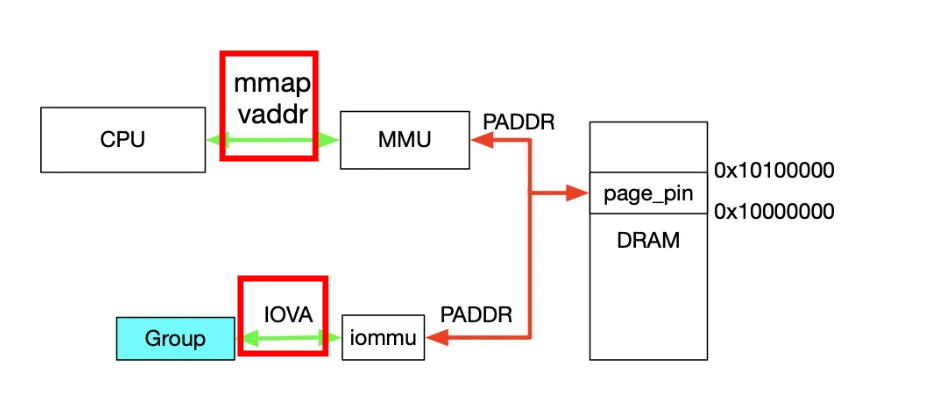
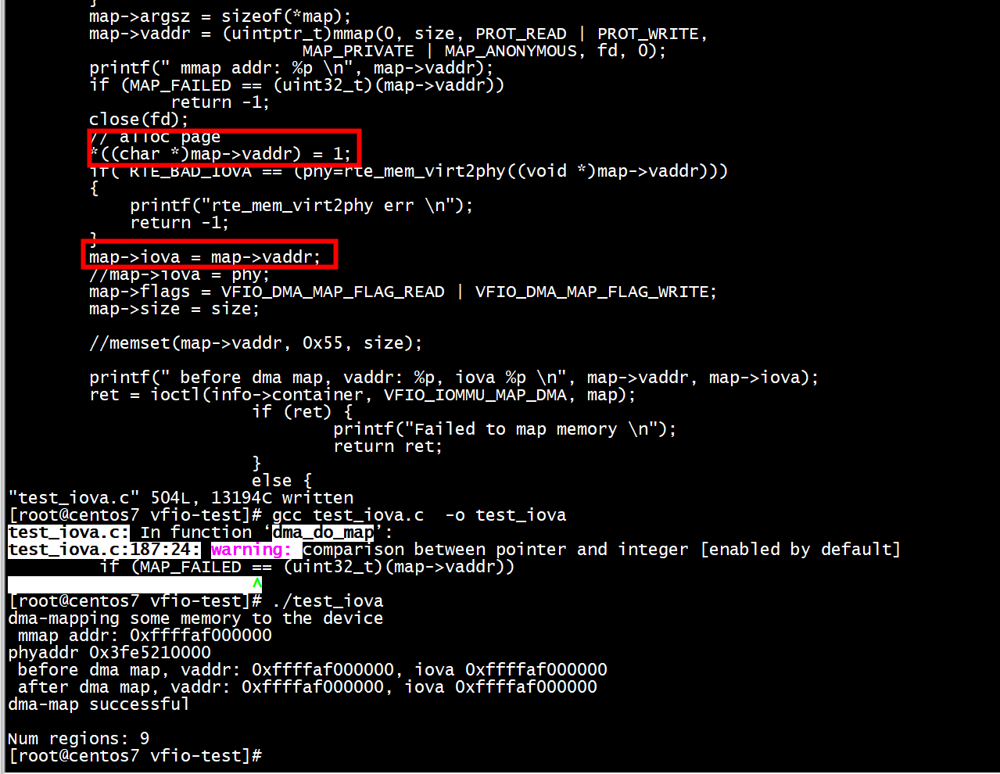
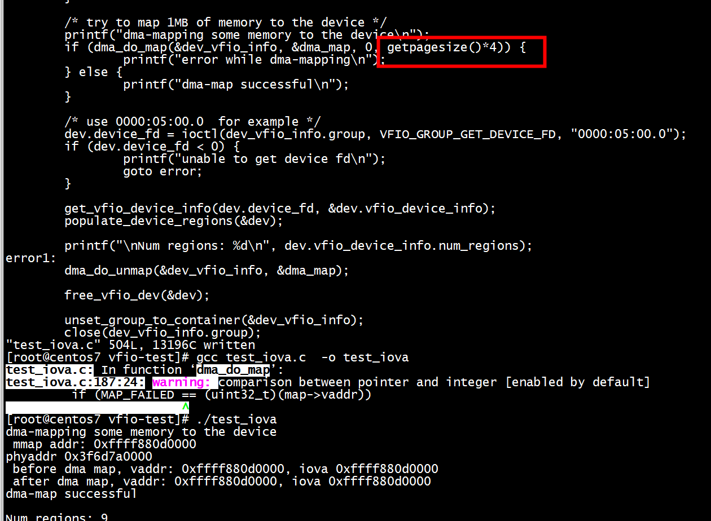
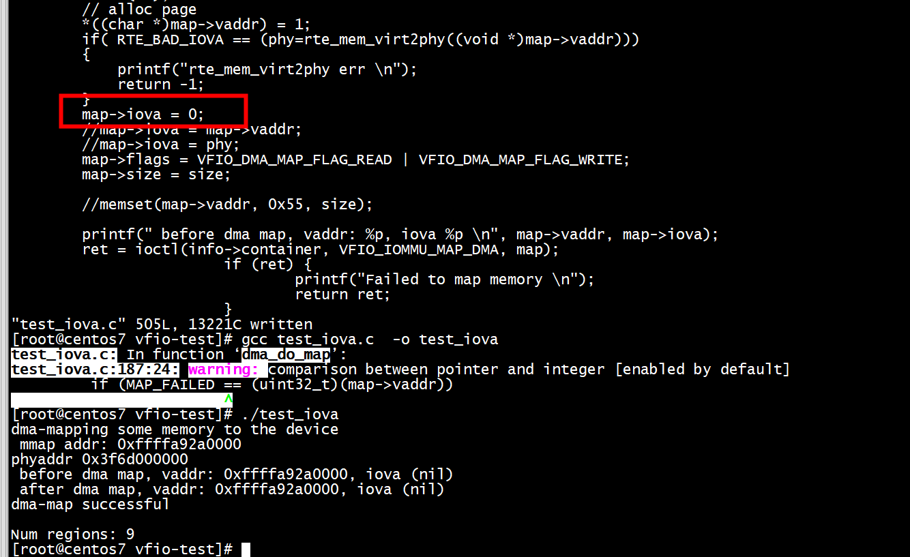

# iova

```
	/* Allocate some space and setup a DMA mapping */
	dma_map.vaddr = mmap(0, 1024 * 1024, PROT_READ | PROT_WRITE,
			     MAP_PRIVATE | MAP_ANONYMOUS, 0, 0);
	dma_map.size = 1024 * 1024;
	dma_map.iova = 0; /* 1MB starting at 0x0 from device view */
	dma_map.flags = VFIO_DMA_MAP_FLAG_READ | VFIO_DMA_MAP_FLAG_WRITE;

	ioctl(container, VFIO_IOMMU_MAP_DMA, &dma_map);
```


首先，利用 mmap 映射出 1MB 字节的虚拟空间，因为物理地址对于用户态不可见，只能通过虚拟地址访问物理空间。然后执行 ioctl 的 VFIO_IOMMU_MAP_DMA 命令，传入参数主要包含 vaddr 及 iova，其中 iova 代表的是设备发起 DMA 请求时要访问的地址，也就是 IOMMU 映射前的地址，vaddr 就是 mmap 的地址。VFIO_IOMMU_MAP_DMA 命令会为虚拟地址 vaddr 找到物理页并 pin 住（因为设备 DMA 是异步的，随时可能发生，物理页面不能交换出去），然后找到 Group 对应的 Contex Entry，建立页表项，页表项能够将 iova 地址映射成上面 pin 住的物理页对应的物理地址上去，这样对用户态程序完全屏蔽了物理地址，实现了用户空间驱动。IOVA 地址的 00x100000 对应 DRAM 地址 0x100000000x10100000，size为1024 * 1024。一句话概述，
VFIO_IOMMU_MAP_DMA 这个命令就是将 iova 通过 IOMMU 映射到 vaddr 对应的物理地址上去。

```
[root@centos7 vfio-test]# gcc vfio-iommu-map-unmap.c  -o vfio-iommu-map-unmap
[root@centos7 vfio-test]# modprobe vfio-pci
[root@centos7 vfio-test]# echo 0000:05:00.0 > /sys/bus/pci/devices/0000:05:00.0/driver/unbind
[root@centos7 vfio-test]# echo  19e5 0200 > /sys/bus/pci/drivers/vfio-pci/new_id
[root@centos7 vfio-test]# ls /dev/vfio/
24  vfio
[root@centos7 vfio-test]# ./vfio-iommu-map-unmap  0000:05:00.0
| before dma map, vaddr: 0xffffba8e0000, iova (nil) 
Failed to map memory (Invalid argument)
```
# test1

dma_do_map(&dev_vfio_info, &dma_map, 0, getpagesize())
```
        map->iova = map->vaddr;
        //map->iova = phy;
        map->flags = VFIO_DMA_MAP_FLAG_READ | VFIO_DMA_MAP_FLAG_WRITE;
        map->size = size;
```


# test2 

dma_do_map(&dev_vfio_info, &dma_map, 0, getpagesize()*4)
```
        map->iova = map->vaddr;
        //map->iova = phy;
        map->flags = VFIO_DMA_MAP_FLAG_READ | VFIO_DMA_MAP_FLAG_WRITE;
        map->size = size;
```



# test3 

dma_do_map(&dev_vfio_info, &dma_map, 0, getpagesize()*4)
```
        //map->iova = map->vaddr;
        map->iova =0;
        map->flags = VFIO_DMA_MAP_FLAG_READ | VFIO_DMA_MAP_FLAG_WRITE;
        map->size = size;
```




##  dpdk rte_mem_virt2iova

```
rte_iova_t
rte_mem_virt2iova(const void *virtaddr)
{
        if (rte_eal_iova_mode() == RTE_IOVA_VA)
                return (uintptr_t)virtaddr;
        return rte_mem_virt2phy(virtaddr);
}
```