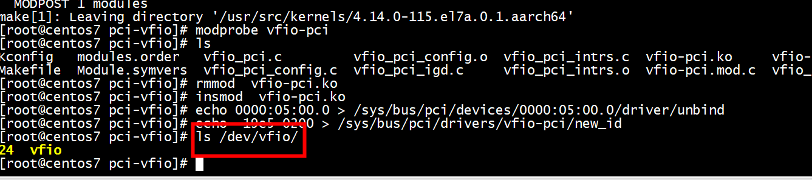
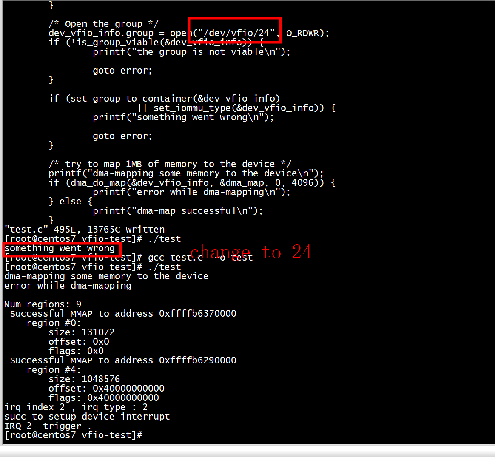
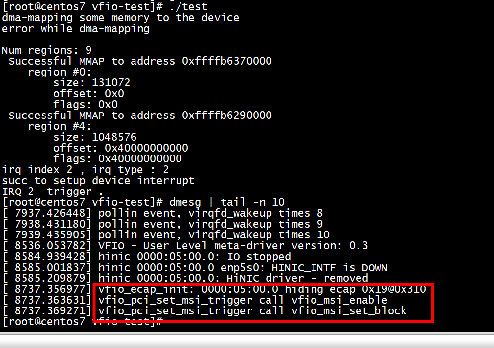
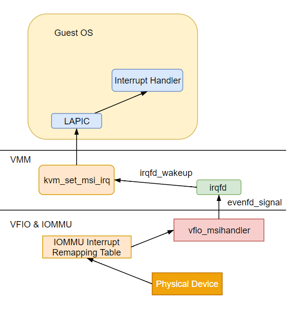

# vfio driver

```
[root@centos7 vfio-test]# ls /dev/vfio/
vfio
[root@centos7 vfio-test]#  modprobe vfio-pci
[root@centos7 vfio-test]# echo 0000:05:00.0 > /sys/bus/pci/devices/0000:05:00.0/driver/unbind
[root@centos7 vfio-test]# echo  19e5 0200 > /sys/bus/pci/drivers/vfio-pci/new_id
[root@centos7 vfio-test]# ls /dev/vfio/
26  vfio
[root@centos7 vfio-test]# 
```

#  /dev/vfio/26

## input params

```
/* Open the group */
        dev_vfio_info.group = open("/dev/vfio/26", O_RDWR);
```

```
  /* use 0000:05:00.0  for example */
        dev.device_fd = ioctl(dev_vfio_info.group, VFIO_GROUP_GET_DEVICE_FD, "0000:05:00.0");
        if (dev.device_fd < 0) {
                printf("unable to get device fd\n");
                goto error;
        }
```

```
[root@centos7 vfio-test]# ./test 
dma-mapping some memory to the device
error while dma-mapping
unable to get device fd
```

## run successfully

```
[root@centos7 pci-vfio]# modprobe vfio-pci
[root@centos7 pci-vfio]# ls
Kconfig   modules.order   vfio_pci.c         vfio_pci_config.o  vfio_pci_intrs.c  vfio-pci.ko     vfio-pci.mod.o  vfio-pci.o          vfio_pci_rdwr.c
Makefile  Module.symvers  vfio_pci_config.c  vfio_pci_igd.c     vfio_pci_intrs.o  vfio-pci.mod.c  vfio_pci.o      vfio_pci_private.h  vfio_pci_rdwr.o
[root@centos7 pci-vfio]# rmmod  vfio-pci.ko 
[root@centos7 pci-vfio]# insmod  vfio-pci.ko 
[root@centos7 pci-vfio]# 
```



### test 	




#  vfio_msi_set_vector_signal



```
vfio_msi_set_block--> vfio_msi_set_vector_signal | --> eventfd_ctx_fdget
                                                 | --> request_irq(vfio_msihandler)
                                                 | --> irq_bypass_register_producer
												 
```
										 


	
												 
***1)***   qemu调用memory_region_init_io注册vfio-pci设备的config space，虚拟机里驱动写config space，qemu拦截然后模拟。

pci_host_data_write->pci_data_write->pci_host_config_write_common->vfio_pci_write_config->vfio_msi_enable

***2)***  qemu调用内核vfio，irqbypass用于把 ***vfio和kvm*** 连接起来。


vfio_msi_enable->vfio_enable_vectors(***qemu代码***) ->vfio_pci_set_irqs_ioctl***(内核vfio代码)*** ->vfio_pci_set_msi_trigger->vfio_msi_set_block->vfio_msi_set_vector_signal->irq_bypass_register_producer->pi_update_irte

***3)***  qemu同时调用到内核kvm。

vfio_msi_enable->vfio_add_kvm_msi_virq->kvm_irqchip_add_irqfd_notifier_gsi->kvm_irqchip_assign_irqfd(***qemu代码*** )->kvm_vm_ioctl(*** kvm代码*** )->kvm_irqfd->kvm_irqfd_assign->irq_bypass_register_consumer												 

***4)*** 外设中断来了，vfio处理，signal kvm，kvm再把虚拟中断注入虚拟机。
vfio_msihandler->eventfd_signal wakeup了irqfd_wakeup->schedule_work
irqfd_inject->kvm_set_irq中断就注册了

 
```
static int vfio_msi_set_vector_signal(struct vfio_pci_device *vdev,
                                      int vector, int fd, bool msix)
{
        struct pci_dev *pdev = vdev->pdev;
        struct eventfd_ctx *trigger;
        int irq, ret;

        if (vector < 0 || vector >= vdev->num_ctx)
                return -EINVAL;

        irq = pci_irq_vector(pdev, vector);

        if (vdev->ctx[vector].trigger) {
                free_irq(irq, vdev->ctx[vector].trigger);
                irq_bypass_unregister_producer(&vdev->ctx[vector].producer);
                kfree(vdev->ctx[vector].name);
                eventfd_ctx_put(vdev->ctx[vector].trigger);
                vdev->ctx[vector].trigger = NULL;
        }

        if (fd < 0)
                return 0;

        vdev->ctx[vector].name = kasprintf(GFP_KERNEL, "vfio-msi%s[%d](%s)",
                                           msix ? "x" : "", vector,
                                           pci_name(pdev));
        if (!vdev->ctx[vector].name)
                return -ENOMEM;

        trigger = eventfd_ctx_fdget(fd);
        if (IS_ERR(trigger)) {
                kfree(vdev->ctx[vector].name);
                return PTR_ERR(trigger);
        }

        /*
         * The MSIx vector table resides in device memory which may be cleared
         * via backdoor resets. We don't allow direct access to the vector
         * table so even if a userspace driver attempts to save/restore around
         * such a reset it would be unsuccessful. To avoid this, restore the
         * cached value of the message prior to enabling.
         */
        if (msix) {
                struct msi_msg msg;

                get_cached_msi_msg(irq, &msg);
                pci_write_msi_msg(irq, &msg);
        }

        ret = request_irq(irq, vfio_msihandler, 0,
                          vdev->ctx[vector].name, trigger);
        if (ret) {
                kfree(vdev->ctx[vector].name);
                eventfd_ctx_put(trigger);
                return ret;
        }

        vdev->ctx[vector].producer.token = trigger;
        vdev->ctx[vector].producer.irq = irq;
        ret = irq_bypass_register_producer(&vdev->ctx[vector].producer);
        if (unlikely(ret))
                dev_info(&pdev->dev,
                "irq bypass producer (token %p) registration fails: %d\n",
                vdev->ctx[vector].producer.token, ret);

        vdev->ctx[vector].trigger = trigger;

        return 0;
}
```

## vfio_msihandler

直通设备在向Guest vCPU投递MSI中断的时候首先会***被IOMMU截获***， 中断被重定向到Host IRQ上，然后通过irqfd注入MSI中断到虚拟机内部。
整个过程如下： 直通设备的中断会触发Host上的vfio_msihandler这个中断处理函数。在这个函数中向这个irqfd发送了一个信号通知中断到来， 如此一来KVM irqfd机制在poll这个irqfd的时候会受到这个事件，随后调用事件的处理函数注入中断。 irqfd_wakeup -> EPOLLIN -> schedule_work(&irqfd->inject) -> irqfd_inject -> kvm_set_irq这样就把中断注入到虚拟机了。

static irqreturn_t vfio_msihandler(int irq, void *arg)
{
    struct eventfd_ctx *trigger = arg;

    eventfd_signal(trigger, 1);
    return IRQ_HANDLED;
}	


# x86

```
root@ubuntux86:/home/ubuntu# ls /dev/vfio/
vfio
root@ubuntux86:/home/ubuntu# modprobe vfio-pci
root@ubuntux86:/home/ubuntu# ethtool -i  enp0s31f6
driver: e1000e
version: 5.13.0-39-generic
firmware-version: 0.4-4
expansion-rom-version: 
bus-info: 0000:00:1f.6
supports-statistics: yes
supports-test: yes
supports-eeprom-access: yes
supports-register-dump: yes
supports-priv-flags: yes

root@ubuntux86:/home/ubuntu# echo 0000:00:1f.6 > /sys/bus/pci/devices/0000:00:1f.6/driver/unbind
root@ubuntux86:/home/ubuntu#  lspci -n -s   0000:00:1f.6
00:1f.6 0200: 8086:15f9 (rev 11)
root@ubuntux86:/home/ubuntu# echo   8086 15f9 > /sys/bus/pci/drivers/vfio-pci/new_id
root@ubuntux86:/home/ubuntu# dmesg | tail -n 10

[  209.693392] vfio-pci: probe of 0000:00:1f.6 failed with error -22
```