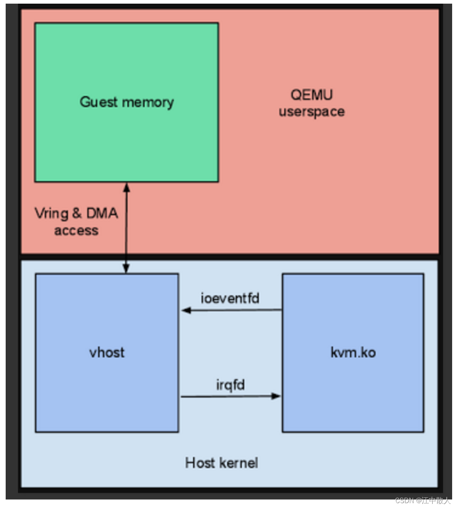
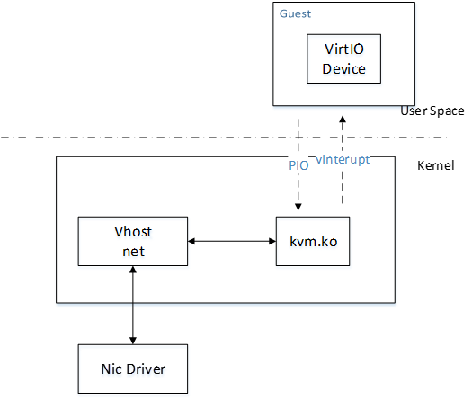
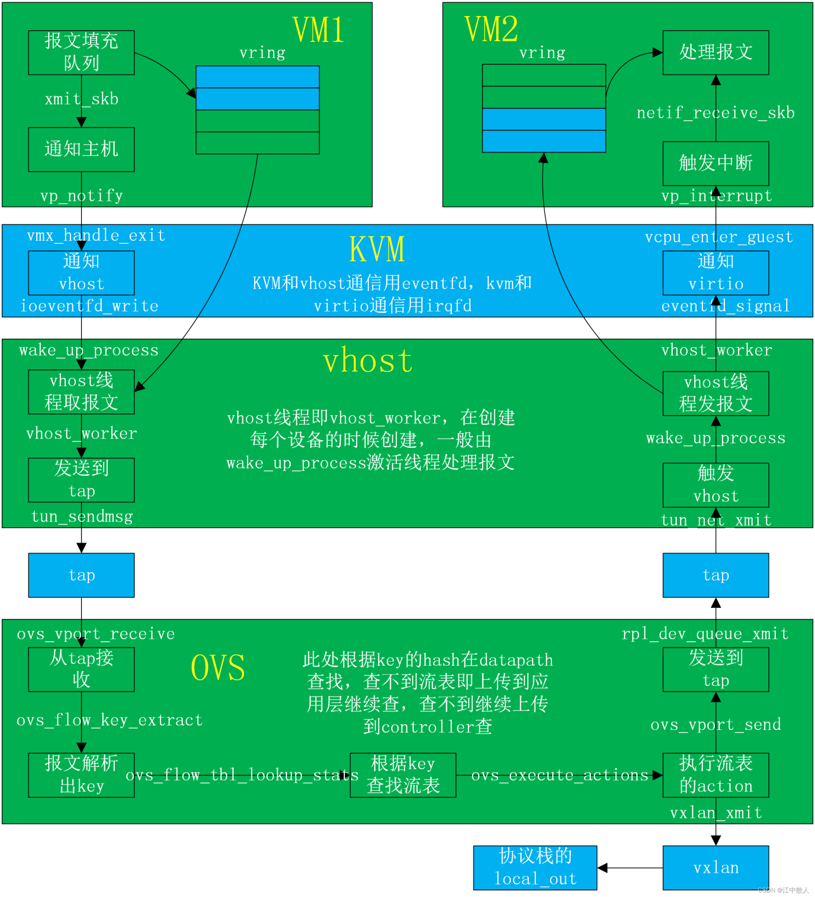
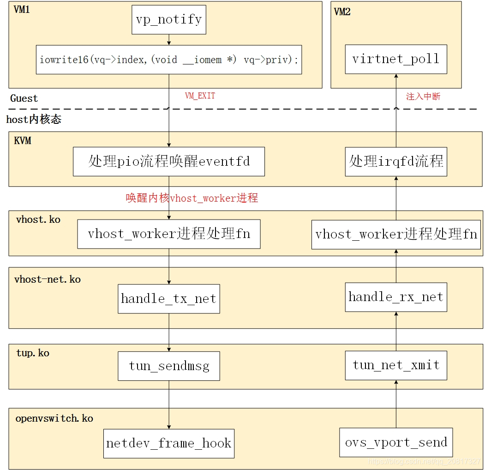
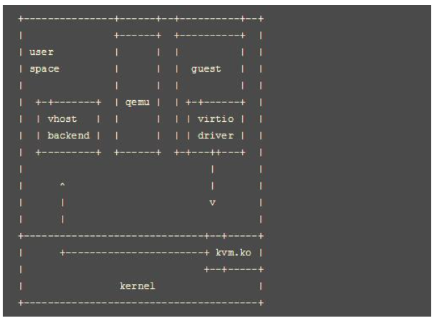
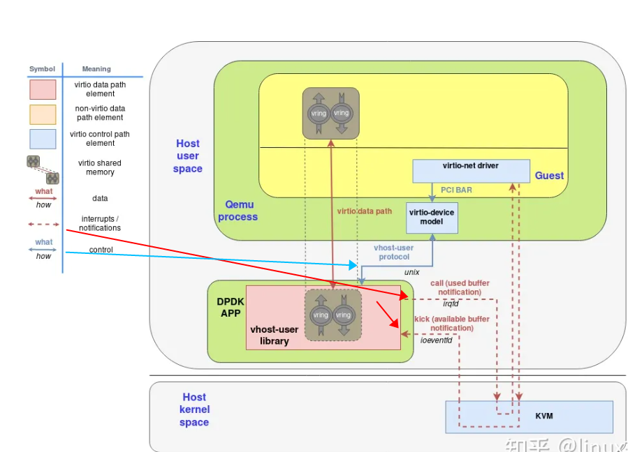
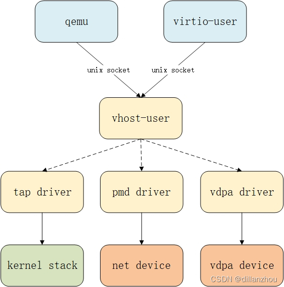
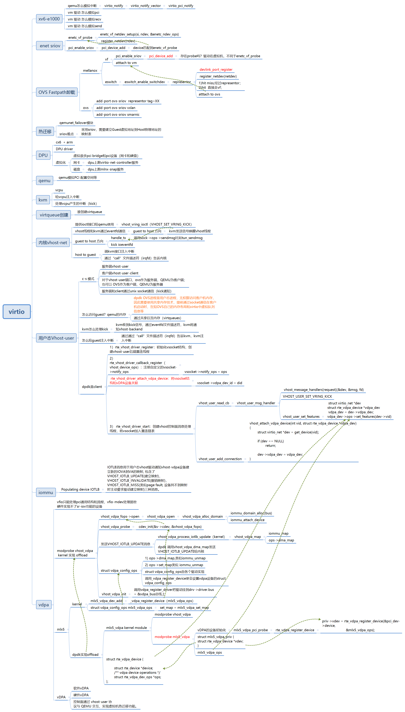

# 1 virtio-net网卡收发在virtqueue上的实现
这里以virtio-net为例（非vhost-net模式）来分析一下网卡收发报文在virtio协议上的具体实现。 virtio-net模式下网卡收发包的流程为：

收包：Hardware => Host Kernel => Qemu => Guest
发包：Guest => Host Kernel => Qemu => Host Kernel => Hardware
## 1.1 virtio-net网卡发包
前面我们看到virtio-net设备初始化的时候会创建一个net_device设备： virtnet_probe -> alloc_etherdev_mq注册了netdev_ops = &virtnet_netdev， 这里virtnet_netdev是网卡驱动的回调函数集合（收发包和参数设置）。

```
static const struct net_device_ops netdev_ops = {
        .ndo_open               = rio_open,
        .ndo_start_xmit = start_xmit,
        .ndo_stop               = rio_close,
        .ndo_get_stats          = get_stats,
        .ndo_validate_addr      = eth_validate_addr,
        .ndo_set_mac_address    = eth_mac_addr,
        .ndo_set_rx_mode        = set_multicast,
        .ndo_do_ioctl           = rio_ioctl,
        .ndo_tx_timeout         = rio_tx_timeout,
};
```
网卡发包的时候调用ndo_start_xmit，将TCP/IP上层协议栈扔下来的数据发送出去。 对应到virtio网卡的回调函数就是start_xmit，从代码看就是将skb发送到virtqueue中， 然后调用virtqueue_kick通知qemu后端将数据包发送出去。


Guest内核里面的virtio-net驱动发包：

 
内核驱动 virtio_net.c
```
start_xmit
    // 将skb放到virtqueue队列中
    -> xmit_skb -> sg_init_table,virtqueue_add_outbuf -> virtqueue_add
    // kick通知qemu后端去取
    virtqueue_kick_prepare && virtqueue_notify 
    // kick次数加1
    sq->stats.kicks++
```
Guest Kick后端从KVM中VMExit出来退出到Qemu用户态（走的是ioeventfd）由Qemu去将数据发送出去。
 大致调用的流程是： virtio_queue_host_notifier_read -> virtio_net_handle_tx_bh -> virtio_net_flush_tx -> virtqueue_pop拿到发包(skb) -> qemu_sendv_packet_async

Qemu代码virtio-net相关代码:

```
virtio_queue_host_notifier_read -> virtio_queue_notify_vq
    -> vq->handle_output -> virtio_net_handle_tx_bh 队列注册的时候，回注册回调函数
        -> qemu_bh_schedule -> virtio_net_tx_bh
            -> virtio_net_flush_tx
            -> virtqueue_pop
        -> qemu_sendv_packet_async // 报文放到发送队列上，写tap设备的fd去发包
            -> tap_receive_iov -> tap_write_packet
```
// 最后调用 tap_write_packet 把数据包发给tap设备投递出去

## 1.2  virtio-net网卡收包

网卡收包的时候，tap设备先收到报文，对应的virtio-net网卡tap设备fd变为可读， Qemu主循环收到POLL_IN事件调用回调函数收包。

```
tap_send -> qemu_send_packet_async -> qemu_send_packet_async_with_flags
    -> qemu_net_queue_send
        -> qemu_net_queue_deliver
        -> qemu_deliver_packet_iov
            -> nc_sendv_compat
            -> virtio_net_receive
                -> virtio_net_receive_rcu
```

virtio-net网卡收报最终调用了virtio_net_receive_rcu， 和发包类似都是调用virtqueue_pop从前端获取virtqueue element， 将报文数据填充到vring中然后***virtio_notify注入中断***v通知前端驱动取结果。

这里不得不吐槽一下，为啥收包函数取名要叫tap_send。


# 2 virtio pci

```
root@internet-x86:~$ lspci
00:00.0 Host bridge: Intel Corporation 440FX - 82441FX PMC [Natoma] (rev 02)
00:01.0 ISA bridge: Intel Corporation 82371SB PIIX3 ISA [Natoma/Triton II]
00:01.1 IDE interface: Intel Corporation 82371SB PIIX3 IDE [Natoma/Triton II]
00:01.2 USB controller: Intel Corporation 82371SB PIIX3 USB [Natoma/Triton II] (rev 01)
00:01.3 Bridge: Intel Corporation 82371AB/EB/MB PIIX4 ACPI (rev 03)
00:02.0 VGA compatible controller: Cirrus Logic GD 5446
00:03.0 Ethernet controller: Red Hat, Inc Virtio network device
00:04.0 Ethernet controller: Red Hat, Inc Virtio network device
00:05.0 SCSI storage controller: Red Hat, Inc Virtio block device
00:06.0 SCSI storage controller: Red Hat, Inc Virtio block device
00:07.0 SCSI storage controller: Red Hat, Inc Virtio block device
00:08.0 Unclassified device [00ff]: Red Hat, Inc Virtio memory balloon


root@internet-x86:~$ lspci -xxx  -s 00:05.0
00:05.0 SCSI storage controller: Red Hat, Inc Virtio block device
00: f4 1a 01 10 07 05 10 00 00 00 00 01 00 00 00 00
10: 01 c0 00 00 00 30 bd fe 00 00 00 00 00 00 00 00
20: 0c 80 00 fe 00 00 00 00 00 00 00 00 f4 1a 02 00
30: 00 00 00 00 98 00 00 00 00 00 00 00 0a 01 00 00


root@internet-x86:~$ lspci -xxx  -s 00:03.0
00:03.0 Ethernet controller: Red Hat, Inc Virtio network device
00: f4 1a 00 10 07 05 10 00 00 00 00 02 00 00 00 00
10: e1 c0 00 00 00 10 bd fe 00 00 00 00 00 00 00 00
20: 0c 00 00 fe 00 00 00 00 00 00 00 00 f4 1a 01 00
30: 00 00 b4 fe 98 00 00 00 00 00 00 00 0b 01 00 00

root@internet-x86:~$ lspci -vvv  -s 00:03.0
00:03.0 Ethernet controller: Red Hat, Inc Virtio network device
        Subsystem: Red Hat, Inc Virtio network device
        Physical Slot: 3
        Control: I/O+ Mem+ BusMaster+ SpecCycle- MemWINV- VGASnoop- ParErr- Stepping- SERR+ FastB2B- DisINTx+
        Status: Cap+ 66MHz- UDF- FastB2B- ParErr- DEVSEL=fast >TAbort- <TAbort- <MAbort- >SERR- <PERR- INTx-
        Latency: 0
        Interrupt: pin A routed to IRQ 10
        Region 0: I/O ports at c0e0 [size=32]
        Region 1: Memory at febd1000 (32-bit, non-prefetchable) [size=4K]
        Region 4: Memory at fe000000 (64-bit, prefetchable) [size=16K]
        Expansion ROM at feb40000 [disabled] [size=256K]
        Capabilities: <access denied>
        Kernel driver in use: virtio-pci


 

root@internet-x86:~$ lspci -vvv  -s 00:05.0
00:05.0 SCSI storage controller: Red Hat, Inc Virtio block device
        Subsystem: Red Hat, Inc Virtio block device
        Physical Slot: 5
        Control: I/O+ Mem+ BusMaster+ SpecCycle- MemWINV- VGASnoop- ParErr- Stepping- SERR+ FastB2B- DisINTx+
        Status: Cap+ 66MHz- UDF- FastB2B- ParErr- DEVSEL=fast >TAbort- <TAbort- <MAbort- >SERR- <PERR- INTx-
        Latency: 0
        Interrupt: pin A routed to IRQ 10
        Region 0: I/O ports at c000 [size=64]
        Region 1: Memory at febd3000 (32-bit, non-prefetchable) [size=4K]
        Region 4: Memory at fe008000 (64-bit, prefetchable) [size=16K]
        Capabilities: <access denied>
        Kernel driver in use: virtio-pci
```
 
# 2 sriov

 SRIOV VF passthrough到VM后，VM的迁移性会受限，主要原因在于SRIOV这种passthrough I/O借助了Intel CPU VT-d（Virtualization Technology for Directed I/O）或AMD的IOMMU（I/O Memory Management Unit）技术，在VM上VF网卡初始化的时候，建立了Guest虚拟地址到Host物理地址的映射表，所以这种“有状态”的映射表在热迁移的过程中会丢失。

# vhost Data Path Acceleration in DPDK

 




 QEMU和vhost-net内核驱动使用ioctl来交换vhost消息，并且用eventfd来实现前后端的通知。当vhost-net内核驱动加载后，它会暴露一个字符设备在/dev/vhost-net。


```
[root@centos7 ice]# ls /dev/vhost-*
/dev/vhost-net  /dev/vhost-vsock
[root@centos7 ice]# 
```


 
 
## ovs dpdk

***1)*** guest的NAPI接口 virtnet_poll






图中描述了的io路径:guest发出中断信号退出kvm，kvm直接和vhost-backend通信，然后网络数据将交由vhost-backend 进行处理。
vhost-user的io路径
*(1)* guest设置好tx;

*(2)* kick host;

*(3)* guest陷出到kvm；

*(4)* kvm将通知vhost-backend；

*(5)* vhost-backend将tx数据直接发送到nic设备。


 

# vDPA

在DPDK中，vDPA的‘v’代表vhost，原因是DPDK中vDPA是作为vhost-user的一种硬件加速实现而存在的。qemu或virtio-user进程与vhost-user的交互接口不变，并不感知vhost-user后端是纯软件实现的还是vDPA硬件实现的，由vhost-user应用决定virtio设备最终的数据面实现。



从上图中可以看到，通过vhost-user和vdpa，qemu和virtio-user事实上是直接与vdpa硬件设备交互收发数据的，性能上与设备直通模式基本相同，但对qemu和virtio-user屏蔽了底层实现的具体方式，只暴露了一个标准的virtio-net设备接口。对vhost-user来说，vdpa模式与通过pmd driver向网卡转发是不同的，vdpa模式下，vhost-user只负责网卡的vdpa模式配置和初始化，后续的数据收发不需要vhost-user参与；而通过pmd driver转发是需要vhost-user处理virtqueue和网卡队列信息并在这两种队列间转发数据的。

从DPDK的实现来看，vdpa是设备驱动的一种模式，实现vhost-user的进程会通过设备的这套驱动实现网卡硬件的初始化和virtqueue信息同步。

理论上说，qemu和virtio-user也可以直接通过设备的vdpa驱动来使用设备，但这就将设备实现和复杂性暴露到了更上层的实现中，vDPA的意义就变小了。
 

#  summary

 

# references

[OVS之vhost-net中VM通信（十）](https://blog.csdn.net/qq_20817327/article/details/106649877)

[用mellanox DPU实现裸金属服务器](https://zhuanlan.zhihu.com/p/394769309)

[Mellanox CX-5网卡支持OVS流表加速功能的调研](https://blog.csdn.net/qihoo_tech/article/details/115649340)

[VirtIO实现原理——PCI基础](https://blog.csdn.net/huang987246510/article/details/103379926)

[MIT-6.828-JOS 笔记 - Lab 6: Network Driver](https://www.epis2048.net/2021/6.828-lab6/)

[VirtIO实现原理——PCI基础](https://blog.csdn.net/huang987246510/article/details/103379926)

[6.S081 lab: networking e1000 网卡驱动](https://blog.csdn.net/u010180372/article/details/119525638)