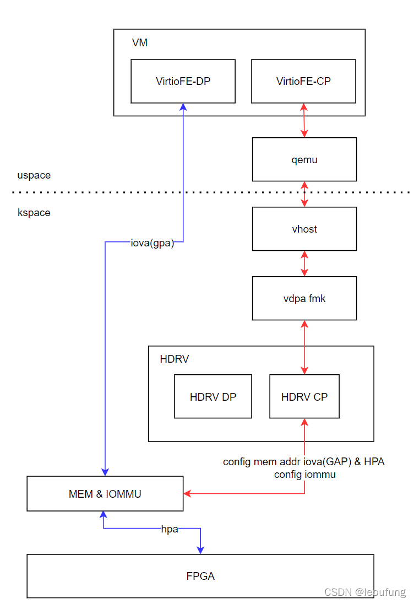
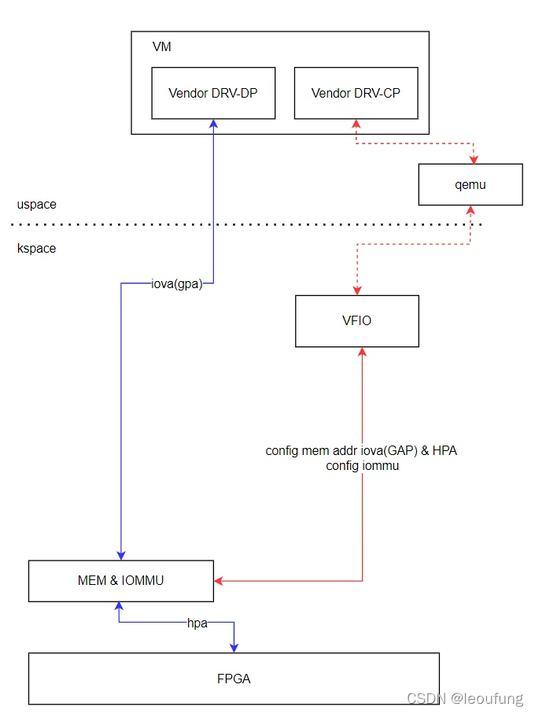

 
目前虚机场景下，关于设备适配到虚拟机有两种思路，一种是通过VFIO透传，一种是通过kernel VDPA进行适配，无论使用哪种，最终都要把数据平面直接透给VM，以便进行高效的数据传输。其实透传这是针对控制面而言，数据面只是设置对应的地址即可

## VDPA的模式

 
 
控制面上，厂商的HOST驱动控制面 HDRV-CP 适配到VDPA框架，通过VDPA转换给vhost设备，QEMU使用VHOST模拟virito设备给虚拟机VM，virito 前端驱动控制面 virito FE-CP即可通过virito标准方式控制厂商驱动。控制面配置数据面所使用内存的地址，***VM里面是GPA然后转换为HVA和HPA，最终将GPA到HPA的映射配置到IOMMU中***，这样就可以独立的指定一块内存作为DMA的通路。不同的VM因为映射的GPA的不同，也就是使用不同的内存了，这样数据面在不同VM间就是分开的。

数据面上，VM的virtio-FE DP部分使用GPA作为IOVA对DMA内存操作，FPGA硬件按照virito方式对DMA内存操作，就完成了VM和硬件的通信，也就达成了“透传”数据面的目的，但实际上就是通过控制面协商好共享DMA内存的地址，两面共同操作。不同VM和FPGA使用的DMA内存位置不同，自然也就区分开了。
 
## VFIO模式

VFIO 模式下，整个设备的PCI 空间都是透传给 VM的，VM 内部需要使用厂商特定的驱动Vendor DRV

控制面上，Vendor DRV-CP 通过 QEMU 间接读写VFIO字符设备，达到配置硬件的目的，同样是配置了一块共享的DMA内存作为DMA传送的空间

数据面上，Vendor DRV-DP 通过 GPA（IOVA）操作DMA内存，FPGA通过HPA操作DMA内存，从而完成VM和FPGA的通信，达成“透传”数据面的目的，但实际上就是通过控制面协商好共享DMA内存的地址，两面共同操作。不同VM和FPGA使用的DMA内存位置不同，自然也就区分开了。

# 总结
 DPU 设备透传，主要是指的控制面CP的透传，DP就是通过CP协商好的一块块共享DMA内存而已，达到的数据面透传的目的
 
 
 # references
 
 [通过 auxiliary bus 管理 multifunction 设备](https://blog.csdn.net/leoufung/article/details/120913643?spm=1001.2014.3001.5502)
 
 