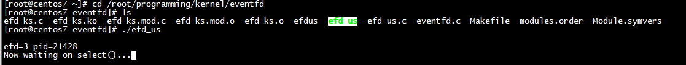
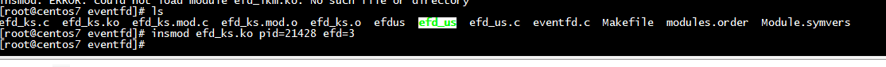
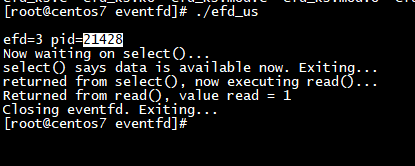
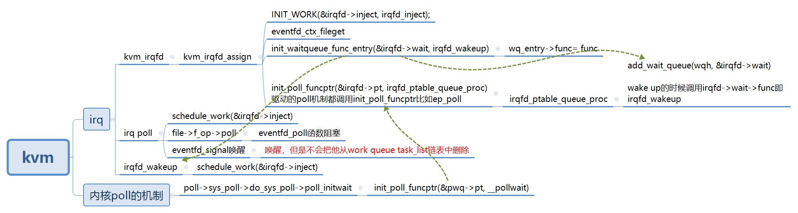

# ./efd_us 

**1** 运行 ./efd_us 



**2** 加载内核   insmod efd_ks.ko pid=21428 efd=3



**2** 查看结果




## eventfd_ctx_fdget

```
/**
 * eventfd_ctx_fdget - Acquires a reference to the internal eventfd context.
 * @fd: [in] Eventfd file descriptor.
 *
 * Returns a pointer to the internal eventfd context, otherwise the error
 * pointers returned by the following functions:
 *
 * eventfd_fget
 */
struct eventfd_ctx *eventfd_ctx_fdget(int fd)
{
    struct eventfd_ctx *ctx;
    struct fd f = fdget(fd);
    if (!f.file)
        return ERR_PTR(-EBADF);
    ctx = eventfd_ctx_fileget(f.file);
    fdput(f);
    return ctx;
}

```

# qemu-kvm的irqfd机制


irqfd机制与ioeventfd机制类似，其基本原理都是基于eventfd。

ioeventfd机制为Guest提供了向qemu-kvm发送通知的快捷通道，对应地，irqfd机制提供了qemu-kvm向Guest发送通知的快捷通道。

irqfd机制将一个eventfd与一个全局中断号联系起来，当向这个eventfd发送信号时，就会导致对应的中断注入到虚拟机中

##  kvm irqfd

kvm的中断处理是有vmm调用iotcl KVM_IRQFD来完成，先看下kvm_irqfd；

```
 struct kvm_irqfd {
     __u32 fd;
     __u32 gsi;
     __u32 flags;
     __u32 resamplefd;
     __u8  pad[16];
 };
```


```
static int kvm_irqchip_assign_irqfd(KVMState *s, int fd, int rfd, int virq,
                                    bool assign)
{
    struct kvm_irqfd irqfd = {
        .fd = fd,
        .gsi = virq,
        .flags = assign ? 0 : KVM_IRQFD_FLAG_DEASSIGN,
    };

    if (rfd != -1) {
        irqfd.flags |= KVM_IRQFD_FLAG_RESAMPLE;
        irqfd.resamplefd = rfd;
    }

    if (!kvm_irqfds_enabled()) {
        return -ENOSYS;
    }

    return kvm_vm_ioctl(s, KVM_IRQFD, &irqfd);
}
```


```
     irqfd = kzalloc(sizeof(*irqfd), GFP_KERNEL);
     if (!irqfd)
         return -ENOMEM;

     irqfd->kvm = kvm;
     irqfd->gsi = args->gsi;
     INIT_LIST_HEAD(&irqfd->list);
     INIT_WORK(&irqfd->inject, irqfd_inject);
     INIT_WORK(&irqfd->shutdown, irqfd_shutdown);
     seqcount_init(&irqfd->irq_entry_sc);

     f = fdget(args->fd);
     if (!f.file) {
         ret = -EBADF;
         goto out;
     }

     eventfd = eventfd_ctx_fileget(f.file);
```

在kvm_irqfd_assign处理函数中，会分配irqfd的数据结构，后面kvm主要做的事情是创建针对irqfd的wait队列，并拿到对应fd的eventfd,并调用fd对应的poll函数，将绑定了irqfd_wakeup函数的wait queue加入到poll队列中，当有用户态对eventfd进行写入的时候，会触发回调irqfd_wakeup函数，其中会调用唤醒irqfd->inject的工作队列，最后调用到irqfd_inject中kvm_set_irq对vm进行中断注入

```
  static void
  irqfd_inject(struct work_struct *work)
  {
      struct kvm_kernel_irqfd *irqfd =
          container_of(work, struct kvm_kernel_irqfd, inject);
      struct kvm *kvm = irqfd->kvm;
 
      if (!irqfd->resampler) {
          kvm_set_irq(kvm, KVM_USERSPACE_IRQ_SOURCE_ID, irqfd->gsi, 1,
                  false);
          kvm_set_irq(kvm, KVM_USERSPACE_IRQ_SOURCE_ID, irqfd->gsi, 0,
                  false);
      }
```

# kvm irq poll





##   eventfd_poll

```
static unsigned int eventfd_poll(struct file *file, poll_table *wait)
{
    struct eventfd_ctx *ctx = file->private_data;
    unsigned int events = 0;
    unsigned long flags;
    /*执行poll_table中的函数，把irqfd加入eventfd的到等待队列中*/
    poll_wait(file, &ctx->wqh, wait);

    spin_lock_irqsave(&ctx->wqh.lock, flags);

    if (ctx->count > 0)
        events |= POLLIN;//表明现在可以read
    if (ctx->count == ULLONG_MAX)
        events |= POLLERR;
    if (ULLONG_MAX - 1 > ctx->count)
        events |= POLLOUT;//现在可以write
    spin_unlock_irqrestore(&ctx->wqh.lock, flags);

    return events;
}
```

##  eventfd_signal

```
__u64 eventfd_signal(struct eventfd_ctx *ctx, __u64 n)
{
    unsigned long flags;
    spin_lock_irqsave(&ctx->wqh.lock, flags);
    if (ULLONG_MAX - ctx->count < n)
        n = ULLONG_MAX - ctx->count;
    ctx->count += n;
    /*mainly judge if wait is empty,如果等待队列不为空，则进行处理*/
    if (waitqueue_active(&ctx->wqh))
        wake_up_locked_poll(&ctx->wqh, POLLIN);
    spin_unlock_irqrestore(&ctx->wqh.lock, flags);

    return n;
} 
 ```
 

 函数首要任务是向对应的eventfd传送信号，实质就是增加count值。因为此时count值一定大于0，即状态可用，则检查等待队列中时候有等待对象，如果有，则调用wake_up_locked_poll函数进行处理

 ```
#define wake_up_locked_poll(x, m)                \
    __wake_up_locked_key((x), TASK_NORMAL, (void *) (m))

void __wake_up_locked_key(wait_queue_head_t *q, unsigned int mode, void *key)
{
    __wake_up_common(q, mode, 1, 0, key);
}

static void __wake_up_common(wait_queue_head_t *q, unsigned int mode,
            int nr_exclusive, int wake_flags, void *key)
{
    wait_queue_t *curr, *next;

    list_for_each_entry_safe(curr, next, &q->task_list, task_list) {
        unsigned flags = curr->flags;

        if (curr->func(curr, mode, wake_flags, key) &&
                (flags & WQ_FLAG_EXCLUSIVE) && !--nr_exclusive)
            break;
    }
}
 
 ```
 
 
 具体处理过程就是遍历等待队列上所有等待对象，并执行对应的唤醒函数。针对irqfd的唤醒函数前面已经提到，是irqfd_wakeup，在该函数中会对普通中断执行schedule_work(&irqfd->inject);这样对于irqfd注册的inject工作对象处理函数就会得到执行，于是，中断就会被执行注入。到这里不妨在看看schedule_work发生了什么

```
static inline bool schedule_work(struct work_struct *work)
{
    return queue_work(system_wq, work);
}
```

# eventfd_poll(struct file *file, poll_table *wait)
```
static unsigned int eventfd_poll(struct file *file, poll_table *wait)
{
        struct eventfd_ctx *ctx = file->private_data;
        unsigned int events = 0;
        u64 count;

        poll_wait(file, &ctx->wqh, wait);

        /*
         * All writes to ctx->count occur within ctx->wqh.lock.  This read
         * can be done outside ctx->wqh.lock because we know that poll_wait
         * takes that lock (through add_wait_queue) if our caller will sleep.
         *
         * The read _can_ therefore seep into add_wait_queue's critical
         * section, but cannot move above it!  add_wait_queue's spin_lock acts
         * as an acquire barrier and ensures that the read be ordered properly
         * against the writes.  The following CAN happen and is safe:
         *
         *     poll                               write
         *     -----------------                  ------------
         *     lock ctx->wqh.lock (in poll_wait)
         *     count = ctx->count
         *     __add_wait_queue
         *     unlock ctx->wqh.lock
         *                                        lock ctx->qwh.lock
         *                                        ctx->count += n
         *                                        if (waitqueue_active)
         *                                          wake_up_locked_poll
         *                                        unlock ctx->qwh.lock
         *     eventfd_poll returns 0
         *
         * but the following, which would miss a wakeup, cannot happen:
         *
         *     poll                               write
         *     -----------------                  ------------
         *     count = ctx->count (INVALID!)
         *                                        lock ctx->qwh.lock
         *                                        ctx->count += n
         *                                        **waitqueue_active is false**
         *                                        **no wake_up_locked_poll!**
         *                                        unlock ctx->qwh.lock
         *     lock ctx->wqh.lock (in poll_wait)
         *     __add_wait_queue
         *     unlock ctx->wqh.lock
         *     eventfd_poll returns 0
         */
        count = READ_ONCE(ctx->count);

        if (count > 0)
                events |= POLLIN;
        if (count == ULLONG_MAX)
                events |= POLLERR;
        if (ULLONG_MAX - 1 > count)
                events |= POLLOUT;

        return events;
}
```

# 参考

[KVM VHOST中irqfd的使用](https://www.cnblogs.com/ck1020/p/8310284.html)

[VHOST KICK&CALL 原理](https://blog.csdn.net/yiyeguzhou100/article/details/122951587)
