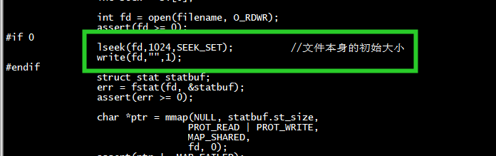

# file len = 0




```
[root@centos7 eventfd]# rm test.txt 
rm: remove regular file ‘test.txt’? y
[root@centos7 eventfd]# touch test.txt
[root@centos7 eventfd]# ./mmap  test.txt
Sockets connected.
Semaphore created and initialized with 0.

PARENT in action.
CHILD in action.
mmap: mmap.c:124: main: Assertion `ptr != ((void *) -1)' failed.
Aborted
[root@centos7 eventfd]# 
```

## dpdk use ftruncate(fd, mem_size)
```
/*
 * Uses mmap to create a shared memory area for storage of data
 * Used in this file to store the hugepage file map on disk
 */
static void *
create_shared_memory(const char *filename, const size_t mem_size)
{
        void *retval;
        int fd;

        /* if no shared files mode is used, create anonymous memory instead */
        if (internal_config.no_shconf) {
                retval = mmap(NULL, mem_size, PROT_READ | PROT_WRITE,
                                MAP_PRIVATE | MAP_ANONYMOUS, -1, 0);
                if (retval == MAP_FAILED)
                        return NULL;
                return retval;
        }

        fd = open(filename, O_CREAT | O_RDWR, 0600);
        if (fd < 0)
                return NULL;
        if (ftruncate(fd, mem_size) < 0) {
                close(fd);
                return NULL;
        }
        retval = mmap(NULL, mem_size, PROT_READ | PROT_WRITE, MAP_SHARED, fd, 0);
        close(fd);
        if (retval == MAP_FAILED)
                return NULL;
        return retval;
}

static void *
inflight_mem_alloc(const char *name, size_t size, int *fd)
{
        void *ptr;
        int mfd = -1;
        char fname[20] = "/tmp/memfd-XXXXXX";

        *fd = -1;
#ifdef MEMFD_SUPPORTED
        mfd = memfd_create(name, MFD_CLOEXEC);
#else
        RTE_SET_USED(name);
#endif
        if (mfd == -1) {
                mfd = mkstemp(fname);
                if (mfd == -1) {
                        RTE_LOG(ERR, VHOST_CONFIG,
                                "failed to get inflight buffer fd\n");
                        return NULL;
                }

                unlink(fname);
        }

        if (ftruncate(mfd, size) == -1) {
                RTE_LOG(ERR, VHOST_CONFIG,
                        "failed to alloc inflight buffer\n");
                close(mfd);
                return NULL;
        }

        ptr = mmap(0, size, PROT_READ | PROT_WRITE, MAP_SHARED, mfd, 0);
        if (ptr == MAP_FAILED) {
                RTE_LOG(ERR, VHOST_CONFIG,
                        "failed to mmap inflight buffer\n");
                close(mfd);
                return NULL;
        }

        *fd = mfd;
        return ptr;
}

```


# test2


```
[root@centos7 eventfd]# gcc mmap.c  -o mmap -pthread
[root@centos7 eventfd]# ./mmap  test.txt
Sockets connected.
Semaphore created and initialized with 0.

PARENT in action.
CHILD in action.
PARENT sends file description of 4 via Unix domain sockets.
PARENT reads memory-shared file:

PARENT sleeps for 5 seconds... Time: Thu Nov 10 01:45:33 2022
CHILD receives 3 via Unix domain sockets.
CHILD waits for its parent to increment semaphore. Time: Thu Nov 10 01:45:34 2022
PARENT edits memory-shared file. Time: Thu Nov 10 01:45:38 2022
PARENT increments semaphore. Time: Thu Nov 10 01:45:38 2022
CHILD can now read. Time: Thu Nov 10 01:45:38 2022
CHILD reads memory-shared file:
 
CHILD exits.
PARENT exits.
[root@centos7 eventfd]# 
```