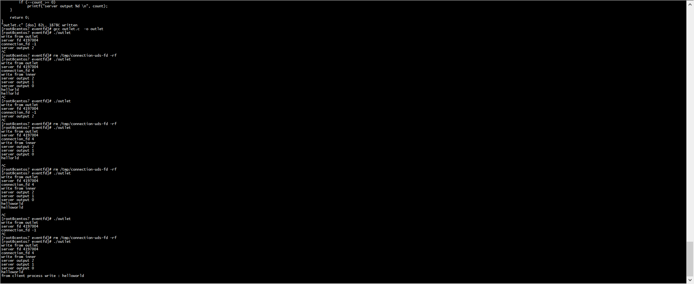
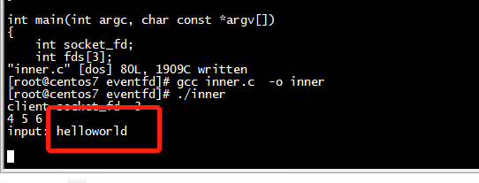

# test

```
[root@centos7 eventfd]# ./outlet 
write from outlet
server fd 4197004 
connection_fd -1 
server output 2 
server output 1 
server output 0 
^C
[root@centos7 eventfd]# rm /tmp/connection-uds-fd -rf
[root@centos7 eventfd]# 
```






```
[root@centos7 eventfd]# ./inner 
client socket_fd  3 
4 5 6 
input: helloworld
 
```


```
    write(fds[1], msg_buf, strlen(msg_buf)); // 输出到server的stdout
    read(fds[0], input, sizeof(input));// 等待server的stdin
    printf("input: %s \n", input);
    write(fds[1], "from client process write : ", strlen("from client process write : ")); / 输出到server的stdout
    write(fds[1], input, strlen(input)); / 输出到server的stdout
```

# test2

```
[root@centos7 eventfd]# gcc sendfd0.c  -o sendfd0
[root@centos7 eventfd]# ./sendfd0
parent val 100
parent val 101
parent val 102
parent val 103
parent val 104
parent val 105
```

# 参考

[从内核看文件描述符传递的实现（基于5.9.9）](https://cloud.tencent.com/developer/article/1844164)