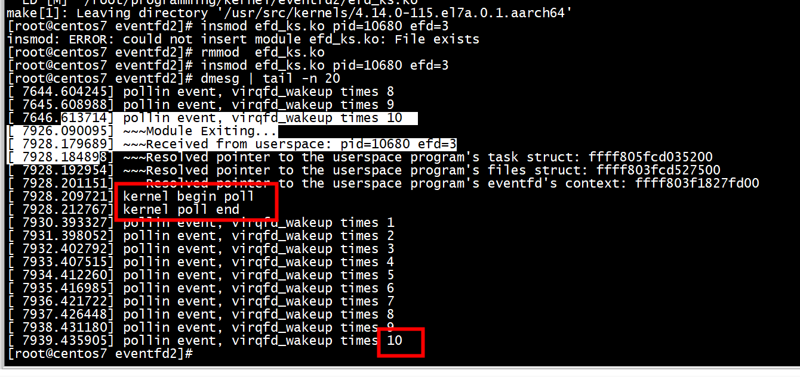
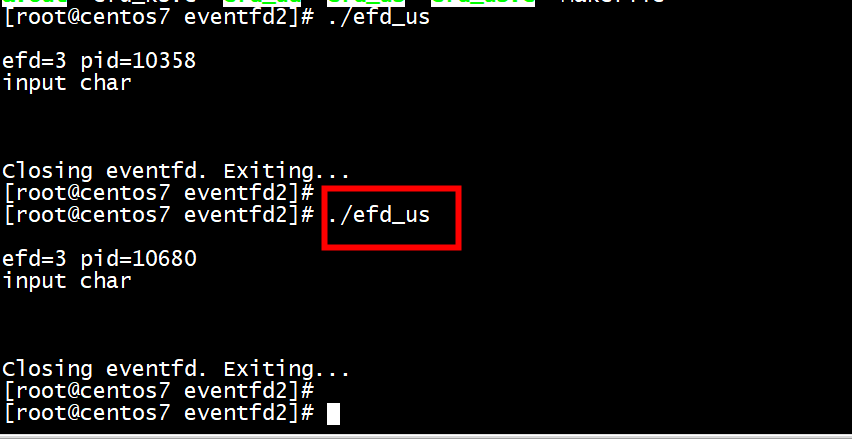

#   insmod efd_ks.ko pid=9473 efd=3

```
[ 4889.178495] ~~~Received from userspace: pid=9473 efd=3
[ 4889.183618] ~~~Resolved pointer to the userspace program's task struct: ffff803fceaded00
[ 4889.191674] ~~~Resolved pointer to the userspace program's files struct: ffff803fc9fe1800
[ 4889.200242] ~~~Resolved pointer to the userspace program's eventfd's file struct: ffff803f180d8800
[ 4889.209161] ~~~Resolved pointer to the userspace program's eventfd's context: ffff803f182acc80
[ 4889.217734] kernel begin poll 
[ 4889.220775] ~~~Incremented userspace program's eventfd's counter by 1
[ 4900.506760] pollin event, virqfd_wakeup times 1  
[ 4901.511493] pollin event, virqfd_wakeup times 2  
[ 4902.516229] pollin event, virqfd_wakeup times 3  
[ 4903.520914] pollin event, virqfd_wakeup times 4  
[ 4904.525643] pollin event, virqfd_wakeup times 5  
[ 4905.530369] pollin event, virqfd_wakeup times 6  
[ 4906.535114] pollin event, virqfd_wakeup times 7  
[ 4907.539840] pollin event, virqfd_wakeup times 8  
[ 4908.544583] pollin event, virqfd_wakeup times 9  
[ 4909.549309] pollin event, virqfd_wakeup times 10 
```

## kernel 



## user




# eventfd_poll(struct file *file, poll_table *wait)
```
static unsigned int eventfd_poll(struct file *file, poll_table *wait)
{
        struct eventfd_ctx *ctx = file->private_data;
        unsigned int events = 0;
        u64 count;

        poll_wait(file, &ctx->wqh, wait);

        /*
         * All writes to ctx->count occur within ctx->wqh.lock.  This read
         * can be done outside ctx->wqh.lock because we know that poll_wait
         * takes that lock (through add_wait_queue) if our caller will sleep.
         *
         * The read _can_ therefore seep into add_wait_queue's critical
         * section, but cannot move above it!  add_wait_queue's spin_lock acts
         * as an acquire barrier and ensures that the read be ordered properly
         * against the writes.  The following CAN happen and is safe:
         *
         *     poll                               write
         *     -----------------                  ------------
         *     lock ctx->wqh.lock (in poll_wait)
         *     count = ctx->count
         *     __add_wait_queue
         *     unlock ctx->wqh.lock
         *                                        lock ctx->qwh.lock
         *                                        ctx->count += n
         *                                        if (waitqueue_active)
         *                                          wake_up_locked_poll
         *                                        unlock ctx->qwh.lock
         *     eventfd_poll returns 0
         *
         * but the following, which would miss a wakeup, cannot happen:
         *
         *     poll                               write
         *     -----------------                  ------------
         *     count = ctx->count (INVALID!)
         *                                        lock ctx->qwh.lock
         *                                        ctx->count += n
         *                                        **waitqueue_active is false**
         *                                        **no wake_up_locked_poll!**
         *                                        unlock ctx->qwh.lock
         *     lock ctx->wqh.lock (in poll_wait)
         *     __add_wait_queue
         *     unlock ctx->wqh.lock
         *     eventfd_poll returns 0
         */
        count = READ_ONCE(ctx->count);

        if (count > 0)
                events |= POLLIN;
        if (count == ULLONG_MAX)
                events |= POLLERR;
        if (ULLONG_MAX - 1 > count)
                events |= POLLOUT;

        return events;
}
```

# references

[linux-marvell/drivers/vfio/virqfd.c](https://github.com/stonytjd/linux-marvell/blob/a3be7c214aefa1c5e8a96ee84a6e876cd2af68eb/drivers/vfio/virqfd.c)