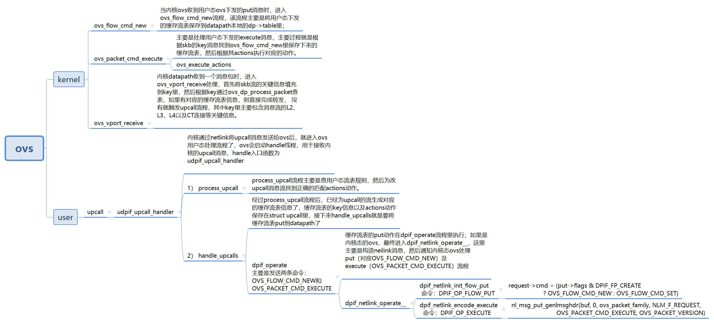

# ovs upcall

# OVS offload流表下发

## OVS相关部分
当报文不匹配的时候，会将报文上报，会调用udpif_upcall_handler
udpif_upcall_handler-->recv_upcalls-->handle_upcalls-->dpif_operate-->dpif_netlink_operate-->try_send_to_netdev-->parse_flow_put-->netdev_flow_put-->netdev_tc_flow_put

首先判定是不是tunnel，是的话需要存储五元组
是vlan的话，记录vid和mask
记录源目的MAC和掩码
记录五元组及其掩码
检测以上记录的信息是否有不支持的，还是有挺多不支持的，具体查看函数test_key_and_mask
记录action，目前支持的是output，push_vlan，pop_vlan，set，set_mask
调用tc_replace_flower将以上记录的信息进行转换，然后通过netlink发送给端口。

# 网卡驱动相关
前面ovs调用tc_replace_flower时候会触发kernel调用函数tc_ctl_tfilter，路径如下：

tc_ctl_tfilter-->fl_change-->fl_hw_replace_filter-->mlx5e_rep_ndo_setup_tc-->mlx5e_configure_flower-->mlx5e_tc_add_fdb_flow-->mlx5_eswitch_add_offloaded_rule

mlx5e_configure_flower

parse_cls_flower解析ovs传递过来的流表中match的key信息
parse_tc_fdb_actions解析ovs传递过来的流表中action信息
mlx5e_tc_add_fdb_flow主要是讲match和action添加到fdb流表
后面先不看了，multipath的那些操作
mlx5e_tc_add_fdb_flow

如果action包含encap，那么调用mlx5e_attach_encap生成vxlan所需要的报文头信息
mlx5_eswitch_add_vlan_action添加vlan的action
mlx5_eswitch_add_offloaded_rule添加offloaded规则
mlx5_eswitch_add_offloaded_rule-->mlx5_add_flow_rules-->_mlx5_add_flow_rules 主要是向firmware发送指令添加offload规则。

# references 

[Tracing hardware offload in Open vSwitch](https://developers.redhat.com/articles/2021/12/10/tracing-hardware-offload-open-vswitch#)