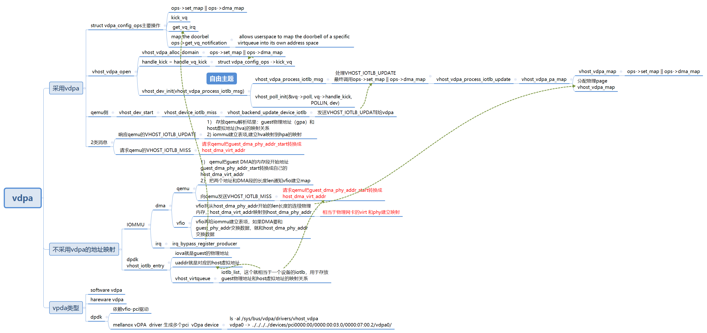
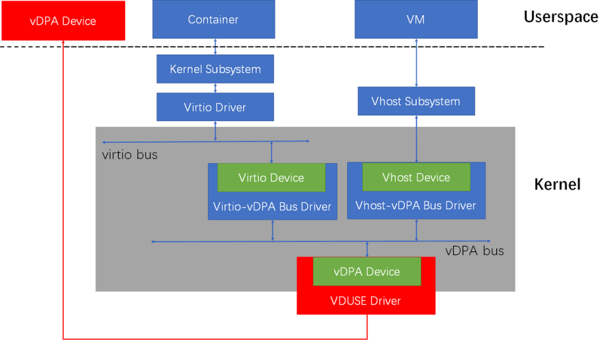
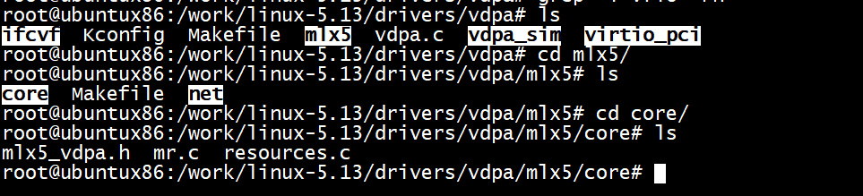
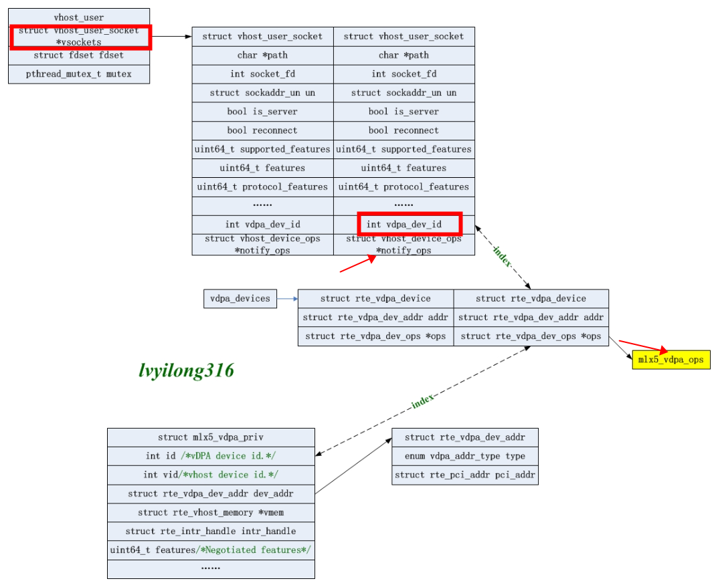

# vDPA

```
void vhost_poll_init(struct vhost_poll *poll, vhost_work_fn_t fn,
             unsigned long mask, struct vhost_dev *dev)
{
    init_waitqueue_func_entry(&poll->wait, vhost_poll_wakeup);
    init_poll_funcptr(&poll->table, vhost_poll_func);
    poll->mask = mask;
    poll->dev = dev;
    poll->wqh = NULL;
    /*设置处理函数*/
    vhost_work_init(&poll->work, fn);
}
```




```
struct vhost_iotlb_entry {
	TAILQ_ENTRY(vhost_iotlb_entry) next;

	uint64_t iova;
	uint64_t uaddr;
	uint64_t size;
	uint8_t perm;
};
```


内核用IOMMU的好处，限制了设备DMA可写的范围，设备不成随便从物理内存读写了。其实IOMMU更大的用处在于用户态驱动，如DPDK和qemu，用于qemu passthrough能更好的理解IOMMU的作用，guest发起DMA时设置的地址是guest_phy_addr，qemu拿到guest DMA的内存段开始地址guest_dma_phy_addr_start转换成自己的host_dma_virt_addr，然后把两个地址和DMA段的长度len通知vfio建立map，vfio找从host_dma_phy_addr开始的len长度的连续物理内存，host_dma_virt_addr映射到host_dma_phy_addr，然后pin住，让qemu的虚拟地址始终有物理内存对应并且对应到固定物理内存。vfio再给iommu建立表项，如果DMA要和guest_phy_addr交换数据，就和host_dma_phy_addr交换数据，iommu中有个iova，其实这个iova在这儿就是guest_phy_addr。

# iommu 工作原理解析之dma remapping


在非虚拟化场景下如果不是显示的在cmdline里面把iommu设置为disabled则一般都会默认enable iommu硬件，另外还有一种常用的方式就是iommu=pt这种方式跟default设置的唯一区别是会不会提前建立static map。为了让大家有个更清晰的认知，我们在内核里面找一段dma操作相关的代码并以此为开端对iommu的dma工作机制进行剖析。

```
static int e100_xmit_prepare(struct nic *nic, struct cb *cb,
        struct sk_buff *skb)
{
        dma_addr_t dma_addr;
        cb->command = nic->tx_command;

        dma_addr = pci_map_single(nic->pdev,
                                  skb->data, skb->len, PCI_DMA_TODEVICE);
        /* If we can't map the skb, have the upper layer try later */
        if (pci_dma_mapping_error(nic->pdev, dma_addr)) {
                dev_kfree_skb_any(skb);
                skb = NULL;
                return -ENOMEM;
        }
  
  .........
}
```

上面的代码片断是取自内核e100网卡驱动，核心逻辑就是先把skb的地址做一下dma map，然后让硬件可以直接dma这段数据，其中使用的pci_map_single这个函数最终会调到

```
static inline dma_addr_t dma_map_single_attrs(struct device *dev, void *ptr,
                                              size_t size,
                                              enum dma_data_direction dir,
                                              unsigned long attrs)
{
        struct dma_map_ops *ops = get_dma_ops(dev);
        dma_addr_t addr;

        kmemcheck_mark_initialized(ptr, size);
        BUG_ON(!valid_dma_direction(dir));
        addr = ops->map_page(dev, virt_to_page(ptr),
                             offset_in_page(ptr), size,
                             dir, attrs);
        debug_dma_map_page(dev, virt_to_page(ptr),
                           offset_in_page(ptr), size,
                           dir, addr, true);
        return addr;
}
```

如果有iommu硬件的情况下(以intel iommu为例)他最终会走到intel_map_page，下面我们来看一下这个函数的核心逻辑

```
static dma_addr_t __intel_map_single(struct device *dev, phys_addr_t paddr,
                                     size_t size, int dir, u64 dma_mask)
{
        struct dmar_domain *domain;
        phys_addr_t start_paddr;
        unsigned long iova_pfn;
        int prot = 0;
        int ret;
        struct intel_iommu *iommu;
        unsigned long paddr_pfn = paddr >> PAGE_SHIFT;

        BUG_ON(dir == DMA_NONE);

        if (iommu_no_mapping(dev))
                return paddr;

        domain = get_valid_domain_for_dev(dev);
        if (!domain)
                return 0;

        iommu = domain_get_iommu(domain);
        size = aligned_nrpages(paddr, size);

        iova_pfn = intel_alloc_iova(dev, domain, dma_to_mm_pfn(size), dma_mask);
        if (!iova_pfn)
                goto error;

        /*
         * Check if DMAR supports zero-length reads on write only
         * mappings..
         */
        if (dir == DMA_TO_DEVICE || dir == DMA_BIDIRECTIONAL || \
                        !cap_zlr(iommu->cap))
                prot |= DMA_PTE_READ;
        if (dir == DMA_FROM_DEVICE || dir == DMA_BIDIRECTIONAL)
                prot |= DMA_PTE_WRITE;
        /*
         * paddr - (paddr + size) might be partial page, we should map the whole
         * page.  Note: if two part of one page are separately mapped, we
         * might have two guest_addr mapping to the same host paddr, but this
         * is not a big problem
         */
   ret = domain_pfn_mapping(domain, mm_to_dma_pfn(iova_pfn),
                                 mm_to_dma_pfn(paddr_pfn), size, prot);
        if (ret)
                goto error;

        /* it's a non-present to present mapping. Only flush if caching mode */
        if (cap_caching_mode(iommu->cap))
                iommu_flush_iotlb_psi(iommu, domain,
                                      mm_to_dma_pfn(iova_pfn),
                                      size, 0, 1);
        else
                iommu_flush_write_buffer(iommu);

        start_paddr = (phys_addr_t)iova_pfn << PAGE_SHIFT;
        start_paddr += paddr & ~PAGE_MASK;
        return start_paddr;

error:
        if (iova_pfn)
                free_iova_fast(&domain->iovad, iova_pfn, dma_to_mm_pfn(size));
        pr_err("Device %s request: %zx@%llx dir %d --- failed\n",
                dev_name(dev), size, (unsigned long long)paddr, dir);
        return 0;
}

```

我们来好好走读一下这个函数，首先会判断是否为iommu_no_mapping，如果是则直接返回paddr也即物理地址。再来看看iommu_no_mapping这个函数的具体逻辑。

```
static int iommu_no_mapping(struct device *dev)
{
        int found;

        if (iommu_dummy(dev))
                return 1;

        if (!iommu_identity_mapping)
                return 0;

        found = identity_mapping(dev);
        if (found) {
                if (iommu_should_identity_map(dev, 0))
                        return 1;
                else {
                        /*
                         * 32 bit DMA is removed from si_domain and fall back
                         * to non-identity mapping.
                         */
                        dmar_remove_one_dev_info(si_domain, dev);
                        pr_info("32bit %s uses non-identity mapping\n",
                                dev_name(dev));
                        return 0;
                }
        } else {
                /*
                 * In case of a detached 64 bit DMA device from vm, the device
                 * is put into si_domain for identity mapping.
                 */
                if (iommu_should_identity_map(dev, 0)) {
                        int ret;
                        ret = domain_add_dev_info(si_domain, dev);
                        if (!ret) {
                                pr_info("64bit %s uses identity mapping\n",
                                        dev_name(dev));
                                return 1;
                        }
                }
        }

        return 0;
}
```

# vdpa

Qemu支持两种方式的vDPA，一种是vhost-user，配合DPDK中的vDPA运行，DPDK再调用厂商用户态vDPA驱动；另一种方式是vhost-vdpa，通过ioctl调用到内核通用vDPA模块，通用vDPA模块再调用厂商硬件专有的vDPA驱动








****vdpa devices****

```
[user@host ~]# ls -l  /sys/bus/vdpa/drivers
drwxr-xr-x 2 root root 0 Sep  5 16:54 vhost_vdpa
#ls -l /sys/bus/vdpa/devices/vdpa0/
total 0
lrwxrwxrwx. 1 root root    0 Sep 21 12:24 driver -> ../../bus/vdpa/drivers/vhost_vdpa
drwxr-xr-x. 2 root root    0 Sep 21 12:25 power
lrwxrwxrwx. 1 root root    0 Sep 21 12:25 subsystem -> ../../bus/vdpa
-rw-r--r--. 1 root root 4096 Sep 21 12:24 uevent
drwxr-xr-x. 3 root root    0 Sep 21 12:25 vhost-vdpa-0
[user@host ~]# ls -l /dev/ |grep vdpa
crw-------   1 root root    239,   0 Sep  5 16:54 vhost-vdpa-0
```

****qemu****

```
 -netdev type=vhost-vdpa,vhostdev=/dev/vhost-vdpa-0,id=vhost-vdpa1
```

```
CONFIG_VIRTIO_VDPA=m
CONFIG_VDPA=y
CONFIG_VDPA_SIM=m
CONFIG_VHOST_VDPA=m
```

## vdpa 

```
root@ubuntux86:/home/ubuntu# modprobe vdpa 
root@ubuntux86:/home/ubuntu#  ls /sys/bus/vdpa/devices/
root@ubuntux86:/home/ubuntu# ls /sys/bus/vdpa/
devices  drivers  drivers_autoprobe  drivers_probe  uevent
root@ubuntux86:/home/ubuntu# ls /sys/bus/vdpa/drivers
root@ubuntux86:/home/ubuntu# ls /sys/bus/vdpa/drivers
```

## vhost_vdpa

```
root@ubuntux86:/home/ubuntu# ls /sys/bus/vdpa/drivers/vhost_vdpa
ls: cannot access '/sys/bus/vdpa/drivers/vhost_vdpa': No such file or directory
root@ubuntux86:/home/ubuntu# modprobe vhost_vdpa
root@ubuntux86:/home/ubuntu# ls /sys/bus/vdpa/drivers/vhost_vdpa
bind  module  uevent  unbind
root@ubuntux86:/home/ubuntu# 
```

##  virtio_vdpa

```
root@ubuntux86:/home/ubuntu# modprobe virtio_vdpa
```

# references

[mellanox How to set up vDPA devices](https://metonymical.hatenablog.com/entry/2021/04/16/212135)

[MLX5 VDPA 实现分析](https://blog.csdn.net/leoufung/article/details/121354421?spm=1001.2101.3001.6650.15&utm_medium=distribute.pc_relevant.none-task-blog-2%7Edefault%7EBlogCommendFromBaidu%7ERate-15-121354421-blog-101514581.pc_relevant_default&depth_1-utm_source=distribute.pc_relevant.none-task-blog-2%7Edefault%7EBlogCommendFromBaidu%7ERate-15-121354421-blog-101514581.pc_relevant_default&utm_relevant_index=16)

[vDPA kernel framework part 1: vDPA bus for abstracting hardware](https://www.redhat.com/en/blog/vdpa-kernel-framework-part-1-vdpa-bus-abstracting-hardware)

[一文详解：vDPA sample的使用方法和基本流程](https://blog.csdn.net/weixin_37097605/article/details/101514581)

[vDPA原理和实现](http://blog.chinaunix.net/uid-28541347-id-5830937.html)

[vDPA Framework 简介](https://blog.csdn.net/qq_29188181/article/details/126162464)

[MLX5 VDPA 实现分析](https://blog.csdn.net/leoufung/article/details/121354421)

[用户态虚拟化IO通道实现概览及实践](https://zhuanlan.zhihu.com/p/562680485)