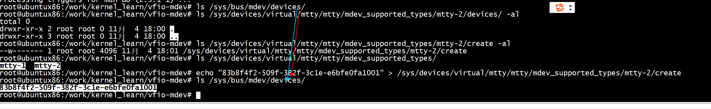
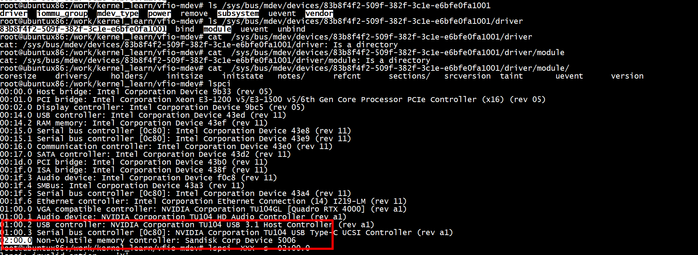

# mdev

mdev本质上是在vfio层面实现VF功能。在mdev的模型中，通过mdev_register_device()注册到mdev中的设备称为父设备（parent_dev），但你用的时候不使用父设备，而是通过父设备提供的机制（在sysfs中，后面会详细谈这个）创建一个mdev，这个mdev自带一个iommu_group，这样，你有多个进程要访问这个父设备的功能，每个都可以有独立的设备页表，而且互相不受影响。

所以，整个mdev框架包括两个基本概念，一个是pdev（父设备），一个是mdev（注意，我们这里mdev有时指整个vfio-mdev的框架，有时指基于一个pdev的device，请注意区分上下文）。前者提供设备硬件支持，后者支持针对一个独立地址空间的请求。

两者都是device(struct device)，前者的总线是真实的物理总线，后者属于虚拟总线mdev，mdev上只有一个驱动vfio_mdev，当你通过pdev创建一个mdev的时候，这个mdev和vfio_mdev驱动匹配，从而给用户态暴露一个普通vfio设备的接口（比如platform_device或者pci_device）的接口。

换句话说，如果一个设备需要给多个进程提供用户态驱动的访问能力，这个设备在probe的时候可以注册到mdev框架中，成为一个mdev框架的pdev。之后，用户程序可以通过sysfs创建这个pdev的mdev。

# insmod  mtty.ko 

```
[root@centos7 vfio-mdev]# dmesg | tail -n 10
[868777.804730] ~~~Resolved pointer to the userspace program's eventfd's context: ffffa05fd295cf00
[868777.813395] ~~~Incremented userspace program's eventfd's counter by 1
[872518.730712] mtty: Unknown symbol vfio_set_irqs_validate_and_prepare (err 0)
[872518.737762] mtty: Unknown symbol mdev_from_dev (err 0)
[872518.742981] mtty: Unknown symbol mdev_parent_dev (err 0)
[872518.748381] mtty: Unknown symbol mdev_get_drvdata (err 0)
[872518.753855] mtty: Unknown symbol mdev_register_device (err 0)
[872518.759678] mtty: Unknown symbol mdev_unregister_device (err 0)
[872518.765674] mtty: Unknown symbol mdev_uuid (err 0)
[872518.770542] mtty: Unknown symbol mdev_set_drvdata (err 0)
[root@centos7 vfio-mdev]# 
```

## ubuntu

```
ubuntu@ubuntux86:/boot$ grep CONFIG_VFIO_MDEV  config-5.13.0-39-generic
CONFIG_VFIO_MDEV=m
CONFIG_VFIO_MDEV_DEVICE=m
ubuntu@ubuntux86:/boot$ 
```

```
root@ubuntux86:/work/kernel_learn/vfio-mdev# insmod  mtty.ko 
insmod: ERROR: could not insert module mtty.ko: Unknown symbol in module
root@ubuntux86:/work/kernel_learn/vfio-mdev# dmesg | tail -n 10
[  265.329438] nvme 0000:02:00.0:    [ 0] RxErr                 
[  266.287778] pcieport 0000:00:1d.0: AER: Corrected error received: 0000:02:00.0
[  266.287874] nvme 0000:02:00.0: PCIe Bus Error: severity=Corrected, type=Physical Layer, (Receiver ID)
[  266.287879] nvme 0000:02:00.0:   device [15b7:5006] error status/mask=00000001/0000e000
[  266.287883] nvme 0000:02:00.0:    [ 0] RxErr                 
[  272.327667] mtty: Unknown symbol mdev_bus_type (err -2)
[  272.327697] mtty: Unknown symbol mdev_register_device (err -2)
[  272.327709] mtty: Unknown symbol mdev_unregister_device (err -2)
[  272.327718] mtty: Unknown symbol mdev_get_type_group_id (err -2)
[  272.327726] mtty: Unknown symbol mtype_get_type_group_id (err -2)
root@ubuntux86:/work/kernel_learn/vfio-mdev#  modprobe  vfio_mdev
root@ubuntux86:/work/kernel_learn/vfio-mdev# modprobe  mdev
root@ubuntux86:/work/kernel_learn/vfio-mdev# insmod  mtty.ko 
root@ubuntux86:/work/kernel_learn/vfio-mdev# 
```

## mtty_dev
```
root@ubuntux86:/work/kernel_learn/vfio-mdev# insmod  mtty.ko 
root@ubuntux86:/work/kernel_learn/vfio-mdev# ls /sys/class/md
mdev_bus/ mdio_bus/ 
root@ubuntux86:/work/kernel_learn/vfio-mdev# ls /sys/class/mdev_bus/
mtty
root@ubuntux86:/work/kernel_learn/vfio-mdev# ls /sys/class/mdev_bus/mtty
mdev_supported_types  mtty_dev  power  subsystem  uevent
root@ubuntux86:/work/kernel_learn/vfio-mdev# rmmod  mtty.ko 
root@ubuntux86:/work/kernel_learn/vfio-mdev# ls /sys/class/mdev_bus/mtty
ls: cannot access '/sys/class/mdev_bus/mtty': No such file or directory
root@ubuntux86:/work/kernel_learn/vfio-mdev# ls /sys/class/mdev_bus/
root@ubuntux86:/work/kernel_learn/vfio-mdev# 
```

```
root@ubuntux86:/work/kernel_learn/vfio-mdev# insmod  mtty.ko 
root@ubuntux86:/work/kernel_learn/vfio-mdev# ls /sys/devices/virtual/mtty/
mtty
root@ubuntux86:/work/kernel_learn/vfio-mdev# ls /sys/devices/virtual/mtty/mtty/
mdev_supported_types  mtty_dev  power  subsystem  uevent
root@ubuntux86:/work/kernel_learn/vfio-mdev# ls /sys/devices/virtual/mtty/mtty/mtty_dev/ -al
total 0
drwxr-xr-x 2 root root    0 11月  4 17:58 .
drwxr-xr-x 5 root root    0 11月  4 17:57 ..
-r--r--r-- 1 root root 4096 11月  4 17:58 sample_mtty_dev
root@ubuntux86:/work/kernel_learn/vfio-mdev# lspci
00:00.0 Host bridge: Intel Corporation Device 9b33 (rev 05)
00:01.0 PCI bridge: Intel Corporation Xeon E3-1200 v5/E3-1500 v5/6th Gen Core Processor PCIe Controller (x16) (rev 05)
00:02.0 Display controller: Intel Corporation Device 9bc5 (rev 05)
00:14.0 USB controller: Intel Corporation Device 43ed (rev 11)
00:14.2 RAM memory: Intel Corporation Device 43ef (rev 11)
00:15.0 Serial bus controller [0c80]: Intel Corporation Device 43e8 (rev 11)
00:15.1 Serial bus controller [0c80]: Intel Corporation Device 43e9 (rev 11)
00:16.0 Communication controller: Intel Corporation Device 43e0 (rev 11)
00:17.0 SATA controller: Intel Corporation Device 43d2 (rev 11)
00:1d.0 PCI bridge: Intel Corporation Device 43b0 (rev 11)
00:1f.0 ISA bridge: Intel Corporation Device 438f (rev 11)
00:1f.3 Audio device: Intel Corporation Device f0c8 (rev 11)
00:1f.4 SMBus: Intel Corporation Device 43a3 (rev 11)
00:1f.5 Serial bus controller [0c80]: Intel Corporation Device 43a4 (rev 11)
00:1f.6 Ethernet controller: Intel Corporation Ethernet Connection (14) I219-LM (rev 11)
01:00.0 VGA compatible controller: NVIDIA Corporation TU104GL [Quadro RTX 4000] (rev a1)
01:00.1 Audio device: NVIDIA Corporation TU104 HD Audio Controller (rev a1)
01:00.2 USB controller: NVIDIA Corporation TU104 USB 3.1 Host Controller (rev a1)
01:00.3 Serial bus controller [0c80]: NVIDIA Corporation TU104 USB Type-C UCSI Controller (rev a1)
02:00.0 Non-Volatile memory controller: Sandisk Corp Device 5006
root@ubuntux86:/work/kernel_learn/vfio-mdev# 
```

## echo "83b8f4f2-509f-382f-3c1e-e6bfe0fa1001" > /sys/devices/virtual/mtty/mtty/mdev_supported_types/mtty-2/create





```
ls /sys/bus/mdev/devices/83b8f4f2-509f-382f-3c1e-e6bfe0fa1001/driver/module/drivers/
mdev:vfio_mdev
```

```
root@ubuntux86:/work/img_repo/x86/images# find /sys/kernel/iommu_groups -type l | sort -t '/' -n -k 5
/sys/kernel/iommu_groups/0/devices/83b8f4f2-509f-382f-3c1e-e6bfe0fa1001
root@ubuntux86:/work/img_repo/x86/images# 

 cat  /lib/modules/$(uname -r)/modules.builtin | grep vfio
kernel/drivers/vfio/vfio.ko
kernel/drivers/vfio/vfio_virqfd.ko
kernel/drivers/vfio/vfio_iommu_type1.ko
```

# qemu

```
-device vfio-pci,\
      sysfsdev=/sys/bus/mdev/devices/83b8f4f2-509f-382f-3c1e-e6bfe0fa1001
```

# references

[Run VFIO-MDEV mtty example on Ubuntu20.04](https://blog.csdn.net/alex_mianmian/article/details/118678510)

[vfio-mediated-device](https://www.kernel.org/doc/Documentation/vfio-mediated-device.txt)