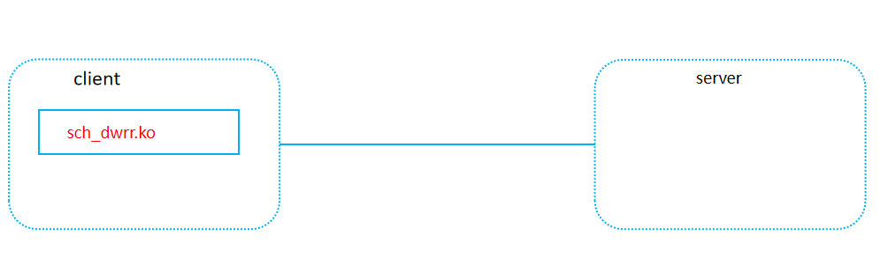
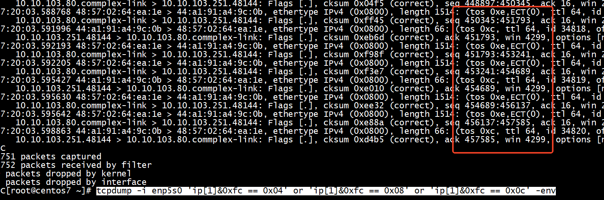

# 1 What is MQ-ECN

MQ-ECN is a new ECN marking scheme to enable ECN for multi-service multi-queue production data center networks. MQ-ECN can achieve high throughput, low latency and weighted fair sharing simultaneously. 

For more details about MQ-ECN, please refer to our NSDI 2016 <a href="http://sing.cse.ust.hk/papers/mqecn.pdf">paper</a>.

# 2 How to use

## 2.1 Compiling
MQ-ECN software prototype is implemented as a Linux queuing discipline (qdisc) kernel module, running on multi-NIC servers to emulate switch hardware behaviors. So you need the kernel headers to compile it. You can find available headers on your system in `/lib/modules`. To install the kernel headers, you just need to use the following command：
<pre><code>$ apt-get install linux-headers-$(uname -r)
</code></pre>

Then you can compile MQ-ECN kernel module:
<pre><code>$ cd sch_dwrr
$ make
</code></pre>

This will produce a kernel module called `sch_dwrr.ko`. I have tested it with Linux kernel 3.18.11. MQ-ECN kernel module is built on the top of <a href="http://lxr.free-electrons.com/source/net/sched/sch_tbf.c">Token Bucket Filter (tbf)</a> and <a href="http://lxr.free-electrons.com/source/net/sched/sch_drr.c">Deficit Round Robin (drr) scheduler</a> in Linux kernel. 

+ os    
```
[root@centos7 MQ-ECN-Software]# lsmod | grep sch
sch_dwrr              262144  1 
[root@centos7 MQ-ECN-Software]# uname -a
Linux centos7 4.14.0-115.el7a.0.1.aarch64 #1 SMP Sun Nov 25 20:54:21 UTC 2018 aarch64 aarch64 aarch64 GNU/Linux
[root@centos7 MQ-ECN-Software]# 
```

+ dctcp

To enable DCTCP on servers:   
```
$ sysctl -w net.ipv4.tcp_ecn=1
$ sysctl -w net.ipv4.tcp_congestion_control=dctcp 
```

detail:        
```
[root@centos7 ~]#  sysctl net.ipv4.tcp_available_congestion_control
net.ipv4.tcp_available_congestion_control = cubic reno
[root@centos7 ~]# modprobe tcp_dctcp
[root@centos7 ~]# echo “tcp_dctcp” | tee -a /etc/modules
“tcp_dctcp”
[root@centos7 ~]#  sysctl net.ipv4.tcp_available_congestion_control
net.ipv4.tcp_available_congestion_control = cubic reno dctcp
[root@centos7 ~]# sysctl -w net.ipv4.tcp_congestion_control=dctcp
net.ipv4.tcp_congestion_control = dctcp
[root@centos7 ~]# sysctl net.ipv4.tcp_congestion_control
net.ipv4.tcp_congestion_control = dctcp
[root@centos7 ~]# 

```


## 2.2 Installing

MQ-ECN replaces token bucket rate limiter module. Hence, you need to remove `sch_tbf` before installing MQ-ECN. To install MQ-ECN on a device (e.g., eth1):   
TBF（Token Bucket Filter）令牌桶过滤器    
<pre><code>$ rmmod sch_tbf
$ insmod sch_dwrr.ko
$ tc qdisc add dev eth1 root tbf rate 995mbit limit 1000k burst 1000k mtu 66000 peakrate 1000mbit
</code></pre>

To remove MQ-ECN on a device (e.g., eth1):
<pre><code>$ tc qdisc del dev eth1 root
$ rmmod sch_dwrr
</code></pre>

In above example, we install MQ-ECN on eth1. The shaping rate is 995Mbps (line rate is 1000Mbps). To accurately reflect switch buffer occupancy, we usually trade a little bandwidth. 

## 2.3 Note

To better emulate real switch hardware behaviors, we should avoid large segments on server-emulated software switches. Hence, we need to disable related offloading techniques on all involved NICs. For example, to disable offloading on eth0: 
<pre><code>
ethtool -K enp5s0 tso off
ethtool -K enp5s0 gso off
ethtool -K enp5s0 gro off
</code></pre>
or will 

```
 dmesg | tail -n 10
[  889.985567] Error: pkt length 7330 > MTU
[  889.989473] Error: pkt length 7330 > MTU
[  889.993383] Error: pkt length 7330 > MTU
[  889.997289] Error: pkt length 7330 > MTU
[  890.001199] Error: pkt length 7330 > MTU
[  890.005106] Error: pkt length 7330 > MTU
[  890.009012] Error: pkt length 7330 > MTU
[  890.012923] Error: pkt length 7330 > MTU
[  890.016829] Error: pkt length 7330 > MTU
[  890.020740] Error: pkt length 7330 > MTU
```

## 2.4 Configuring

Except for shaping rate, all the parameters of MQ-ECN are configured through `sysctl` interfaces. Here, I only show several important parameters. For the rest, see `params.h` and `params.c` for more details.

<ul>
<li>ECN marking scheme:
<pre><code>$ sysctl dwrr.ecn_scheme
</code></pre>
To enable per-queue ECN marking:
<pre><code>$ sysctl -w dwrr.ecn_scheme=1
</code></pre>
To enable per-port ECN marking:
<pre><code>$ sysctl -w dwrr.ecn_scheme=2
</code></pre>
To enable MQ-ECN:
<pre><code>$ sysctl -w dwrr.ecn_scheme=3
</code></pre>
</li>

<li>Per-port ECN marking threshold (bytes):
<pre><code>$ sysctl dwrr.port_thresh_bytes
</code></pre>
</li>

<li>Per-queue ECN marking threshold (bytes) (i is queue index):
<pre><code>$ sysctl dwrr.queue_thresh_bytes_i
</code></pre>
</li>

<li>Per-port shared buffer size (bytes):
<pre><code>$ sysctl dwrr.shared_buffer_bytes
</code></pre>
</li>
</ul>

## 2.5 WRR

By default, MQ-ECN kernel module performs Deficit Weighted Round Robin (DWRR) scheduling algorithm. You can also enable Weighted Round Robin (WRR) as follows:
<pre><code>$ sysctl -w dwrr.enable_wrr=1
</code></pre>


## 2.6 mytest

+ enable sch_dwrr2

```
rmmod sch_tbf
insmod sch_dwrr.ko
tc qdisc add dev enp5s0 root tbf rate 995mbit limit 1000k burst 1000k mtu 66000 peakrate 1000mbit

```
for  disable  sch_dwrr2
```
tc qdisc del dev enp5s0 root
```

+  To enable DCTCP on servers:      
enable MQ-ECN     
```
sysctl -w dwrr.ecn_scheme=3
```

```
sysctl -w net.ipv4.tcp_ecn=1

```


+ not need to configure ,use default config    

```
sysctl dwrr.port_thresh
dwrr.port_thresh = 32000
```

```
[root@centos7 sch_dwrr2]# sysctl dwrr.port_thresh
dwrr.port_thresh = 32000
[root@centos7 sch_dwrr2]# sysctl dwrr.queue_buffer_0
dwrr.queue_buffer_0 = 2000000
[root@centos7 sch_dwrr2]# sysctl dwrr.queue_thresh_0
dwrr.queue_thresh_0 = 32000
[root@centos7 sch_dwrr2]# 
```

```
/proc/sys/dwrr/queue_thresh_4
cat /proc/sys/dwrr/queue_buffer_*
cat /proc/sys/dwrr/queue_dscp_*
cat /proc/sys/dwrr/queue_quantum_*
cat /proc/sys/dwrr/queue_thresh_*
cat /proc/sys/dwrr/port_thresh 
cat /proc/sys/dwrr/shared_buffer 
```

+ disable offloading   

```
ethtool -K enp5s0 tso off
ethtool -K enp5s0 gso off
ethtool -K enp5s0 gro off
```

### 2.6.1 Traffic Generator

+ server    
```
ip a add 10.10.103.81/24 dev enahisic2i3
ip a add 10.10.103.80/24 dev enahisic2i3
ip a add 10.10.103.79/24 dev enahisic2i3
```

```
./bin/server -p 5001 -d   
```

+ client  

```
ip a add 10.10.103.251/24 dev enp5s0
``` 

```
server 10.10.103.79 5001
server 10.10.103.80 5001
server 10.10.103.81 5001
req_size_dist conf/DCTCP_CDF.txt
rate 0Mbps 10
rate 500Mbps 30
rate 800Mbps 60
dscp 0 25
dscp 1 25
dscp 2 25
dscp 3 25
```


```
./bin/client -b 900 -c conf/client_config.txt -n 5000 -l flows.txt -s 123 -r bin/result.py
```

### tcpdump

DSCP=001010 十进制就是10 十六进制就是a，相对应的TOS=00101000 十进制就是40 十六进制就是28    

In both these examples, you can use TOS hex values instead of TOS decimal values, e.g. == 0x48. Alternatively, if you want to use DSCP hex or DSCP decimal values, you can shift the result, for the first example, this would give, as exact equivalents of those above:     
```
	$ tcpdump -v -n -i ppp0 'ip and (ip[1] & 0xfc) >> 2 == 0x12'
```
and for the second example:
```
	$ tcpdump -v -n -i he-ipv6 'ip6 and (ip6[0:2] & 0xfc0) >> 4  == 0x12'
```
In both cases, using the DSCP hex value of 0x12 which as you can see from the table above is equivalent to the TOS decimal value 72.   

```
 tcpdump -v -i eth0 ‘ip[1]&0xfc == 40’，ip[1] 是过滤IP包头的第2个字节，0xfc相当于掩码忽略掉后两位ECN位。
```

dscp = 1 、dscp = 2 、dscp = 3   

```
tcpdump -i enp5s0 'ip[1]&0xfc == 0x04' or 'ip[1]&0xfc == 0x08' or 'ip[1]&0xfc == 0x0c' -env
```

tos 0xe,ECT(0)  
tos 0xc    



+ CE   

```
tcpdump -i enp5s0 'ip[1]&0x3 == 0x3' -env
```

### analysis

```
python2 bin/result.py  flows.txt 
Parse 1 file
5000 flows/requests overall average completion time: 36326126 us
2690 flows/requests (0, 100KB) average completion time: 2043544 us
2690 flows/requests (0, 100KB) 99th percentile completion time: 8124134 us
2166 flows/requests [100KB, 10MB) average completion time: 59160122 us
144 flows/requests [10MB, ) average completion time: 333282457 us
5000 flows/requests overall average goodput: 0 Mbps
```

# linux qdisc

```Text
bfifo和pfifo是内核内置实现的两个非常简单的无类qdisc，数据包按照FIFO策略入队出队，它们唯一的可配置参数就是队列最大长度limit。
bfifo以字节为单位控制FIFO策略，pfifo以数据包为单位控制FIFO策略。    
```

