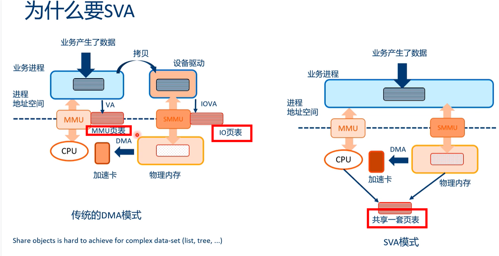
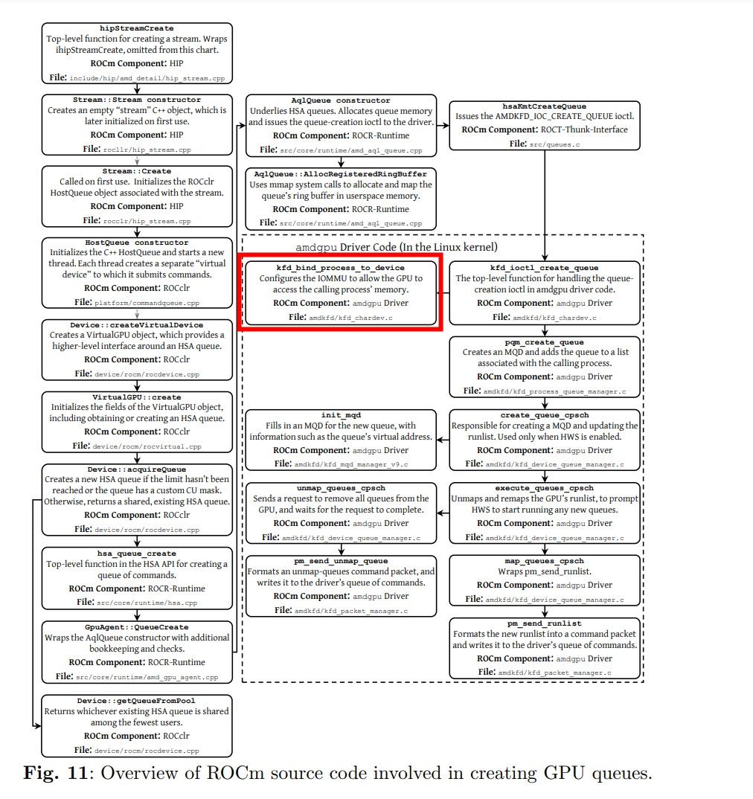

# Qemu-in-guest-SVM-demo

[Qemu-in-guest-SVM-demo](https://github.com/BullSequana/Qemu-in-guest-SVM-demo)   

SVM (Shared Virtual Memory)    

CUDA UVM (Unified Virtual Memory)    
 
 
Shared Virtual Addressing (SVA) provides a way for device drivers to bind
process address spaces to devices. This requires the IOMMU to support page
table format and features compatible with the CPUs, and usually requires
the system to support I/O Page Faults (IOPF) and Process Address Space ID
(PASID). When all of these are available, ***DMA can access virtual addresses
of a process.*** A PASID is allocated for each process, and the device driver
programs it into the device in an implementation-specific way.

# HMM and SVM   

● IOMMU with ATS and PASID (AMD, ARM, Intel, PowerPC)     
● HMM (software solution) mirror CPU page table into device page table   
● HMM for CPU inaccessible device memory (DEVICE_PRIVATE)   
● HMM helpers for memory migration   


+ Shared virtual address (SVA) with software (HMM in linux kernel):
● Copy CPU page table to the device page table   
● Keep CPU and device page tables synchronized at all times   
● Same virtual address must point to same physical address at all times  


+ Shared virtual address (SVA) with hardware (IOMMU):   
● ATS: Address Translation Service  
● PASID: Process Address Space ID   
Event flow:   
1)Device requests a virtual address translation (ATS) for a given PASID  
2)IOMMU maps PASID to a CPU page table   
3)IOMMU maps virtual address to physical address (through CPU page table)   
4)IOMMU replies to device with a physical address   
5)Device uses the physical address to access the memory   

# SVM-demo



```
grep SVM config-5.13.0-39-generic 
# CONFIG_DRM_NOUVEAU_SVM is not set
CONFIG_INTEL_IDXD_SVM=y
CONFIG_INTEL_IOMMU_SVM=y
```

> ## pin memory 和sva

[Introduction to Shared Virtual Memory](http://liujunming.top/2022/03/30/Introduction-to-Shared-Virtual-Memory/)   

`引入SVM后不需要进程pin内存，而是通过page fault触发缺页处理进行映射。`

引入SVM后的效果，最大的区别是设备访问地址在经过iommu的DMAR转换时会参考引用CPU的mmu页表，在地址缺页时同样会产生缺页中断。为什么要这样设计呢？因为要想设备直接使用进程空间的虚拟地址可能采用的有两种方法。一种是把整个进程地址空间全部pin住，但这点一般是不现实的，除非类似DPDK应用程序全部采用静态内存，否则如果进程动态分配一个内存，那么这个地址设备是不感知的。另一种方法就是采用动态映射，就像进程访问虚拟地址一样，mmu发现缺页就会动态映射，所以从设备发来的地址请求也会经过CPU缺页处理，并将映射关系同步到iommu的页表中。     


 

# CONFIG_IOMMU_SVA  IOMMU_DOMAIN_SVA

```
#define IOMMU_DOMAIN_BLOCKED    (0U)
#define IOMMU_DOMAIN_IDENTITY   (__IOMMU_DOMAIN_PT)
#define IOMMU_DOMAIN_UNMANAGED  (__IOMMU_DOMAIN_PAGING)
#define IOMMU_DOMAIN_DMA        (__IOMMU_DOMAIN_PAGING |        \
                                 __IOMMU_DOMAIN_DMA_API)
#define IOMMU_DOMAIN_DMA_FQ     (__IOMMU_DOMAIN_PAGING |        \
                                 __IOMMU_DOMAIN_DMA_API |       \
                                 __IOMMU_DOMAIN_DMA_FQ)
#define IOMMU_DOMAIN_SVA        (__IOMMU_DOMAIN_SVA)
```


```
	case IOMMU_DOMAIN_SVA:
		return intel_svm_domain_alloc();
```

# page fault
Use of SVA requires IOMMU support in the platform. IOMMU is also required to support the PCIe features ATS and PRI. ATS allows devices to cache translations for virtual addresses. The IOMMU driver uses the mmu_notifier() support to keep the device TLB cache and the CPU cache in sync. When an ATS lookup fails for a virtual address, the device should use the **PRI** in order to request the virtual address to be paged into the CPU page tables. The device must use ATS again in order the fetch the translation before use.

设想SVA的场景中，先malloc得到va, 然把这个va传给设备，配置设备DMA去访问该地址空间，这时内核并没有为va分配实际的
物理内存，所以设备一侧的访问流程必然需要进行类似的缺页请求。支持设备侧缺页
请求的硬件设备就是SMMU，其中对于PCI设备，还需要ATS、PRI硬件特性支持。
平台设备需要SMMU stall mode支持(使用event queue)。PCI设备和平台设备都需要
PASID特性的支持。   

SMMU内部使用command queue，event queue，pri queue做基本的事件管理。当有相应
硬件事件发生时，硬件把相应的描述符写入event queue或者pri queue, 然后上报中断。
软件使用command queue下发相应的命令操作硬件   

> ## pagefault 处理

```
[root@centos7 linux-6.3]# cat /proc/interrupts |grep -i  arm-smmu-v3-priq |awk '{print $1,$(NF-2),$(NF-1),$NF}'
21: 100354 Edge arm-smmu-v3-priq
24: 102402 Edge arm-smmu-v3-priq
27: 104450 Edge arm-smmu-v3-priq
30: 106498 Edge arm-smmu-v3-priq
33: 108546 Edge arm-smmu-v3-priq
36: 110594 Edge arm-smmu-v3-priq
39: 112642 Edge arm-smmu-v3-priq
42: 114690 Edge arm-smmu-v3-priq
[root@centos7 linux-6.3]# 
```

```Text
devm_request_threaded_irq(..., arm_smmu_priq_thread, ...)
arm_smmu_priq_thread
  +-> arm_smmu_handle_ppr
    +-> iommu_report_device_fault
      +-> iommu_fault_param->handler
        +-> iommu_queue_iopf /* 初始化参见上面第2部分 */
          +-> iopf_group = kzalloc
          +-> list_add(faults list in group, fault)
          +-> INIT_WORK(&group->work, iopf_handle_group)
          +-> queue_work(iopf_param->queue->wq, &group->work)
          这段代码创建缺页的group，并把当前的缺页请求挂入group里的链表，然后
          创建一个任务，并调度这个任务运行

          在工作队列线程中:
          +-> iopf_handle_group
            +-> iopf_handle_single
              +-> handle_mm_fault
                  这里会最终申请内存并建立页表

    +-> arm_smmu_page_response
        软件执行完缺页流程后，软件控制SMMU向设备回响应。
```

> ##  iommu_sva_handle_iopf -->  handle_mm_fault
```
/*
 * I/O page fault handler for SVA
 */
enum iommu_page_response_code
iommu_sva_handle_iopf(struct iommu_fault *fault, void *data)
{
	vm_fault_t ret;
	struct vm_area_struct *vma;
	struct mm_struct *mm = data;
	unsigned int access_flags = 0;
	unsigned int fault_flags = FAULT_FLAG_REMOTE;
	struct iommu_fault_page_request *prm = &fault->prm;
	enum iommu_page_response_code status = IOMMU_PAGE_RESP_INVALID;

	if (!(prm->flags & IOMMU_FAULT_PAGE_REQUEST_PASID_VALID))
		return status;

	if (!mmget_not_zero(mm))
		return status;

	mmap_read_lock(mm);

	vma = vma_lookup(mm, prm->addr);
	if (!vma)
		/* Unmapped area */
		goto out_put_mm;

	if (prm->perm & IOMMU_FAULT_PERM_READ)
		access_flags |= VM_READ;

	if (prm->perm & IOMMU_FAULT_PERM_WRITE) {
		access_flags |= VM_WRITE;
		fault_flags |= FAULT_FLAG_WRITE;
	}

	if (prm->perm & IOMMU_FAULT_PERM_EXEC) {
		access_flags |= VM_EXEC;
		fault_flags |= FAULT_FLAG_INSTRUCTION;
	}

	if (!(prm->perm & IOMMU_FAULT_PERM_PRIV))
		fault_flags |= FAULT_FLAG_USER;

	if (access_flags & ~vma->vm_flags)
		/* Access fault */
		goto out_put_mm;

	ret = handle_mm_fault(vma, prm->addr, fault_flags, NULL);
	status = ret & VM_FAULT_ERROR ? IOMMU_PAGE_RESP_INVALID :
		IOMMU_PAGE_RESP_SUCCESS;

out_put_mm:
	mmap_read_unlock(mm);
	mmput(mm);

	return status;
}
```

#  iommu_dma_alloc_iova
```
 backtrace:
    [<000000001b204ddf>] kmem_cache_alloc+0x1b0/0x350
    [<00000000d9ef2e50>] alloc_iova+0x3c/0x168
    [<00000000ea30f99d>] alloc_iova_fast+0x7c/0x2d8
    [<00000000b8bb2f1f>] iommu_dma_alloc_iova.isra.0+0x12c/0x138
    [<000000002f1a43b5>] __iommu_dma_map+0x8c/0xf8
    [<00000000ecde7899>] iommu_dma_map_page+0x98/0xf8
    [<0000000082004e59>] otx2_alloc_rbuf+0xf4/0x158
    [<000000002b107f6b>] otx2_rq_aura_pool_init+0x110/0x270
    [<00000000c3d563c7>] otx2_open+0x15c/0x734
    [<00000000a2f5f3a8>] otx2_dev_open+0x3c/0x68
    [<00000000456a98b5>] otx2_set_ringparam+0x1ac/0x1d4
    [<00000000f2fbb819>] dev_ethtool+0xb84/0x2028
    [<0000000069b67c5a>] dev_ioctl+0x248/0x3a0
    [<00000000af38663a>] sock_ioctl+0x280/0x638
    [<000000002582384c>] do_vfs_ioctl+0x8b0/0xa80
    [<000000004e1a2c02>] ksys_ioctl+0x84/0xb8
```

# arm64 sva


```

struct iommu_domain *arm_smmu_sva_domain_alloc(void)
{
        struct iommu_domain *domain;

        domain = kzalloc(sizeof(*domain), GFP_KERNEL);
        if (!domain)
                return NULL;
        domain->ops = &arm_smmu_sva_domain_ops;

        return domain;
}
static const struct iommu_domain_ops arm_smmu_sva_domain_ops = {
        .set_dev_pasid          = arm_smmu_sva_set_dev_pasid,
        .free                   = arm_smmu_sva_domain_free
};
```

> ## iommu_map

不需要实现 (ops->map || ops->map_pages  ,  pin pages    

```
static int __iommu_map(struct iommu_domain *domain, unsigned long iova,
                       phys_addr_t paddr, size_t size, int prot, gfp_t gfp)
{
        const struct iommu_domain_ops *ops = domain->ops;
        unsigned long orig_iova = iova;
        unsigned int min_pagesz;
        size_t orig_size = size;
        phys_addr_t orig_paddr = paddr;
        int ret = 0;

        if (unlikely(!(ops->map || ops->map_pages) ||
                     domain->pgsize_bitmap == 0UL))
                return -ENODEV;
```

> ## 不需要iommu_map
```
static ssize_t amdgpu_iomem_read(struct file *f, char __user *buf,
                                 size_t size, loff_t *pos)
{
        struct amdgpu_device *adev = file_inode(f)->i_private;
        struct iommu_domain *dom;
        ssize_t result = 0;
        int r;

        /* retrieve the IOMMU domain if any for this device */
        dom = iommu_get_domain_for_dev(adev->dev);

        while (size) {
                phys_addr_t addr = *pos & PAGE_MASK;
                loff_t off = *pos & ~PAGE_MASK;
                size_t bytes = PAGE_SIZE - off;
                unsigned long pfn;
                struct page *p;
                void *ptr;

                bytes = bytes < size ? bytes : size;

                /* Translate the bus address to a physical address.  If
                 * the domain is NULL it means there is no IOMMU active
                 * and the address translation is the identity
                 */
                addr = dom ? iommu_iova_to_phys(dom, addr) : addr;

                pfn = addr >> PAGE_SHIFT;
                if (!pfn_valid(pfn))
                        return -EPERM;

                p = pfn_to_page(pfn);
                if (p->mapping != adev->mman.bdev.dev_mapping)
                        return -EPERM;

                ptr = kmap_local_page(p);
                r = copy_to_user(buf, ptr + off, bytes);
                kunmap_local(ptr);
                if (r)
                        return -EFAULT;

                size -= bytes;
                *pos += bytes;
                result += bytes;
        }

        return result;
}
```

> ## dma_map_sgtable

[深入了解iommu系列一：iommu硬件架构和驱动初始化](https://kernelnote.com/deep-dive-iommu-hardware-driver.html)

引入iommu的另外一个收益就是可以把多个分散的dma操作聚合成一个连续的DMA操作。举个例子，驱动程序可能分配两个大小为4KB的且在物理内存地址上不连续的buffer，那么通过dma_map_sgtable这样的api可以直接把它们合并成一个8KB的在iova上是连续的DMA操作，这样一来原来需要两次DMA操作现在只需要一次操作就搞定了。


# iommu_sva_bind_device   
```
static int __iommu_set_group_pasid(struct iommu_domain *domain,
                                   struct iommu_group *group, ioasid_t pasid)
{
        struct group_device *device;
        int ret = 0;

        list_for_each_entry(device, &group->devices, list) {
                ret = domain->ops->set_dev_pasid(domain, device->dev, pasid);
                if (ret)
                        break;
        }

        return ret;
}
```

#  kfd_iommu   (HMM-based SVM memory)
参考·`HSA Kernel Code (KFD v0.6) | PPT`   

[英特尔Data Streaming Accelerator SVM功能](https://www.ctyun.cn/developer/article/497381907484741)   

```
amd_iommu_bind_pasid
kfd_iommu_bind_process_to_device
```


## kfd migrate amdgpu_copy_buffer
[AMD GPU任务调度（3） —— fence机制](https://blog.csdn.net/huang987246510/article/details/106865386/)   
```
    [<ffffffffc0b9914f>] drm_sched_fence_create+0x1f/0x1d0 [gpu_sched]
    [<ffffffffc0b944de>] drm_sched_job_init+0x10e/0x240 [gpu_sched]
    [<ffffffffc138dd37>] amdgpu_job_submit+0x27/0x2d0 [amdgpu]
    [<ffffffffc0f7ae6e>] amdgpu_copy_buffer+0x49e/0x700 [amdgpu]
    [<ffffffffc0f7b6ca>] amdgpu_ttm_copy_mem_to_mem+0x5fa/0xf00 [amdgpu]
    [<ffffffffc0f7ce06>] amdgpu_bo_move+0x356/0x2180 [amdgpu]
    [<ffffffffc0a79897>] ttm_bo_handle_move_mem+0x1c7/0x620 [ttm]
    [<ffffffffc0a7d297>] ttm_bo_validate+0x2c7/0x450 [ttm]
    [<ffffffffc0f83444>] amdgpu_bo_fault_reserve_notify+0x2a4/0x640 [amdgpu]
    [<ffffffffc0f93313>] amdgpu_gem_fault+0x123/0x2d0 [amdgpu]
    [<ffffffffab55c3b3>] __do_fault+0xf3/0x3e0
    [<ffffffffab56e5ab>] __handle_mm_fault+0x1bcb/0x2ac0
    [<ffffffffab56f5ca>] handle_mm_fault+0x12a/0x490
    [<ffffffffab0908b9>] do_user_addr_fault+0x259/0xb70
    [<ffffffffac7b6935>] exc_page_fault+0x55/0xb0
    [<ffffffffac800acb>] asm_exc_page_fault+0x1b/0x20
```

# svm mmap  (cpu访问触发pagefault)  

```
STATIC struct vm_operations_struct devmm_vm_ops_managed = {
#if LINUX_VERSION_CODE >= KERNEL_VERSION(4, 14, 4)
    .split = devmm_svm_vm_split,
#endif
};
```

```
STATIC void devmm_init_svm_process(struct devmm_svm_process *process, struct vm_area_struct *vma)
{
    u32 i;

    process->normal_exited = DEVMM_SVM_ABNORMAL_EXITED_FLAG;
    process->start_addr = DEVMM_SVM_MEM_START;
    process->end_addr = DEVMM_SVM_MEM_START + DEVMM_SVM_MEM_SIZE - 1;
```

start_addr 和 end_addr    
```
STATIC int devmm_svm_mmap(struct file *file, struct vm_area_struct *vma)
{
    struct devmm_svm_process *svm_process = NULL;

    if ((vma->vm_start != DEVMM_SVM_MEM_START) || (vma->vm_end != (DEVMM_SVM_MEM_START + DEVMM_SVM_MEM_SIZE))) {
        devmm_drv_err("svm map err. vm_start=0x%lx,vm_end=0x%lx,vm_pgoff=0x%lx, vm_flags=0x%lx.\n", vma->vm_start,
                      vma->vm_end, vma->vm_pgoff, vma->vm_flags);
        return -ESRCH;
    }

    svm_process = devmm_svm_mmap_init_struct(&devmm_vm_ops_managed, vma);
    if (svm_process == NULL) {
        devmm_drv_err("svm map init_struct err.vm_start=0x%lx,vm_end=0x%lx,vm_pgoff=0x%lx, vm_flags=0x%lx.\n",
                      vma->vm_start, vma->vm_end, vma->vm_pgoff, vma->vm_flags);
        return -ESRCH;
    }
    /* init vma */
    svm_process->vma = vma;
    vma->vm_ops = &devmm_vm_ops_managed;
    vma->vm_flags |= VM_LOCKED;
    vma->vm_flags |= VM_DONTEXPAND;
    vma->vm_flags |= VM_PFNMAP;
    vma->vm_flags |= VM_WRITE;
    vma->vm_flags |= VM_DONTDUMP;

    file->private_data = kzalloc(sizeof(struct devmm_private_data), GFP_KERNEL);
    if (file->private_data == NULL) {
        devmm_drv_err("kzalloc devmm_private_data fail."
                      "vm_start=0x%lx,vm_end=0x%lx,vm_pgoff=0x%lx,vm_flags=0x%lx.\n",
                      vma->vm_start, vma->vm_end, vma->vm_pgoff, vma->vm_flags);
        return -ENOMEM;
    }

    ((struct devmm_private_data *)file->private_data)->process = svm_process;

    devmm_drv_switch("vm_start=0x%lx,vm_end=0x%lx,vm_pgoff=0x%lx,vm_flags=0x%lx\n", vma->vm_start, vma->vm_end,
                     vma->vm_pgoff, vma->vm_flags);

    devmm_init_svm_process(svm_process, vma);

    return 0;
}

```

>  ##  pagefault    devmm_svm_vm_fault_host   
```
struct devmm_svm_process *devmm_svm_mmap_init_struct(struct vm_operations_struct *ops_managed,
                                                     struct vm_area_struct *vma)
{
    struct devmm_svm_process *svm_proc = NULL;
    if (devmm_get_pro_by_pid(devmm_get_current_pid(), DEVMM_SVM_INITED_FLAG, DEVMM_END_HOST) != NULL) {
        devmm_drv_err("svm process remap err.\n");
        return NULL;
    }

#if LINUX_VERSION_CODE >= KERNEL_VERSION(4, 11, 0)
    ops_managed->fault = devmm_svm_vmf_fault_host;
#else
    ops_managed->fault = devmm_svm_vm_fault_host;
#endif
    svm_proc = devmm_get_idle_process_set_init(devmm_get_current_pid(), DEVMM_SVM_INVALID_PID,
                                               DEVMM_SVM_INITING_FLAG);
    return svm_proc;
}
```


```
STATIC int devmm_svm_vm_fault_host(struct vm_area_struct *vma, struct vm_fault *vmf)
{
 ret = devmm_alloc_pages(NUMA_NO_NODE, 0, page_num, pages, svm_process);
 ret = devmm_page_fault_h2d_sync(dev_id, pages, start, adjust_order, heap);
 ret = devmm_insert_pages_to_vma(svm_process, start, adjust_order, pages);
}
```

# references

[Linux x86-64 IOMMU详解（六）——Intel IOMMU参与下的DMA Coherent Mapping流程](https://blog.csdn.net/qq_34719392/article/details/117699839)   

[再议 IOMMU](https://zhuanlan.zhihu.com/p/610416847?utm_id=0)   
