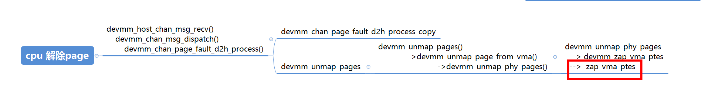

The device, buses and the IOMMU must support the following features:
* Multiple address spaces per device, for example using the PCI PASID (Process Address Space ID) extension. The IOMMU driver allocates a PASID and the device uses it in DMA transactions.
* I/O Page Faults (IOPF), for example PCI PRI (Page Request Interface) or Arm SMMU stall. The core mm handles translation faults from the IOMMU.
* MMU and IOMMU implement compatible page table formats.


#  IO page fault ( IOPF)

为了保持高内存利用率，需要使能I/O缺页错误（I/O Page Fault, IOPF）以按需灵活分配内存。
IOPF实现方案：ATS+PRI标准   


	Shared Virtual Addressing (SVA) allows the processor and device to use the same virtual addresses avoiding the need for software to translate virtual addresses to physical addresses. SVA is what PCIe calls Shared Virtual Memory (SVM).   

	In addition to the convenience of using application virtual addresses by the device, it also doesn’t require pinning pages for DMA. PCIe Address Translation Services (ATS) along with Page Request Interface (PRI) allow devices to function much the same way as the CPU handling application page-faults. For more information please refer to the PCIe specification Chapter 10: ATS Specification.   

	Use of SVA requires IOMMU support in the platform. IOMMU is also required to support the PCIe features ATS and PRI. ATS allows devices to cache translations for virtual addresses. The IOMMU driver uses the mmu_notifier() support to keep the device TLB cache and the CPU cache in sync. When an ATS lookup fails for a virtual address, the device should use the PRI in order to request the virtual address to be paged into the CPU page tables. The device must use ATS again in order the fetch the translation before use.    


```
static int svm_demo_enable_sva(void)
{
	ret = pci_enable_ats(device.dev, PAGE_SHIFT);
	ret = iommu_dev_enable_feature(&device.dev->dev, IOMMU_DEV_FEAT_IOPF);
	ret = iommu_dev_enable_feature(&device.dev->dev, IOMMU_DEV_FEAT_SVA);
	return 0;
}
```


```
int arm_smmu_master_enable_sva(struct arm_smmu_master *master)
{
        int ret;

        mutex_lock(&sva_lock);
        ret = arm_smmu_master_sva_enable_iopf(master);
        if (!ret)
                master->sva_enabled = true;
        mutex_unlock(&sva_lock);

        return ret;
}

```

> ## sva  iopf
domain->type = IOMMU_DOMAIN_SVA;    
```

struct iommu_domain *iommu_sva_domain_alloc(struct device *dev,
                                            struct mm_struct *mm)
{
        const struct iommu_ops *ops = dev_iommu_ops(dev);
        struct iommu_domain *domain;

        domain = ops->domain_alloc(IOMMU_DOMAIN_SVA);
        if (!domain)
                return NULL;

        domain->type = IOMMU_DOMAIN_SVA;
        mmgrab(mm);
        domain->mm = mm;
        domain->iopf_handler = iommu_sva_handle_iopf;
        domain->fault_data = mm;

        return domain;
}
```

```
iommu_sva_handle_iopf(struct iommu_fault *fault, void *data)
{
        vm_fault_t ret;
        struct vm_area_struct *vma;
        struct mm_struct *mm = data;
        unsigned int access_flags = 0;
        unsigned int fault_flags = FAULT_FLAG_REMOTE;
        struct iommu_fault_page_request *prm = &fault->prm;
        enum iommu_page_response_code status = IOMMU_PAGE_RESP_INVALID;

        if (!(prm->flags & IOMMU_FAULT_PAGE_REQUEST_PASID_VALID))
                return status;

        if (!mmget_not_zero(mm))
                return status;

        mmap_read_lock(mm);

        vma = find_extend_vma(mm, prm->addr);
        if (!vma)
                /* Unmapped area */
                goto out_put_mm;

        if (prm->perm & IOMMU_FAULT_PERM_READ)
                access_flags |= VM_READ;

        if (prm->perm & IOMMU_FAULT_PERM_WRITE) {
                access_flags |= VM_WRITE;
                fault_flags |= FAULT_FLAG_WRITE;
        }

        if (prm->perm & IOMMU_FAULT_PERM_EXEC) {
                access_flags |= VM_EXEC;
                fault_flags |= FAULT_FLAG_INSTRUCTION;
        }

        if (!(prm->perm & IOMMU_FAULT_PERM_PRIV))
                fault_flags |= FAULT_FLAG_USER;

        if (access_flags & ~vma->vm_flags)
                /* Access fault */
                goto out_put_mm;

        ret = handle_mm_fault(vma, prm->addr, fault_flags, NULL);
        status = ret & VM_FAULT_ERROR ? IOMMU_PAGE_RESP_INVALID :
                IOMMU_PAGE_RESP_SUCCESS;
}
```

## pri 中断处理


+ 注册 中断 callback (iommu_queue_iopf ) 
iommu_queue_iopf
```
        +-> iommu_sva_enable
          +-> iommu_register_device_fault_handler(dev, iommu_queue_iopf, dev)
              /* 动态部分将执行iommu_queue_iopf */
              把iommu_queue_iopf赋值给iommu_fault_param里的handler                  
        +-> iopf_queue_add_device(struct iopf_queue, dev)
            把相应的iopf_queue赋值给iopf_device_param里的iopf_queue, 这里有
            pri对应的iopf_queue或者是stall mode对应的iopf_queue。初始化
            iopf_device_param里的wait queue
```

+ 中断触发   
 

当一个PRI或者是一个stall event上报后, 软件会在缺页流程里建立页表，然后控制
SMMU给设备返送reponse信息。我们可以从SMMU PRI queue或者是event queue的中断
处理流程入手跟踪: e.g.PRI中断流程       
iommu_report_device_fault    
```
devm_request_threaded_irq(..., arm_smmu_priq_thread, ...)
arm_smmu_priq_thread
  +-> arm_smmu_handle_ppr
    +-> iommu_report_device_fault
      +-> iommu_fault_param->handler
        +-> iommu_queue_iopf /* 初始化参见上面第2部分 */
          +-> iopf_group = kzalloc
          +-> list_add(faults list in group, fault)
          +-> INIT_WORK(&group->work, iopf_handle_group)
          +-> queue_work(iopf_param->queue->wq, &group->work)
          这段代码创建缺页的group，并把当前的缺页请求挂入group里的链表，然后
          创建一个任务，并调度这个任务运行

          在工作队列线程中:
          +-> iopf_handle_group
            +-> iopf_handle_single
              +-> handle_mm_fault
                  这里会最终申请内存并建立页表

    +-> arm_smmu_page_response
        软件执行完缺页流程后，软件控制SMMU向设备回响应。
```


# /dev/devmm_svm    
smmu svm vma  IOPF
```
int devmm_insert_pages_range_to_vma(struct devmm_svm_process *svm_process, unsigned long va,
    u64 page_num, struct page **inpages)
{
    struct vm_area_struct *vma = svm_process->vma;
    phys_addr_t offset;
    int ret;
    u64 i;

    vma->vm_page_prot = devmm_make_pgprot(0);
    for (i = 0; i < page_num; i++) {
        offset = (i << PAGE_SHIFT);
        ret = remap_pfn_range(vma, va + offset, page_to_pfn(inpages[i]), PAGE_SIZE, vma->vm_page_prot);
        if (ret) {
            devmm_drv_err("vm_insert_page() failed,ret=%d. va=0x%lx, i=%llu, page_num=%llu.\n",
                ret, va, i, page_num);
            /* will not return fail ,so free page here */
            devmm_free_pages(1, &inpages[i], svm_process);
        } else {
            devmm_pin_page(inpages[i]);
        }
        devmm_svm_stat_page_inc(PAGE_SIZE);
        devmm_svm_stat_pg_map_inc();
    }

    return 0;
}
```

##  cpu page fault  
handle_mm_fault  -->   remap_pfn_range  或者 struct vm_operations_struct fault    


```
[  132.892345] [<ffff000001520108>] mmap_fault+0x38/0x80 [mmap_example]
[  132.898673] [<ffff00000824b07c>] __do_fault+0x30/0xf4
[  132.903705] [<ffff00000824fe48>] do_fault+0x3ec/0x4b8
[  132.908739] [<ffff0000082514a4>] __handle_mm_fault+0x3f4/0x560
[  132.914549] [<ffff0000082516f0>] handle_mm_fault+0xe0/0x178
[  132.920101] [<ffff000008873a44>] do_page_fault+0x1c4/0x3cc
[  132.925565] [<ffff000008873c9c>] do_translation_fault+0x50/0x5c
[  132.931460] [<ffff0000080813e8>] do_mem_abort+0x64/0xe4
```


### devmm_svm_mmap


+ devmm_alloc_pages函数会在主机端申请物理页。在不使用大页或者巨页的情况下，每次缺页中断会申请一个页，devmm_alloc_pages最终会调用numa的page申请接口alloc_pages_node申请物理内存。   
+  devmm_page_fault_h2d_sync会将申请到的页信息发送到device，device会使用得到的页面信息做dma拷贝   
+  devmm_pages_remap会调用remap_pfn_range函数为申请到的物理地址建立页表并将vma插入自己的进程空间中。同时会调用get_page函数锁住这个页面    
 

```
STATIC int devmm_svm_mmap(struct file *file, struct vm_area_struct *vma)
{
    struct devmm_svm_process *svm_process = NULL;

    if ((vma->vm_start != DEVMM_SVM_MEM_START) || (vma->vm_end != (DEVMM_SVM_MEM_START + DEVMM_SVM_MEM_SIZE))) {
        devmm_drv_err("svm map err. vm_start=0x%lx,vm_end=0x%lx,vm_pgoff=0x%lx, vm_flags=0x%lx.\n", vma->vm_start,
                      vma->vm_end, vma->vm_pgoff, vma->vm_flags);
        return -ESRCH;
    }

    svm_process = devmm_svm_mmap_init_struct(&devmm_vm_ops_managed, vma);
    if (svm_process == NULL) {
        devmm_drv_err("svm map init_struct err.vm_start=0x%lx,vm_end=0x%lx,vm_pgoff=0x%lx, vm_flags=0x%lx.\n",
                      vma->vm_start, vma->vm_end, vma->vm_pgoff, vma->vm_flags);
        return -ESRCH;
    }
    /* init vma */
    svm_process->vma = vma;
    vma->vm_ops = &devmm_vm_ops_managed;
    vma->vm_flags |= VM_LOCKED;
    vma->vm_flags |= VM_DONTEXPAND;
    vma->vm_flags |= VM_PFNMAP;
    vma->vm_flags |= VM_WRITE;
    vma->vm_flags |= VM_DONTDUMP;

    file->private_data = kzalloc(sizeof(struct devmm_private_data), GFP_KERNEL);
    if (file->private_data == NULL) {
        devmm_drv_err("kzalloc devmm_private_data fail."
                      "vm_start=0x%lx,vm_end=0x%lx,vm_pgoff=0x%lx,vm_flags=0x%lx.\n",
                      vma->vm_start, vma->vm_end, vma->vm_pgoff, vma->vm_flags);
        return -ENOMEM;
    }

    ((struct devmm_private_data *)file->private_data)->process = svm_process;

    devmm_drv_switch("vm_start=0x%lx,vm_end=0x%lx,vm_pgoff=0x%lx,vm_flags=0x%lx\n", vma->vm_start, vma->vm_end,
                     vma->vm_pgoff, vma->vm_flags);

    devmm_init_svm_process(svm_process, vma);

    return 0;
}
```

## page fault 

+  page fault  处理函数初始化    
```
struct devmm_svm_process *devmm_svm_mmap_init_struct(struct vm_operations_struct *ops_managed,
                                                     struct vm_area_struct *vma)
{
    struct devmm_svm_process *svm_proc = NULL;
    if (devmm_get_pro_by_pid(devmm_get_current_pid(), DEVMM_SVM_INITED_FLAG, DEVMM_END_HOST) != NULL) {
        devmm_drv_err("svm process remap err.\n");
        return NULL;
    }

#if LINUX_VERSION_CODE >= KERNEL_VERSION(4, 11, 0)
    ops_managed->fault = devmm_svm_vmf_fault_host;
#else
    ops_managed->fault = devmm_svm_vm_fault_host;
#endif
    svm_proc = devmm_get_idle_process_set_init(devmm_get_current_pid(), DEVMM_SVM_INVALID_PID,
                                               DEVMM_SVM_INITING_FLAG);
    return svm_proc;
}
```

devmm_svm_vm_fault_host -->  devmm_insert_pages_to_vma  --> devmm_insert_pages_range_to_vma --> remap_pfn_range 


> ### 物理page 分配

outpages[i] = alloc_pages_node(nid, flag, 0)     

```
int devmm_alloc_pages(int nid, int is_4G, u64 page_num, struct page **outpages, struct devmm_svm_process *svm_process)
{
    struct mem_cgroup *memcg = NULL;
    pid_t pid;
    int flag;
    u64 i;

    flag = devmm_get_alloc_mask();
    if (is_4G) {
        flag |= GFP_DMA32;
    }

    if (devmm_get_end_type() == DEVMM_END_HOST) {
        pid = svm_process->hostpid;
    } else {
        pid = svm_process->devpid;
    }

    devmm_drv_switch("nid=%d, is_4G=%d, page_num=%llu\n", nid, is_4G, page_num);

    devmm_enable_cgroup(&memcg, pid);
    for (i = 0; i < page_num; i++) {
        outpages[i] = alloc_pages_node(nid, flag, 0);
        if (outpages[i] == NULL) {
            outpages[i] = alloc_pages_node(devmm_get_another_nid(nid), flag, 0);
            if (outpages[i] == NULL) {
                devmm_print_phy_meminfo(nid);
                devmm_free_pages(i, outpages, svm_process);
                devmm_disable_cgroup(memcg);
                devmm_drv_err("i=%llu, page_num=%llu, pid(%d) alloc_cnt=%lld, free_cnt=%lld.\n", i, page_num, pid,
                              (long long)atomic64_read(&svm_process->alloc_page_cnt), (long long)atomic64_read(&svm_process->free_page_cnt));
                return -ENOMEM;
            }
        }
        atomic64_inc(&svm_process->alloc_page_cnt);
        devmm_svm_stat_pg_alloc_inc();
    }
    devmm_disable_cgroup(memcg);
    return 0;
}
```


## page fault中 同步page table （devmm_page_fault_h2d_sync） 
```
/* h2d fault, inv device pagetable: (the max dma unit size is PAGESIZE ?)
 * 1. host host query host page (pin page and map dma)
 * 2. host send page-msg to device
 * 3. device recv and prs devic pagetable
 * 4. device query device page
 * 5. device copy to host
 * 6. device inv device page,return.
 * 7. host (unpin page and unmap dma) if non full size, return to 1.
 */
int devmm_page_fault_h2d_sync(unsigned int dev_id, struct page **pages, unsigned long va, u32 adjust_order,
                              const struct devmm_svm_heap *heap)
{
    struct devmm_chan_page_fault *fault_msg = NULL;
    struct devmm_chan_phy_block *blks = NULL;
    struct device *dev = NULL;
    u32 j, idx;
    int ret;

    devmm_drv_switch("enter dev_id=%u, va=0x%lx, adjust_order=%u\n", dev_id, va, adjust_order);

    fault_msg = (struct devmm_chan_page_fault *)kzalloc(sizeof(struct devmm_chan_page_fault), GFP_KERNEL);
    if (fault_msg == NULL) {
        devmm_drv_err("kmalloc error. dev_id=%u, va=0x%lx, adjust_order=%u\n", dev_id, va, adjust_order);
        return -ENOMEM;
    }
    blks = fault_msg->blks;
    devmm_fill_page_fault_msg(dev_id, va, adjust_order, DEVMM_CHAN_PAGE_FAULT_H2D_ID, fault_msg);

    dev = devmm_devid_to_device(dev_id);
    if (dev == NULL) {
        devmm_drv_err("dev is NULL,dev_id = %d\n", dev_id);
        kfree(fault_msg);
        return -EINVAL;
    }

    for (idx = 0, j = 0; idx < fault_msg->num; idx++) {
        blks[idx].pa = page_to_phys(pages[idx]);
        blks[idx].sz = PAGE_SIZE;
        devmm_merg_phy_blk(blks, idx, &j);
    }
    fault_msg->num = j;

    for (idx = 0; idx < fault_msg->num; idx++) {
        blks[idx].pa = dma_map_page(dev, pfn_to_page(PFN_DOWN(blks[idx].pa)), 0, blks[idx].sz, DMA_BIDIRECTIONAL);
        if (dma_mapping_error(dev, blks[idx].pa)) {
            devmm_drv_err("host page fault dma map page failed. dev_id=%u, va=0x%lx, adjust_order=%u\n",
                          dev_id, va, adjust_order);
            ret = -EIO;
            goto host_page_fault_dma_free;
        }
    }

    /* sync send msg:device todo copy data process */
    ret = devmm_chan_msg_send(fault_msg, sizeof(*fault_msg), 0);
    if (ret) {
        devmm_drv_err("host page fault send msg failed, ret=%d. dev_id=%u, va=0x%lx, adjust_order=%u\n",
                      ret, dev_id, va, adjust_order);
    }

host_page_fault_dma_free:
    for (j = 0; j < idx; j++) {
        dma_unmap_page(dev, blks[j].pa, blks[j].sz, DMA_BIDIRECTIONAL);
    }
    kfree(fault_msg);
    fault_msg = NULL;
    return ret;
}
```

### cpu 解除page 

主机端接收到pcie消息后会通过以下调用函数调用路径来处理。    


