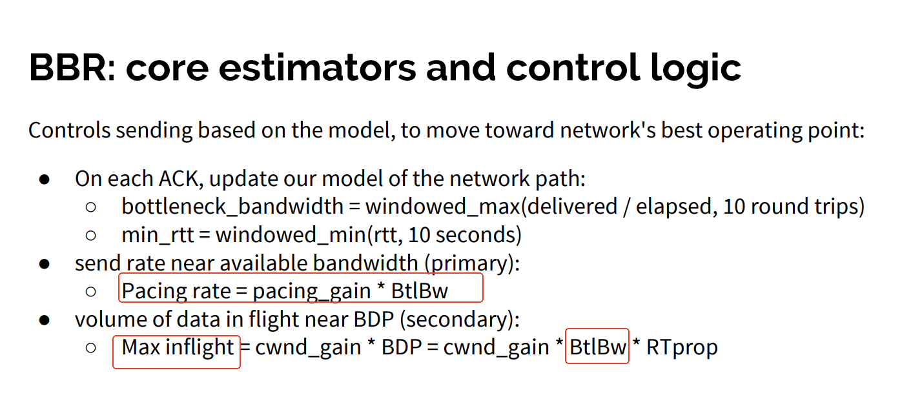

[google-bbr](https://github.com/google/bbr)    

```
root@ubuntux86:# sysctl net.ipv4.tcp_available_congestion_control
net.ipv4.tcp_available_congestion_control = reno cubic
root@ubuntux86:# lsmod | grep bbr
root@ubuntux86:# modprobe tcp_bbr
root@ubuntux86:# lsmod | grep bbr
tcp_bbr                20480  0
root@ubuntux86:# sysctl net.ipv4.tcp_available_congestion_control
net.ipv4.tcp_available_congestion_control = reno cubic bbr
root@ubuntux86:# 

root@ubuntux86:# sysctl net.ipv4.tcp_congestion_control
net.ipv4.tcp_congestion_control = cubic
root@ubuntux86:# 
```


```
 netperf -l 180 -H 10.11.12.82  -- -k THROUGHPUT -K bbr -P 10001
```

This open source distribution contains documentation, scripts, and
other materials related to the BBR congestion control algorithm.

Quick links
---

* Linux TCP BBRv3 Release:
  * https://github.com/google/bbr/blob/v3/README.md
* BBR FAQ:
  * https://github.com/google/bbr/blob/master/Documentation/bbr-faq.md
* TCP BBR Quick-Start: Building and Running TCP BBR on Google Compute Engine:
  * https://github.com/google/bbr/blob/master/Documentation/bbr-quick-start.md
* Mailing list: Test results, performance evaluations, feedback, and BBR-related discussions are very welcome in the public e-mail list for BBR: https://groups.google.com/d/forum/bbr-dev

Latest BBR code from Google's BBR team
---

* For Linux TCP BBR:
  * https://github.com/google/bbr/blob/v3/net/ipv4/tcp_bbr.c

* For QUIC BBR:
  * https://github.com/google/quiche/blob/main/quiche/quic/core/congestion_control/bbr2_sender.cc
  * https://github.com/google/quiche/blob/main/quiche/quic/core/congestion_control/bbr2_sender.h

BBR v1 releases
---

* For Linux TCP BBR:
  * https://git.kernel.org/pub/scm/linux/kernel/git/davem/net-next.git/tree/net/ipv4/tcp_bbr.c

* For QUIC BBR:
  * https://github.com/google/quiche/blob/main/quiche/quic/core/congestion_control/bbr_sender.cc
  * https://github.com/google/quiche/blob/main/quiche/quic/core/congestion_control/bbr_sender.h

BBR Internet Draft
---
* There is an Internet Draft specifying BBR:  
  * BBR is a Congestion Control Working Group (CCWG) "working group item"  
  * Target: publish an experimental RFC documenting the algorithm  
  * IETF working group members are collaborating on github  
    * [https://github.com/ietf-wg-ccwg/draft-ietf-ccwg-bbr](https://github.com/ietf-wg-ccwg/draft-ietf-ccwg-bbr)  
    * Ideas or suggestions? Feel free to file a github issue.  
    * Specific editorial suggestions? Feel free to propose a pull request.  
  * BBR Internet Draft:  draft-ietf-ccwg-bbr  
    * [https://datatracker.ietf.org/doc/draft-ietf-ccwg-bbr/](https://datatracker.ietf.org/doc/draft-ietf-ccwg-bbr/)  

Information About BBR
---
* There is a [blog post](https://cloudplatform.googleblog.com/2017/07/TCP-BBR-congestion-control-comes-to-GCP-your-Internet-just-got-faster.html) on the launch of BBR for Google.com, YouTube, and Google Cloud Platform  
* There is an [article describing BBR](http://cacm.acm.org/magazines/2017/2/212428-bbr-congestion-based-congestion-control/fulltext) in the February 2017 issue of CACM (the same content is in the [ACM Queue BBR article from Oct 2016](http://queue.acm.org/detail.cfm?id=3022184)).  
* \[[YouTube](https://www.youtube.com/watch?v=hIl_zXzU3DA)\] \[[slides](http://netdevconf.org/1.2/slides/oct5/04_Making_Linux_TCP_Fast_netdev_1.2_final.pdf)\] for a BBR talk at the Linux netdev 1.2 conference (Oct 2016\)  
* \[[YouTube](https://youtu.be/qjWTULVbiVc?t=3460)\] \[[slides](https://www.ietf.org/proceedings/97/slides/slides-97-iccrg-bbr-congestion-control-02.pdf)\] for a BBR talk in the ICCRG session at IETF 97 (Nov 2016\)  
* \[[YouTube](https://youtu.be/7wRXkQcD8PM?t=3317)\] \[[slides](https://www.ietf.org/proceedings/97/slides/slides-97-maprg-traffic-policing-in-the-internet-yuchung-cheng-and-neal-cardwell-00.pdf)\] for a talk covering policers and BBR's handling of policers, in the MAPRG session at IETF 97 (Nov 2016\)  
* \[[YouTube](https://youtu.be/_rf4EjkaRNo?t=5751)\] \[[slides](https://www.ietf.org/proceedings/98/slides/slides-98-iccrg-an-update-on-bbr-congestion-control-00.pdf)\] BBR talk at the ICCRG session at IETF 98 (Mar 2017\)  
* \[[YouTube](https://youtu.be/5EiUx_sXpak?t=1406)\] \[[slides](https://www.ietf.org/proceedings/99/slides/slides-99-iccrg-iccrg-presentation-2-00.pdf)\] BBR talk at the ICCRG session at IETF 99 (Jul 2017\)  
* \[[YouTube](https://www.youtube.com/watch?v=IGw5NVGBsDU&t=43m58s)\] \[[slides](https://datatracker.ietf.org/meeting/100/materials/slides-100-iccrg-a-quick-bbr-update-bbr-in-shallow-buffers/)\] BBR talk at the ICCRG session at IETF 100 (Nov 2017\)  
* \[[YouTube](https://www.youtube.com/watch?v=rHH9wFbms80&feature=youtu.be&t=52m09s)\] \[[slides](https://datatracker.ietf.org/meeting/101/materials/slides-101-iccrg-an-update-on-bbr-work-at-google-00)\] BBR talk at the ICCRG session at IETF 101 (Mar 2018\)  
* \[[YouTube](https://youtu.be/LdjavTiMrs0?t=1h10m3s)\] \[[slides](https://datatracker.ietf.org/meeting/102/materials/slides-102-iccrg-an-update-on-bbr-work-at-google-00)\] BBR Congestion Control Work at Google: IETF 102 Update  (Jul 2018\)  
* \[[YouTube](https://youtu.be/LdjavTiMrs0?t=1h36m42s)\] \[[slides](https://datatracker.ietf.org/meeting/102/materials/slides-102-iccrg-bbr-startup-behavior-01)\] BBR Congestion Control: IETF 102 Update: BBR Startup (Jul 2018\)  
* \[[YouTube](https://youtu.be/cJ-0Ti8ZlfE?t=210)\] \[[slides](https://datatracker.ietf.org/meeting/104/materials/slides-104-iccrg-an-update-on-bbr-00)\] BBR v2: A Model-based Congestion Control \- ICCRG at IETF 104 (Mar 2019\)  
* \[[YouTube](https://www.youtube.com/watch?v=6Njd4ApRsuo&feature=youtu.be&t=1149)\] \[[slides](https://datatracker.ietf.org/meeting/105/materials/slides-105-iccrg-bbr-v2-a-model-based-congestion-control-00)\] BBR v2: A Model-based Congestion Control: IETF 105 Update \- ICCRG (Jul 2019\)  
* \[[YouTube](https://www.youtube.com/watch?v=i3CpETXwA7Q&feature=youtu.be&t=1679)\] \[[slides](https://datatracker.ietf.org/meeting/106/materials/slides-106-iccrg-update-on-bbrv2)\] BBR v2: A Model-based Congestion Control: Performance Optimizations \- IETF 106 \- ICCRG (Nov 2019\)  
* \[[YouTube](https://www.youtube.com/watch?v=VIX45zMMZG8)\] BBR: A Model-based Congestion Control \- High-Speed Networking Workshop (May 2020\)  
* \[[YouTube](https://www.youtube.com/watch?v=tBuXblC0o1M&feature=youtu.be&t=3485)\] \[[slides](https://datatracker.ietf.org/meeting/109/materials/slides-109-iccrg-update-on-bbrv2-00)\] BBR Update: 1: BBR.Swift; 2: Scalable Loss Handling \- IETF 109 \- ICCRG (Nov 2020\)  
* \[[YouTube](https://youtu.be/Km7dzk6-4_E?t=5361)\] \[[slides](https://datatracker.ietf.org/meeting/110/materials/slides-110-iccrg-bbr-updates-00.pdf)\] BBR Internal Deployment, Code, Draft Plans \- IETF 110 \- ICCRG (Mar 2021\)  
* \[YouTube\] \[[slides](https://datatracker.ietf.org/meeting/112/materials/slides-112-iccrg-bbrv2-update-00)\] BBRv2 Update: Internet Drafts & Deployment Inside Google \- IETF 112 \- ICCRG (Nov 2021)  
* \[YouTube\] \[[slides](https://datatracker.ietf.org/meeting/112/materials/slides-112-iccrg-bbrv2-quic-update-00)\] BBRv2 Update: QUIC Tweaks and Internet Deployment \- IETF 112 ICCRG (Nov 2021)  
* \[[YouTube](https://youtu.be/u-91t6JfjmY?t=2828)\] \[[slides](https://datatracker.ietf.org/meeting/117/materials/slides-117-ccwg-bbrv3-algorithm-bug-fixes-and-public-internet-deployment-00)\] BBRv3: Algorithm Updates and Public Internet Deployment \- IETF 117 \- CCWG (Jul 2023\)  
* \[[YouTube](https://www.youtube.com/watch?v=ZVqQiA7h-W8&t=5378s)\] \[[slides](https://datatracker.ietf.org/meeting/119/materials/slides-119-ccwg-bbrv3-overview-and-google-deployment)\] BBRv3: Algorithm Overview and Google's Public Internet Deployment \- IETF 119 \- CCWG (Mar 2024\)  
* \[[YouTube](https://www.youtube.com/watch?v=QYiiaOYkfjo&t=1173s)\] \[[slides](https://datatracker.ietf.org/meeting/120/materials/slides-120-ccwg-bbrv3-ccwg-internet-draft-update-00)\] BBRv3: Internet Draft Update: draft-cardwell-ccwg-bbr-00 \- IETF 120 \- CCWG (Jul 2024\)


This is not an official Google product.


# 更改TCP拥塞控制算法

```
#include <sys/socket.h>
#include <netinet/in.h>
#include <netinet/tcp.h>
#include <stdio.h>
#include <string.h>
#include <unistd.h>

int main(int argc, char **argv)
{
    char buf[256];
    socklen_t len;
    int sock = socket(AF_INET, SOCK_STREAM, 0);

    if (sock == -1)
    {
        perror("socket");
        return -1;
    }

    len = sizeof(buf);

    if (getsockopt(sock, IPPROTO_TCP, TCP_CONGESTION, buf, &len) != 0)
    {
        perror("getsockopt");
        return -1;
    }

    printf("Current: %s\n", buf);

    strcpy(buf, "reno");

    len = strlen(buf);

    if (setsockopt(sock, IPPROTO_TCP, TCP_CONGESTION, buf, len) != 0)
    {
        perror("setsockopt");
        return -1;
    }

    len = sizeof(buf);

    if (getsockopt(sock, IPPROTO_TCP, TCP_CONGESTION, buf, &len) != 0)
    {
        perror("getsockopt");
        return -1;
    }

    printf("New: %s\n", buf);

    close(sock);
    return 0;
}
```


# BBR算法主要处理阶段 

每当收到一个ACK报文后，Linux内核会调用tcp_ack函数进行处理。在该函数中会调用拥塞控制算法的关键函数tcp_cong_control。这个调用链对于所有拥塞控制算法是相同的。     

tcp_cong_control函数中主要有两大分支，一个是发送方当前处于快速恢复阶段，即拥塞窗口减少过程，另一个是拥塞避免阶段，其中包含了慢启动过程。     





 BBRcontrol the transmission rate by calculating three output
parameters: ***pacing_rate, cwnd, and quantum*** based onthe configured network path model


```text
BBR算法主要处理阶段包括:     

 起步阶段    
传输起步阶段，与传统算法基本一致，每次发送速率翻倍增长。不同的是，如果连续三次翻倍增长后，对比发现速率增长小于25%，意味着带宽进入瓶颈，有部分数据进入了缓冲区。于是立即将发送速率减半，并进入排干阶段。   

 排干阶段    
排干阶段主要目的通过减半速率让缓冲区逐渐清空数据。当outstanding package size(TCP发送出去还没被对方ack的值)≤BtlBW×RTT，这代表缓冲区数据已经处理完毕，所有流量都在链路中，就进入了稳健阶段。    

 稳健阶段     
该阶段主要任务就是稳定发包。       
同时，由于网络中可用带宽不是一成不变的，所以稳健阶段在不停地周期性探测最大可用带宽的变化趋势。简单来说，就是周期性地将发送速率乘以一个大于1的系数，检查可用带宽是否增加；同一周期内，再将发送速率除以同样的系数，保持平稳，并探测可用带宽是否变小。 
```    

> ##  BBR 核心算法

```
BBR 的核心算法分为两部分：

当收到一个 ACK 时，应该做什么操作；
当发送一段数据时，应该做什么操作。
```

> ###   BBR 收到应答包（ACK）时的逻辑

```
每个 ACK 都为我们提供了 RTT 和平均传输速率 的一次测量，二者又将分别更新对 RTprop 和 BtlBw 的估计。

具体来说，收到一个 ACK 时，BBR 将执行以下逻辑：

function onAck(packet)
  rtt = now - packet.sendtime                      // 收包时间 减去 包中记录的发包时间
  update_min_filter(RTpropFilter, rtt)             // 根据 2.2 中的方程，更新对 RTT 的估计
 
  delivered      += packet.size
  delivered_time =  now
  delivery_rate  =  (delivered - packet.delivered) / (delivered_time - packet.delivered_time)
 
  if (delivery_rate > BtlBwFilter.current_max      // 实际传输速率已经大于当前估计的瓶颈带宽，或
     || !packet.app_limited)                       // 不是应用受限（应用受限的样本对估计 BtlBw 无意义）
     update_max_filter(BtlBwFilter, delivery_rate) // 根据 2.3 中的方程，更新对 BtlBw 的估计
 
  if (app_limited_until > 0)                       // 达到瓶颈带宽前，仍然可发送的字节数
     app_limited_until = app_limited_until - packet.size
```
几点说明：  

****每个包都会更新对 RTProp 的估计，但只有部分包会更新对 BtlBw 的估计；****
应用受限的包

对于一个包，当应用（application）全速发送它而仍然没有占满瓶颈带宽时， BBR 会这个包标记为 app_limited（见下面的 send() 伪代码）， 即 packet.app_limited = true。这将决定哪些样本会用来更新对带宽的估计。   
瓶颈带宽 BtlBw 是传输速率的一个硬性上限，因此
如果测量到当前的传输速率 > 当前对 BtlBw 估计， 必定意味着这个估计太低了，不管样本是不是 app-limited；对应到上面的代码，就是只要 delivery_rate > BtlBwFilter.current_max，就一定更新 BtlBw 估计；否则，
如果样本不是 app-limited（说明实际带宽已经饱和），也更新 BtlBw 估计。     


> ###  TCP Pacing（在每个 RTT 窗口内均匀发送数据）
BBR determines the inflight packets by two control parameters: pacing rate and congestion window (cwnd)    

BBR 发送数据时的逻辑如下：

```
function send(packet)
  bdp = BtlBwFilter.current_max * RTpropFilter.current_min  // 计算 BDP
  if (inflight >= cwnd_gain * bdp)                          // 如果正在传输中的数据量超过了允许的最大值
     return                                                 // 直接返回，接下来就等下一个 ACK，或者等超时重传

  // 能执行到这说明 inflight < cwnd_gain * bdp，即正在传输中的数据量 < 瓶颈容量

  if (now >= next_send_time)
     packet = nextPacketToSend()
     if (!packet)                      // 如果没有数据要发送
        app_limited_until = inflight   // 更新 “在达到瓶颈容量之前，仍然可发送的数据量”
        return

     packet.app_limited = (app_limited_until > 0)  // 如果仍然能发送若干字节才会达到瓶颈容量，说明处于 app_limited 状态
     packet.sendtime = now
     packet.delivered = delivered
     packet.delivered_time = delivered_time
     ship(packet)
     next_send_time = now + packet.size / (pacing_gain * BtlBwFilter.current_max)

  timerCallbackAt(send, next_send_time)
在 Linux 实现中，BBR 发送过程会用到高效的 FQ/pacing qdisc4， 这使得 BBR 在多条 Gbps 链路上，单条连接的性能就能达到线速；CPU 开销几乎可以忽略 ，就能处理几千条低速 paced 连接。

```

> ###  bbr_target_cwnd 和 pacing gain    
```
static u32 bbr_target_cwnd(struct sock *sk, u32 bw, int gain)
{
        struct bbr *bbr = inet_csk_ca(sk);
        u32 cwnd;
        u64 w;

        /* If we've never had a valid RTT sample, cap cwnd at the initial
         * default. This should only happen when the connection is not using TCP
         * timestamps and has retransmitted all of the SYN/SYNACK/data packets
         * ACKed so far. In this case, an RTO can cut cwnd to 1, in which
         * case we need to slow-start up toward something safe: TCP_INIT_CWND.
         */
        if (unlikely(bbr->min_rtt_us == ~0U))    /* no valid RTT samples yet? */
        {
                return TCP_INIT_CWND;  /* be safe: cap at default initial cwnd*/
                pr_err("bbr min rtt is 0 and  target cwnd slow start ************** \n");
        }
        w = (u64)bw * bbr->min_rtt_us;

        /* Apply a gain to the given value, then remove the BW_SCALE shift. */
        cwnd = (((w * gain) >> BBR_SCALE) + BW_UNIT - 1) / BW_UNIT;

        /* Allow enough full-sized skbs in flight to utilize end systems. */
        cwnd += 3 * bbr->tso_segs_goal;

        /* Reduce delayed ACKs by rounding up cwnd to the next even number. */
        cwnd = (cwnd + 1) & ~1U;

        return cwnd;
}
```


> ###   采样

当监测到使用令牌桶算法时，直接使用长期采样，避免频繁采样。函数是bbr_lt_bw_sampling   

```
/* Token-bucket traffic policers are common (see "An Internet-Wide Analysis of
 * Traffic Policing", SIGCOMM 2016). BBR detects token-bucket policers and
 * explicitly models their policed rate, to reduce unnecessary losses. We
 * estimate that we're policed if we see 2 consecutive sampling intervals with
 * consistent throughput and high packet loss. If we think we're being policed,
 * set lt_bw to the "long-term" average delivery rate from those 2 intervals.
 * 有些网络会使用令牌桶的方式来限制带宽，这里就使用长期采样的方式，检测12个rtt内的平均bw，
 * 如果检测到被令牌桶策略限制，则使用这个bw来限制带宽，避免无意义的丢包和浪费
 * 令牌桶的设置是，你可能短时间可以获得很高的bw，但是长时间令牌受限，最后还是限制整体的bw
 */
static void bbr_lt_bw_sampling(struct sock *sk, const struct rate_sample *rs)
{
	struct tcp_sock *tp = tcp_sk(sk);
	struct bbr *bbr = inet_csk_ca(sk);
	u32 lost, delivered;
	u64 bw;
	u32 t;

	if (bbr->lt_use_bw) {	/* already using long-term rate, lt_bw? */
	    // 如果已经使用了长期采样的带宽，则不再采样，直接跳过
		if (bbr->mode == BBR_PROBE_BW && bbr->round_start &&
		    ++bbr->lt_rtt_cnt >= bbr_lt_bw_max_rtts) {
			// 使用lt_bw超过一定时间，重新进入Probe_BW状态状态，重置长期采样护具
			bbr_reset_lt_bw_sampling(sk);    /* stop using lt_bw */
			bbr_reset_probe_bw_mode(sk);  /* restart gain cycling */
		}
		return;
	}

	/* Wait for the first loss before sampling, to let the policer exhaust
	 * its tokens and estimate the steady-state rate allowed by the policer.
	 * Starting samples earlier includes bursts that over-estimate the bw.
	 * 等待令牌桶慢了之后出现第一个丢包才开始长期采样，从而更好预估policer的带宽限制
	 */
	if (!bbr->lt_is_sampling) {
		if (!rs->losses)
			return;
		// 重置采样参数，开始采样
		bbr_reset_lt_bw_sampling_interval(sk);
		bbr->lt_is_sampling = true;
	}

	/* To avoid underestimates, reset sampling if we run out of data. */
	// app提供数据量不足，重置采样
	if (rs->is_app_limited) {
		bbr_reset_lt_bw_sampling(sk);
		return;
	}

	if (bbr->round_start) // 记录采样的数量
		bbr->lt_rtt_cnt++;	/* count round trips in this interval */
	if (bbr->lt_rtt_cnt < bbr_lt_intvl_min_rtts) // 最小采样周期数
		return;		/* sampling interval needs to be longer */
	if (bbr->lt_rtt_cnt > 4 * bbr_lt_intvl_min_rtts) { // 采样数量太多了也需要重新采样
		bbr_reset_lt_bw_sampling(sk);  /* interval is too long */
		return;
	}

	/* End sampling interval when a packet is lost, so we estimate the
	 * policer tokens were exhausted. Stopping the sampling before the
	 * tokens are exhausted under-estimates the policed rate.
	 * 没丢包，不采样
	 */
	if (!rs->losses)
		return;

	/* Calculate packets lost and delivered in sampling interval. */
	lost = tp->lost - bbr->lt_last_lost;
	delivered = tp->delivered - bbr->lt_last_delivered;
	/* Is loss rate (lost/delivered) >= lt_loss_thresh? If not, wait. */
	// 如果没有数据到达，或者丢包率超过20%(50/256)，则无视这次采样
	if (!delivered || (lost << BBR_SCALE) < bbr_lt_loss_thresh * delivered)
		return;

	/* Find average delivery rate in this sampling interval. */
	// ms级别的测量周期
	t = div_u64(tp->delivered_mstamp, USEC_PER_MSEC) - bbr->lt_last_stamp;
	if ((s32)t < 1)
		return;		/* interval is less than one ms, so wait */
	/* Check if can multiply without overflow */
	if (t >= ~0U / USEC_PER_MSEC) {
		bbr_reset_lt_bw_sampling(sk);  /* interval too long; reset */
		return;
	}
	t *= USEC_PER_MSEC; // 时间戳转换为us
	bw = (u64)delivered * BW_UNIT;
	do_div(bw, t);
	// 采样结束，决定是否使用长期采样的bw
	bbr_lt_bw_interval_done(sk, bw);
}
```

 bbr_update_bw根据采样计算带宽***（rs->delivered/rs->interval_us）．***如果到了新的一轮（rs->prior_delivered>=bbr->next_rtt_delivered）,更新下一个周期初始delivered，轮数+1．然后是***long-term检测（用于处理流量监管丢包，如果两次丢包严重就会进入long-term阶段），最后就是更新带宽采样（bbr->bw是minmax类型，一个三元数组，会不断更新用于计算最大带宽）．***

 rate_sample用于跟踪一个周期（interval）内的delivered，用于计算带宽．其中prior_delivered是在一个采样周期开始时tp->deliverd的大小， tcp_sock中的delivered的值则是一个累加值，通过这个值的大小来判断是否到了新的周期
 
 ```
  /* A rate sample measures the number of (original/retransmitted) data
 * packets delivered "delivered" over an interval of time "interval_us".
 * The tcp_rate.c code fills in the rate sample, and congestion
 * control modules that define a cong_control function to run at the end
 * of ACK processing can optionally chose to consult this sample when
 * setting cwnd and pacing rate.
 * A sample is invalid if "delivered" or "interval_us" is negative.
 */
struct rate_sample {
	u64  prior_mstamp; /* starting timestamp for interval */
	u32  prior_delivered;	/* tp->delivered at "prior_mstamp" */
	s32  delivered;		/* number of packets delivered over interval */
	long interval_us;	/* time for tp->delivered to incr "delivered" */
	long rtt_us;		/* RTT of last (S)ACKed packet (or -1) */
	int  losses;		/* number of packets marked lost upon ACK */
	u32  acked_sacked;	/* number of packets newly (S)ACKed upon ACK */
	u32  prior_in_flight;	/* in flight before this ACK */
	bool is_app_limited;	/* is sample from packet with bubble in pipe? */
	bool is_retrans;	/* is sample from retransmission? */
};
 ```
 
 bbr_lt_bw_sampling处理占了bbr代码很大一部分． 用来处理traffic policers主动丢包（如路由器交换机会在某些场景下，随即丢包）．如注释中说到的，当看到两次连续采样间隔，吞吐量不变并有大量丢包，就认为有traffic policers主动丢包，进入long-term状态，避免进一步大量丢包
 
 > ### bbr lost
 
 
```
    bbr_lt_bw_sampling(sk, rs);

	/* Divide delivered by the interval to find a (lower bound) bottleneck
	 * bandwidth sample. Delivered is in packets and interval_us in uS and
	 * ratio will be <<1 for most connections. So delivered is first scaled.
	 */
	bw = div64_long((u64)rs->delivered * BW_UNIT, rs->interval_us);
``` 
