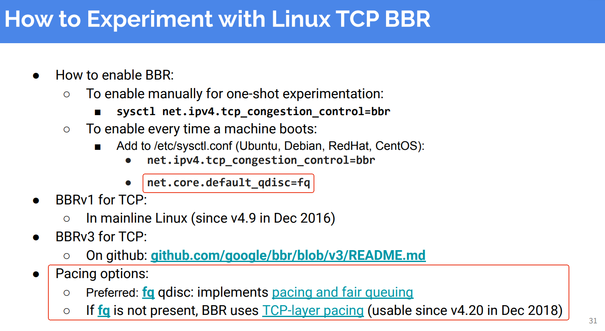

```
./configure.sh
./run_tests.sh
./graph_tests.sh
```

```
root@ubuntux86:# ls out/bufferbloat/
bbr1:2  bbr:2  cubic:2
root@ubuntux86:# pwd
/work/test/nsperf
root@ubuntux86:# ls out/bufferbloat/
bbr1:2  bbr:2  cubic:2
root@ubuntux86:# ls out/
bufferbloat  coexist  ecn_bulk  random_loss  shallow
root@ubuntux86:# 

```