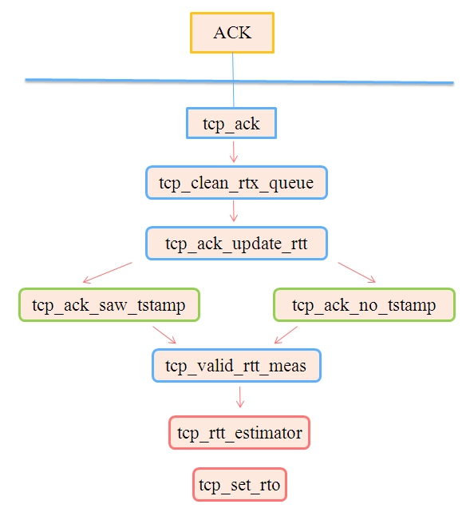

#  tcp rtt采样

```
root@tango-rac01 tools]# ss -ti
State       Recv-Q Send-Q                                      Local Address:Port                                                       Peer Address:Port                
ESTAB       0      0                                         192.168.112.135:ssh                                                       192.168.112.1:56505                
         cubic wscale:8,9 rto:241 rtt:40.225/0.997 ato:74 mss:1448 cwnd:10 bytes_acked:152109 bytes_received:12047 segs_out:733 segs_in:816 send 2.9Mbps lastsnd:41 lastrcv:137 pacing_rate 5.8Mbps rcv_rtt:28 rcv_space:28960


```
其中有rtt:40.225/0.997数据，表示RTT均值和中位数   


```text

看一组 RTT 采样：9，10，11，9，28，12，9，3，10，11，.... 这组样本对目前TCP RTT 采集会有什么影响？

样本 28 会拉高 srtt，虽然移动指数平均会平滑些许，但还是会拉高。  
样本 3 会被 minrtt 记录，造成类 BBR，Vegas 算法对带宽的高估。    
肉眼看一眼就能排除 28 和 3，但在算法离散采样过程中如何识别？势必要进行更精细粒度的观测。  
```
   

> ## 如何估计RTT
如何估计RTT：
        1. RTT是变化的，需要实时测量从发出某个报文段到收到其确认报文段之间经过的时间（称SampleRTT）   
        2. 由于SampleRTT波动很大，更有意义的是计算其平均值（称EstimatedRTT）   
        3. 平均RTT的估算方法（指数加权移动平均）：   
            * $EstimatedRTT = (1- α)*EstimatedRTT + α*SampleRTT$   
            * 典型地，α=0.125   
        4. 估算SampleRTT 与 EstimatedRTT的偏差（称DevRTT）：
            * $DevRTT = (1-β)*DevRTT + β*|SampleRTT - EstimatedRTT|$    
            * 典型地，β= 0.25    
        5. 设置重传定时器的超时值：$TimeoutInterval = EstimatedRTT + 4*DevRTT$     

```
{
    SampleRTT -= (EstimatedRTT >> 3);
    EstimatedRTT += SampleRTT;
    if (SampleRTT < 0) 
        SampleRTT = -SampleRTT;
    SampleRTT -= (Deviation >> 3);
    Deviation += SampleRTT;
    TimeOut = (EstimatedRTT >> 3) + (Deviation >> 1);
}
```		
> ## RTT测量方法

每发送一个分组，TCP都会进行RTT采样，这个采样并不会每一个数据包都采样，同一时刻发送的数据包中，只会针对一个数据包采样，这个采样数据被记为sampleRTT，用它来代表所有的RTT。采样的方法一般有两种：   
TCP Timestamp选项：在TCP选项中添加时间戳选项，发送数据包的时候记录下时间，收到数据包的时候计算当前时间和时间戳的差值就能得到RTT。这个方法简单并且准确，但是需要发送段和接收端都支持这个选项。     

重传队列中数据包的TCP控制块：每个数据包第一次发送出去后都会放到重传队列中，数据包中的TCP控制块包含着一个变量，tcp_skb_cb->when，记录了该数据包的第一次发送时间。如果没有时间戳选项，那么RTT就等于当前时间和when的差值。     
linux内核中，更新rtt的函数为tcp_ack_update_rtt：   

#   tcp 发送    

> ## 滑动窗口


```
//检查这一次要发送的报文最大序号是否超出了发送滑动窗口大小
static inline int tcp_snd_wnd_test(struct tcp_sock *tp, struct sk_buff *skb, unsigned int cur_mss)
{
    //end_seq待发送的最大序号
    u32 end_seq = TCP_SKB_CB(skb)->end_seq;

    if (skb->len > cur_mss)
      end_seq = TCP_SKB_CB(skb)->seq + cur_mss;

    //snd_una是已经发送过的数据中，最小的没被确认的序号；而snd_wnd就是发送窗口的大小
    return !after(end_seq, tp->snd_una + tp->snd_wnd);
}
```

> ##  慢启动和拥塞窗口

首先用unsigned int tcp_cwnd_test方法检查飞行的报文数是否小于拥塞窗口个数（多少个MSS的个数）

```
static inline unsigned int tcp_cwnd_test(struct tcp_sock *tp, struct sk_buff *skb)
{
    u32 in_flight, cwnd;

    /* Don't be strict about the congestion window for the final FIN.  */
    if (TCP_SKB_CB(skb)->flags & TCPCB_FLAG_FIN)
        return 1;

    //飞行中的数据，也就是没有ACK的字节总数
    in_flight = tcp_packets_in_flight(tp);
    cwnd = tp->snd_cwnd;
    //如果拥塞窗口允许，需要返回依据拥塞窗口的大小，还能发送多少字节的数据
    if (in_flight < cwnd)
        return (cwnd - in_flight);

    return 0;
}

```
再通过tcp_window_allows方法获取拥塞窗口与滑动窗口的最小长度，检查待发送的数据是否超出   

```
static unsigned int tcp_window_allows(struct tcp_sock *tp, struct sk_buff *skb, unsigned int mss_now,unsigned int cwnd)
{
    u32 window, cwnd_len;

    window = (tp->snd_una + tp->snd_wnd - TCP_SKB_CB(skb)->seq);
    cwnd_len = mss_now * cwnd;
    return min(window, cwnd_len);
}
```


# TCP传输速率估算

如下公式，带宽取值为计算得出的数据传输速率与接收ACK速率两者之间的较小值。通常情况下，传输速率（send_rate-发送并得到确认的数据速率）将大于ACK接收速率（ack_rate），但是，在面对ACK压缩等的情况下，将导致ACK接收速率意外的增大，此时，带宽应选取传输速率（send_rate）。
```
    send_rate = #pkts_delivered/(last_snd_time - first_snd_time)
    ack_rate  = #pkts_delivered/(last_ack_time - first_ack_time)
    bw = min(send_rate, ack_rate)
```


计算 rate sample (tcp_rate_gen)    
如上图所示, 每当收到 ack, 协议栈就会计算出一个 rate sample. 其中rs->delivered没有异议, 而rs->interval取的是 snd_us 和 ack_us 的较大值. 前者是的意义是通过 send pipeline 估计速率，后者是通过 ack pipeline 估计.

关于这一点, 在文件开头的注释中有解释

```
 /* The bandwidth estimator estimates the rate at which the network
     * can currently deliver outbound data packets for this flow. At a high
     * level, it operates by taking a delivery rate sample for each ACK.
     *
     * A rate sample records the rate at which the network delivered packets
     * for this flow, calculated over the time interval between the transmission
     * of a data packet and the acknowledgment of that packet.
    */
```
意思是 bandwidth estimator 会同时使用两种 interval 进行计算: 1.使用发送时的时刻计算 2.通过ack到达的时刻计算


```
* Specifically, over the interval between each transmit and corresponding ACK,
     * the estimator generates a delivery rate sample. Typically it uses the rate
     * at which packets were acknowledged. However, the approach of using only the
     * acknowledgment rate faces a challenge under the prevalent ACK decimation or
     * compression: packets can temporarily appear to be delivered much quicker
     * than the bottleneck rate. Since it is physically impossible to do that in a
     * sustained fashion, when the estimator notices that the ACK rate is faster
     * than the transmit rate, it uses the latter:
     *    send_rate = #pkts_delivered/(last_snd_time - first_snd_time)
     *    ack_rate  = #pkts_delivered/(last_ack_time - first_ack_time)
     *    bw = min(send_rate, ack_rate
```
一般说来, 我们使用 ack到达的时刻计算. 但有一种特别的情况，就是当出现 ack compression 时(一个 ack 应答多个 skb), 这个时候用 ack_us 当做 interval 就可能出现计算出的带宽超过 bottleneck rate (物理链路的极限). 因此, 这种情况下, 内核使用 snd_us 进行计算, 对应上面最后一张图的 ack4。    


```
class RateSample:
    """
    The class rate sample used for estimation of delivery rate
    Y. Cheng, N. Cardwell, S. Hassas Yeganeh, V.Jacvobson 
    draft-cheng-iccrg-delivery-rate-estimation-02
    """
    def __init__(self):
        self.delivery_rate = 0
        self.delivered = 0
        self.prior_delivered = 0
        self.prior_time = 0
        self.newly_acked = 0
        self.last_acked = 0
        self.delivery_rate = 0
        self.send_rate = 0
        self.ack_rate = 0
        self.interval = 0
        self.ack_elapsed = 0
        self.send_elapsed = 0
        self.minRTT = 10
        self.rtt = -1
        self.lost = 0
        self.is_app_limited = False
        self.newly_lost = 0
        self.full_lost = 0
        self.prior_lost = 0
        self.tx_in_flight = -1
        
    def send_packet(self, packet, C, packets_in_flight, current_time):
        if (packets_in_flight == 0):
            C.first_sent_time = current_time
            C.delivered_time  = current_time
        packet.first_sent_time = C.first_sent_time
        packet.delivered_time = C.delivered_time
        packet.delivered = C.delivered
        packet.lost = C.lost
        packet.is_app_limited = (C.is_app_limited != 0)
        
    def updaterate_sample(self, packet, C ,current_time):
        if packet.delivered_time == 0:
            return # packet already sacked
        C.delivered += packet.size
        C.delivered_time = current_time
        if (packet.delivered >= self.prior_delivered):
            self.prior_delivered = packet.delivered
            if not packet.self_lost:
                self.send_elapsed = packet.time - packet.first_sent_time
                self.ack_elapsed = C.delivered_time - packet.delivered_time
                self.prior_time = packet.delivered_time
            self.is_app_limited = packet.is_app_limited
            self.tx_in_flight = packet.tx_in_flight
            C.first_sent_time = packet.time
        
        packet.delivered_time = 0

    def update_sample_group(self, C, minRTT = -1):
        self.rtt = minRTT
        self.newly_lost = C.lost - self.prior_lost
        self.prior_lost = C.lost
        # print(f"BBRS ack_elpased{self.ack_elapsed}, send_elapsed{self.send_elapsed}")
        if(C.is_app_limited and C.delivered > C.is_app_limited):
                C.is_app_limited = 0
        
        self.minRTT = minRTT
        self.delivered = C.delivered - self.prior_delivered
        self.interval = max(self.ack_elapsed, self.send_elapsed)
        if(self.interval < self.minRTT):
            self.interval = -1
            return False
        self.delivery_rate = self.delivered / self.interval
        # print(f"BBRState interval {self.interval}, rtt {self.minRTT}, delivered {self.delivered}, {self.prior_delivered} {self.prior_time} delivery_rate {self.delivery_rate}")
        return True
```

> ## 发送报文速率记录
如下函数tcp_rate_skb_sent记录下发送的skb相关信息，之后，当接收到ACK（SACK）确认报文时，根据这些信息生成速率采样。首先，看一下采样周期，当packets_out为零时，表明网络中没有报文，所有发送的报文都已经被确认，从这一刻起，是合适的时间点，记录之后报文的发送时间，在接收到相应的ACK报文后，计算报文在网络中的传播时间，即要采样的间隔。

这里使用packets_out而不是tcp_packets_in_flight函数的结果，因为后者是基于RTO和丢失检测而得出的网络中的报文数量，过早的RTO的发生，以及激进的丢失检测，将导致采样间隔缩短，进而造成带宽估算的过高。
```
void tcp_rate_skb_sent(struct sock *sk, struct sk_buff *skb)
{
    struct tcp_sock *tp = tcp_sk(sk);

     /* In general we need to start delivery rate samples from the
      * time we received the most recent ACK, to ensure we include
      * the full time the network needs to deliver all in-flight
      * packets. If there are no packets in flight yet, then we
      * know that any ACKs after now indicate that the network was
      * able to deliver those packets completely in the sampling
      * interval between now and the next ACK.
      *
      * Note that we use packets_out instead of tcp_packets_in_flight(tp)
      * because the latter is a guess based on RTO and loss-marking
      * heuristics. We don't want spurious RTOs or loss markings to cause
      * a spuriously small time interval, causing a spuriously high
      * bandwidth estimate.
      */
    if (!tp->packets_out) {
        u64 tstamp_us = tcp_skb_timestamp_us(skb);

        tp->first_tx_mstamp  = tstamp_us;
        tp->delivered_mstamp = tstamp_us;
    }
```
反之，如果packets_out不为空，将套接口之前的记录值赋予发送报文结构中。函数tcp_rate_check_app_limited用于检测是否由于应用发送的数据不足，导致的发送受限，稍后介绍。注意这里的变量
first_tx_mstamp和delivered_mstamp，二者记录了本次速率采用的起点，在同一个采样窗口内的后续发送报文中，保存相同的起点时间戳值。

TCP控制块中的tx.first_tx_mstamp保存发送速率采样周期的开始时间戳，用于后续计算发送速率。

***TCP控制块中的tx.delivered保存当前套接口在发送此报文时，已经成功传输的报文数量。而TCP控制块中的tx.delivered_mstamp记录了成功发送tx.delivered报文时的时间戳，也即初始的确认tx.delivered数据的ACK报文到达的时间戳，随后用于计算ACK速率***。

```
    TCP_SKB_CB(skb)->tx.first_tx_mstamp = tp->first_tx_mstamp;
    TCP_SKB_CB(skb)->tx.delivered_mstamp    = tp->delivered_mstamp;
    TCP_SKB_CB(skb)->tx.delivered       = tp->delivered;
    TCP_SKB_CB(skb)->tx.is_app_limited  = tp->app_limited ? 1 : 0;
}
```
以上函数tcp_rate_skb_sent在内核中有两处调用，分别是报文发送和重传函数。如下发送函数__tcp_transmit_skb中，报文成功发送之后，调用tcp_rate_skb_sent函数，更新速率信息。但是，对于ACK报文等，这里oskb为空，不处理。
```
static int __tcp_transmit_skb(struct sock *sk, struct sk_buff *skb,
                  int clone_it, gfp_t gfp_mask, u32 rcv_nxt)
{

    err = icsk->icsk_af_ops->queue_xmit(sk, skb, &inet->cork.fl);

    if (unlikely(err > 0)) {
        tcp_enter_cwr(sk);
        err = net_xmit_eval(err);
    }
    if (!err && oskb) {
        tcp_update_skb_after_send(sk, oskb, prior_wstamp);
        tcp_rate_skb_sent(sk, oskb);
    }
```
多数情况下，报文重传函数调用tcp_transmit_skb进行报文发送，其内部封装了以上的发送函数。但是如果skb的数据缓存出现对其问题，或者校验的起始位置太靠后的话，虽然也是使用tcp_transmit_skb发送报文，但是，不在其内部更新报文速率信息，也是在这里进行更新，调用tcp_rate_skb_sent函数。
```
int __tcp_retransmit_skb(struct sock *sk, struct sk_buff *skb, int segs)
{
    ...
    if (unlikely((NET_IP_ALIGN && ((unsigned long)skb->data & 3)) ||
             skb_headroom(skb) >= 0xFFFF)) {
        struct sk_buff *nskb;

        tcp_skb_tsorted_save(skb) {
            nskb = __pskb_copy(skb, MAX_TCP_HEADER, GFP_ATOMIC);
            err = nskb ? tcp_transmit_skb(sk, nskb, 0, GFP_ATOMIC) : -ENOBUFS;
        } tcp_skb_tsorted_restore(skb);

        if (!err) {
            tcp_update_skb_after_send(sk, skb, tp->tcp_wstamp_ns);
            tcp_rate_skb_sent(sk, skb);
        }
    } else {
        err = tcp_transmit_skb(sk, skb, 1, GFP_ATOMIC);
```
 
> ## 报文传输时长
函数tcp_rate_skb_delivered用于计算报文的传输时间，当接收到ACK报文时，调用此函数进行处理。如果delivered_mstamp为空，表明此报文发送时没有记录时间戳，不进行处理。
```
void tcp_rate_skb_delivered(struct sock *sk, struct sk_buff *skb, struct rate_sample *rs)
{
    struct tcp_sock *tp = tcp_sk(sk);
    struct tcp_skb_cb *scb = TCP_SKB_CB(skb);

    if (!scb->tx.delivered_mstamp)
        return;
```

对于确认多个skb的ACK报文（Stretched-Acks），此函数将被调用多次（每个确认报文调用一次），这里使用这些确认报文中最近发送的报文的时间信息，即tx.delivered时间较大的报文，使用其信息生成速率采样rate_sample。

并且，使用此报文的时间戳，更新套接口first_tx_mstamp时间戳变量，开始新的发送速率采样窗口。随后，计算此时结束的上一个发送速率采样阶段的长度，即最近确认的报文的发送时间戳，减去最早发送的报文的时间戳（采样周期的开始时间），得到发送阶段的时长。
```
    if (!rs->prior_delivered ||
        after(scb->tx.delivered, rs->prior_delivered)) {
        rs->prior_delivered  = scb->tx.delivered;
        rs->prior_mstamp     = scb->tx.delivered_mstamp;
        rs->is_app_limited   = scb->tx.is_app_limited;
        rs->is_retrans       = scb->sacked & TCPCB_RETRANS;

        /* Record send time of most recently ACKed packet: */
        tp->first_tx_mstamp  = tcp_skb_timestamp_us(skb);
        /* Find the duration of the "send phase" of this window: */
        rs->interval_us = tcp_stamp_us_delta(tp->first_tx_mstamp, scb->tx.first_tx_mstamp);

    }
 
```
最后，如果报文被SACK所确认，清空其tx.delivered_mstamp时间戳。反之，在之后接收到ACK确认时，再次使用此报文信息计算速率。参见本函数tcp_rate_skb_delivered开头，delivered_mstamp为零的报文，不参与处理。
```
    /* Mark off the skb delivered once it's sacked to avoid being
     * used again when it's cumulatively acked. For acked packets
     * we don't need to reset since it'll be freed soon.
     */
    if (scb->sacked & TCPCB_SACKED_ACKED)
        scb->tx.delivered_mstamp = 0;
```
以上函数tcp_rate_skb_delivered在SACK的处理和ACK确认报文的处理中都由调用，首先看一下在SACK处理过程中的使用。函数tcp_sacktag_walk遍历skb开始的重传队列，如果判断队列中的某个skb的数据位于SACK序号块之内（tcp_match_skb_to_sack），即SACK确认了此报文，调用以上函数tcp_rate_skb_delivered进行处理。

另外，如果in_sack小于等于零，表明SACK没有完全包含当前SKB的数据，由函数tcp_shift_skb_data处理部分交叉的情况。
```
static struct sk_buff *tcp_sacktag_walk(struct sk_buff *skb, struct sock *sk,
                    struct tcp_sack_block *next_dup, struct tcp_sacktag_state *state,
                    u32 start_seq, u32 end_seq, bool dup_sack_in)
{
    skb_rbtree_walk_from(skb) {
        ...
        if (in_sack <= 0) {
            tmp = tcp_shift_skb_data(sk, skb, state, start_seq, end_seq, dup_sack);
            ...
        }
        if (unlikely(in_sack < 0)) break;

        if (in_sack) {
            TCP_SKB_CB(skb)->sacked = tcp_sacktag_one(sk, state,
                TCP_SKB_CB(skb)->sacked, TCP_SKB_CB(skb)->seq, TCP_SKB_CB(skb)->end_seq,
                dup_sack,
                tcp_skb_pcount(skb), tcp_skb_timestamp_us(skb));
            tcp_rate_skb_delivered(sk, skb, state->rate);
```

对于部分数据被确认的skb，使用函数tcp_shifted_skb将此部分数据分离出来，尝试与之前已经被SACK确认的报文进行合并。虽然只有部分数据被确认，也表明此报文完成了传输，使用其更新速率信息（见函数tcp_rate_skb_delivered）。
```
static bool tcp_shifted_skb(struct sock *sk, struct sk_buff *prev,
                struct sk_buff *skb, struct tcp_sacktag_state *state,
                unsigned int pcount, int shifted, int mss, bool dup_sack)
{
    struct tcp_sock *tp = tcp_sk(sk);
    u32 start_seq = TCP_SKB_CB(skb)->seq;   /* start of newly-SACKed */
    u32 end_seq = start_seq + shifted;  /* end of newly-SACKed */

    BUG_ON(!pcount);

    /* Adjust counters and hints for the newly sacked sequence
     * range but discard the return value since prev is already
     * marked. We must tag the range first because the seq
     * advancement below implicitly advances
     * tcp_highest_sack_seq() when skb is highest_sack.
     */
    tcp_sacktag_one(sk, state, TCP_SKB_CB(skb)->sacked,
            start_seq, end_seq, dup_sack, pcount,
            tcp_skb_timestamp_us(skb));
    tcp_rate_skb_delivered(sk, skb, state->rate);
```
最后，看一下ACK报文相关的速率处理，参见以下函数tcp_clean_rtx_queue，无论报文是完全被确认，还是部分确认，都使用函数tcp_rate_skb_delivered更新速率信息。fully_acked在之后进行。
```
static int tcp_clean_rtx_queue(struct sock *sk, u32 prior_fack,
                   u32 prior_snd_una, struct tcp_sacktag_state *sack)
{
    for (skb = skb_rb_first(&sk->tcp_rtx_queue); skb; skb = next) {

        ...
        tp->packets_out -= acked_pcount;
        pkts_acked += acked_pcount;
        tcp_rate_skb_delivered(sk, skb, sack->rate);
        ...
        if (!fully_acked)
            break;
```
> ## 生成速率样本
以上的函数SACK和ACK报文处理函数都是在tcp_ack函数中调用，在tcp_ack函数最后，调用tcp_rate_gen生成速率样本。在此之前，由函数tcp_newly_delivered计算ACK报文确认的报文数量。函数tcp_rate_gen的第三个参数lost表示新推倒出来的丢失报文数量（进行了标记）。

函数tcp_ack的最后，调用拥塞控制函数tcp_cong_control，目前只有BBR拥塞算法在使用速率样本。
```
static int tcp_ack(struct sock *sk, const struct sk_buff *skb, int flag)
{
    struct rate_sample rs = { .prior_delivered = 0 };
    bool is_sack_reneg = tp->is_sack_reneg;
	u32 lost = tp->lost;
	u32 delivered = tp->delivered;
	
	sack_state.rate = &rs;
	rs.prior_in_flight = tcp_packets_in_flight(tp);

    if ((flag & (FLAG_SLOWPATH | FLAG_SND_UNA_ADVANCED)) ==
        FLAG_SND_UNA_ADVANCED) {
        ...
    } else {
        ...
        if (TCP_SKB_CB(skb)->sacked)
            flag |= tcp_sacktag_write_queue(sk, skb, prior_snd_una, &sack_state);
        ...
    }
    ...
    /* See if we can take anything off of the retransmit queue. */
    flag |= tcp_clean_rtx_queue(sk, prior_fack, prior_snd_una, &sack_state);
    ...
    delivered = tcp_newly_delivered(sk, delivered, flag);
    lost = tp->lost - lost;         /* freshly marked lost */
    rs.is_ack_delayed = !!(flag & FLAG_ACK_MAYBE_DELAYED);
    tcp_rate_gen(sk, delivered, lost, is_sack_reneg, sack_state.rate);
	tcp_cong_control(sk, ack, delivered, flag, sack_state.rate);
```
如下函数tcp_newly_delivered，使用当前套接口中更新的delivered计数减去之前的旧值prior_delivered，得到本次ACK处理，确认的报文数量。
```
/* Returns the number of packets newly acked or sacked by the current ACK */
static u32 tcp_newly_delivered(struct sock *sk, u32 prior_delivered, int flag)
{
    delivered = tp->delivered - prior_delivered;
    NET_ADD_STATS(net, LINUX_MIB_TCPDELIVERED, delivered);
    ...
    return delivered;
```
如下速率样本生成函数tcp_rate_gen，在发送报文数量超过应用程序限制点时，清零app_limited。之后，保存本次确认（ACK & SACK）报文数量到速率样本结构rate_sample中，保存新评估的丢失报文数量。

如果delivered有值，表明ACK报文确认了新的数据，更新确认数据的时间戳为当前时间。
```
void tcp_rate_gen(struct sock *sk, u32 delivered, u32 lost, bool is_sack_reneg, struct rate_sample *rs)
{
    struct tcp_sock *tp = tcp_sk(sk);

    /* Clear app limited if bubble is acked and gone. */
    if (tp->app_limited && after(tp->delivered, tp->app_limited))
        tp->app_limited = 0;

    /* TODO: there are multiple places throughout tcp_ack() to get
     * current time. Refactor the code using a new "tcp_acktag_state"
     * to carry current time, flags, stats like "tcp_sacktag_state".
     */
    if (delivered)
        tp->delivered_mstamp = tp->tcp_mstamp;

    rs->acked_sacked = delivered;   /* freshly ACKed or SACKed */
    rs->losses = lost;      /* freshly marked lost */
```
 
如果没有记录报文确认时的时间戳，或者接收端删除了接收到的乱序报文，返回一个无效的速率样本。对于后一种情况，计算带宽时，会包含进了接收端删除的乱序报文，将导致对带宽的高估，这里选择返回无效速率样本。

需要注意的是，速率样本rate_sample结构的acked_sacked变量保存了本次接收的ACK报文新确认（S/ACK）的报文；而另一个变量rs->delivered保存的本次采样周期内确认的报文数量。
```
    /* Return an invalid sample if no timing information is available or
     * in recovery from loss with SACK reneging. Rate samples taken during
     * a SACK reneging event may overestimate bw by including packets that
     * were SACKed before the reneg.
     */
    if (!rs->prior_mstamp || is_sack_reneg) {
        rs->delivered = -1;
        rs->interval_us = -1;
        return;
    }
    rs->delivered = tp->delivered - rs->prior_delivered;
```
 
通常情况，对于一个发送窗口期，ACK接收的时长大于数据发送的时长，正如开始所述，这导致计算的ACK接收速率小于数据发送速率。但是考虑到ACK压缩的情况，安全的选择是将interval_us设置为两个时间段之间的较大值。
```
    /* Model sending data and receiving ACKs as separate pipeline phases
     * for a window. Usually the ACK phase is longer, but with ACK
     * compression the send phase can be longer. To be safe we use the
     * longer phase.
     */
    snd_us = rs->interval_us;               /* send phase */
    ack_us = tcp_stamp_us_delta(tp->tcp_mstamp, rs->prior_mstamp); /* ack phase */
    rs->interval_us = max(snd_us, ack_us);

    /* Record both segment send and ack receive intervals */
    rs->snd_interval_us = snd_us;
    rs->rcv_interval_us = ack_us;
```	
	

如果interval_us小于RTT的最小值，很有可能带宽会估算过高，将其设置为无效值。
```
    /* Normally we expect interval_us >= min-rtt.
     * Note that rate may still be over-estimated when a spuriously
     * retransmistted skb was first (s)acked because "interval_us"
     * is under-estimated (up to an RTT). However continuously
     * measuring the delivery rate during loss recovery is crucial
     * for connections suffer heavy or prolonged losses.
     */
    if (unlikely(rs->interval_us < tcp_min_rtt(tp))) {
        if (!rs->is_retrans)
            pr_debug("tcp rate: %ld %d %u %u %u\n",
                 rs->interval_us, rs->delivered, inet_csk(sk)->icsk_ca_state,
                 tp->rx_opt.sack_ok, tcp_min_rtt(tp));
        rs->interval_us = -1;
        return;
    }
```
如果app_limited为空，记录的速率为应用程序不限制的速率。否则，app_limited有值，如果当前的速率大于记录的速率（rate_delivered/rate_interval_us），进行速率更新。
```
    /* Record the last non-app-limited or the highest app-limited bw */
    if (!rs->is_app_limited ||
        ((u64)rs->delivered * tp->rate_interval_us >=
         (u64)tp->rate_delivered * rs->interval_us)) {
        tp->rate_delivered = rs->delivered;
        tp->rate_interval_us = rs->interval_us;
        tp->rate_app_limited = rs->is_app_limited;
    }
```

> ## 应用层限制
如下函数tcp_rate_check_app_limited，如果套接口发送缓存中的数据长度小于MSS值； 并且，本机Qdisc队列/网卡发送队列中没有数据（小于数据长度为1的SKB所占用的空间）； 并且，发送到网络中的报文数量小于拥塞窗口（并非拥塞窗口限制了报文发送）； 并且，所有丢失报文都已经被重传，当满足以上的所有条件时，认为套接口的发送受限于应用程序。    

如果确认报文数量与网络中报文数量之和大于零，将结果赋予变量app_limited，否则app_limited赋值为一。可见，app_limited一方面表示数据发送是否收到了应用层的限制，另一方面，其表示受限发生时的发送的报文数量。       
```
/* If a gap is detected between sends, mark the socket application-limited. */
void tcp_rate_check_app_limited(struct sock *sk)
{
    struct tcp_sock *tp = tcp_sk(sk);

    if (/* We have less than one packet to send. */
        tp->write_seq - tp->snd_nxt < tp->mss_cache &&
        /* Nothing in sending host's qdisc queues or NIC tx queue. */
        sk_wmem_alloc_get(sk) < SKB_TRUESIZE(1) &&
        /* We are not limited by CWND. */
        tcp_packets_in_flight(tp) < tp->snd_cwnd &&
        /* All lost packets have been retransmitted. */
        tp->lost_out <= tp->retrans_out)
        tp->app_limited = (tp->delivered + tcp_packets_in_flight(tp)) ? : 1;
```
在以上tcp_rate_gen函数中，如果delivered的值已经超过记录的app_limited值，将其清零。
```
void tcp_rate_gen(struct sock *sk, u32 delivered, u32 lost,
          bool is_sack_reneg, struct rate_sample *rs)
{
    struct tcp_sock *tp = tcp_sk(sk);
    u32 snd_us, ack_us;

    /* Clear app limited if bubble is acked and gone. */
    if (tp->app_limited && after(tp->delivered, tp->app_limited))
        tp->app_limited = 0;
```
检查函数的调用发生在TCP与应用层接口的报文发送函数中，如下tcp_sendpage_locked和tcp_sendmsg_locked函数。
```
int tcp_sendpage_locked(struct sock *sk, struct page *page, int offset,
            size_t size, int flags)
{
    ...
    tcp_rate_check_app_limited(sk);  /* is sending application-limited? */
    ...	
}
int tcp_sendmsg_locked(struct sock *sk, struct msghdr *msg, size_t size)
{
    ...
    tcp_rate_check_app_limited(sk);  /* is sending application-limited? */
```

> # struct rate_sample
[BBR算法中轮数计算方法](https://blog.csdn.net/qq_40894952/article/details/80626622)      
```
struct rate_sample {
        struct skb_mstamp prior_mstamp; /* starting timestamp for interval */ 
        u32 prior_delivered;/* tp->delivered at "prior_mstamp" */ 
        s32 delivered;/* number of packets delivered over interval */ 
        long interval_us;/* time for tp->delivered to incr "delivered" */ 
        long rtt_us; /* RTT of last (S)ACKed packet (or -1) */ 
        int  losses; /* number of packets marked lost upon ACK */
        u32  acked_sacked;	/* number of packets newly (S)ACKed upon ACK */
        u32  prior_in_flight;	/* in flight before this ACK */
        bool is_app_limited;	/* is sample from packet with bubble in pipe? */
        bool is_retrans;	/* is sample from retransmission? */
}
 
```

 Maintain 1-round-trip max of delivered bandwidth =(rs->delivered/rs->interval_us)    
 
