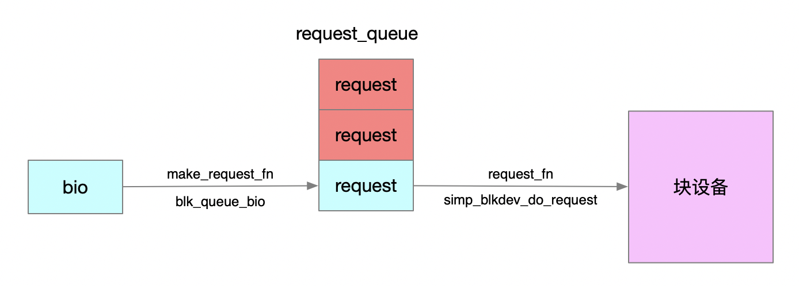
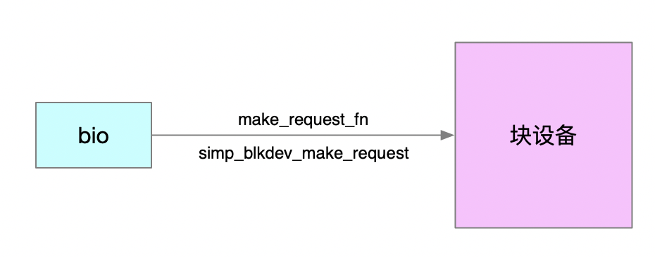
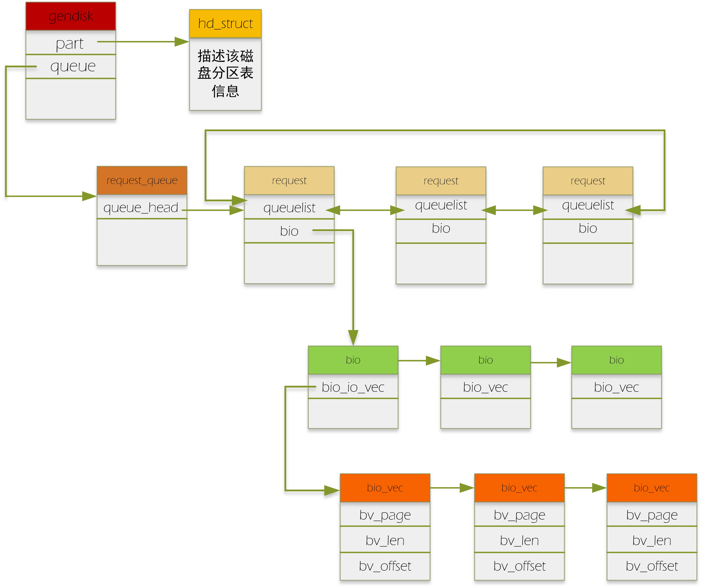

# insmod  blk_test.ko 

```
insmod  blk_test.ko 
ls /dev/simp_blkdev 
mkfs.ext4 /dev/simp_blkdev
mkdir /mnt/data -p 
mount /dev/simp_blkdev  /mnt/data
```

```
[root@centos7 block]# insmod  blk_test.ko 
[root@centos7 block]# ls /dev/simp_blkdev 
/dev/simp_blkdev
[root@centos7 block]# mkfs.ext4 /dev/simp_blkdev 
mke2fs 1.42.9 (28-Dec-2013)
Filesystem label=
OS type: Linux
Block size=1024 (log=0)
Fragment size=1024 (log=0)
Stride=0 blocks, Stripe width=0 blocks
1024 inodes, 4096 blocks
204 blocks (4.98%) reserved for the super user
First data block=1
Maximum filesystem blocks=4194304
1 block group
8192 blocks per group, 8192 fragments per group
1024 inodes per group

Allocating group tables: done                            
Writing inode tables: done                            
Creating journal (1024 blocks): done
Writing superblocks and filesystem accounting information: done

[root@centos7 block]# mkdir /mnt/data -p
[root@centos7 block]# mount /dev/simp_blkdev  /mnt/data
[root@centos7 block]# cp udp_srv.c  /mnt/data/
[root@centos7 block]# cat /mnt/data/udp_srv.c 
```
##  simp_blkdev_do_request
 simp_blkdev_do_request   
 1.调用调度算法的elv_next_request方法获得下一个处理的request  
 2.如果是读，将simp_blkdev_data拷贝到request.buffer，  
 3.如果是写，将request.buffer拷贝到simp_blkdev_data  
 4.调用end_request通知完成  
 
## blk_init_queue

```
simp_blkdev_queue = blk_init_queue(simp_blkdev_do_request, NULL);//调用blk_init_queue

struct request_queue *blk_init_queue(request_fn_proc *rfn, spinlock_t *lock)
{
    return blk_init_queue_node(rfn, lock, NUMA_NO_NODE);//跳转1.5.1
}
EXPORT_SYMBOL(blk_init_queue);

//1.5.1
struct request_queue *
blk_init_queue_node(request_fn_proc *rfn, spinlock_t *lock, int node_id)
{
    struct request_queue *q;
    q = blk_alloc_queue_node(GFP_KERNEL, node_id, lock);
    if (!q)
        return NULL;

    q->request_fn = rfn;//也就是simp_blkdev_do_request
    if (blk_init_allocated_queue(q) < 0) {//转1.5.2
        blk_cleanup_queue(q);
        return NULL;
    }
    return q;
}
EXPORT_SYMBOL(blk_init_queue_node);

//1.5.2
int blk_init_allocated_queue(struct request_queue *q)
{
    ...
    blk_queue_make_request(q, blk_queue_bio);//转1.5.3
    if (elevator_init(q))//初始化IO调度算法
        goto out_exit_flush_rq;
    return 0;
    ...
}
EXPORT_SYMBOL(blk_init_allocated_queue);

//1.5.3
void blk_queue_make_request(struct request_queue *q, make_request_fn *mfn)
{
    ...
    q->make_request_fn = mfn;//mfn也就是blk_queue_bio
    ...
}
EXPORT_SYMBOL(blk_queue_make_request);

static blk_qc_t blk_queue_bio(struct request_queue *q, struct bio *bio)//完成bio如何插入到request_queue
{
    //IO调度算法发挥作用的地方
}
```
整个调用完成之后，会绑定当前块设备的request_queue两个重要方法  

```
q->make_request_fn = blk_queue_bio;//linux默认实现
q->request_fn = simp_blkdev_do_request;//驱动自己实现
```

1) make_request_fn(struct request_queue *q, struct bio *bio)  
submit_bio会调用make_request_fn将bio封装成request插入到request_queue，默认会使用linux系统实现的blk_queue_bio。如果我们替换make_request_fn，会导致IO调度算法失效，一般不会去改。  
2) request_fn(struct request_queue *q)
这个方法一般是驱动实现，也就是simp_blkdev_do_request，从request_queue中取出合适的request进行处理，一般会调用调度算法的elv_next_request方法，获得一个推荐的request。

 

#  no make_request

 

使用 blk_init_queue() 函数来初始化一个请求队列，默认会将请求队列的 make_request_fn 方法设置为内核缺省的处理函数 __make_request()。该函数会使用 IO 调度器将多个 bio 的访问顺序进行优化，整合，合并为一个请求放入请求队列。  

由于 ramdisk 不需要这个 IO 调度器,需要实现自己的 make_request_fn 函数，通过函数 blk_alloc_queue() 我们可以分配一个请求队列结构而不将 make_request_fn 方法设置为默认的处理函数 __make_request()。     

主要过程：  
①、 分配一个请求队列blk_alloc_queue();  
②、 为请求队列绑定 make_request_fn 方法  blk_queue_make_request();   


```
 blk_queue_make_request(ramdisk.queue, ramdisk_make_request_fn);

```


##  insmod  blk_test2.ko 
```
[root@centos7 block]# insmod  blk_test2.ko 
[root@centos7 block]# ls /dev/ramdisk 
/dev/ramdisk
[root@centos7 block]# mkfs.ext4 /dev/ramdisk 
mke2fs 1.42.9 (28-Dec-2013)
Filesystem label=
OS type: Linux
Block size=1024 (log=0)
Fragment size=1024 (log=0)
Stride=0 blocks, Stripe width=0 blocks
256 inodes, 2048 blocks
102 blocks (4.98%) reserved for the super user
First data block=1
Maximum filesystem blocks=2097152
1 block group
8192 blocks per group, 8192 fragments per group
256 inodes per group

Allocating group tables: done                            
Writing inode tables: done                            
Creating journal (1024 blocks): done
Writing superblocks and filesystem accounting information: done

You have new mail in /var/spool/mail/root
[root@centos7 block]# mount /dev/ramdisk  /mnt/data
[root@centos7 block]# cp blk_test2.
blk_test2.c      blk_test2.ko     blk_test2.mod.c  blk_test2.mod.o  blk_test2.o      
[root@centos7 block]# cp blk_test2.c /mnt/data/
[root@centos7 block]# cat /mnt/data/blk_test2.c 
```

# submit_bio

 

```
static int __blkdev_issue_zero_pages(struct block_device *bdev,
                sector_t sector, sector_t nr_sects, gfp_t gfp_mask,
                struct bio **biop)
{
        struct request_queue *q = bdev_get_queue(bdev);
        struct bio *bio = *biop;
        int bi_size = 0;
        unsigned int sz;

        if (!q)
                return -ENXIO;

        while (nr_sects != 0) {
                bio = next_bio(bio, __blkdev_sectors_to_bio_pages(nr_sects),
                               gfp_mask);
                bio->bi_iter.bi_sector = sector;
                bio_set_dev(bio, bdev);
                bio_set_op_attrs(bio, REQ_OP_WRITE, 0);

                while (nr_sects != 0) {
                        sz = min((sector_t) PAGE_SIZE, nr_sects << 9);
                        bi_size = bio_add_page(bio, ZERO_PAGE(0), sz, 0);
                        nr_sects -= bi_size >> 9;
                        sector += bi_size >> 9;
                        if (bi_size < sz)
                                break;
                }
                cond_resched();
        }

        *biop = bio;
        return 0;
}
```

```
/**
 * submit_bio - submit a bio to the block device layer for I/O
 * @bio: The &struct bio which describes the I/O
 *
 * submit_bio() is very similar in purpose to generic_make_request(), and
 * uses that function to do most of the work. Both are fairly rough
 * interfaces; @bio must be presetup and ready for I/O.
 *
 */
blk_qc_t submit_bio(struct bio *bio)
{
        /*
         * If it's a regular read/write or a barrier with data attached,
         * go through the normal accounting stuff before submission.
         */
        if (bio_has_data(bio)) {
                unsigned int count;

                if (unlikely(bio_op(bio) == REQ_OP_WRITE_SAME))
                        count = queue_logical_block_size(bio->bi_disk->queue) >> 9;
                else
                        count = bio_sectors(bio);

                if (op_is_write(bio_op(bio))) {
                        count_vm_events(PGPGOUT, count);
                } else {
                        task_io_account_read(bio->bi_iter.bi_size);
                        count_vm_events(PGPGIN, count);
                }

                if (unlikely(block_dump)) {
                        char b[BDEVNAME_SIZE];
                        printk(KERN_DEBUG "%s(%d): %s block %Lu on %s (%u sectors)\n",
                        current->comm, task_pid_nr(current),
                                op_is_write(bio_op(bio)) ? "WRITE" : "READ",
                                (unsigned long long)bio->bi_iter.bi_sector,
                                bio_devname(bio, b), count);
                }
        }

        return generic_make_request(bio);
}
EXPORT_SYMBOL(submit_bio);
```

# reference

[Linux block 层 - BIO拆分分析 (V5.4内核)](https://zhuanlan.zhihu.com/p/164884780)