# bio

> ## bio拆分和合并  

[linux block layer第二篇bio 的操作](https://blog.csdn.net/geshifei/article/details/120590183)   

> ## ctx和elevator_queue
其实ctx软件队列并不是必要的，kernel有很多可选的io调度器(elevator_queue)，例如：bpf、kyber、deadline，实现思想和cpu调度器类似。io调度器通过自定义的回调函数ops.insert_requests拿到新的request，使用一系列调度算法将request进行合并与重新排列，通过回调函数ops.dispatch_request输出最合适的request，跳过ctx机制，直接将request发送给磁盘。我认为ctx和elevator_queue两者是互相替代的关系，默认情况下使用ctx机制，在复杂的场景下可选择elevator_queue机制，举个例子，对于机械硬盘而言，磁头需要通过不停的旋转扫描盘片数据，我们总是希望多个request之间尽管不是连续的，但也尽量是一个顺序分布的关系，以减少磁盘旋转的范围，提高访问速度，在这种情况下，不同的io调度器提供的不同调度策略往往能起到更好的效果。 ctx和elevator_queue调度器本质上都是为了更高效的访问磁盘，殊途同归。具体io调度器的实现细节我也没看过，elevator_queue内部是否会用到ctx也不是很清楚，以后再来填这个坑吧。


插入：blk_mq_sched_insert_request -> ops.insert_requests

取出：__ blk_mq_sched_dispatch_requests -> blk_mq_do_dispatch_sched -> __ blk_mq_do_dispatch_sched -> ops.dispatch_request

将request发送给disk：__ blk_mq_do_dispatch_sched -> blk_mq_dispatch_rq_list -> .queue_rq
 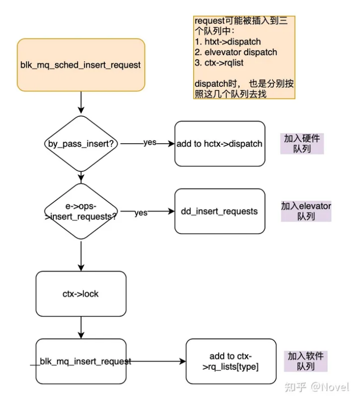   
 
  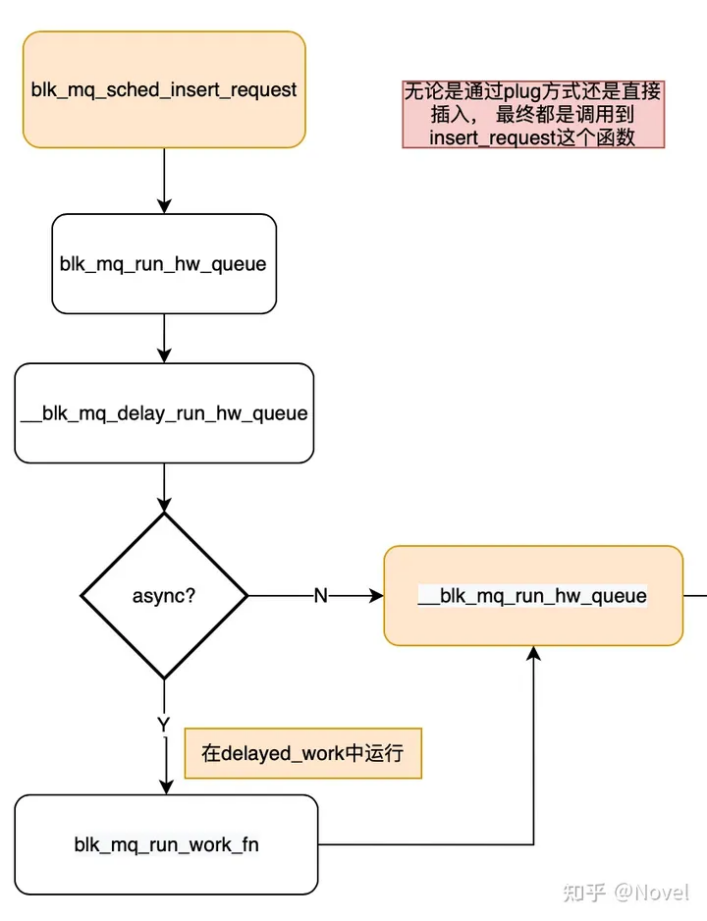  
   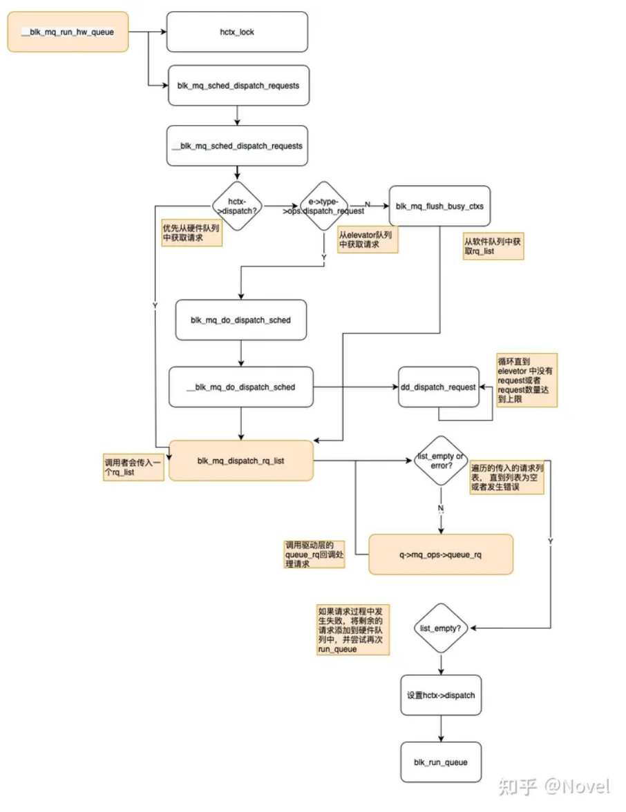  

> ## submit bio 路径 


blk_mq_submit_bio将bio提交给存储设备处理，bio经不同路径被提交至不同的链表，最终由器件的host controller处理。bio的处理路径见图1，图1遵循以下原则：   
  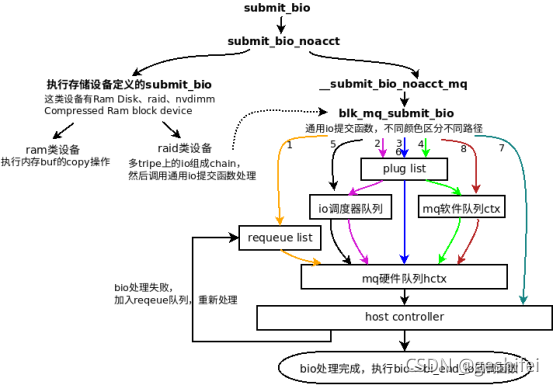
1）按照路径标号值从小到大顺序，决策路径流。   

2）io调度器队列、软件队列ctx是二选一关系。***若存储设备有调度器，则启用io调度器队列，否则启用软件队列ctx***。  

路径1：flush、fua类型且有数据需要传输的bio执行此路径流。这类bio需要尽快分发给器件处理，不能缓存在上层队列中，否则会因io调度等不可控因素导致该bio延迟处理。这类bio首先被加入requeu list，rq加入requeu list后立即唤醒高优先级的工作队列线程kbockd，将rq其从requeue list移至硬件队列hctx头，并执行blk_mq_run_hw_queue将rq分发给器件处理。引入requeue list是为了复用已有代码，尽量让block flush代码着眼于flush机制本身，外围工作交给已有代码，可以使代码独立、精简。   

路径2：io发起者执行了blk_start_plug（发起者预计接下来有多个io请求时，会执行此函数），且满足条件：“硬件队列数量为1”或者“存储设备定义了自己的commit_rqs函数”或者**“存储设备是旋转的机械磁盘”**，并且存储设备使用了io调度器，执行此路径流。这个场景是针对慢速存储设备的，将rq暂存至进程自己的plug list，然后将plug list中rq移至io调度器队列，由调度器选择合适的rq下发给器件处理。   

路径3：io发起者执行了blk_start_plug（发起者预计接下来有多个io请求时，会执行此函数），且硬件队列hctx不忙的情况下，执行此路径流。这种场景充分利用存储器件处理能力，将rq在进程级plug list中短暂暂存后，将plug list中的rq尽快地下发给处于不忙状态的器件处理。  

路径4：io发起者执行了blk_start_plug（发起者预计接下来有多个io请求时，会执行此函数），***且存储器件没有使用io调度器***、且硬件队列hctx处于busy状态，执行此路径流。这是一个通用场景，rq先在进程级的plug list缓存，然后存在软件队列ctx中，接着存至硬件队列hctx，最后分发给器件处理。   

路径5：存储设备存在io调度器，执行此路径流。rq被放入调度器队列，由调度器决定rq的处理顺序。既然存在io调度器，就把rq交给调度器处理吧。   

路径6：io发起者执行了blk_start_plug（发起者预计接下来有多个io请求时，会执行此函数），且存储设备设置了QUEUE_FLAG_NOMERGES（不允许合并io请求）、且没有io调度器，执行此路径流。这个场景下，仅做有限的合并，若bio与plug list中的rq可以合并则合并，否则就添加到plug中。plug list存在属于相同存储设备的rq，尝试将bio合并到plug list的rq，接着执行blk_mq_try_issue_directly将plug list中的rq发送到下层队列中，这体现了“有限合并”的含义，且只做一次合并，另外也意味着，任何时候，在plug list中只属于一个存储设备的rq有且只有一个。   

路径7：***未使用io调度器的前提下***，硬件队列数量大于1且io请求是同步请求，或者硬件队列hctx不忙，执行此路径流。io请求通过rq->q->mq_ops->queue_rq（nvme设备回调函数是nvme_queue_rq）分发至host controller。  

路径8：默认处理路径，上面路径条件都不满足，执行此路径流。这个路径是***没有io调度器的***（如果有调度器，执行路径5）。举些例子，在没有io调度器、没有启动plug list的前提下，执行该路径流：   

1）如果是emmc、ufs这些单队列设备，io请求就执行此路径流。   

2）***如果是nvme这类支持多硬件队列的设备***，io请求是异步的，执行此路径流。   

3）如果是nvme这类支持多硬件队列的设备，io请求是同步的，但硬件队列busy，执行此路径流。   

> ### plug

经过plug->mq_list往调度器或ctx->rq_lists下发、不经过plug->mq_list往调度器或ctx->rq_lists下发、直接往驱动下发。是否经过plug->mq_list即为是否支持PLUG/UNPLUG机制。   

> ###  hctx->dispatch
blk_mq_get_driver_tag本质还是调用blk_mq_get_tag()去硬件队列的blk_mq_tags结为req分配一个tag。该函数只是分配tag，没有分配req。blk_mq_get_driver_tag()存在的意义是:req派发给磁盘驱动时，遇到磁盘硬件队列繁忙，无法派送，则释放掉tag，req加入硬件hctx->dispatch链表异步派发。等再次派发时，就会执行blk_mq_get_driver_tag()为req分配一个tag。    

> ### blk_mq_try_issue_directly(直接下发路径)
   对于一些SSD盘或NVME盘，不希望进行PLUG/UNPLUG，且不需要调度层的合并和排序，因此直接下发驱动。
      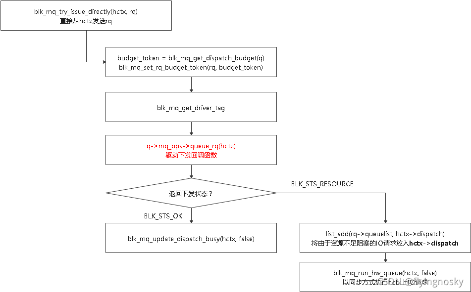  

直接下发会通过q->mq_ops->queue_rq()下发IO，但若由于资源不足（比如tag不够），会将当前IO请求放入hctx->dispatch链中。然后通过函数blk_mq_run_hw_queue()以同步方式执行hcxt上IO请求。


```
static int  __blk_mq_issue_directly(struct blk_mq_hw_ctx *hctx, struct request *rq)
{
   //根据req设置磁盘驱动 command,把req添加到q->timeout_list，并且启动q->timeout,把command复制到nvmeq->sq_cmds[]队列等等
	ret = q->mq_ops->queue_rq(hctx, &bd);
	switch (ret) {
	case BLK_MQ_RQ_QUEUE_OK://成功把req派发给磁盘硬件驱动
		blk_mq_update_dispatch_busy(hctx, false);//设置硬件队列不忙，看着就hctx->dispatch_busy = ewma
		break;
	case BLK_MQ_RQ_QUEUE_BUSY:
	case BLK_MQ_RQ_QUEUE_DEV_BUSY://这是遇到磁盘硬件驱动繁忙，req没有派送给驱动
		blk_mq_update_dispatch_busy(hctx, true);//设置硬件队列忙
        //硬件队列繁忙，则从tags->bitmap_tags或者breserved_tags中按照req->tag这个tag编号释放tag
		__blk_mq_requeue_request(rq);
		break;
	default:
        //标记硬件队列不忙
		blk_mq_update_dispatch_busy(hctx, false);
		break;
	}
  return ret;
}
```

req在派发给磁盘驱动时，磁盘驱动硬件繁忙，派发失败，则会把req加入硬件队列hctx->dispatch链表，然后把req的tag释放掉，则req->tag=-1，等空闲时派发该req。好的，空闲时间来了，再次派发该req，此时就需要执行blk_mq_get_driver_tag为req重新分配一个tag。一个req在派发给驱动时，必须分配一个tag
 

> ### IO调度器下发路径

 对于需要通过IO调度器中排序和合并的情况时，通过函数blk_mq_sched_insert_request(rq, false, true, true)将IO请求插入到IO调度器中（若没有定义IO调度器（***调度器类型为none***），将IO请求插入到ctx->rq_lists即每CPU的请求链表）。最终也通过函数blk_mq_run_hw_queue()以异步方式执行hctx中IO请求。
   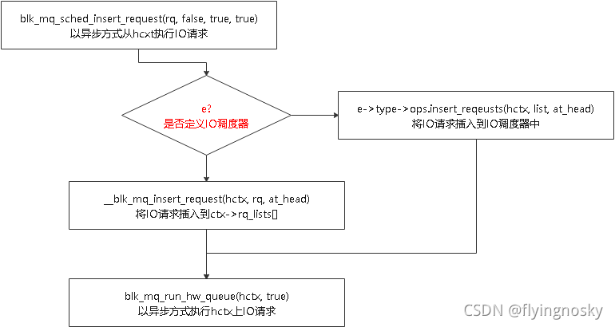   

> ### 函数blk_mq_run_hw_queue

+ 1 IO同步和异步下发方式   
IO同步下发为直接调用queue_rq()下发，待上一个IO下发后再进行下一个IO下发；IO异步下发为通过hctx的workqueue执行run_work，可以将多个work分别下发到不同的cpu上（异步work执行的CPU为hctx->cpumask中的一个，轮询机制，每个cpu执行的WORK数目为BLK_MQ_CPU_WORK_BATCH(8)），分别执行run_work，每个run_work最终会执行queue_rq()。

+ 2  无论是直接下发IO还是通过IO调度器下发，最终通过函数blk_mq_run_hw_queue()下发IO。   

函数blk_mq_run_hw_queue()简单流程如下所示：  
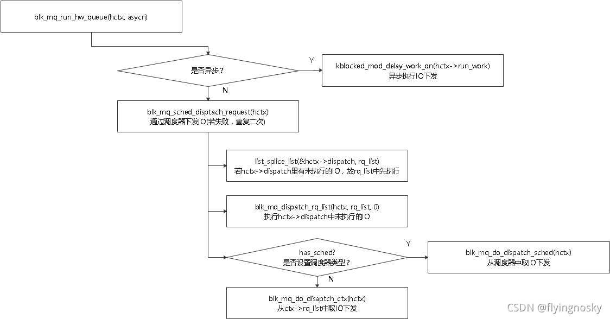   

1) 检查参数，若是异步，执行workqueue的run_work；   
2) 若是同步，先检查hctx->dispatch上（当资源不足时放入hctx->dispatch）是否存在未完成的IO，若存在执行未完成的IO；   
3) 执行步骤（2）后仍有IO待完成，检查是否定义调度器类型，若定义，从调度器中取IO下发，若没有定义，从ctx->rq_lists中取IO下发；  
4) 若hctx->dispatch上没有未完成的IO，执行步骤（3）     
 

> ### blk_mq_try_issue_directly pk blk_mq_run_hw_queue
blk_mq_try_issue_directly()类的req direct 派发是针对单个req的，blk_mq_run_hw_queue()是派发类软件队列ctx->rq_list、硬件hctx->dispatch链表、IO调度算法队列上的req的，这是二者最大的区别。
# mq


[linux内核block层Multi queue多队列核心点分析](https://blog.csdn.net/hu1610552336/article/details/111464548)
 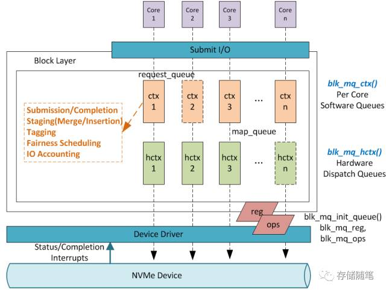
+ Multi-Queue Block Layer分为两层，Software Queues和Hardware Dispatch Queues.   
+ Softeware Queues是per core的，Queue的数目与协议有关系，比如NVMe协议，可以有最多64K对 IO SQ/CQ。Software Queues层做的事情如上图标识部分。   
+ Hardware Queues数目由底层设备驱动决定，可以1个或者多个。最大支持数目一般会与MSI-X中断最大数目一样，支持2K。
设备驱动通过map_queue维护Software Queues和Hardware Queues之间的对接关系。    
需要强调一点，Hardware Queues与Software Queues的数目不一定相等，上图1:1 Mapping的情况属于最理想的情况。
 
 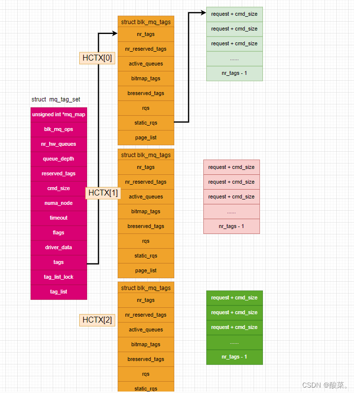
 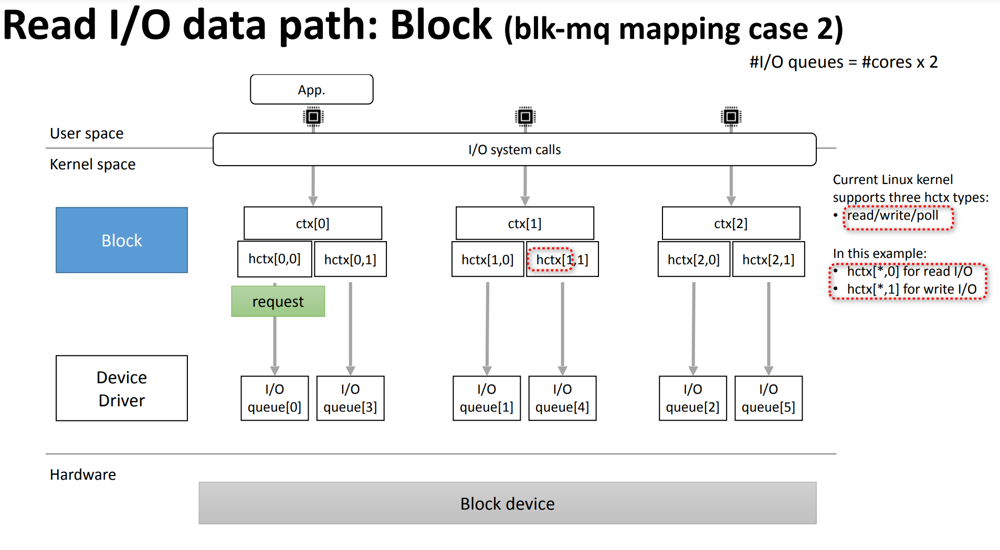
 
 
> ## 单队列 generic_make_request pk 多对列 blk_mq_submit_bio

generic_make_request已经随着SQ框架的移除也被移除，改为blk_mq_submit_bio    
 
## 电梯调度


 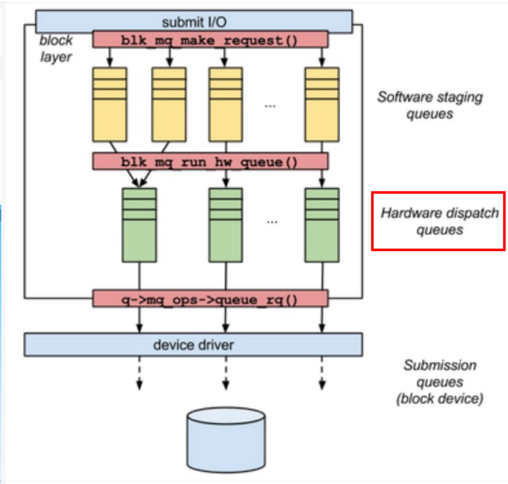
 
 
  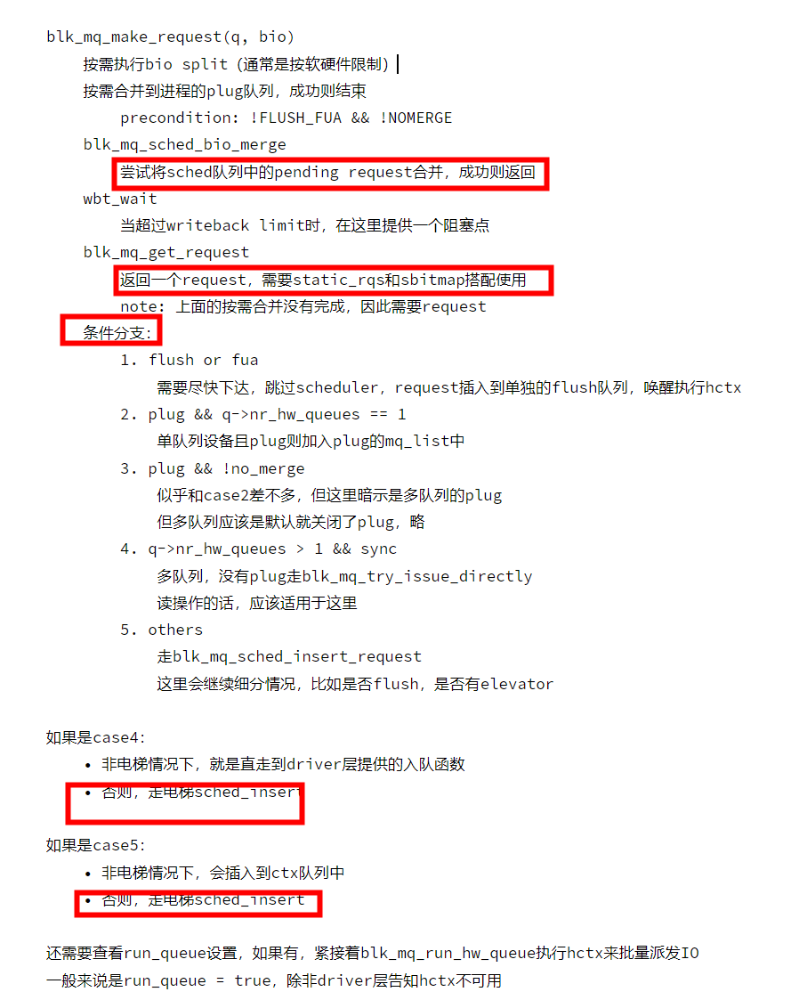

如果配置了调度器，则调用blk_mq_sched_insert_request将请求插入调度器队列（如果没有实现insert_requests接口，则插入到当前cpu的软件队列中）      

blk_mq_submit_bio  -->     __blk_mq_alloc_request --> blk_mq_rq_ctx_init
```
static struct request *blk_mq_rq_ctx_init(struct blk_mq_alloc_data *data,
                unsigned int tag, u64 alloc_time_ns)
{

        if (!op_is_flush(data->cmd_flags)) {
                struct elevator_queue *e = data->q->elevator;

                rq->elv.icq = NULL;
                if (e && e->type->ops.prepare_request) {
                        if (e->type->icq_cache)
                                blk_mq_sched_assign_ioc(rq);

                        e->type->ops.prepare_request(rq);
                        rq->rq_flags |= RQF_ELVPRIV;
                }
        }
}
```

blk_mq_submit_bio中的电梯调度：
```
    } else if (q->elevator) {
                /* Insert the request at the IO scheduler queue */
                blk_mq_sched_insert_request(rq, false, true, true);
        }
```

> ## 电梯调度初始化elevator_init_mq
device_add_disk  -->   __device_add_disk  --> elevator_init_mq   
```
void device_add_disk(struct device *parent, struct gendisk *disk,
                     const struct attribute_group **groups)

{
        __device_add_disk(parent, disk, groups, true);
}
```

```
static void __device_add_disk(struct device *parent, struct gendisk *disk,
                              const struct attribute_group **groups,
                              bool register_queue)
{
        dev_t devt;
        int retval;

        /*
         * The disk queue should now be all set with enough information about
         * the device for the elevator code to pick an adequate default
         * elevator if one is needed, that is, for devices requesting queue
         * registration.
         */
        if (register_queue)
                elevator_init_mq(disk->queue);
```

> ###  电梯调度 alloc tags

 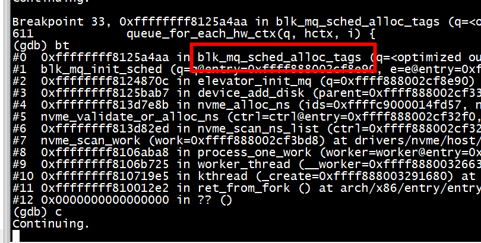   
 

> ###    elevator_queue  

```
void elevator_init_mq(struct request_queue *q)
{
        struct elevator_type *e;
        int err;

        if (!elv_support_iosched(q))
                return;

        WARN_ON_ONCE(blk_queue_registered(q));

        if (unlikely(q->elevator))
                return;

        if (!q->required_elevator_features)
                e = elevator_get_default(q);
        else
                e = elevator_get_by_features(q);
}
block/elevator.c
static struct elevator_type *elevator_get_default(struct request_queue *q)
{
if (q->nr_hw_queues != 1)
return NULL;
​
return elevator_get(q, "mq-deadline", false);
}
```
可见， 只要q->nr_hw_queues不为1， 就没有elevator_queue， 默认的elevator_queue类型是mq-deadline。后续很多mq的流程都和request->queue中是否存在elevator_queue有关。

 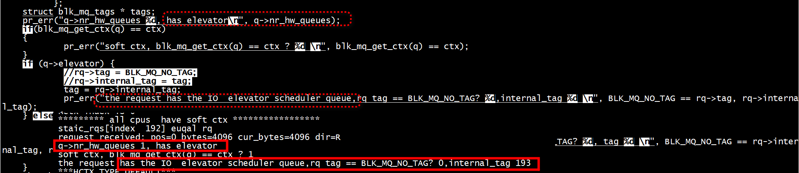   

> ## nvme电梯调度

```
ubuntu@ubuntux86:~$ cat  /sys/block/nvme0n1/queue/scheduler 
[none] mq-deadline 
ubuntu@ubuntux86:~$ 
```

+ insert_requests

 e->type->ops.insert_requests(hctx, list, false)   

+ dispatch_request:  

```
__blk_mq_run_hw_queue -->
blk_mq_sched_dispatch_requests(hctx)
 __blk_mq_sched_dispatch_requests(hctx)  --> ……
__blk_mq_do_dispatch_sched(hctx)  --> e->type->ops.dispatch_request(hctx)
```
e->type->ops.dispatch_request返回struct request   
进入存储设备硬件队列的request***意味着已经经过了调度***    
> ## struct request rq->q 初始化  
与single-queue相比有另一个重要区别，multi-queue使用的request结构体都是预分配的。每个request结构体都关联着一个不同tag number，这个tag number会随着请求传递到硬件，再随着请求完成通知传递回来。早点为一个请求分配tag number，在时机到来的时候，request 层可随时向底层发送请求。   
进入存储设备硬件队列的request***意味着已经经过了调度***    
```
 blk_mq_submit_bio -->  __blk_mq_alloc_request
 __blk_mq_alloc_request
 {
 data->ctx = blk_mq_get_ctx(q);
 data->hctx = blk_mq_map_queue(q, data->cmd_flags, data->ctx);
 tag = blk_mq_get_tag(&data);
  blk_mq_rq_ctx_init(&data, tag, alloc_time_ns);
 }
        
request *blk_mq_rq_ctx_init
{
        struct request *rq = tags->static_rqs[tag];
        rq->q = data->q;
        rq->mq_ctx = data->ctx;
        rq->mq_hctx = data->hctx;
        rq->rq_flags = 0;
        rq->cmd_flags = data->cmd_flags
}
```

+ 1 blk_mq_alloc_rqs给 tags->static_rqs[i] = rq 分配struct request   
+ 2 tag = blk_mq_get_tag(&data);struct request *rq = tags->static_rqs[tag]      


# os

```
root@ubuntux86:# uname -a
Linux ubuntux86 5.13.0-39-generic #44~20.04.1-Ubuntu SMP Thu Mar 24 16:43:35 UTC 2022 x86_64 x86_64 x86_64 GNU/Linux
root@ubuntux86:# 
```

# insmod  ram-disk.ko 
```
root@ubuntux86:# insmod  ram-disk.ko 
root@ubuntux86:# ls /dev/myblock
/dev/myblock
root@ubuntux86:# 
```

# cpu的软硬队列

blk-mq中使用了两层队列，将单个请求队列锁的竞争分散多个队列中，极大的提高了Block Layer并发处理IO的能力。两层队列的设计分工明确:

+ 软件暂存队列（Software Staging     Queue）：blk-mq中为每个cpu分配一个软件队列，bio的提交/完成处理、IO请求暂存（合并、排序等）、IO请求标记、IO调度、IO记账都在这个队列上进行。由于每个cpu有单独的队列，所以每个cpu上的这些IO操作可以同时进行，而不存在锁竞争问题

+ 硬件派发队列（Hardware Dispatch Queue）：
 blk-mq为存储器件的每个硬件队列（目前多数存储器件只有1个）分配一个硬件派发队列，负责存放软件队列往这个硬件队列派发的IO请求。在存储设备驱动初始化时，blk-mq会通过固定的映射关系将一个或多个软件队列映射（map）到一个硬件派发队列（同时保证映射到每个硬件队列的软件队列数量基本一致），之后这些软件队列上的IO请求会往对应的硬件队列上派发。

 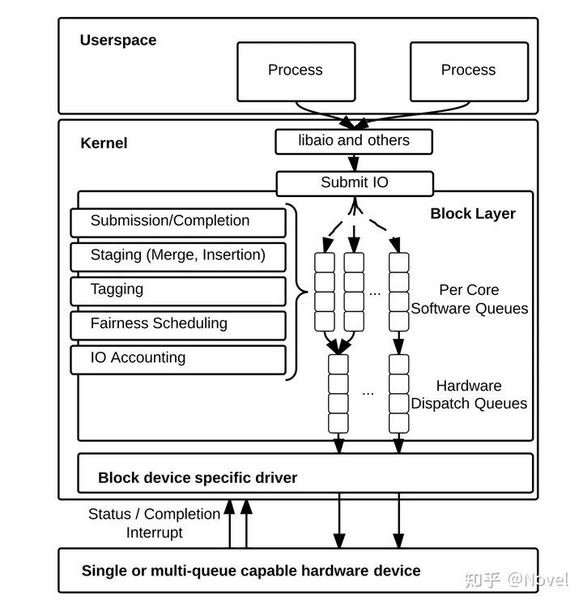   


每个CPU对应唯一的软件队列blk_mq_ctx，blk_mq_ctx对应唯一的硬件队列blk_mq_hw_ctx，blk_mq_hw_ctx对应唯一的blk_mq_tags。我们在进行发起bio请求后，需要从blk_mq_tags结构的相关成员分配一个tag(其实是一个数字)，再根据tag分配一个req，最后才能进行IO派发，磁盘数据传输   

 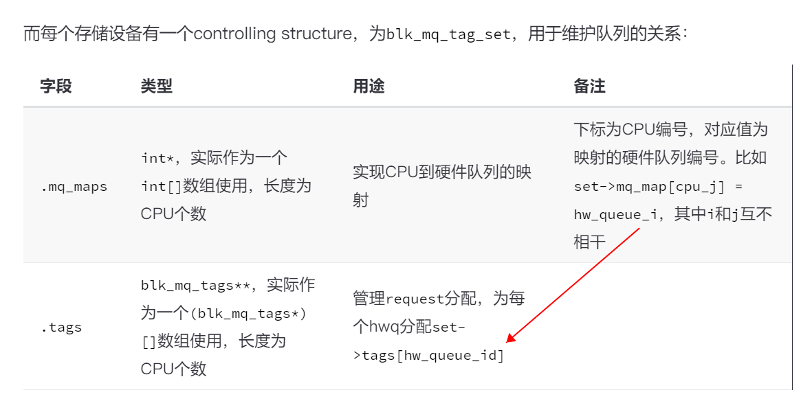   


+ 1 //根据CPU编号取出每个CPU对应的软件队列结构struct blk_mq_ctx *ctx   
ctx = per_cpu_ptr(q->queue_ctx, i);   

+ 2 //根据CPU编号取出每个CPU对应的硬件队列struct blk_mq_hw_ctx *hctx   
hctx = blk_mq_map_queue(q, i);新版内核通过 blk_mq_map_queue_type(q, j, i)  

运行./test-only-one-sec   
  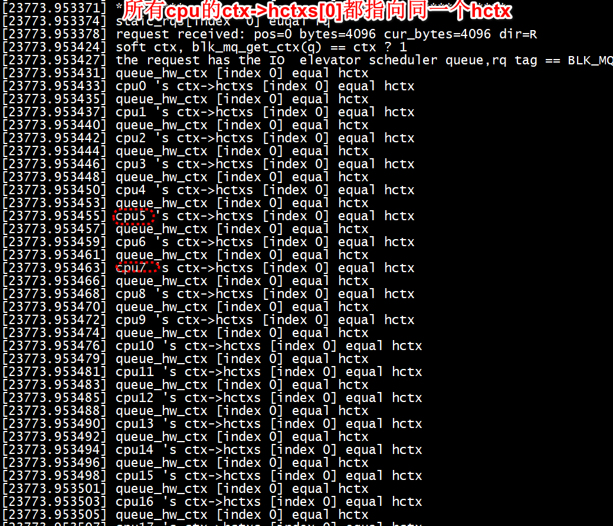
```
static void blk_mq_map_swqueue(struct request_queue *q,
			       const struct cpumask *online_mask)
{
	 struct blk_mq_hw_ctx *hctx;
	 struct blk_mq_ctx *ctx;
	 struct blk_mq_tag_set *set = q->tag_set;

/*根据CPU编号依次取出每一个软件队列，再根据CPU编号取出硬件队列struct blk_mq_hw_ctx *hctx，对硬件
 队列结构的hctx->ctxs[]赋值软件队列结构blk_mq_ctx*/
	for_each_possible_cpu(i) {
	
	      //根据CPU编号取出硬件队列编号
		     hctx_idx = q->mq_map[i];
		     
	      //根据CPU编号取出每个CPU对应的软件队列结构struct blk_mq_ctx *ctx
			ctx = per_cpu_ptr(q->queue_ctx, i);
			
	       //根据CPU编号取出每个CPU对应的硬件队列struct blk_mq_hw_ctx *hctx
			hctx = blk_mq_map_queue(q, i);
			
	/*硬件队列关联的第几个软件队列。硬件队列每关联一个软件队列，都hctx->ctxs[hctx->nr_ctx++] = ctx，把
	软件队列结构保存到hctx->ctxs[hctx->nr_ctx++]，即硬件队列结构的hctx->ctxs[]数组，而ctx->index_hw会先保存
	hctx->nr_ctx*/
			ctx->index_hw = hctx->nr_ctx;
			
	        //软件队列结构以hctx->nr_ctx为下标保存到hctx->ctxs[]
			hctx->ctxs[hctx->nr_ctx++] = ctx;
	}

	/*根据硬件队列数，依次从q->queue_hw_ctx[i]数组取出硬件队列结构体struct blk_mq_hw_ctx *hctx，然后对
	hctx->tags赋值blk_mq_tags结构*/
	queue_for_each_hw_ctx(q, hctx, i) {
	
	   //i是硬件队列编号，这是根据硬件队列编号i从struct blk_mq_tag_set *set取出硬件队列专属的blk_mq_tags
		hctx->tags = set->tags[i];
	    sbitmap_resize(&hctx->ctx_map, hctx->nr_ctx);
	}
}
```
## 软硬件队列映射
在之前的数据结构分析中提到block multi-queue的软硬件映射关系是由硬件相关的blk_mq_tag_set->map决定，设置其映射关系的函数为blk_mq_map_queues()。
```
void blk_mq_map_queues(struct blk_mq_queue_map *qmap)
{
        const struct cpumask *masks;
        unsigned int queue, cpu;

        masks = group_cpus_evenly(qmap->nr_queues);
        if (!masks) {
                for_each_possible_cpu(cpu)
                        qmap->mq_map[cpu] = qmap->queue_offset;
                return;
        }

        for (queue = 0; queue < qmap->nr_queues; queue++) {
                for_each_cpu(cpu, &masks[queue])
                        qmap->mq_map[cpu] = qmap->queue_offset + queue;
        }
        kfree(masks);
}
EXPORT_SYMBOL_GPL(blk_mq_map_queues);
```

```
static inline struct blk_mq_hw_ctx *blk_mq_map_queue_type(struct request_queue *q, enum hctx_type type, unsigned int cpu)
{
                return q->queue_hw_ctx[q->tag_set->map[type].mq_map[cpu]];
}

```
+ ***blk_mq_map_swqueue***   
blk_mq_map_swqueue：建立软硬队列的映射关系，与blk_mq_map_queues不同，blk_mq_map_queues是通过map数组的mq_map数组通过索引和数组元素记录软硬队列的映射关系，其中数组索引为软队列编号，数组元素为硬队列编号，且映射关系保存在
blk_mq_tag_set.map[i]->mq_map中；blk_mq_map_swqueue是基于blk_mq_map_queues创建的映射关系，进一步将软队列描述符指针保存在硬队列描述符，将软队列映射到硬队列的映射号index_hw保存在软队列描述符，它也与软队列索引号相同。如双核，一个硬队列的情况下blk_mq_map_swqueue打印如下：
blk_mq_map_swqueue: hctx(bfa29000), ctx(80e7a9c0), q->nr_queues(2),hctx->nr_ctx(1),
ctx->index_hw(0),hctx->ctxs0
blk_mq_map_swqueue: hctx(bfa29000), ctx(80e829c0), q->nr_queues(2),hctx->nr_ctx(2),
ctx->index_hw(1),hctx->ctxs1
如上就显示了双核下有两个软队列（地址为80e7a9c0和80e829c0），都映射到同一个硬队列（地址为bfa29000）   
 
                           
##  struct request_queue 分配

```
struct request_queue *blk_mq_init_queue_data(struct blk_mq_tag_set *set,
                void *queuedata)
{
        struct request_queue *uninit_q, *q;
        uninit_q = blk_alloc_queue(set->numa_node);
        q = blk_mq_init_allocated_queue(set, uninit_q, false);
        
}
```

# tag set 初始化
 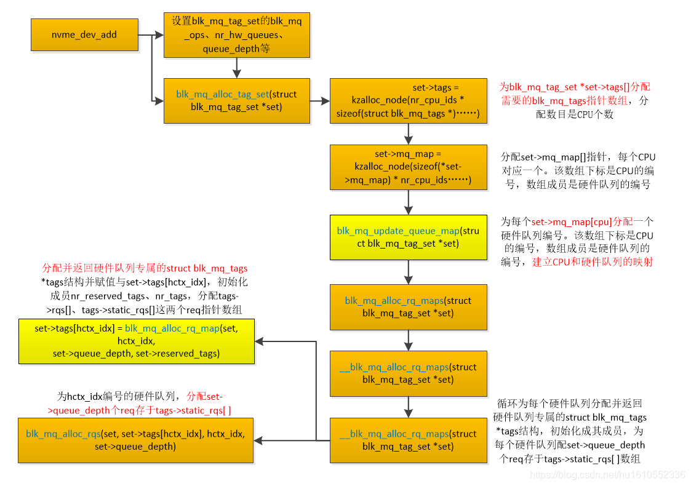
  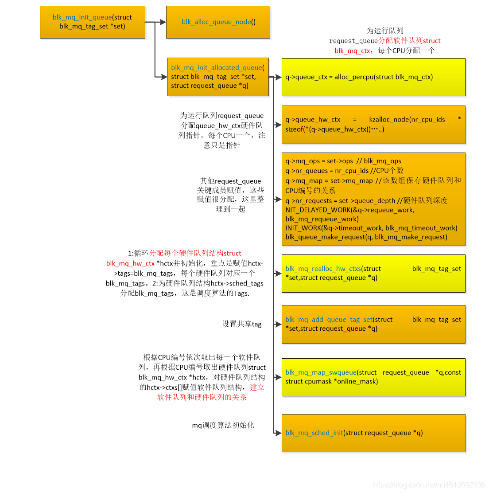
  
  
 submit_bio…->blk_mq_make_request发送IO请求开始。按照内核block层多队列的要求，需要执行blk_mq_sched_get_request->__blk_mq_alloc_request->blk_mq_get_tag为bio分配一个tag。具体细节是，找到当前进程所在cpu，继而找到该cpu绑定的nvme硬件队列，nvme硬件队列用blk_mq_hw_ctx结构体表示。然后，从blk_mq_hw_ctx的成员struct blk_mq_tags *tags分配一个tag，测试的机器发现最多可以分配1023个tag。如果进程已经从nvme硬件队列分配了1023个tag，还要再分配的话，只能休眠等待谁释放tag。   

```
static void nvme_pci_alloc_tag_set(struct nvme_dev *dev)
{
	struct blk_mq_tag_set * set = &dev->tagset;
	int ret;

	set->ops = &nvme_mq_ops;
	set->nr_hw_queues = dev->online_queues - 1;
	set->nr_maps = 1;
	if (dev->io_queues[HCTX_TYPE_READ])
		set->nr_maps = 2;
	if (dev->io_queues[HCTX_TYPE_POLL])
		set->nr_maps = 3;
	set->timeout = NVME_IO_TIMEOUT;
	set->numa_node = dev->ctrl.numa_node;
	set->queue_depth = min_t(unsigned, dev->q_depth, BLK_MQ_MAX_DEPTH) - 1;
	set->cmd_size = sizeof(struct nvme_iod);
	set->flags = BLK_MQ_F_SHOULD_MERGE;
	set->driver_data = dev;

	/*
	 * Some Apple controllers requires tags to be unique
	 * across admin and IO queue, so reserve the first 32
	 * tags of the IO queue.
	 */
	if (dev->ctrl.quirks & NVME_QUIRK_SHARED_TAGS)
		set->reserved_tags = NVME_AQ_DEPTH;

	ret = blk_mq_alloc_tag_set(set);
	if (ret) {
		dev_warn(dev->ctrl.device,
			"IO queues tagset allocation failed %d\n", ret);
		return;
	}
	dev->ctrl.tagset = set;
}
```
> ##  tag分配

+ 1 __blk_mq_alloc_request()分配tag和req   

```
struct request *__blk_mq_alloc_request(struct blk_mq_alloc_data *data, int rw)
{
    /*从硬件队列有关的blk_mq_tags结构体的static_rqs[]数组里得到空闲的request。获取失败则启动硬件IO数据派
发，之后再尝试从blk_mq_tags结构体的static_rqs[]数组里得到空闲的request。注意，这里返回的是空闲的request
在static_rqs[]数组的下标*/
	tag = blk_mq_get_tag(data);
	
	if (tag != BLK_MQ_TAG_FAIL) //分配tag成功
	{ 
         //有调度器时返回硬件队列的hctx->sched_tags,无调度器时返回硬件队列的hctx->tags
		struct blk_mq_tags *tags = blk_mq_tags_from_data(data);
         //从tags->static_rqs[tag]得到空闲的req，tag是req在tags->static_rqs[ ]数组的下标
	     rq = tags->static_rqs[tag]; //这里真正分配得到本次传输使用的req
	  
		  if (data->flags & BLK_MQ_REQ_INTERNAL) //用调度器时设置
		{ 
			    rq->tag = -1;
			   __rq_aux(rq, data->q)->internal_tag = tag;//这是req的tag
		}
		else 
		{
	     //赋值为空闲req在blk_mq_tags结构体的static_rqs[]数组的下标
		rq->tag = tag;
		__rq_aux(rq, data->q)->internal_tag = -1;
		//这里边保存的req是刚从static_rqs[]得到的空闲的req
		data->hctx->tags->rqs[rq->tag] = rq;
	   }
	  
       //对新分配的req进行初始化，赋值软件队列、req起始时间等
	    blk_mq_rq_ctx_init(data->q, data->ctx, rq, rw);
       return rq; 
	}
	return NULL;
}
```
该函数的大体过程是：从硬件队列的blk_mq_tags结构体的tags->bitmap_tags或者tags->nr_reserved_tags分配一个空闲tag，然后req = tags->static_rqs[tag]从static_rqs[]分配一个req，再req->tag=tag。接着hctx->tags->rqs[rq->tag] = rq，一个req必须分配一个tag才能IO传输。分配失败则启动硬件IO数据派发，之后再尝试分配tag。函数核心是执行blk_mq_get_tag()分配tag.     


+ 2 blk_mq_get_driver_tag  

blk_mq_get_driver_tag本质还是调用blk_mq_get_tag()去硬件队列的blk_mq_tags结为req分配一个tag。该函数只是分配tag，没有分配req。blk_mq_get_driver_tag()存在的意义是:req派发给磁盘驱动时，遇到磁盘硬件队列繁忙，无法派送，则释放掉tag，req加入硬件hctx->dispatch链表异步派发。等再次派发时，就会执行blk_mq_get_driver_tag()为req分配一个tag。    


> ##  blk_mq_alloc_tag_set

```

        /* Initialize tag set. */
        dev->tag_set.ops = &my_queue_ops;
        dev->tag_set.nr_hw_queues = 1;
        dev->tag_set.queue_depth = 128;
        dev->tag_set.numa_node = NUMA_NO_NODE;
        dev->tag_set.cmd_size = 0;
        dev->tag_set.flags = BLK_MQ_F_SHOULD_MERGE;
        err = blk_mq_alloc_tag_set(&dev->tag_set);
```
> ## struct blk_mq_tags


struct blk_mq_tags *tags（tags->rqs和tags->static_rqs）存储struct request *   

+ 1 每个硬件队列都要执行2和3     
+ 2 blk_mq_alloc_rq_map分配（tags->rqs和tags->static_rqs）存储struct request *   

+ 3 blk_mq_alloc_rqs给 tags->static_rqs[i] = rq 分配struct request   

```
   for (i = 0; i < set->nr_hw_queues; i++) {
                if (!__blk_mq_alloc_map_and_rqs(set, i))
                        goto out_unwind;
                cond_resched();
        }
struct blk_mq_tags *blk_mq_alloc_map_and_rqs(struct blk_mq_tag_set *set,
                                             unsigned int hctx_idx,
                                             unsigned int depth)
{
        struct blk_mq_tags *tags;
        tags = blk_mq_alloc_rq_map(set, hctx_idx, depth, set->reserved_tags);
        ret = blk_mq_alloc_rqs(set, tags, hctx_idx, depth);

}
```

```C
                        struct request *rq = p;

                        tags->static_rqs[i] = rq;
                        if (blk_mq_init_request(set, rq, hctx_idx, node)) {
                                tags->static_rqs[i] = NULL;
                                goto fail;
                        }
```

> ##  struct request_queue的struct blk_mq_ctx
```

static inline struct blk_mq_ctx *__blk_mq_get_ctx(struct request_queue *q,
                                           unsigned int cpu)
{
        return per_cpu_ptr(q->queue_ctx, cpu);
}


static inline struct blk_mq_ctx *blk_mq_get_ctx(struct request_queue *q)
{
        return __blk_mq_get_ctx(q, raw_smp_processor_id());
}
```

> ##  struct request_queue的硬件队列hctx
```

data->hctx = blk_mq_map_queue(q, data->cmd_flags, data->ctx);
static inline struct blk_mq_hw_ctx *blk_mq_map_queue_type(struct request_queue *q,
                                                          enum hctx_type type,
                                                          unsigned int cpu)
{
        return xa_load(&q->hctx_table, q->tag_set->map[type].mq_map[cpu]);
}
```


# user test

```
root@ubuntux86:# ./ram-disk-test 
test sector   0 ... passed
test sector   1 ... passed
test sector   2 ... passed
test sector   3 ... passed
test sector   4 ... passed
test sector   5 ... passed
test sector   6 ... passed
............................
test sector 127 ... passed
root@ubuntux86:# 
```

# test2


```
root@ubuntux86:# dmesg | tail -n 40
[28902.553994] CR2: 0000000000000000 CR3: 000000010a652002 CR4: 00000000007706e0
[28902.553998] PKRU: 55555554
[28902.554000] Call Trace:
[28902.554004]  <TASK>
[28902.554009]  blk_mq_test_req+0x1e3/0x2e6 [ram_disk]
[28902.554019]  ? sbitmap_get+0x88/0x1a0
[28902.554028]  my_block_request+0x44/0x161 [ram_disk]
[28902.554035]  blk_mq_dispatch_rq_list+0x13b/0x7c0
[28902.554044]  ? elv_rb_del+0x24/0x30
[28902.554051]  ? deadline_read_fifo_stop+0x11/0x30
[28902.554060]  __blk_mq_do_dispatch_sched+0xba/0x2c0
[28902.554067]  ? newidle_balance+0x2f7/0x3f0
[28902.554073]  ? dequeue_task_fair+0x1cc/0x320
[28902.554082]  __blk_mq_sched_dispatch_requests+0x14e/0x190
[28902.554088]  blk_mq_sched_dispatch_requests+0x35/0x60
[28902.554094]  __blk_mq_run_hw_queue+0x34/0x70
[28902.554102]  blk_mq_run_work_fn+0x1b/0x20
[28902.554109]  process_one_work+0x21d/0x3c0
[28902.554116]  worker_thread+0x4d/0x3f0
[28902.554123]  ? process_one_work+0x3c0/0x3c0
[28902.554129]  kthread+0x128/0x150
[28902.554134]  ? set_kthread_struct+0x40/0x40
[28902.554139]  ret_from_fork+0x1f/0x30
[28902.554150]  </TASK>
```
IO调度器deadline_read_fifo_stop     
 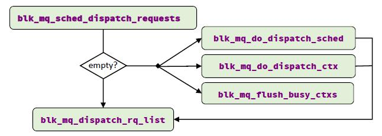   


> ##  tag关联struct request
 +  1 struct blk_mq_tags *tags，获取 blk_mq_tags_from_data(data)
 > + 1.1 blk_mq_get_new_requests --> 构造struct blk_mq_alloc_data data
 > + 1.2  通过 blk_mq_tags_from_data(data)获取struct blk_mq_tags   
```
        data->ctx = blk_mq_get_ctx(q);
        data->hctx = blk_mq_map_queue(q, data->cmd_flags, data->ctx);
```
 
 
 
 +  blk_mq_try_issue_directly   --> blk_mq_get_driver_tag    
```
static bool blk_mq_get_driver_tag(struct request *rq)
{
        struct blk_mq_hw_ctx *hctx = rq->mq_hctx;

        if (rq->tag == BLK_MQ_NO_TAG && !__blk_mq_get_driver_tag(rq))
                return false;

        if ((hctx->flags & BLK_MQ_F_TAG_QUEUE_SHARED) &&
                        !(rq->rq_flags & RQF_MQ_INFLIGHT)) {
                rq->rq_flags |= RQF_MQ_INFLIGHT;
                __blk_mq_inc_active_requests(hctx);
        }
        hctx->tags->rqs[rq->tag] = rq;
        return true;
}
```
> ## 分配tag tag = __sbitmap_queue_get 
```
static bool __blk_mq_get_driver_tag(struct request *rq)
{
        struct sbitmap_queue *bt = rq->mq_hctx->tags->bitmap_tags;
        unsigned int tag_offset = rq->mq_hctx->tags->nr_reserved_tags;
        int tag;

        blk_mq_tag_busy(rq->mq_hctx);

        if (blk_mq_tag_is_reserved(rq->mq_hctx->sched_tags, rq->internal_tag)) {
                bt = rq->mq_hctx->tags->breserved_tags;
                tag_offset = 0;
        } else {
                if (!hctx_may_queue(rq->mq_hctx, bt))
                        return false;
        }

        tag = __sbitmap_queue_get(bt);
        if (tag == BLK_MQ_NO_TAG)
                return false;

        rq->tag = tag + tag_offset;
        return true;
}
```
+  hctx->tags->rqs[rq->tag] = rq;   
+  tag = blk_mq_get_tag(&data)   
```
struct request *__blk_mq_alloc_request(struct blk_mq_alloc_data *data, int rw)
{
    /*从硬件队列有关的blk_mq_tags结构体的static_rqs[]数组里得到空闲的request。获取失败则启动硬件IO数据派
发，之后再尝试从blk_mq_tags结构体的static_rqs[]数组里得到空闲的request。注意，这里返回的是空闲的request
在static_rqs[]数组的下标*/
	tag = blk_mq_get_tag(data);
	
	if (tag != BLK_MQ_TAG_FAIL) //分配tag成功
	{ 
         //有调度器时返回硬件队列的hctx->sched_tags,无调度器时返回硬件队列的hctx->tags
		struct blk_mq_tags *tags = blk_mq_tags_from_data(data);
         //从tags->static_rqs[tag]得到空闲的req，tag是req在tags->static_rqs[ ]数组的下标
	     rq = tags->static_rqs[tag]; //这里真正分配得到本次传输使用的req
	  
		  if (data->flags & BLK_MQ_REQ_INTERNAL) //用调度器时设置
		{ 
			    rq->tag = -1;
			   __rq_aux(rq, data->q)->internal_tag = tag;//这是req的tag
		}
		else 
		{
	     //赋值为空闲req在blk_mq_tags结构体的static_rqs[]数组的下标
		rq->tag = tag;
		__rq_aux(rq, data->q)->internal_tag = -1;
		//这里边保存的req是刚从static_rqs[]得到的空闲的req
		data->hctx->tags->rqs[rq->tag] = rq;
	   }
	  
       //对新分配的req进行初始化，赋值软件队列、req起始时间等
	    blk_mq_rq_ctx_init(data->q, data->ctx, rq, rw);
       return rq; 
	}
	return NULL;
}

```
该函数的大体过程是：从硬件队列的blk_mq_tags结构体的tags->bitmap_tags或者tags->nr_reserved_tags分配一个空闲tag，然后req = tags->static_rqs[tag]从static_rqs[]分配一个req，再req->tag=tag。接着hctx->tags->rqs[rq->tag] = rq，一个req必须分配一个tag才能IO传输。分配失败则启动硬件IO数据派发，之后再尝试分配tag。函数核心是执行blk_mq_get_tag()分配tag


# debug


```
[  184.616108] #PF: supervisor read access in kernel mode
[  184.618078] #PF: error_code(0x0000) - not-present page
[  184.618800] PGD 72801067 P4D 72801067 PUD 0 
[  184.619253] Oops: 0000 [#1] SMP PTI
[  184.619621] CPU: 1 PID: 3092 Comm: probe-bcache Tainted: G           OE     5.4.0-172-generic #190-Ubuntu
[  184.620626] Hardware name: QEMU Standard PC (i440FX + PIIX, 1996), BIOS rel-1.14.0-0-g155821a1990b-prebuilt.qemu.org 04/01/2014
[  184.621870] RIP: 0010:memcpy_orig+0x16/0x110
[  184.622355] Code: 1f 44 00 00 48 89 f8 48 89 d1 f3 a4 c3 0f 1f 80 00 00 00 00 48 89 f8 48 83 fa 20 72 7e 40 38 fe 7c 35 48 83 ea 20 48 83 ea 20 <4c> 8b7
[  184.624374] RSP: 0018:ffff9ab640f8f788 EFLAGS: 00010206
[  184.625016] RAX: ffff8e637102e000 RBX: 0000000000001000 RCX: ffff8e6359ba6000
[  184.625846] RDX: 0000000000000fc0 RSI: ffff8e64651f0000 RDI: ffff8e637102e000
[  184.626581] RBP: ffff9ab640f8f7e8 R08: 0000000000001000 R09: ffff8e636f30b488
[  184.627354] R10: 0000000000000000 R11: 0000000000001000 R12: 0000000000000000
[  184.628161] R13: 0000000000001000 R14: ffff8e636f30b400 R15: 0000000000000000
[  184.629027] FS:  00007fbb22ec6780(0000) GS:ffff8e6377a80000(0000) knlGS:0000000000000000
[  184.629993] CS:  0010 DS: 0000 ES: 0000 CR0: 0000000080050033
[  184.630686] CR2: ffff8e64651f0000 CR3: 00000002313f0000 CR4: 00000000000006e0
[  184.631535] Call Trace:
[  184.631852]  ? show_regs.cold+0x1a/0x1f
[  184.632318]  ? __die+0x90/0xd9
[  184.632695]  ? no_context+0x196/0x380
[  184.633137]  ? __bad_area_nosemaphore+0x50/0x1a0
[  184.633702]  ? pcpu_next_unpop+0x3a/0x50
[  184.634207]  ? bad_area_nosemaphore+0x16/0x20
[  184.634731]  ? do_kern_addr_fault+0x56/0x90
[  184.635242]  ? __do_page_fault+0x87/0x90
[  184.635725]  ? __sbitmap_get_word+0x31/0x90
[  184.636226]  ? do_page_fault+0x2c/0xe0
[  184.636688]  ? do_async_page_fault+0x39/0x70
[  184.637213]  ? async_page_fault+0x34/0x40
[  184.637703]  ? memcpy_orig+0x16/0x110
[  184.638169]  ? queue_rq+0x196/0x2d0 [rdma_krping]
[  184.638739]  blk_mq_dispatch_rq_list+0x93/0x640
[  184.639287]  ? elv_rb_del+0x24/0x30
[  184.639706]  ? deadline_remove_request+0x4e/0xb0
[  184.640255]  ? deadline_dispatch_stop+0x21/0x30
[  184.640801]  blk_mq_do_dispatch_sched+0xf7/0x130
[  184.641341]  __blk_mq_sched_dispatch_requests+0x111/0x170
[  184.641979]  blk_mq_sched_dispatch_requests+0x35/0x60
[  184.642581]  __blk_mq_run_hw_queue+0x5a/0x110
[  184.643111]  __blk_mq_delay_run_hw_queue+0x15b/0x160
[  184.643678]  blk_mq_run_hw_queue+0x92/0x120
[  184.644436]  blk_mq_sched_insert_requests+0x74/0x100
[  184.645283]  ? lru_cache_add+0xe/0x10
[  184.645951]  blk_mq_flush_plug_list+0x1e8/0x290
[  184.646716]  ? mpage_readpages+0x162/0x1a0
[  184.647435]  blk_flush_plug_list+0xe3/0x110
[  184.648158]  blk_finish_plug+0x26/0x40
[  184.648814]  read_pages+0x86/0x1a0
[  184.649451]  __do_page_cache_readahead+0x180/0x1a0
[  184.650223]  force_page_cache_readahead+0x98/0x110
[  184.651020]  page_cache_sync_readahead+0xaf/0xc0
[  184.651768]  generic_file_buffered_read+0x5ba/0xbd0
[  184.652527]  ? filemap_map_pages+0x24c/0x380
[  184.653239]  generic_file_read_iter+0xdc/0x140
[  184.653973]  ? __handle_mm_fault+0x4c5/0x7a0
[  184.654679]  blkdev_read_iter+0x4a/0x60
[  184.655314]  new_sync_read+0x122/0x1b0
[  184.655946]  __vfs_read+0x29/0x40
[  184.656519]  vfs_read+0xab/0x160
[  184.657079]  ksys_read+0x67/0xe0
[  184.657638]  __x64_sys_read+0x1a/0x20
[  184.658259]  do_syscall_64+0x57/0x190
[  184.658873]  entry_SYSCALL_64_after_hwframe+0x5c/0xc1
```