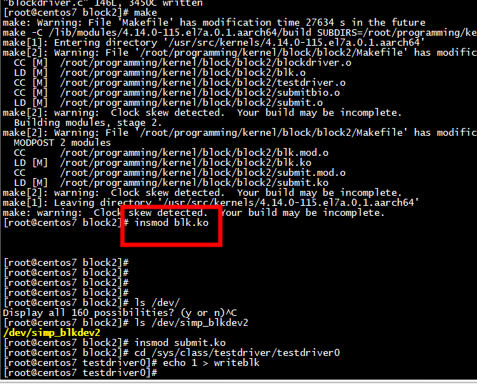
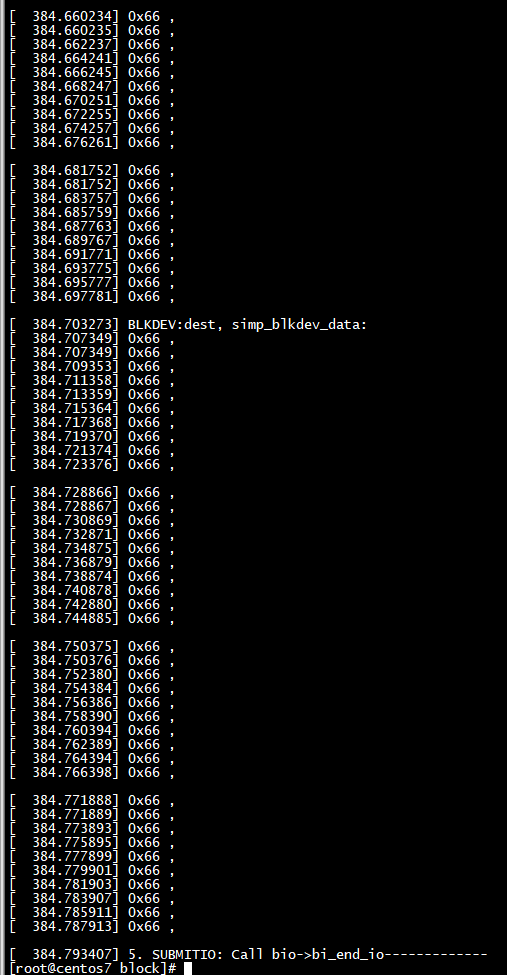

# 1.How to use those drivers:  

insmod blk.ko  
insmod submit.ko  
cd /sys/class/testdriver/testdriver0  
echo 1 > writeblk  

   

# 2. What's those drivers?

blockdriver.c -- a simple block device driver  
submitbio.c -- create a bio and init it, and submit bio to block layer.  
               from this driver, you can track many useful information  
               for submit_bio interface.  
testdriver.c -- trigger read and write bio pages.  

Test log:  

 

 
