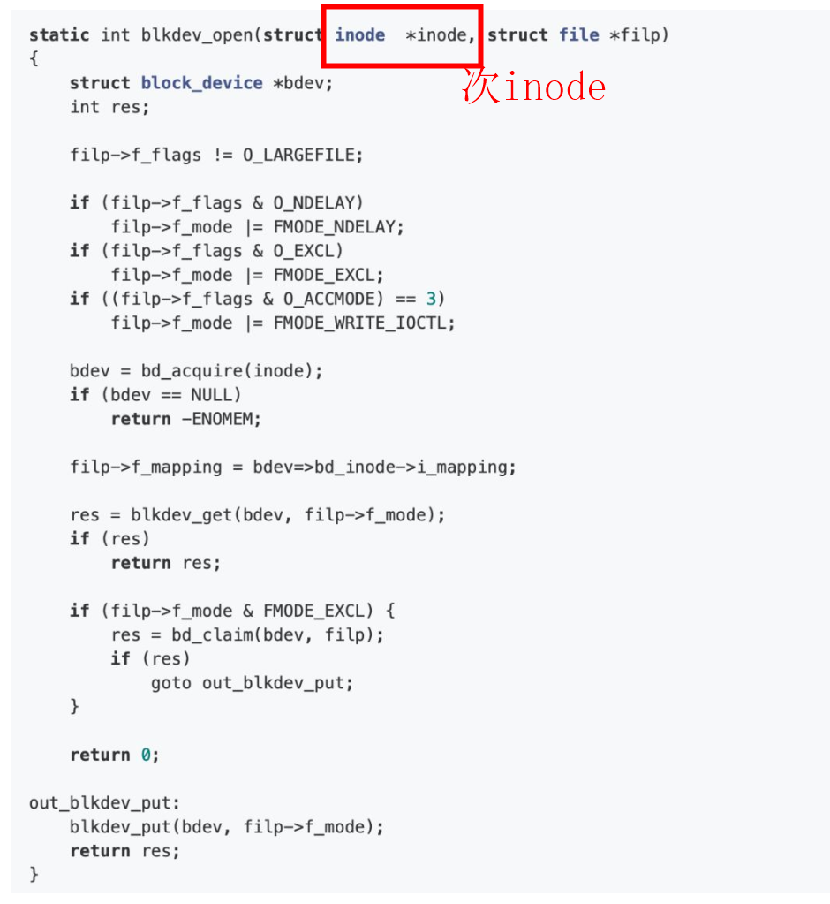
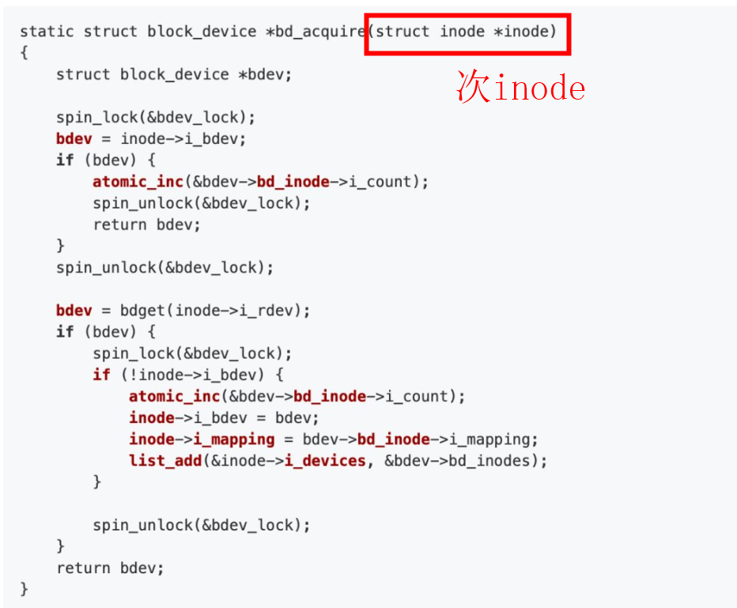

# simple_fs.ko

Description of design:
  a.the max len of filename is 64 byte.
  b.excpt super block, we can have 64 files.
  c.every block size is 512 byte.

```
root@centos7 ramdisk-lab]# insmod  simple_fs.ko
[root@centos7 ramdisk-lab]# mkdir  test_fs
[root@centos7 ramdisk-lab]# mount -t simple_fs none ./test_fs/
[root@centos7 ramdisk-lab]# cd test_fs
[root@centos7 test_fs]# mkdir test1
[root@centos7 test_fs]# cho 12345 > 111.txt
-bash: cho: command not found
[root@centos7 test_fs]# echo 12345 > 111.txt
[root@centos7 test_fs]# ls
111.txt  test1
[root@centos7 test_fs]# rm 111.txt  test1/ -rf
[root@centos7 test_fs]# cd ..
[root@centos7 ramdisk-lab]# umount ./test_fs
[root@centos7 ramdisk-lab]# 
```

# insmod   ramdisk_test.ko

```
    insmod   ramdisk_test.ko
	mkfs.ext2 /dev/myramdisk
	mkdir ramdisk
	mount /dev/myramdisk ./ramdisk/
	cd ./ramdisk
```

```
[root@centos7 ramdisk-lab]# insmod   ramdisk_test.ko
[root@centos7 ramdisk-lab]# mkfs.ext2 /dev/myramdisk
mke2fs 1.42.9 (28-Dec-2013)
Filesystem label=
OS type: Linux
Block size=1024 (log=0)
Fragment size=1024 (log=0)
Stride=0 blocks, Stripe width=0 blocks
2560 inodes, 10240 blocks
512 blocks (5.00%) reserved for the super user
First data block=1
Maximum filesystem blocks=10485760
2 block groups
8192 blocks per group, 8192 fragments per group
1280 inodes per group
Superblock backups stored on blocks: 
        8193

Allocating group tables: done                            
Writing inode tables: done                            
Writing superblocks and filesystem accounting information: done

[root@centos7 ramdisk-lab]# mkdir ramdisk
[root@centos7 ramdisk-lab]# mount /dev/myramdisk ./ramdisk/
[root@centos7 ramdisk-lab]# ls ramdisk
lost+found
[root@centos7 ramdisk-lab]# 
```

# 块设备文件与文件系统之间的关系

```
static int dev_open(struct block_device *bdev, fmode_t mode){
    unsigned unit = iminor(bdev->bd_inode);
    printk(KERN_INFO "Ramdisk: Device is opened iminor %u \n", unit);

    return 0;
}
```
  insmod  blk_test.ko 
```
[root@centos7 ramdisk-lab]# mkfs.ext2 /dev/myramdisk
mke2fs 1.42.9 (28-Dec-2013)
Filesystem label=
OS type: Linux
Block size=1024 (log=0)
Fragment size=1024 (log=0)
Stride=0 blocks, Stripe width=0 blocks
2560 inodes, 10240 blocks
512 blocks (5.00%) reserved for the super user
First data block=1
Maximum filesystem blocks=10485760
2 block groups
8192 blocks per group, 8192 fragments per group
1280 inodes per group
Superblock backups stored on blocks: 
        8193

Allocating group tables: done                            
Writing inode tables: done                            
Writing superblocks and filesystem accounting information: done

[root@centos7 ramdisk-lab]# mount /dev/myramdisk  ramdisk
[root@centos7 ramdisk-lab]# cd ramdisk
[root@centos7 ramdisk]# ls
lost+found
[root@centos7 ramdisk]# dmesg |  grep 'opened iminor'
[55532.510703] Ramdisk: Device is opened iminor 0 
[55532.523330] Ramdisk: Device is opened iminor 0 
[55532.523486] Ramdisk: Device is opened iminor 0 
[55567.734824] Ramdisk: Device is opened iminor 0 
[55567.811565] Ramdisk: Device is opened iminor 0 
[55567.828865] Ramdisk: Device is opened iminor 0 
[55567.841190] Ramdisk: Device is opened iminor 0 
[55567.853481] Ramdisk: Device is opened iminor 0 
[55567.870774] Ramdisk: Device is opened iminor 0 
[55568.235508] Ramdisk: Device is opened iminor 0 
[55580.078940] Ramdisk: Device is opened iminor 0 
[55580.087114] Ramdisk: Device is opened iminor 0 
[55580.095297] Ramdisk: Device is opened iminor 0 
[55580.103462] Ramdisk: Device is opened iminor 0 
[55580.111627] Ramdisk: Device is opened iminor 0 
[55580.119874] Ramdisk: Device is opened iminor 0 
[55580.214077] Ramdisk: Device is opened iminor 0 
[55580.227235] Ramdisk: Device is opened iminor 0 
[55580.231913] Ramdisk: Device is opened iminor 0 
[55583.519809] Ramdisk: Device is opened iminor 0 
[55583.596184] Ramdisk: Device is opened iminor 0 
```

关于块设备文件，可以从两方面来进行理解。从块设备文件的外部表现来看，它是属于某个外部文件系统上的一个文件。通常Linux内核将其存放在/dev目录下，用户像对常规文件一样来对其进行访问。从块设备文件的内部实现来看，它可以看作是一种特殊文件系统的所属文件，同时该块设备文件的文件逻辑编号与块设备逻辑编号一一对应。  
那如何对常规文件与块设备文件进行区分？当类似于/dev目录下的挂载在宿主系统中的块设备文件，主要通过文件所对应的inode结构中i_mode字段来进行判别，另外在inode结构中i_zone[0]字段中存储了所对应的块设备的编号。   
而为了对块设备文件进行便捷的组织与管理，Linux内核创建了bdev文件系统，该文件系统的目的是为了建立块设备文件在外部表现与内部实现之间的关联性。bev文件系统是一个“伪”文件系统，它只被内核使用，而无需挂载到全局的文件系统树上。   
    块设备文件除了与常规文件类似的在根文件系统上存在inode之外，其在bdev文件系统上也存在对应的inode。两个inode之间通过块设备编号相关联，需要注意的是，前者的inode称之为次inode，而后者称之为主inode。  
如下图所示，展示了主inode与次inode之间的关系:  

 
                ****mount命令创建inode**
 由上述的结构图中，可以知道，当对某个文件进行相关的文件操作时，可以该文件的file结构体中获取该文件所属的文件系统类型，并根据文件路径找到对应的dentry以及inode等，随后利用所对应的具体的数据结构中的相关操作来进行实际的文件操作。这是宿主文件系统中的通用文件操作的形式，而对于块设备文件，其间接的通过***宿主文件系统获取到bdev文件系统中实际的block_inode***，从而进行后续的文件操作。  
比如对于所谓的宿主文件系统中打开文件的操作，利用Linux中通用的do_sys_open即可，而对块设备文件，则根据宿主文件系统与bdev文件系统之间的关系，最后由do_sys_open定位到***blkdev_open***函数。  

 

针对该函数进行分析，可以知道当打开某一块设备文件时，该函数所需的参数为该文件的inode以及file两种结构体。该函数首先利用file结构体对文件进行相关的判断与设置，随后利用inode节点获取到所对应的block_device结构体，同时利用该结构体将实际的inode中的地址空间映射复制到file结构体中。从上边的代码中可以看到block_device的获取是通过bd_acquire函数来完成的。


##  struct simdisk 和 struct block_device

1）register_blkdev(simdisk_major, "simdisk")
2） dev->gd = alloc_disk(SIMDISK_MINORS)， dev->gd->major = simdisk_major ； gendisk通过simdisk_major关联blkdev
```
static int __init simdisk_setup(struct simdisk *dev, int which,
		struct proc_dir_entry *procdir)
{
    dev->queue = blk_alloc_queue(GFP_KERNEL);
	dev->queue->queuedata = dev;
    dev->gd = alloc_disk(SIMDISK_MINORS);
	dev->gd->private_data = dev; 
}
```
## bdev->bd_disk->private_data

```
static int simdisk_open(struct block_device *bdev, fmode_t mode)
{
	struct simdisk *dev = bdev->bd_disk->private_data;;
}
```


## innode

```
static int simdisk_open(struct block_device *bdev, fmode_t mode)
{
  struct gendisk *disk = bdev->bd_disk;
  struct simdisk *dev = disk->private_data;	/* Created in simdisk_setup() during __init */
  struct inode *inode = bdev->bd_inode;
#if 0
  struct file *filp = NULL;

  filp->private_data = dev;
#endif
  return 0;
}
```
 

# reference

[Linux Block Driver - 2](http://oliveryang.net/2016/07/linux-block-driver-basic-2/)