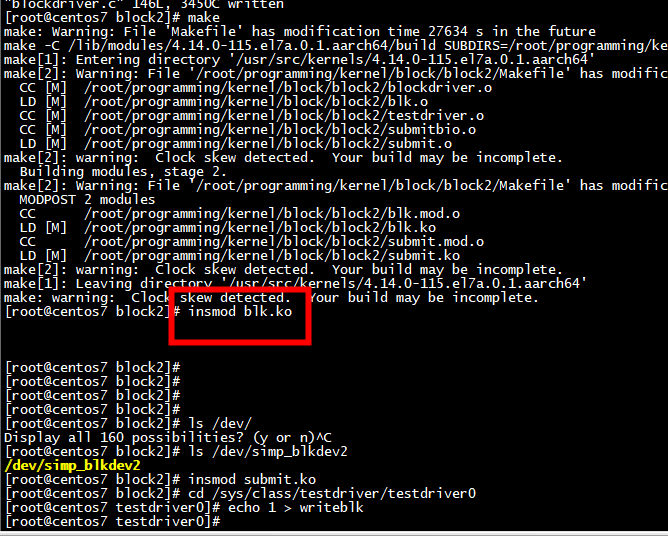

#  insmod  read_test.ko 

## ret = mapping->a_ops->readpage(file, page);
```
static ssize_t generic_file_buffered_read(struct kiocb *iocb,
                struct iov_iter *iter, ssize_t written)
{
ret = mapping->a_ops->readpage(file, page);
  
}
int filemap_fault(struct vm_fault *vmf)
{
ret = mapping->a_ops->readpage(file, page);
}
static int page_cache_read(struct file *file, pgoff_t offset, gfp_t gfp_mask)
{
     
                        ret = mapping->a_ops->readpage(file, page);
          
}
```
test.txt    
```
[root@centos7 fs_test]# cat test.txt 
helloworld
[root@centos7 fs_test]# 
```

##  insmod  read_test.ko

```
[ 5089.257202] mnt_root: /
[ 5089.259644] name: test.txt
[ 5089.262349] d_iname: test.txt
[ 5089.265304] i_ino: 823169
[ 5089.267912] host: 823169
[ 5089.270438] nrpages: 1
[ 5089.272788] ****** page num index: 0
[ 5089.272789] flags: -2305844108725317588
[ 5089.276435] index: 0
[ 5089.280345] _mapcount: -1
[ 5089.285216] content : helloworld

[root@centos7 fs_test]# 
```


# insmod  kern_path_test.ko 
```
[root@centos7 fs_test]# insmod  kern_path_test.ko 
[root@centos7 fs_test]# dmesg | tail -n 10
[ 1311.754018] mnt_root: /
[ 1311.756468] name: kern_path_test.c
[ 1311.759855] d_iname: kern_path_test.c
[ 1311.763501] i_ino: 820975
[ 1311.766115] host: 820975
[ 1311.768636] nrpages: 1
[ 1311.770986] ****** page num index: 0
[ 1311.770988] flags: -2305844108725317524
[ 1311.774633] index: 0
[ 1311.778542] _mapcount: -1
```

# insmod  super_test.ko
```
[root@centos7 fs_test]# insmod  super_test.ko 
[root@centos7 fs_test]# dmesg | tail -n 10
[ 1167.581033] s_blocksize: 4096
[ 1167.583987] s_dev: 8388611
[ 1167.586683] s_type: xfs
[ 1167.589126] s_type: 58465342
[root@centos7 fs_test]# 
```


#  insmod  dcache_test.ko 
```
[root@centos7 fs_test]# insmod  dcache_test.ko 
[root@centos7 fs_test]# dmesg | tail -n 30
[  967.499813] d_name: ib_umad:hashed
[  967.503205] d_name: rdma_cm:hashed
[  967.506593] d_name: ib_cm:hashed
[  967.509806] d_name: iw_cm:hashed
[  967.513025] d_name: ib_core:hashed
[  967.516412] d_name: forcequotacheck:hashed
[  967.520489] d_name: fastboot:hashed
[  967.523966] d_name: forcefsck:hashed
[  967.527525] d_name: tmp:hashed
[  967.530567] d_name: .unconfigured:hashed
[  967.534476] d_name: .autorelabel:hashed
[  967.538293] d_name: boot:hashed
[  967.541426] d_name: us:hashed
[  967.544380] d_name: latarcyrheb-sun16:hashed
[  967.548631] d_name: data:hashed
[  967.551762] d_name: opt:hashed
[  967.554803] d_name: root:hashed
[  967.557929] d_name: sbin:hashed
[  967.561055] d_name: .i18n:hashed
[  967.564274] d_name: bin:hashed
[  967.567316] d_name: selinux:hashed
[  967.570703] d_name: var:hashed
[  967.573749] d_name: lib64:hashed
[  967.576963] d_name: lib:hashed
[  967.580004] d_name: run:hashed
[  967.583051] d_name: sys:hashed
[  967.586093] d_name: proc:hashed
[  967.589219] d_name: dev:hashed
[  967.592265] d_name: usr:hashed
[  967.595307] d_name: etc:hashed
```

# X insmod  write_test.ko 


## X.1 新建一个文件

```
root@ubuntux86:/work/kernel_learn/fs_test# touch test.txt
root@ubuntux86:/work/kernel_learn/fs_test# insmod  write_test.ko 
root@ubuntux86:/work/kernel_learn/fs_test# dmesg | tail -n 10
[ 2831.061713] d_iname: test.txt
[ 2831.061716] i_ino: 45352736
[ 2831.061718] host: 45352736
[ 2831.061720] nrpages: 0
[ 2831.061722] *********** test file write begin
[ 2831.061725] after iov iter fault nrpages: 0
[ 2831.061744] old page content : 
[ 2831.061747] copied bytes : 15
[ 2831.061749] new page content : test file write
[ 2831.061764] write bytes : 15
```
1)   调用 iov_iter_fault_in_readable后的nrpages=0  
2)  as->a_ops->write_begin 调用grab_cache_page_write_begin   从mapping的radixtree中查找缓存页，假如不存在，则从伙伴系统中申请一个新页插入，并添加到LRU链表中
3)    fault_in_pages_readable并没有申请cache page。iov_iter_fault_in_readable针对的是v.iov_base

 

### iov_iter_fault_in_readable
```
int iov_iter_fault_in_readable(struct iov_iter *i, size_t bytes)
{
        size_t skip = i->iov_offset;
        const struct iovec *iov;
        int err;
        struct iovec v;

        if (!(i->type & (ITER_BVEC|ITER_KVEC))) {
                iterate_iovec(i, bytes, v, iov, skip, ({
                        err = fault_in_pages_readable(v.iov_base, v.iov_len);
                        if (unlikely(err))
                        return err;
                0;}))
        }
        return 0;
}
```

## X.2 没有调用iov_iter_fault_in_readable

 

## X.3 没有调用balance_dirty_pages_ratelimited(as)

 


1)   没有调用balance_dirty_pages_ratelimited，但是写入page 的数据还是落地到了test.txt。这是因为内核被动wakeup_flusher_threads 唤醒 flusher 线程

## X.4  没有调用  as->a_ops->write_end


#  ext4_io_submit

ext4_writepages
	-->还涉及journal日志提交
	-->ext4_io_submit
    	-->submit_bio
		
```
 Call Trace:
 io_schedule+0x59/0x71
 get_request_wait+0x105/0x18f
 add_wait_queue+0x3c/0x3c
 blk_queue_bio+0x17f/0x28a
 generic_make_request+0x90/0xcf
 submit_bio+0xd3/0xf1
 __bio_add_page.part.12+0xcc/0x1ed
 test_set_page_writeback+0xdc/0xeb
 ext4_io_submit+0x21/0x4a [ext4]
 ext4_bio_write_page+0x1fd/0x3bc [ext4]
 __percpu_counter_add+0x2d/0x49
 mpage_da_submit_io+0x2bd/0x36f [ext4]
 mpage_da_map_and_submit+0x2e3/0x2f9 [ext4]
 write_cache_pages_da+0x214/0x2c5 [ext4]
 ext4_da_writepages+0x2a2/0x45d [ext4]
 queue_unplugged+0x71/0x84
 writeback_single_inode+0x11d/0x2cc
 writeback_sb_inodes+0x16b/0x204
 __writeback_inodes_wb+0x6d/0xab
 wb_writeback+0x128/0x21f
 wb_do_writeback+0x189/0x1a8
 bdi_writeback_thread+0x85/0x1e6
 wb_do_writeback+0x1a8/0x1a8
 kthread+0x76/0x7e
 kernel_thread_helper+0x4/0x10
 kthread_worker_fn+0x139/0x139
```
```
void ext4_io_submit(struct ext4_io_submit *io)
{
        struct bio *bio = io->io_bio;

        if (bio) {
                int io_op_flags = io->io_wbc->sync_mode == WB_SYNC_ALL ?
                                  REQ_SYNC : 0;
                io->io_bio->bi_write_hint = io->io_end->inode->i_write_hint;
                bio_set_op_attrs(io->io_bio, REQ_OP_WRITE, io_op_flags);
                submit_bio(io->io_bio);
        }
        io->io_bio = NULL;
}
```
```
static int ext4_writepage(struct page *page,
                          struct writeback_control *wbc)
{
  struct buffer_head *page_bufs = NULL;
  
  page_bufs = page_buffers(page);
  
   ext4_walk_page_buffers(NULL, page_bufs, 0, len, NULL,
                                   ext4_bh_delay_or_unwritten)
	ext4_io_submit_init(&io_submit, wbc);							  
   ret = ext4_bio_write_page(&io_submit, page, len, wbc, keep_towrite);
   ext4_io_submit(&io_submit);
 }
 ```



submit_bh->submit_bh_wbc->submit_io-> generic_make_request

# insmod  write_test2.ko

```
root@ubuntux86:/work/kernel_learn/fs_test# insmod  write_test2.ko 
root@ubuntux86:/work/kernel_learn/fs_test# dmesg | tail -n 10
[ 1987.796675] host: 45352749
[ 1987.796678] nrpages: 0
[ 1987.796680] *********** test file write begin
[ 1987.796683] after iov iter fault nrpages: 0
[ 1987.806704] after write begin nrpages: 1
[ 1987.806713] old page content : test file write
[ 1987.806716] copied bytes : 15
[ 1987.806719] new page content : test file write
[ 1987.806727] block_start : 4096 , blocknr 181938925, disk name  sda 
[ 1987.806732] write bytes : 15
```

##  struct buffer_head and  struct bio


struct buffer_head 初始化  struct bio   
ext4_bio_write_page-> io_submit_add_bh->bio_add_page

```
int bio_add_page(struct bio *bio, struct page *page,
                 unsigned int len, unsigned int offset)
{
        struct bio_vec *bv;

        /*
         * cloned bio must not modify vec list
         */
        if (WARN_ON_ONCE(bio_flagged(bio, BIO_CLONED)))
                return 0;

        /*
         * For filesystems with a blocksize smaller than the pagesize
         * we will often be called with the same page as last time and
         * a consecutive offset.  Optimize this special case.
         */
        if (bio->bi_vcnt > 0) {
                bv = &bio->bi_io_vec[bio->bi_vcnt - 1];

                if (page == bv->bv_page &&
                    offset == bv->bv_offset + bv->bv_len) {
                        bv->bv_len += len;
                        goto done;
                }
        }

        if (bio->bi_vcnt >= bio->bi_max_vecs)
                return 0;

        bv              = &bio->bi_io_vec[bio->bi_vcnt];
        bv->bv_page     = page;
        bv->bv_len      = len;
        bv->bv_offset   = offset;

        bio->bi_vcnt++;
done:
        bio->bi_iter.bi_size += len;
        return len;
}
EXPORT_SYMBOL(bio_add_page);
static int io_submit_add_bh(struct ext4_io_submit *io,
                            struct inode *inode,
                            struct page *page,
                            struct buffer_head *bh)
{
        int ret;

        if (io->io_bio && bh->b_blocknr != io->io_next_block) {
submit_and_retry:
                ext4_io_submit(io);
        }
        if (io->io_bio == NULL) {
                ret = io_submit_init_bio(io, bh);
                if (ret)
                        return ret;
                io->io_bio->bi_write_hint = inode->i_write_hint;
        }
        ret = bio_add_page(io->io_bio, page, bh->b_size, bh_offset(bh));
        if (ret != bh->b_size)
                goto submit_and_retry;
        wbc_account_io(io->io_wbc, page, bh->b_size);
        io->io_next_block++;
        return 0;
}

```

# rerences

[bpftrace](https://zhuanlan.zhihu.com/p/511093857)  
[Linux内核机制总结文件系统之读写文件及文件回写(五十三)](https://blog.csdn.net/maybeYoc/article/details/123465877)  
内核./drivers/block/brd.c  