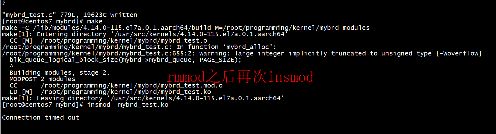
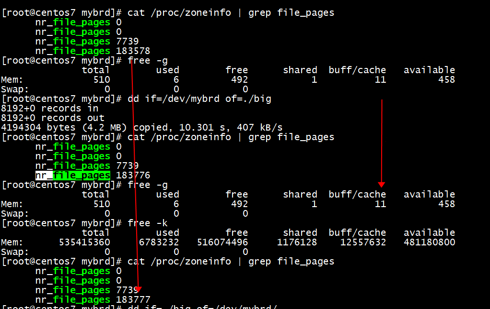
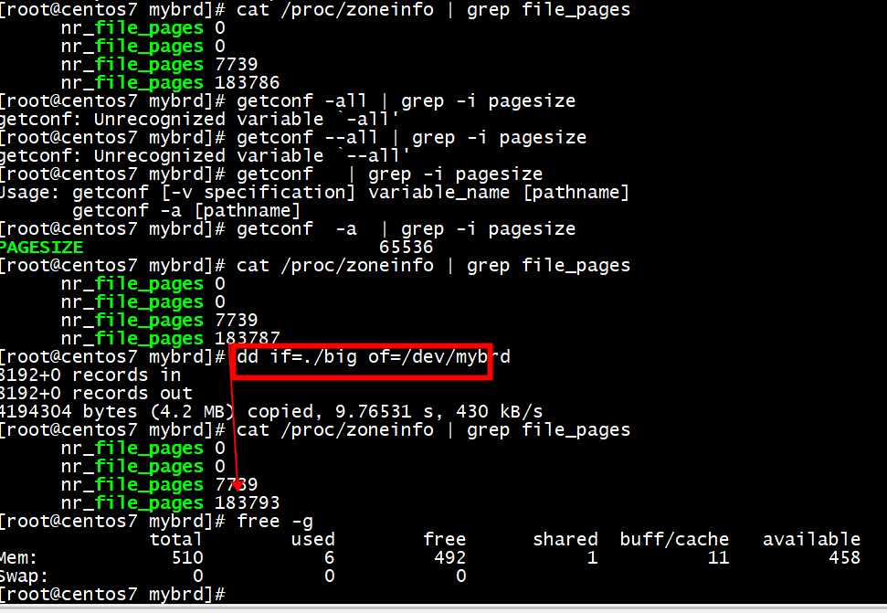
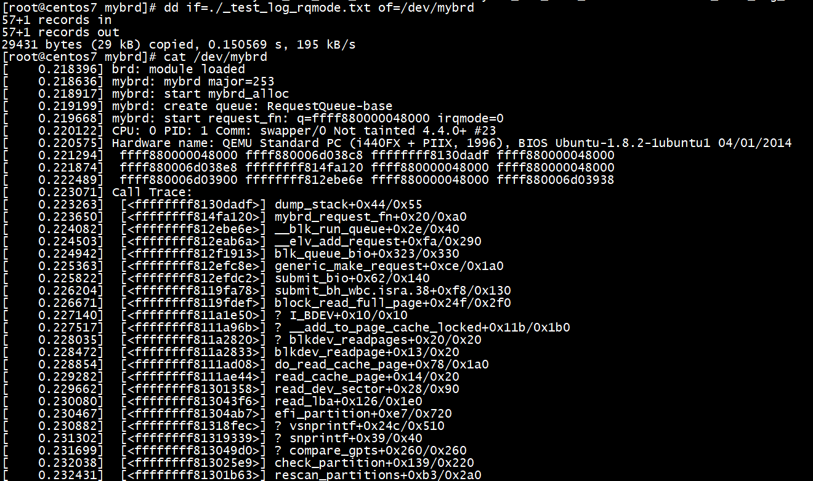

# bug

# queue mode

```C
        if (queue_mode == MYBRD_Q_BIO) {
                mybrd->mybrd_queue = blk_alloc_queue_node(GFP_KERNEL,
                                                          NUMA_NO_NODE);
                if (!mybrd->mybrd_queue)
                        goto out_free_brd;
                blk_queue_make_request(mybrd->mybrd_queue,
                                       mybrd_make_request_fn);
        } else if (queue_mode == MYBRD_Q_RQ) {
                mybrd->mybrd_queue = blk_init_queue_node(mybrd_request_fn,
                                                         &mybrd->mybrd_queue_lock,
                                                         NUMA_NO_NODE);
                if (!mybrd->mybrd_queue) {
                        pr_warn("failed to create RQ-queue\n");
                        goto out_free_brd;
                }
                blk_queue_prep_rq(mybrd->mybrd_queue, mybrd_prep_rq_fn);
                blk_queue_softirq_done(mybrd->mybrd_queue,
                                       mybrd_softirq_done_fn);
        } else if (queue_mode == MYBRD_Q_MQ) {
                mybrd->hw_queue_priv = kzalloc(nr_hw_queues *
                                           sizeof(struct mybrd_hw_queue_private),
                                           GFP_KERNEL);
                if (!mybrd->hw_queue_priv) {
                        pr_warn("failed to create queues for mq-mode\n");
                        goto out_free_brd;
                }

                mybrd->queue_depth = hw_queue_depth;
                mybrd->tag_set.ops = &mybrd_mq_ops;
                mybrd->tag_set.nr_hw_queues = nr_hw_queues;
                mybrd->tag_set.queue_depth = hw_queue_depth;
                mybrd->tag_set.numa_node = NUMA_NO_NODE;
                mybrd->tag_set.cmd_size = sizeof(struct mybrd_device);
                mybrd->tag_set.flags = BLK_MQ_F_SHOULD_MERGE;
                mybrd->tag_set.driver_data = mybrd;

                ret = blk_mq_alloc_tag_set(&mybrd->tag_set);
                if (ret) {
                        pr_warn("failed to allocate tag-set\n");
                        goto out_free_queue;
                }

                mybrd->mybrd_queue = blk_mq_init_queue(&mybrd->tag_set);
                if (IS_ERR(mybrd->mybrd_queue)) {
                        pr_warn("failed to init queue for mq-mode\n");
                        goto out_free_tag;
                }
        }
```

## MYBRD_Q_BIO

```C
  mybrd->mybrd_queue = blk_alloc_queue_node(GFP_KERNEL,
                                                          NUMA_NO_NODE);
                blk_queue_make_request(mybrd->mybrd_queue,
                                       mybrd_make_request_fn)
```

##  MYBRD_Q_MQ

```C
    ret = blk_mq_alloc_tag_set(&mybrd->tag_set);
   

    mybrd->mybrd_queue = blk_mq_init_queue(&mybrd->tag_set);
```

# insmod mybrd_test.ko

## pagecage

```
[root@centos7 mybrd]# getconf  -a  | grep -i pagesize
PAGESIZE                           65536
[root@centos7 mybrd]# 
```
 1) pagesize is 64k  
 2) mybrd disk size is 4MB  
 
 
 
 
 
  
  
## test

```
dd if=./_test_log_rqmode.txt of=/dev/mybrd
```



# references

[pagecacheand_blockdriver.md](https://github.com/gurugio/book_linuxkernel_blockdrv/blob/master/pagecacheand_blockdriver.md)  

[linux free 命令输出中 buffer 与 cache 的区别](https://blog.csdn.net/iqifenxia/article/details/121226003)  