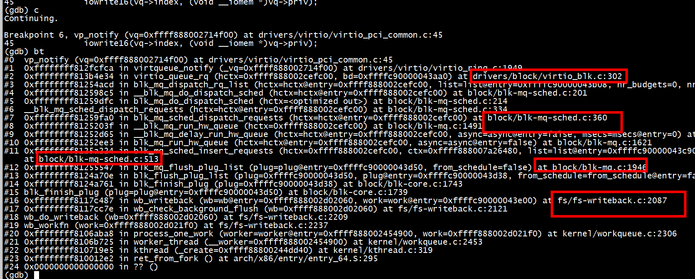
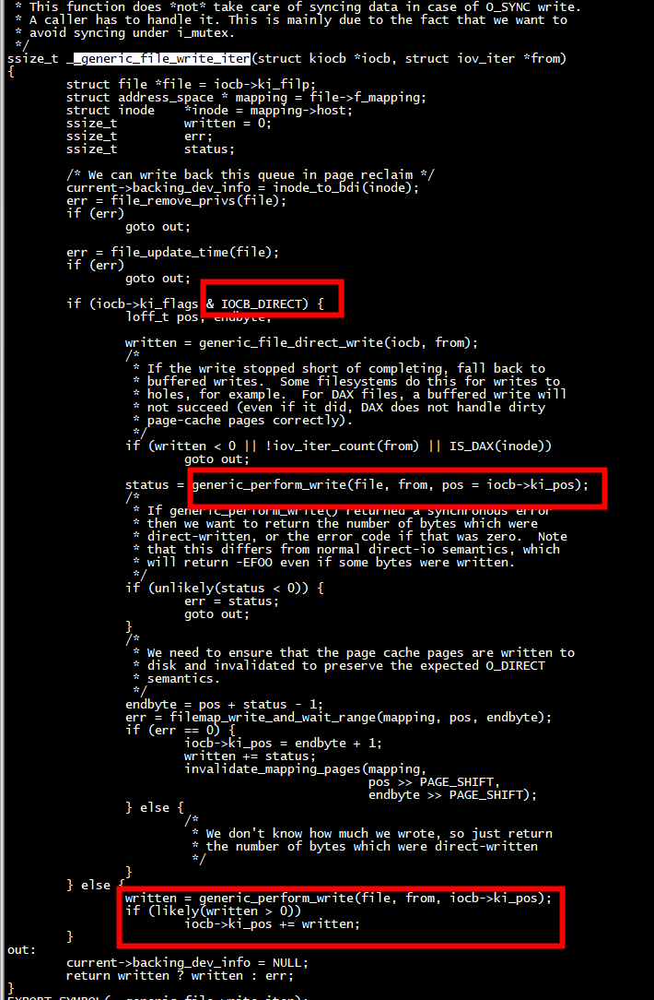
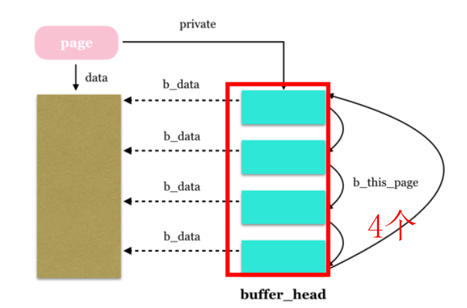
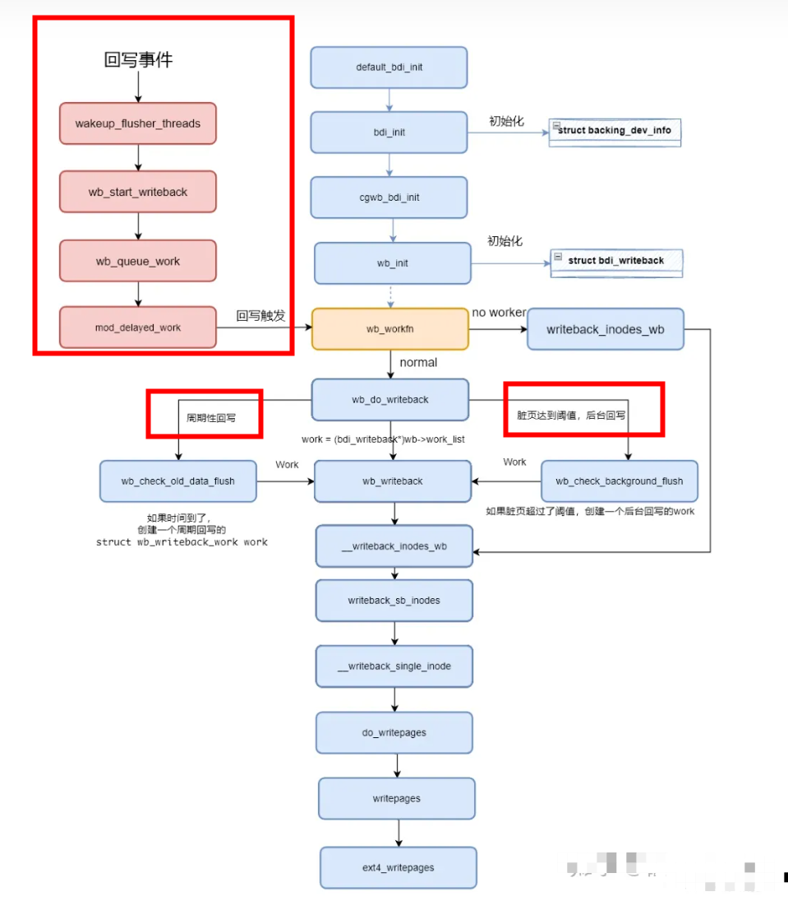
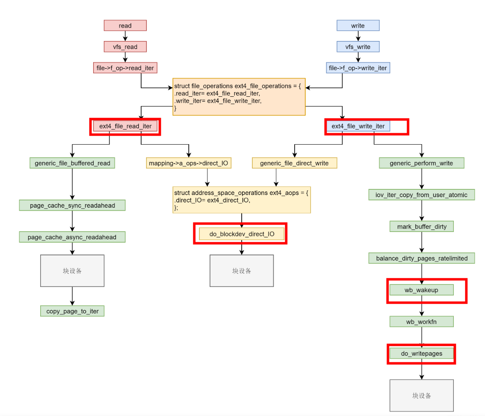

# write

 


```
Kernel panic - not syncing: corrupted stack end detected inside scheduler

CPU: 1 PID: 3540 Comm: kworker/u8:2 Not tainted 4.19.0-00014-g978b77fe75 #6
Workqueue: writeback wb_workfn (flush-179:0)
Call Trace:
[<ffffffe000c867d4>] walk_stackframe+0x0/0xa4
[<ffffffe000c869d4>] show_stack+0x2a/0x34
[<ffffffe0011a8800>] dump_stack+0x62/0x7c
[<ffffffe000c8b542>] panic+0xd2/0x1f0
[<ffffffe0011bb25c>] schedule+0x0/0x58
[<ffffffe0011bb470>] preempt_schedule_common+0xe/0x1e
[<ffffffe0011bb4b4>] _cond_resched+0x34/0x40
[<ffffffe001025694>] __spi_pump_messages+0x29e/0x40e
[<ffffffe001025986>] __spi_sync+0x168/0x16a
[<ffffffe001025b86>] spi_sync_locked+0xc/0x14
[<ffffffe001077e8e>] mmc_spi_data_do.isra.2+0x568/0xa7c
[<ffffffe0010783fa>] mmc_spi_request+0x58/0xc6
[<ffffffe001068bbe>] __mmc_start_request+0x4e/0xe2
[<ffffffe001069902>] mmc_start_request+0x78/0xa4
[<ffffffd008307394>] mmc_blk_mq_issue_rq+0x21e/0x64e [mmc_block]
[<ffffffd008307b46>] mmc_mq_queue_rq+0x11a/0x1f0 [mmc_block]
[<ffffffe000ebbf60>] __blk_mq_try_issue_directly+0xca/0x146
[<ffffffe000ebca2c>] blk_mq_request_issue_directly+0x42/0x92
[<ffffffe000ebcaac>] blk_mq_try_issue_list_directly+0x30/0x6e
[<ffffffe000ebfdc2>] blk_mq_sched_insert_requests+0x56/0x80
[<ffffffe000ebc9da>] blk_mq_flush_plug_list+0xd6/0xe6
[<ffffffe000eb3498>] blk_flush_plug_list+0x9e/0x17c
[<ffffffe000ebc2f8>] blk_mq_make_request+0x282/0x2d8
[<ffffffe000eb1d02>] generic_make_request+0xee/0x27a
[<ffffffe000eb1f6e>] submit_bio+0xe0/0x136
[<ffffffe000db10da>] submit_bh_wbc+0x130/0x176
[<ffffffe000db12c6>] __block_write_full_page+0x1a6/0x3a8
[<ffffffe000db167c>] block_write_full_page+0xce/0xe0
[<ffffffe000db40f0>] blkdev_writepage+0x16/0x1e
[<ffffffe000d3c7ca>] __writepage+0x14/0x4c
[<ffffffe000d3d142>] write_cache_pages+0x15c/0x306
[<ffffffe000d3e8a4>] generic_writepages+0x36/0x52
[<ffffffe000db40b4>] blkdev_writepages+0xc/0x14
[<ffffffe000d3f0ec>] do_writepages+0x36/0xa6
[<ffffffe000da96ca>] __writeback_single_inode+0x2e/0x174
[<ffffffe000da9c08>] writeback_sb_inodes+0x1ac/0x33e
[<ffffffe000da9dea>] __writeback_inodes_wb+0x50/0x96
[<ffffffe000daa052>] wb_writeback+0x182/0x186
[<ffffffe000daa67c>] wb_workfn+0x242/0x270
[<ffffffe000c9bb08>] process_one_work+0x16e/0x2ee
[<ffffffe000c9bcde>] worker_thread+0x56/0x42a
[<ffffffe000ca0bdc>] kthread+0xda/0xe8
[<ffffffe000c85730>] ret_from_exception+0x0/0xc
```

## ext4回写 worker
 回写的主要调用流程为：wb_workfn->wb_do_writeback->wb_writeback->writeback_sb_inodes->__writeback_single_inode->do_writepages->mapping->a_ops->writepages(比如ext4_writepages)，最终通过ext4的ext4_writepages API将dirty page对应的block，构建出相应的buffer head以及bio，然后调用submit_bio()来产生一个对block device的write操作。  
# VFS
   用户打开一个文件获取其句柄fd后，调用read(fd,buf,len)读取该设备的一段内容，经过漫长的调用路径到达
   read->sys_read->vfs_read->page_cache_sync_readahead->read_pages->ext4_readpages->mpage_readpages->do_mpage_readpages->ext4_get_block->mpage_bio_submit->submit_bio->generic_make_request之后，
   开始执行ret= q->make_request_fn(q, bio)。   
## EXT4中page cache机制

ext4_file_operations提供的file_operations   
``` 
 fs/ext4/file.c
const struct file_operations ext4_file_operations = {
        .llseek         = ext4_llseek,
        .read_iter      = ext4_file_read_iter,
        .write_iter     = ext4_file_write_iter,
        .unlocked_ioctl = ext4_ioctl,
#ifdef CONFIG_COMPAT
        .compat_ioctl   = ext4_compat_ioctl,
#endif
        .mmap           = ext4_file_mmap,
        .open           = ext4_file_open,
        .release        = ext4_release_file,
        .fsync          = ext4_sync_file,
        .get_unmapped_area = thp_get_unmapped_area,
        .splice_read    = generic_file_splice_read,
        .splice_write   = iter_file_splice_write,
        .fallocate      = ext4_fallocate,
};
```

 ext4_file_write_iter，其代码较长但核心调用为__generic_file_write_iter  
 
 ```
 mm/filemap.c
 
 ```
  
 
 首先判断iocb->ki_flags & IOCB_DIRECT，struct kiocb *iocb用来记录这笔IO操作的状态，条件满足表示是一笔direct IO，将调用generic_file_direct_write->(mapping->a_ops->direct_IO)。cache写对应的API：generic_perform_write 
 
 ```
 ssize_t generic_perform_write(struct file *file,
                                struct iov_iter *i, loff_t pos)
{
        struct address_space *mapping = file->f_mapping;
        const struct address_space_operations *a_ops = mapping->a_ops;
        long status = 0;
        ssize_t written = 0;
        unsigned int flags = 0;

        do {
                struct page *page;
                unsigned long offset;   /* Offset into pagecache page */
                unsigned long bytes;    /* Bytes to write to page */
                size_t copied;          /* Bytes copied from user */
                void *fsdata;

                offset = (pos & (PAGE_SIZE - 1));
                bytes = min_t(unsigned long, PAGE_SIZE - offset,
                                                iov_iter_count(i));

again:
                /*
                 * Bring in the user page that we will copy from _first_.
                 * Otherwise there's a nasty deadlock on copying from the
                 * same page as we're writing to, without it being marked
                 * up-to-date.
                 *
                 * Not only is this an optimisation, but it is also required
                 * to check that the address is actually valid, when atomic
                 * usercopies are used, below.
                 */
                if (unlikely(iov_iter_fault_in_readable(i, bytes))) {
                        status = -EFAULT;
                        break;
                }

                if (fatal_signal_pending(current)) {
                        status = -EINTR;
                        break;
                }

                status = a_ops->write_begin(file, mapping, pos, bytes, flags,
                                                &page, &fsdata);
                if (unlikely(status < 0))
                        break;

                if (mapping_writably_mapped(mapping))
                        flush_dcache_page(page);

                copied = iov_iter_copy_from_user_atomic(page, i, offset, bytes);
                flush_dcache_page(page);

                status = a_ops->write_end(file, mapping, pos, bytes, copied,
                                                page, fsdata);
                if (unlikely(status < 0))
                        break;
                copied = status;

                cond_resched();

                iov_iter_advance(i, copied);
                if (unlikely(copied == 0)) {
                        /*
                         * If we were unable to copy any data at all, we must
                         * fall back to a single segment length write.
                         *
                         * If we didn't fallback here, we could livelock
                         * because not all segments in the iov can be copied at
                         * once without a pagefault.
                         */
                        bytes = min_t(unsigned long, PAGE_SIZE - offset,
                                                iov_iter_single_seg_count(i));
                        goto again;
                }
                pos += copied;
                written += copied;

                balance_dirty_pages_ratelimited(mapping);
        } while (iov_iter_count(i));

        return written ? written : status;
}
 ```
  generic_perform_write中的核心代码  
 ```
 status = a_ops->write_begin(file, mapping, pos, bytes, flags,
                                                &page, &fsdata);
 ```
  generic_perform_write会主动调用cond_resched();   
 其中a_ops->write_begin即ext4_write_begin:  
 
### ext4_write_begin
首先涉及到结构体struct  address_space， 在内核中，pagecache以物理页为单位放从内存申请，每一个打开的文件都有一个struct file结构，每个struct file结构都有一个structaddress_space用于关联文件和内存，struct address_space包含一棵radix tree，Linux中radix tree将指针与long整数键值相关联，它存储效率高，并且可通过一个长整型键值快速查询。    
ext4_write_begin的过程分为以下6个步骤。   
1、首先调用ext4_writepage_trans_blocks获取本次写操作所属的文件的inode（EXT4中每个文件都对应一个inode，记录了文件尺寸、修改时间、访问权限、占用的硬盘数据块等信息），然后需要的block数目。  
2、调用***grab_cache_page_write_begin***为此次操作分配一个物理页。分配过程分为两步，首先搜索radixtree，此步需要提供一个长整型键值，这键值即index = pos >>PAGE_CACHE_SHIFT，pos是本次写操作提供的位置信息，通过调用grab_cache_page_write_begin->find_get_entry->radix_tree_lookup_slot返回index对应的slot。然后调用grab_cache_page_write_begin->find_get_entry->radix_tree_deref_slot-> rcu_dereference，认领radixtree中slot对应的page，并将页信息保存在struct page中。  
3、调用ext4_journal_start开启EXT4的journal功能，EXT4提供三种日志模式：journal、ordered、writeback。其中ordered模式为默认的缺省模式。journal模式提供了完全的数据块和元数据快的日志，所有的数据都会被先写入到日志里，然后再写入磁盘上。在文件系统崩溃的时候，日志就可以进行重放，把数据和元数据带回到一个一致性的状态，journal模式性能是三种模式中最低的，因为所有的数据都需要日志来记录。ordered模式下，ext4文件系统只提供元数据的日志。  
4、调用lock_page将struct page* page->flags设置为PG_locked，此处page正是步骤2获取的page，此处操作保证此page不再被其他文件使用。
5、调用wait_for_stable_page等待可能正在进行的writeback执行完成。
6、如果不需要加密，则调用__block_write_begin。需要说明的是page在内核中被称为缓存页，在文件系统中扮演最核心的角色。***Linux使用内存缓存文件数据，而所有的文件内容都被分割成page然后通过一定方式组织起来，便于查找。而buffer_head则是描述缓冲区的元数据。由于内核以page为单位管理文件内容，page典型大小为4KB，而一般块设备的访问以扇区为单位，扇区的一般大小为512B，当然随着技术的进步，这个大小也在不断提升。而文件系统最小逻辑可寻址单元称为块（block）。块的大小要比扇区大，但又比页小，典型大小为1K。内核执行磁盘的所有操作是按照块来操作的。在如此背景之下，便诞生了buffer_head这样的数据结构，它是内核page与磁盘上物理数据块之间的桥梁。***   			一方面，每个page包含多个buffer_head（一般4个），另外一方面，buffer_head中又记录了底层设备块号信息。这样，通过
page->buffer_head->block
就能完成数据的读写。page与buffer_head数据结构之间关系如下图所示，假设page大小为4KB，而文件系统块大小为1KB。
 
 

#### grab_cache_page_write_begin
grab_cache_page_write_begin   查获取一个缓存页或者创建一个缓存页。
     -> page_cache_get_page   从mapping的radixtree中查找缓存页，假如不存在，则从伙伴系统中申请一个新页插入，并添加到LRU链表中。

### ext4_write_end
a_ops-write_end即ext4_write_end，它主要工作:
1) 调用__block_commit_write提交写入的数
2)更新inode信息以及调用block_write_end将page标记为dirty，调用路径是block_write_end-> __block_commit_write -> mark_buffer_dirty。   

### balance_dirty_pages_ratelimited 

在balance_dirty_pages_ratelimited 里面，发现脏页的数据超过了规定的数目，就调用balance_dirty_pages->wb_start_background_writeback，启动一个背后线程开始回写.

#### 回写 worker

 wb_workfn->wb_do_writeback->wb_writeback->writeback_sb_inodes->__writeback_single_inode->do_writepages，写入页面到硬盘。

在调用write的最后，当发现缓存的数据太多的时候，会触发回写，这仅仅是回写的一种场景。另外还有几种场景也会触发回写：  
1）用户主动调用 sync，将缓存刷到硬盘上去，最终会调用 wakeup_flusher_threads，同步脏页；  
2）当内存十分紧张，以至于无法分配页面的时候，会调用free_more_memory，最终会调用wakeup_flusher_threads，释放脏页  
3）脏页已经更新了较长时间，时间上超过了timer，需要及时回写，保存内存和磁盘上数据一致性 

 

```
void wb_workfn(struct work_struct *work)
{
 struct bdi_writeback *wb = container_of(to_delayed_work(work),
      struct bdi_writeback, dwork);
 long pages_written;

 set_worker_desc("flush-%s", dev_name(wb->bdi->dev));
 current->flags |= PF_SWAPWRITE;

 if (likely(!current_is_workqueue_rescuer() ||
     !test_bit(WB_registered, &wb->state))) {
  do {
   pages_written = wb_do_writeback(wb);
   trace_writeback_pages_written(pages_written);
  } while (!list_empty(&wb->work_list)); // 正常情况下遍历work_list，执行wb_do_writeback
 } else {
  pages_written = writeback_inodes_wb(wb, 1024,
          WB_REASON_FORKER_THREAD); // 没有足够的worker去处理writeback，紧急情况下回写。
  trace_writeback_pages_written(pages_written);
 }

 if (!list_empty(&wb->work_list))
  wb_wakeup(wb); // 如果没有处理完，再唤醒处理一次
 else if (wb_has_dirty_io(wb) && dirty_writeback_interval)
  wb_wakeup_delayed(wb); // 如果还有dirty inode在其他list，延迟500再执行一次

 current->flags &= ~PF_SWAPWRITE;
}
```

# do_writepages  and sync

ext4_sync_file -> file_write_and_wait_range-> __filemap_fdatawrite_range->  do_writepages

 执行filemap_fdatawait_range->__filemap_fdatawait_range->wait_on_page_writeback->wait_on_page_bit 会使进程休眠。等文件数据块最终写入磁盘，由底层驱动的中断函数调用回调函数，最终执行到end_page_writeback函数唤醒休眠的写文件进程。

#   flusher 线程

 

# 总结

在系统调用层我们需要仔细学习 read 和 write。在 VFS 层调用的是 vfs_read 和 vfs_write 并且调用 file_operation。在 ext4 层调用的是 ext4_file_read_iter 和 ext4_file_write_iter。接下来就是分叉：缓存 I/O 和直接 I/O。   
1）直接IO读写的流程是一样的，调用ext4_direct_IO，再往下就是调用块设备层了   
2）缓存IO读写流程不一样。对于读，从块设备读取到缓存中，然后从缓存中拷贝到用户态。对于写，从用户态拷贝到缓存，设备缓存页为脏，然后启动一个线程写入块设备   

 


 
两者区别，O_DIRECT 把一片地址配置成不带cache的空间 , 直接导硬盘 , 而 O_SYNC 类似CPU cache的write through. 当应用程序使用O_SYNC写page cache时，直接写穿到硬盘。当应用程序同时使用O_SYNC和 O_DIRECT，可能会出现page cache的不一致问题。