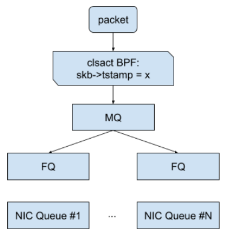

#  FQ 队列
 



**Fair Queue(FQ) 公平队列**，这个方法是 google 在 https://netdevconf.info/0x14/pub/papers/55/0x14-paper55-talk-paper.pdf 这个论文里提到的。这个方法中 bpf 程序通过上下文参数中的 ``skb->tstamp`` 设置 skb 的 EDT（ Earliest Departure Time），FQ 模块会读取这个时间来调度包的发送。

``` 

    SEC("myedt")
    int cls_bpf_prog1(struct __sk_buff *skb)
    {
        // 将发送包的时间延后 1 秒
        skb->tstamp = bpf_ktime_get_ns() + 1000000000;
        return TC_ACT_OK;
    }
``` 

挂载 tc clsact bpf 程序和 FQ 模块：

``` bash

    tc qdisc add dev eth0 root fq
    tc qdisc add dev eth0 clsact
    tc filter add dev eth0 ingress bpf da obj cls_bpf.o sec myedt
    tc filter add dev eth0 egress bpf da obj cls_bpf.o sec myedt
``` 

这个方法比方法一的性能要好，但是实现稍微复杂点，上面的 bpf 程序只是展示了这种控制的原理，实际应用中 bpf 需要自行通过算法来计算 EDT。     

内核中自带的一个比较完整的示例：

- https://github.com/torvalds/linux/blob/master/tools/testing/selftests/bpf/progs/test_tc_edt.c
- https://github.com/torvalds/linux/blob/master/tools/testing/selftests/bpf/test_tc_edt.sh

BPF 对流量进行分类，根据用户定义的限速带宽，为每个包设置一个离开时间（ departure time），其实就是一个时间戳 skb->tstamp。   
在物理设备上设置 FQ qdisc，FQ qdisc 会根据这个时间戳对包进行调度。保证不会早于这个时间戳将包发送出去。   


