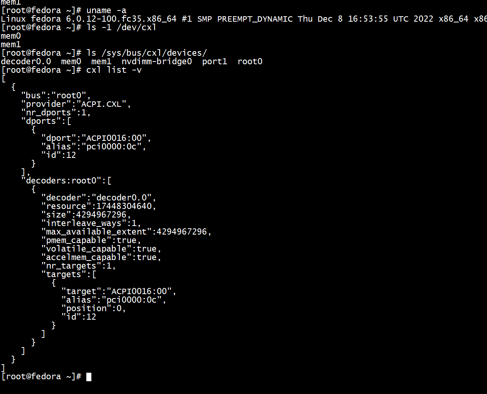

# CXL

Linux 6.3 will most of the required patches for PMEM and RAM regions. Qemu branch cxl-2023-01-26 from https://gitlab.com/jic23/qemu works.

### Single PMEM device on single 4-core socket

First we need a CXL hostbridge (pxb-cxl "cxl.1" here), then we attach a root-port (cxl-rp "root_port13" here), then a Type 3 device.

In this case is PMEM device so it needs two "memory-backend-file" objects, one for the memory ("pmem0" here) and one for its label storage area ("cxl-lsa0" here). Finally we need a Fixed Memory Window (cxl-fwm) to map that memory in the host.

There can be multiple PXBs, multiple RPs behind each PXB, but only one device behind each RP unless we place CXL switches between RP and devices.

```
qemu-system-x86_64 \
  -machine q35,accel=kvm,nvdimm=on,cxl=on \
  -drive if=pflash,format=raw,file=$FILES/OVMF.fd \
  -drive media=disk,format=qcow2,file=$FILES/efi.qcow2 \
  -device e1000,netdev=net0,mac=52:54:00:12:34:56 \
  -netdev user,id=net0,hostfwd=tcp::10022-:22 \
  -m 4G,slots=8,maxmem=8G \
  -smp 4 \
  -object memory-backend-ram,size=4G,id=mem0 \
  -numa node,nodeid=0,cpus=0-3,memdev=mem0 \
  -object memory-backend-file,id=pmem0,share=on,mem-path=/tmp/cxltest.raw,size=256M \
  -object memory-backend-file,id=cxl-lsa0,share=on,mem-path=/tmp/lsa.raw,size=256M \
  -device pxb-cxl,bus_nr=12,bus=pcie.0,id=cxl.1 \
  -device cxl-rp,port=0,bus=cxl.1,id=root_port13,chassis=0,slot=2 \
  -device cxl-type3,bus=root_port13,persistent-memdev=pmem0,lsa=cxl-lsa0,id=cxl-pmem0 \
  -M cxl-fmw.0.targets.0=cxl.1,cxl-fmw.0.size=4G
```

### Two RAM devices on single 4-core socket, on different PXBs

RAM devices need only one Qemu object ("memory-backend-ram" since its volatile) since they have no LSA.

We define 2 FWM, one per PXB. We'll get one region per device.

Devices are attached to different PXBs here, with a single RP each, although that's not required (see below).

```
qemu-system-x86_64 \
  -machine q35,accel=kvm,nvdimm=on,cxl=on \
  -drive if=pflash,format=raw,file=$FILES/OVMF.fd \
  -drive media=disk,format=qcow2,file=$FILES/efi.qcow2 \
  -device e1000,netdev=net0,mac=52:54:00:12:34:56 \
  -netdev user,id=net0,hostfwd=tcp::10022-:22 \
  -m 2G,slots=8,maxmem=6G \
  -smp cpus=4,cores=2,sockets=2 \
  -object memory-backend-ram,size=1G,id=mem0 \
  -numa node,nodeid=0,cpus=0-1,memdev=mem0 \
  -object memory-backend-ram,size=1G,id=mem1 \
  -numa node,nodeid=1,cpus=2-3,memdev=mem1 \
  -object memory-backend-ram,id=vmem0,share=on,size=256M \
  -device pxb-cxl,numa_node=0,bus_nr=12,bus=pcie.0,id=cxl.1 \
  -device cxl-rp,port=0,bus=cxl.1,id=root_port13,chassis=0,slot=2 \
  -device cxl-type3,bus=root_port13,volatile-memdev=vmem0,id=cxl-vmem0 \
  -object memory-backend-ram,id=vmem1,share=on,size=256M \
  -device pxb-cxl,numa_node=1,bus_nr=14,bus=pcie.0,id=cxl.2 \
  -device cxl-rp,port=0,bus=cxl.2,id=root_port14,chassis=1,slot=2 \
  -device cxl-type3,bus=root_port14,volatile-memdev=vmem1,id=cxl-vmem1 \
  -M cxl-fmw.0.targets.0=cxl.1,cxl-fmw.0.size=4G,cxl-fmw.1.targets.0=cxl.2,cxl-fmw.1.size=4G
```

### Two RAM devices on single 4-core socket, on single PXB

Same as above but we don't want two PXBs. We have 2 RPs on the same PXB, and one device on each RP.

Another solution would be to have a single RP and a switch (see below). However Linux (at least 6.3) doesn't correct propagate decoders unless we have a second RP, hence we'd need to add a second RP anyway.

```
qemu-system-x86_64 \
  -machine q35,accel=kvm,nvdimm=on,cxl=on \
  -drive if=pflash,format=raw,file=$FILES/OVMF.fd \
  -drive media=disk,format=qcow2,file=$FILES/efi.qcow2 \
  -device e1000,netdev=net0,mac=52:54:00:12:34:56 \
  -netdev user,id=net0,hostfwd=tcp::10022-:22 \
  -m 2G,slots=8,maxmem=6G \
  -smp cpus=4,cores=2,sockets=2 \
  -object memory-backend-ram,size=1G,id=mem0 \
  -numa node,nodeid=0,cpus=0-1,memdev=mem0 \
  -object memory-backend-ram,size=1G,id=mem1 \
  -numa node,nodeid=1,cpus=2-3,memdev=mem1 \
  -object memory-backend-ram,id=vmem0,share=on,size=256M \
  -object memory-backend-ram,id=vmem1,share=on,size=256M \
  -device pxb-cxl,numa_node=0,bus_nr=12,bus=pcie.0,id=cxl.1 \
  -device cxl-rp,port=0,bus=cxl.1,id=root_port13,chassis=0,slot=2 \
  -device cxl-type3,bus=root_port13,volatile-memdev=vmem0,id=cxl-vmem0 \
  -device cxl-rp,port=0,bus=cxl.1,id=root_port14,chassis=1,slot=2 \
  -device cxl-type3,bus=root_port14,volatile-memdev=vmem1,id=cxl-vmem1 \
  -M cxl-fmw.0.targets.0=cxl.1,cxl-fmw.0.size=4G
```

There's a single FWM here, can be used either as a single interleaved region or 2 separate regions.

### Single socket with CXL switch in front of 2 switches with 2 regions each, but single region usable

Below the PXB+RP, we create a switch 'interm0' with 'cxl-upstream'. Then we define two ports 'intermport0' and 'intermport1' below that switch with 'cxl-downstream'. Below each port, we attach one switch ('us0' and 'us1' respectively). And finally we put one RAM device and one PMEM device below 'us0', and one RAM device and one RAM+PMEM device below 'us1'.

Single FWM, hence no way to use both RAM and PMEM simultaneously. But multiple RAM (or PMEM respectively) devices may be used simultaneously either as separed RAM regions (or PMEM respectively) or a single interleaved one.

```
qemu-system-x86_64 \
  -machine q35,accel=kvm,nvdimm=on,cxl=on \
  -drive if=pflash,format=raw,file=$FILES/OVMF.fd \
  -drive media=disk,format=qcow2,file=$FILES/efi.qcow2 \
  -device e1000,netdev=net0,mac=52:54:00:12:34:56 \
  -netdev user,id=net0,hostfwd=tcp::10022-:22 \
  -m 4G,slots=8,maxmem=8G \
  -smp 4 \
  -object memory-backend-ram,size=4G,id=mem0 \
  -numa node,nodeid=0,cpus=0-3,memdev=mem0 \
  -object memory-backend-ram,id=cxl-mem0,share=on,size=256M \
  -object memory-backend-file,id=cxl-pmem1,share=on,mem-path=/tmp/cxltest1.raw,size=256M \
  -object memory-backend-ram,id=cxl-mem2,share=on,size=256M \
  -object memory-backend-ram,id=cxl-mem3,share=on,size=256M \
  -object memory-backend-file,id=cxl-pmem3,share=on,mem-path=/tmp/cxltest3.raw,size=256M \
  -object memory-backend-file,id=cxl-lsa1,share=on,mem-path=/tmp/lsa1.raw,size=256M \
  -object memory-backend-file,id=cxl-lsa3,share=on,mem-path=/tmp/lsa3.raw,size=256M \
  -device pxb-cxl,bus_nr=12,bus=pcie.0,id=cxl.1 \
  -device cxl-rp,port=0,bus=cxl.1,id=root_port0,chassis=0,slot=0 \
  -device cxl-upstream,bus=root_port0,id=interm0 \
  -device cxl-downstream,port=0,bus=interm0,id=intermport0,chassis=1,slot=1 \
  -device cxl-downstream,port=1,bus=interm0,id=intermport1,chassis=1,slot=2 \
  -device cxl-upstream,bus=intermport0,id=us0 \
  -device cxl-downstream,port=0,bus=us0,id=swport0,chassis=2,slot=4 \
  -device cxl-type3,bus=swport0,volatile-memdev=cxl-mem0,id=cxl-mem0 \
  -device cxl-downstream,port=1,bus=us0,id=swport1,chassis=2,slot=5 \
  -device cxl-type3,bus=swport1,persistent-memdev=cxl-pmem1,lsa=cxl-lsa1,id=cxl-pmem1 \
  -device cxl-upstream,bus=intermport1,id=us1 \
  -device cxl-downstream,port=2,bus=us1,id=swport2,chassis=3,slot=6 \
  -device cxl-type3,bus=swport2,volatile-memdev=cxl-mem2,id=cxl-mem2 \
  -device cxl-downstream,port=3,bus=us1,id=swport3,chassis=3,slot=7 \
  -device cxl-type3,bus=swport3,volatile-memdev=cxl-mem3,persistent-memdev=cxl-pmem3,lsa=cxl-lsa3,id=cxl-pmem3 \
  -M cxl-fmw.0.targets.0=cxl.1,cxl-fmw.0.size=4G
```

### Two sockets with one CXL switch each, and 3 devices between each switch, with 4 FWM

4 PXB. 1st and 4th have a single device. 2nd and 3rd have a switch with 2 devices each.

4 FWM, one per PXB.

```
qemu-system-x86_64 \
  -machine q35,accel=kvm,nvdimm=on,cxl=on \
  -drive if=pflash,format=raw,file=$FILES/OVMF.fd \
  -drive media=disk,format=qcow2,file=$FILES/efi.qcow2 \
  -device e1000,netdev=net0,mac=52:54:00:12:34:56 \
  -netdev user,id=net0,hostfwd=tcp::10022-:22 \
  -m 2G,slots=8,maxmem=6G \
  -smp cpus=4,cores=2,sockets=2 \
  -object memory-backend-ram,size=1G,id=mem0 \
  -numa node,nodeid=0,cpus=0-1,memdev=mem0 \
  -object memory-backend-ram,size=1G,id=mem1 \
  -numa node,nodeid=1,cpus=2-3,memdev=mem1 \
\
  -object memory-backend-ram,id=cxl-mem0,share=on,size=256M \
  -device pxb-cxl,numa_node=0,bus_nr=16,bus=pcie.0,id=cxl.0 \
  -device cxl-rp,port=0,bus=cxl.0,id=root_port16,chassis=0,slot=0 \
  -device cxl-type3,bus=root_port16,volatile-memdev=cxl-mem0,id=cxl-mem0 \
\
  -object memory-backend-file,id=cxl-pmem1,share=on,mem-path=/tmp/cxltest1.raw,size=256M \
  -object memory-backend-file,id=cxl-lsa1,share=on,mem-path=/tmp/lsa1.raw,size=256M \
  -object memory-backend-ram,id=cxl-mem2,share=on,size=256M \
  -object memory-backend-file,id=cxl-pmem2,share=on,mem-path=/tmp/cxltest2.raw,size=256M \
  -object memory-backend-file,id=cxl-lsa2,share=on,mem-path=/tmp/lsa2.raw,size=256M \
  -device pxb-cxl,numa_node=0,bus_nr=24,bus=pcie.0,id=cxl.1 \
  -device cxl-rp,port=0,bus=cxl.1,id=root_port24,chassis=1,slot=0 \
  -device cxl-upstream,bus=root_port24,id=sw0 \
  -device cxl-downstream,port=1,bus=sw0,id=sw0port1,chassis=1,slot=1 \
  -device cxl-type3,bus=sw0port1,persistent-memdev=cxl-pmem1,lsa=cxl-lsa1,id=cxl-pmem1 \
  -device cxl-downstream,port=2,bus=sw0,id=sw0port2,chassis=1,slot=2 \
  -device cxl-type3,bus=sw0port2,volatile-memdev=cxl-mem2,persistent-memdev=cxl-pmem2,lsa=cxl-lsa2,id=cxl-pmem2 \
\
  -device pxb-cxl,numa_node=1,bus_nr=32,bus=pcie.0,id=cxl.2 \
  -device cxl-rp,port=0,bus=cxl.2,id=root_port32,chassis=2,slot=0 \
  -device cxl-upstream,bus=root_port32,id=sw1 \
  -device cxl-downstream,port=0,bus=sw1,id=sw1port0,chassis=2,slot=1 \
  -object memory-backend-ram,id=cxl-mem3,share=on,size=256M \
  -device cxl-type3,bus=sw1port0,volatile-memdev=cxl-mem3,id=cxl-mem3 \
  -device cxl-downstream,port=1,bus=sw1,id=sw1port1,chassis=2,slot=2 \
  -object memory-backend-ram,id=cxl-mem4,share=on,size=256M \
  -device cxl-type3,bus=sw1port1,volatile-memdev=cxl-mem4,id=cxl-mem4 \
\
  -object memory-backend-file,id=cxl-pmem5,share=on,mem-path=/tmp/cxltest5.raw,size=256M \
  -object memory-backend-file,id=cxl-lsa5,share=on,mem-path=/tmp/lsa5.raw,size=256M \
  -device pxb-cxl,numa_node=1,bus_nr=40,bus=pcie.0,id=cxl.3 \
  -device cxl-rp,port=0,bus=cxl.3,id=root_port40,chassis=3,slot=0 \
  -device cxl-type3,bus=root_port40,persistent-memdev=cxl-pmem5,lsa=cxl-lsa5,id=cxl-pmem5 \
  -M \
cxl-fmw.0.targets.0=cxl.0,cxl-fmw.0.size=4G,\
cxl-fmw.1.targets.0=cxl.1,cxl-fmw.1.size=4G,\
cxl-fmw.2.targets.0=cxl.2,cxl-fmw.2.size=4G,\
cxl-fmw.3.targets.0=cxl.3,cxl-fmw.3.size=4G
```

### Interleaving across PXBs

It's possible to interleave regions across multiple devices, very easily when on the same PXB, but also on different PXB. In the latter case, the FWM must specify multiple targets and interleaving commands (see below) will have to strictly match these targets.

This configuration will interleave the first FWM between buses cxl.1 and cxl.2 with granularity 8k:
```
-M cxl-fmw.0.targets.0=cxl.1,cxl-fmw.0.targets.1=cxl.2,cxl-fmw.0.size=4G,cxl-fmw.0.interleave-granularity=8k
```

### Using CXL devices on Linux

The CXL command-line tool comes with ndctl. However release 0.76 doesn't contain support for volatile regions yet. Use the vv/volatile-regions branch from the https://github.com/pmem/ndctl

To see the list of devices:
```
$ cxl list -M
```

To see the list of decoders:
```
$ cxl list -D
```

#### Decoders

Using regions requires a "decoder" at each level of the hierarchy. In practice, only the "root" decoder is required at region creation. Other level will get their decoder automatically (except on Linux 6.3 where single RP can cause some decoder shortage...).

The cxl tool is supposed to find the right decoder automatically but it doesn't do it yet, hence we have to manually specifying it.

Root decoders are decoder0.0 ... decoder0.3 if there are 4 PXB. To see which PCI bus is associated with a decoder, run `cxl list -v` and look for `decoders:root`. Attribute `"target":"pci0000:10"` means all PCI/CXL devices behing that bus may use that decoder.

Otherwise just try decoder0.X until it works.

#### RAM regions

To create a region using RAM device "mem0" and decoder "decoder0.0":
```
$ cxl create-region -m -t ram -d decoder0.0 mem0
```
To create a region interleaved between 2 RAM device "mem0" and "mem1" and decoder "decoder0.0":
```
$ cxl create-region -m -t ram -d decoder0.0 -w 2 mem0 mem1
```
Once a RAM region is created, a new DAX device should appear under /sys/bus/dax/devices. Linux 6.3 may make it an offline NUMA node by default. Use `daxctl online-memory dax0.0` to make it online. Older kernels may make it a DAX device only instead. Use `daxctl reconfigure-device --mode=devdax dax0.0` to make it an (online) NUMA node.

A single decoder may be used for multiple regions, but it cannot mix RAM and PMEM regions.

#### PMEM regions

If using PMEM device, change into `-t pmem` (and change the decoder if already used for a RAM region).
```
$ cxl create-region -m -t pmem -d decoder0.1 mem1
```
PMEM regions need a namespace before they are usable:
```
$ ndctl create-namespace -t pmem -m devdax -r region0 -f
```
This will create DAX device such as dax0.0, which is not converted to NUMA node automatically. Use `daxctl reconfigure-device --mode=devdax dax0.0` to do so.


# my test


## images
```
wget https://fedora-mirror02.rbc.ru/pub/fedora-archive/fedora/linux/releases/35/Cloud/x86_64/images/Fedora-Cloud-Base-35-1.2.x86_64.qcow2  -O Fedora-Cloud-Base-35-1.2.x86_64.qcow2
```

```
root@ubuntux86:# mv Fedora-Cloud-Base-35-1.2.x86_64.qcow2  CXL-Test.qcow2
root@ubuntux86:# qemu-img resize  CXL-Test.qcow2 +15G
Image resized.
root@ubuntux86:# qemu-img info CXL-Test.qcow2
image: CXL-Test.qcow2
file format: qcow2
virtual size: 20 GiB (21474836480 bytes)
disk size: 359 MiB
cluster_size: 65536
Format specific information:
    compat: 0.10
    compression type: zlib
    refcount bits: 16
root@ubuntux86:# 
```
更改密码   
```
virt-sysprep --root-password password:123456 -a CXL-Test.qcow2 
```

```

[root@fedora ~]# uname -a
Linux fedora 5.14.10-300.fc35.x86_64 #1 SMP Thu Oct 7 20:48:44 UTC 2021 x86_64 x86_64 x86_64 GNU/Linux
```
+ 配置ip   
```
ip a add 192.168.11.22/24 dev eth0
ip r add default  via 192.168.11.33
[root@fedora ~]# ping www.baidu.com
PING www.a.shifen.com (183.2.172.42) 56(84) bytes of data.
64 bytes from 183.2.172.42 (183.2.172.42): icmp_seq=1 ttl=48 time=44.0 ms
64 bytes from 183.2.172.42 (183.2.172.42): icmp_seq=2 ttl=48 time=43.0 ms

--- www.a.shifen.com ping statistics ---
2 packets transmitted, 2 received, 0% packet loss, time 1001ms
rtt min/avg/max/mdev = 42.972/43.490/44.008/0.518 ms
[root@fedora ~]# 


```

+ 内核更新

更新前  
```
[root@fedora boot]# cat config-5.14.10-300.fc35.x86_64  | grep CONFIG_CXL
CONFIG_CXL_BUS=y
CONFIG_CXL_MEM=m
# CONFIG_CXL_MEM_RAW_COMMANDS is not set
CONFIG_CXL_ACPI=y
CONFIG_CXL_PMEM=m
[root@fedora boot]# 
```


```
dnf --enablerepo=fedora-kernel-vanilla-stable update
```

```
[root@fedora ~]# uname -a
Linux fedora 6.0.12-100.fc35.x86_64 #1 SMP PREEMPT_DYNAMIC Thu Dec 8 16:53:55 UTC 2022 x86_64 x86_64 x86_64 GNU/Linux
[root@fedora ~]# 
[root@fedora boot]# cat config-6.0.12-100.fc35.x86_64  | grep CONFIG_CXL
CONFIG_CXL_BUS=y
CONFIG_CXL_PCI=y
# CONFIG_CXL_MEM_RAW_COMMANDS is not set
CONFIG_CXL_ACPI=y
CONFIG_CXL_PMEM=m
CONFIG_CXL_MEM=m
CONFIG_CXL_PORT=y
CONFIG_CXL_SUSPEND=y
CONFIG_CXL_REGION=y

```

+  ndctl 

```
[root@fedora boot]# ndctl --version
74
[root@fedora boot]# 
```

+ cxl   
```
1) Query the repository to confirm if the cxl-cli package is available:

Copy
dnf search cxl-cli 
2) Install the cxl-cli package

Copy
dnf install cxl-cli
```


## ubuntu    
```
 apt-get install libndctl-dev
```

```
apt-get install -y libkmod-dev
apt-get install xmlto
```
升级cmake
```
apt-get -y install cmake
```

```
python3 -m pip install asciidoc
```


```
git clone -b ndctl-58.y  https://github.com/pmem/ndctl.git
./autogen.sh
./configure CFLAGS='-g -O2' --prefix=/usr/local --sysconfdir=/etc --libdir=/usr/local/lib64
make
```

## qemu

退出快捷键:Ctrl + a,然后按 x 键(不要Ctrl)      
 Press Ctrl+a and c to exit kernel and then press q to exit Qemu.   

```
git clone https://gitlab.com/jic23/qemu.git

cd qemu

git checkout cxl-2023-05-25
root@ubuntux86:# mkdir build
root@ubuntux86:# cd build
root@ubuntux86:# ../configure --prefix=/opt/qemu-jic23 --target-list=i386-softmmu,x86_64-softmmu --enable-libpmem --enable-slirp
make -j all
make install
```

 
 + bug1

```
Looking for a fallback subproject for the dependency slirp

../meson.build:964:10: ERROR: Automatic wrap-based subproject downloading is disabled

A full log can be found at /work/cxl/cxl-qemu/qemu/build/meson-logs/meson-log.txt

ERROR: meson setup failed
```
安装依赖  
```
 apt-get -y install libslirp-dev
 apt-get -y install libpmem-dev
```

## test

```
/opt/qemu-jic23/bin/qemu-system-x86_64 -drive file=CXL-Test.qcow2,format=qcow2,index=0,media=disk,id=hd \
        -m 4G,slots=8,maxmem=8G \
        -smp 4 \
        -machine type=q35,accel=kvm,nvdimm=on,cxl=on \
        -enable-kvm \
        -netdev tap,id=tap0,ifname=tap0,script=no,downscript=no,vhost=on  -device virtio-net-pci,netdev=tap0,mac=52:55:00:d1:55:01 \
        -nographic \
        -m 2G,slots=8,maxmem=6G \
          -smp cpus=4,cores=2,sockets=2 \
        -object memory-backend-ram,size=1G,id=mem0 \
          -numa node,nodeid=0,cpus=0-1,memdev=mem0 \
            -object memory-backend-ram,size=1G,id=mem1 \
              -numa node,nodeid=1,cpus=2-3,memdev=mem1 \
                -object memory-backend-ram,id=vmem0,share=on,size=256M \
                  -object memory-backend-ram,id=vmem1,share=on,size=256M \
                    -device pxb-cxl,numa_node=0,bus_nr=12,bus=pcie.0,id=cxl.1 \
                      -device cxl-rp,port=0,bus=cxl.1,id=root_port13,chassis=0,slot=2 \
                        -device cxl-type3,bus=root_port13,volatile-memdev=vmem0,id=cxl-vmem0 \
                          -device cxl-rp,port=0,bus=cxl.1,id=root_port14,chassis=1,slot=2 \
                            -device cxl-type3,bus=root_port14,volatile-memdev=vmem1,id=cxl-vmem1 \
                              -M cxl-fmw.0.targets.0=cxl.1,cxl-fmw.0.size=4G
```

```
[root@fedora ~]# ls -1 /dev/cxl
[root@fedora ~]# ls /sys/bus/cxl/devices/
```


```
 [root@fedora ~]# ls -1 /dev/cxl
mem0
mem1
[root@fedora ~]# cxl list -v
[
  {
    "bus":"root0",
    "provider":"ACPI.CXL",
    "nr_dports":1,
    "dports":[
      {
        "dport":"ACPI0016:00",
        "alias":"pci0000:0c",
        "id":12
      }
    ],
    "decoders:root0":[
      {
        "decoder":"decoder0.0",
        "resource":17448304640,
        "size":4294967296,
        "interleave_ways":1,
        "max_available_extent":4294967296,
        "pmem_capable":true,
        "volatile_capable":true,
        "accelmem_capable":true,
        "nr_targets":1,
        "targets":[
          {
            "target":"ACPI0016:00",
            "alias":"pci0000:0c",
            "position":0,
            "id":12
          }
        ]
      }
    ]
  }
]
```

## 


```
[root@fedora ~]#  cxl list -D
[
  {
    "decoder":"decoder0.0",
    "resource":19595788288,
    "size":4294967296,
    "interleave_ways":1,
    "max_available_extent":4294967296,
    "pmem_capable":true,
    "volatile_capable":true,
    "accelmem_capable":true,
    "nr_targets":1
  }
]
[root@fedora ~]# cxl list -M
[
  {
    "memdev":"mem0",
    "pmem_size":268435456,
    "ram_size":0,
    "serial":0,
    "host":"0000:0d:00.0"
  }
]
```
# cxl create-region   

```
[root@localhost ~]# cxl create-region -d decoder0.0 -t pmem -m mem0
[ 1082.012739] cxl_region region0: Failed to synchronize CPU cache state
libcxl: cxl_region_enable: region0: failed to enable
cxl region: create_region: region0: failed to enable: No such device or address
cxl region: cmd_create_region: created 0 regions
```


# References
* Related kernel patch:https://patchwork.kernel.org/project/linux-nvdimm/patch/20190225185740.8660866F@viggo.jf.intel.com/#22501531
* Using instructions from here: https://stevescargall.com/2019/07/09/how-to-extend-volatile-system-memory-ram-using-persistent-memory-on-linux/
