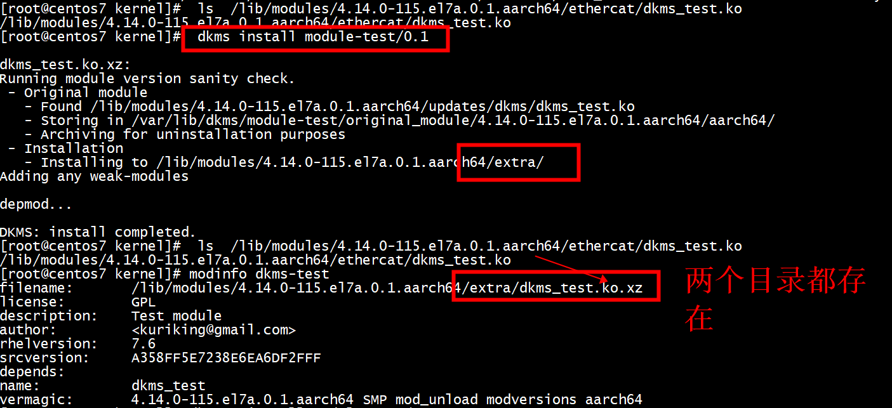
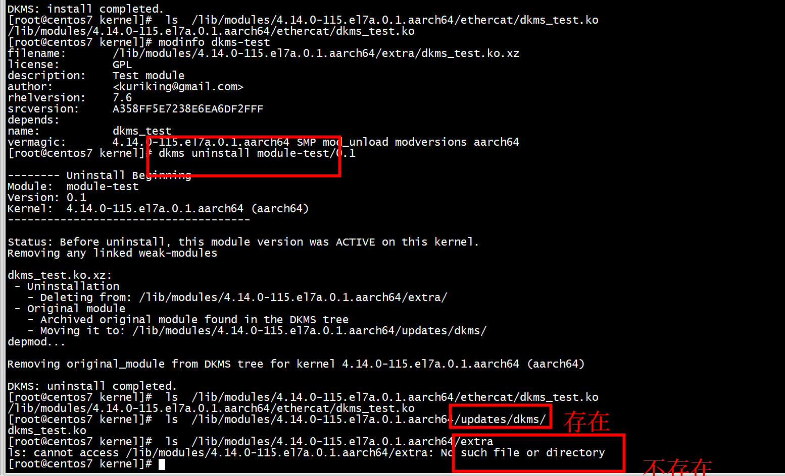

```
[root@centos7 dkms-demo]# tree 
.
└── v1.0
    ├── dkms.conf
    ├── dkms_test.c
    └── Makefile

1 directory, 3 files
[root@centos7 dkms-demo]# 
```

```
[root@centos7 v1.0]# cat dkms.conf 
PACKAGE_NAME="module-test"   
PACKAGE_VERSION="0.1"   
CLEAN="make clean"   
AUTOINSTALL="yes"   
MAKE[0]="make KERNDIR= all"   
BUILT_MODULE_LOCATION[0]="."   
BUILT_MODULE_NAME[0]="dkms_test"   
DEST_MODULE_LOCATION[0]="/updates/dkms"   
[root@centos7 v1.0]#
```
模块名：dkms_test ，packet ：module-test    

+ dkms add   
```
[root@centos7 kernel]# dkms add dkms-demo/v1.0

Creating symlink /var/lib/dkms/module-test/0.1/source ->
                 /usr/src/module-test-0.1

DKMS: add completed.
```

```
[root@centos7 kernel]# ls /var/lib/dkms/module-test/0.1/source
dkms.conf  dkms_test.c  Makefile
[root@centos7 kernel]# 
```
+ dkms status      
```
[root@centos7 kernel]# dkms status module-test  
module-test, 0.1: added
[root@centos7 kernel]#
```

+ dkms build   

```
[root@centos7 kernel]# dkms build -m module-test -v 0.1   

Kernel preparation unnecessary for this kernel.  Skipping...

Building module:
cleaning build area...
make -j128 KERNELRELEASE=4.14.0-115.el7a.0.1.aarch64 KERNDIR= all...
cleaning build area...

DKMS: build completed.
[root@centos7 kernel]#
```
+ dkms status   
```
[root@centos7 kernel]# dkms status module-test  
module-test, 0.1, 4.14.0-115.el7a.0.1.aarch64, aarch64: built
[root@centos7 kernel]# 
```
+ dkms install   
```
[root@centos7 kernel]# dkms install module-test/0.1

dkms_test.ko.xz:
Running module version sanity check.
 - Original module
   - No original module exists within this kernel
 - Installation
   - Installing to /lib/modules/4.14.0-115.el7a.0.1.aarch64/extra/
Adding any weak-modules


depmod...

DKMS: install completed.
[root@centos7 kernel]# 
[root@centos7 kernel]# 
```
+ dkms_test.ko    
```
[root@centos7 kernel]# ls /lib/modules/4.14.0-115.el7a.0.1.aarch64/extra/
dkms_test.ko.xz
[root@centos7 kernel]# 
```
+ dkms status    
```
[root@centos7 kernel]# dkms status module-test   
module-test, 0.1, 4.14.0-115.el7a.0.1.aarch64, aarch64: installed
[root@centos7 kernel]# 
```
+  modprobe dkms-test

```
[root@centos7 kernel]# ls /lib/modules/4.14.0-115.el7a.0.1.aarch64/extra/
dkms_test.ko.xz
[root@centos7 kernel]# dkms status module-test   
module-test, 0.1, 4.14.0-115.el7a.0.1.aarch64, aarch64: installed
[root@centos7 kernel]# modprobe module-test 
modprobe: FATAL: Module module-test not found.
[root@centos7 kernel]# modprobe dkms-test
[root@centos7 kernel]# lsmod | grep dkms-test
[root@centos7 kernel]# lsmod | grep dkms
dkms_test             262144  0 
[root@centos7 kernel]# 
```
+  rmmod dkms-test

```
[root@centos7 kernel]# rmmod dkms-test  
[root@centos7 kernel]# lsmod | grep dkms
```
+ dkms uninstall
```
[root@centos7 kernel]# dkms uninstall module-test/0.1

-------- Uninstall Beginning --------
Module:  module-test
Version: 0.1
Kernel:  4.14.0-115.el7a.0.1.aarch64 (aarch64)
-------------------------------------

Status: Before uninstall, this module version was ACTIVE on this kernel.
Removing any linked weak-modules

dkms_test.ko.xz:
 - Uninstallation
   - Deleting from: /lib/modules/4.14.0-115.el7a.0.1.aarch64/extra/
 - Original module
   - No original module was found for this module on this kernel.
   - Use the dkms install command to reinstall any previous module version.

depmod...

DKMS: uninstall completed.
```

+ dkms remove   
```
[root@centos7 kernel]#  dkms remove module-test/0.1 --all

------------------------------
Deleting module version: 0.1
completely from the DKMS tree.
------------------------------
Done.
[root@centos7 kernel]#  
```
module-test是PACKAGE_NAME名称   

```
[root@centos7 kernel]#  dkms remove dkms_test/0.1 --all
Error! There are no instances of module: dkms_test
0.1 located in the DKMS tree.
[root@centos7 kernel]# 
```

# test2 
+ 1 编译模块，拷贝到/lib/modules/4.14.0-115.el7a.0.1.aarch64/ethercat   
 cp dkms_test.ko /lib/modules/4.14.0-115.el7a.0.1.aarch64/ethercat   
```
[root@centos7 kernel]# modinfo dkms-test
filename:       /lib/modules/4.14.0-115.el7a.0.1.aarch64/ethercat/dkms_test.ko
license:        GPL
description:    Test module
author:         <kuriking@gmail.com>
rhelversion:    7.6
srcversion:     A358FF5E7238E6EA6DF2FFF
depends:        
name:           dkms_test
vermagic:       4.14.0-115.el7a.0.1.aarch64 SMP mod_unload modversions aarch64
[root@centos7 kernel]# 
```

```
[root@centos7 v1.0]# ls  /lib/modules/4.14.0-115.el7a.0.1.aarch64/ethercat/dkms_test.ko 
/lib/modules/4.14.0-115.el7a.0.1.aarch64/ethercat/dkms_test.ko
[root@centos7 v1.0]# 
```

+ 2 dkms install module-test/0.1
```
[root@centos7 kernel]# dkms install module-test/0.1

dkms_test.ko.xz:
Running module version sanity check.
 - Original module
   - No original module exists within this kernel
 - Installation
   - Installing to /lib/modules/4.14.0-115.el7a.0.1.aarch64/extra/
Adding any weak-modules

depmod...

DKMS: install completed
```
执行dkms install module-test/0.1命令后，modinfo dkms-test的路径变了
```
[root@centos7 kernel]# modinfo dkms-test
filename:       /lib/modules/4.14.0-115.el7a.0.1.aarch64/extra/dkms_test.ko.xz
license:        GPL
description:    Test module
author:         <kuriking@gmail.com>
rhelversion:    7.6
srcversion:     A358FF5E7238E6EA6DF2FFF
depends:        
name:           dkms_test
vermagic:       4.14.0-115.el7a.0.1.aarch64 SMP mod_unload modversions aarch64
[root@centos7 kernel]# 
```




+ 3 dkms uninstall module-test/0.1
```
[root@centos7 kernel]# dkms uninstall module-test/0.1

-------- Uninstall Beginning --------
Module:  module-test
Version: 0.1
Kernel:  4.14.0-115.el7a.0.1.aarch64 (aarch64)
-------------------------------------

Status: Before uninstall, this module version was ACTIVE on this kernel.
Removing any linked weak-modules

dkms_test.ko.xz:
 - Uninstallation
   - Deleting from: /lib/modules/4.14.0-115.el7a.0.1.aarch64/extra/
 - Original module
   - Archived original module found in the DKMS tree
   - Moving it to: /lib/modules/4.14.0-115.el7a.0.1.aarch64/updates/dkms/
depmod...

Removing original_module from DKMS tree for kernel 4.14.0-115.el7a.0.1.aarch64 (aarch64)

DKMS: uninstall completed.
[root@centos7 kernel]#  ls  /lib/modules/4.14.0-115.el7a.0.1.aarch64/ethercat/dkms_test.ko
/lib/modules/4.14.0-115.el7a.0.1.aarch64/ethercat/dkms_test.ko
[root@centos7 kernel]#  ls  /lib/modules/4.14.0-115.el7a.0.1.aarch64/updates/dkms/
dkms_test.ko
[root@centos7 kernel]#  ls  /lib/modules/4.14.0-115.el7a.0.1.aarch64/extra
ls: cannot access /lib/modules/4.14.0-115.el7a.0.1.aarch64/extra: No such file or directory
[root@centos7 kernel]# modinfo dkms_test.ko
modinfo: ERROR: Module dkms_test.ko not found.
[root@centos7 kernel]# ls  /lib/modules/4.14.0-115.el7a.0.1.aarch64/ethercat/dkms_test.ko
/lib/modules/4.14.0-115.el7a.0.1.aarch64/ethercat/dkms_test.ko
[root@centos7 kernel]# ls  /lib/modules/4.14.0-115.el7a.0.1.aarch64/extra/dkms_test.ko
ls: cannot access /lib/modules/4.14.0-115.el7a.0.1.aarch64/extra/dkms_test.ko: No such file or directory
[root@centos7 kernel]# ls   /lib/modules/4.14.0-115.el7a.0.1.aarch64/updates/dkms/
dkms_test.ko
[root@centos7 kernel]# modinfo dkms_test.ko
modinfo: ERROR: Module dkms_test.ko not found.
[root@centos7 kernel]# 
```
modinfo: ERROR: Module dkms_test.ko not found  

#

```
ofed_info -s
MLNX_OFED_LINUX-5.4-3.0.3.0
ofed_info -l
```

# references
[dkms](https://www.usupi.org/sysad/298.html)   