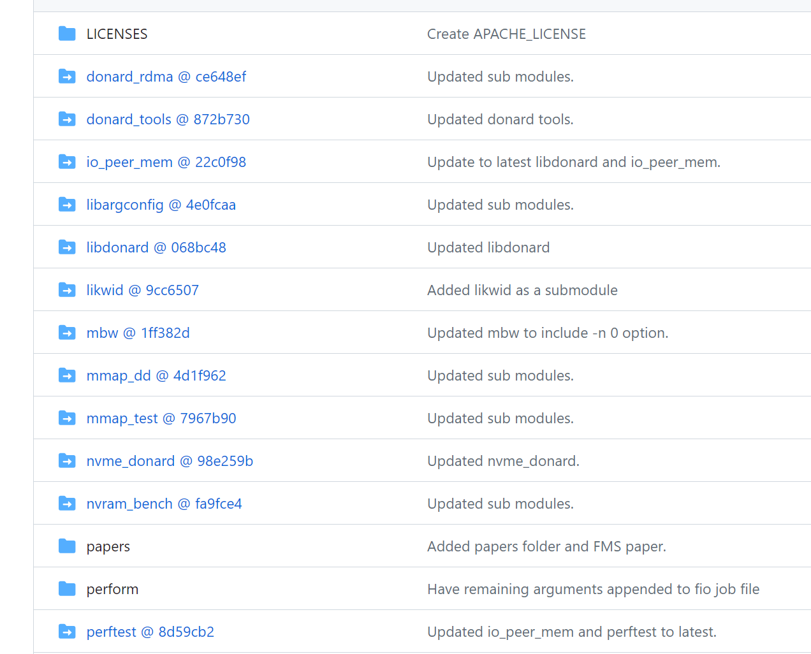

# donard


[donard](https://github.com/sbates130272/donard)


#  nvidia_p2p_page_table

```
struct page_handle {
    unsigned long id;
    struct nvidia_p2p_page_table *page_table;
};
```

> ##  nvidia_p2p_get_pages


```
int nvidia_p2p_get_pages(u64 vaddr, u64 size,
		struct nvidia_p2p_page_table **page_table,
		void (*free_callback)(void *data), void *data)
{
	int ret = 0;
	int user_pages = 0;
	int locked = 0;
	int nr_pages = size >> PAGE_SHIFT;
	struct page **pages;

	if (nr_pages <= 0) {
		return -EINVAL;
	}

	*page_table = kzalloc(sizeof(**page_table), GFP_KERNEL);
	if (!*page_table) {
		return -ENOMEM;
	}

	pages = kcalloc(nr_pages, sizeof(*pages), GFP_KERNEL);
	if (!pages) {
		ret = -ENOMEM;
		goto free_page_table;
	}
#if LINUX_VERSION_CODE >= KERNEL_VERSION(5, 7, 0)
	down_read(&current->mm->mmap_lock);
#else
	down_read(&current->mm->mmap_sem);
#endif
	locked = 1;
	user_pages = get_user_pages_locked(vaddr & PAGE_MASK, nr_pages,
			FOLL_WRITE | FOLL_FORCE,
			pages, &locked);
#if LINUX_VERSION_CODE >= KERNEL_VERSION(5, 7, 0)
	up_read(&current->mm->mmap_lock);
#else
	up_read(&current->mm->mmap_sem);
#endif
	if (user_pages != nr_pages) {
		ret = user_pages < 0 ? user_pages : -ENOMEM;
		goto free_pages;
	}

	(*page_table)->version = NVIDIA_P2P_PAGE_TABLE_VERSION;
	(*page_table)->pages = pages;
	(*page_table)->entries = user_pages;
	(*page_table)->page_size = NVIDIA_P2P_PAGE_SIZE_4KB;
	(*page_table)->size = size;

	(*page_table)->mn.ops = &nvidia_p2p_mmu_ops;
	(*page_table)->mm = current->mm;
	(*page_table)->free_callback = free_callback;
	(*page_table)->data = data;
	(*page_table)->vaddr = vaddr;
	mutex_init(&(*page_table)->lock);
	(*page_table)->mapped = NVIDIA_P2P_PINNED;

	ret = mmu_notifier_register(&(*page_table)->mn, (*page_table)->mm);
	if (ret) {
		goto free_pages;
	}

	return 0;
free_pages:
	while (--user_pages >= 0) {
		put_page(pages[user_pages]);
	}
	kfree(pages);
free_page_table:
	kfree(*page_table);
	*page_table = NULL;
	return ret;
}
EXPORT_SYMBOL(nvidia_p2p_get_pages);

int nvidia_p2p_put_pages(struct nvidia_p2p_page_table *page_table)
{
	if (!page_table) {
		return -EINVAL;
	}

	mmu_notifier_unregister(&page_table->mn, page_table->mm);

	return 0;
}
EXPORT_SYMBOL(nvidia_p2p_put_pages);
```

 
## remap_pfn_range nvidia_p2p_page


```
static int donard_pinbuf_mmap(struct file *filp, struct vm_area_struct *vma)
{
    uint32_t page_size;
    unsigned long addr = vma->vm_start;
    struct nvidia_p2p_page_table *pages;
    int i;
    int ret;

    if (mmap_page_handle == NULL)
        return -EINVAL;

    pages = mmap_page_handle->page_table;

    switch(pages->page_size) {
    case NVIDIA_P2P_PAGE_SIZE_4KB:   page_size =   4*1024; break;
    case NVIDIA_P2P_PAGE_SIZE_64KB:  page_size =  64*1024; break;
    case NVIDIA_P2P_PAGE_SIZE_128KB: page_size = 128*1024; break;
    default:
        return -EIO;
    }


    for (i = 0; i < pages->entries; i++) {
        if (addr+page_size > vma->vm_end) break;

        if ((ret = remap_pfn_range(vma, addr,
                                   pages->pages[i]->physical_address >> PAGE_SHIFT,
                                   page_size, vma->vm_page_prot))) {

            printk("donard: remap %d failed: %d\n", i, ret);
            return -EAGAIN;
        }
        addr += page_size;
    }

    return 0;
}
```
