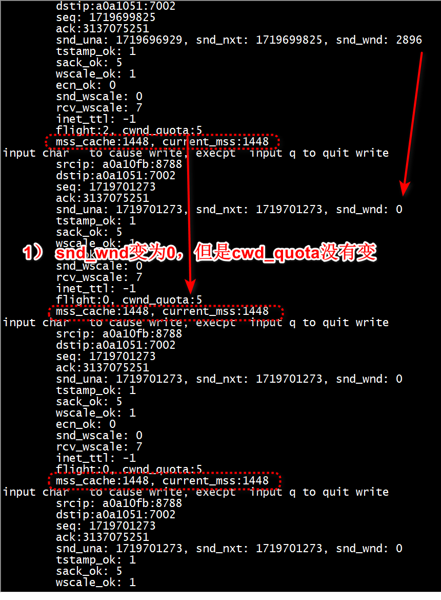
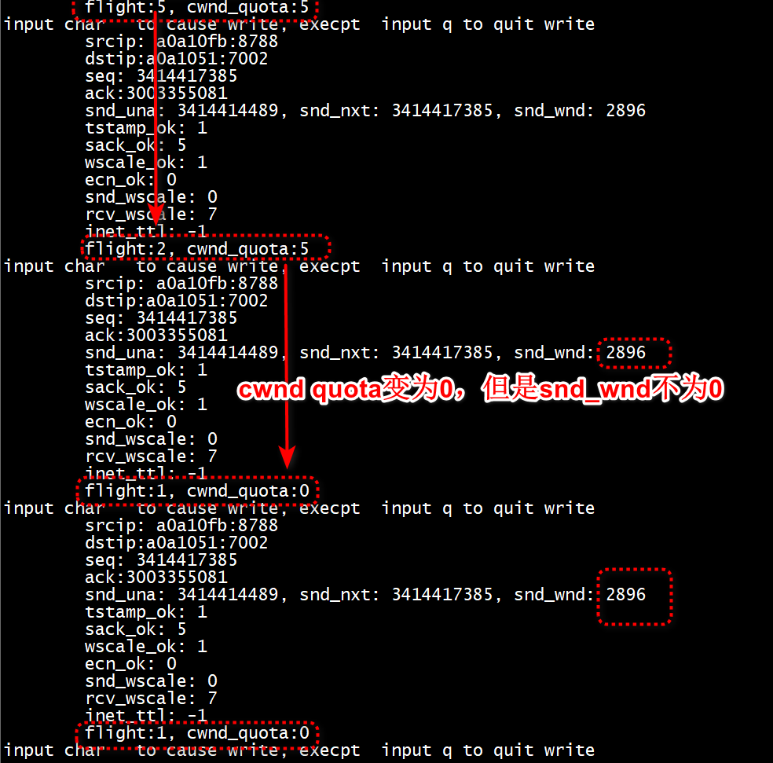
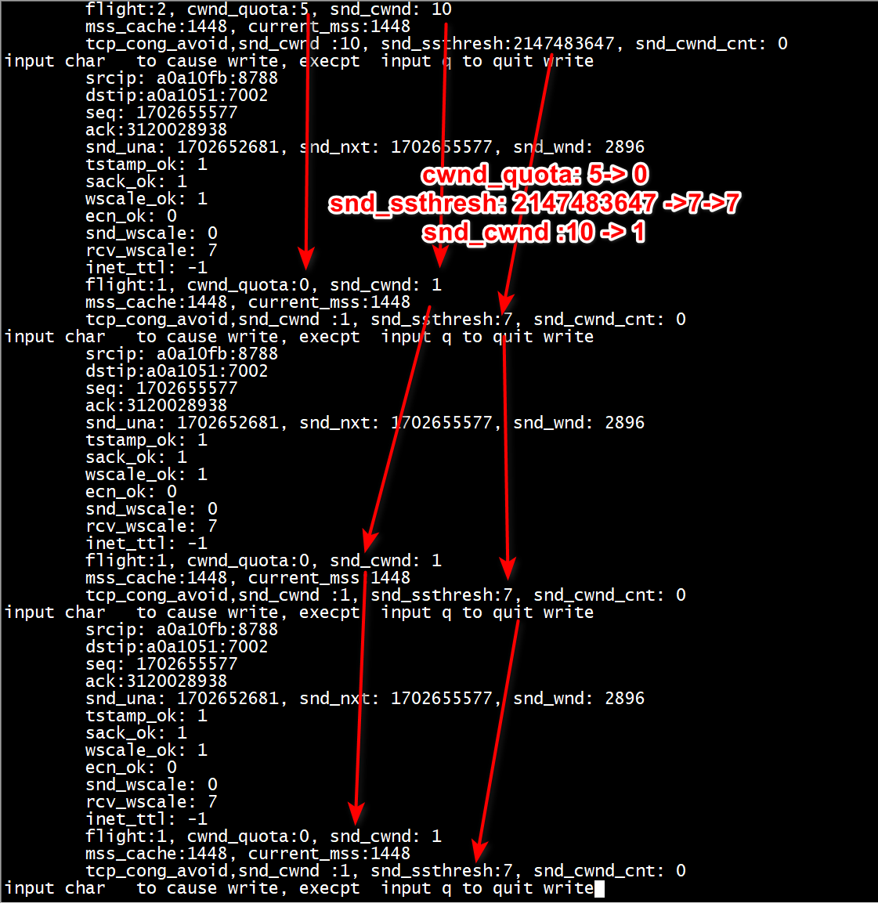
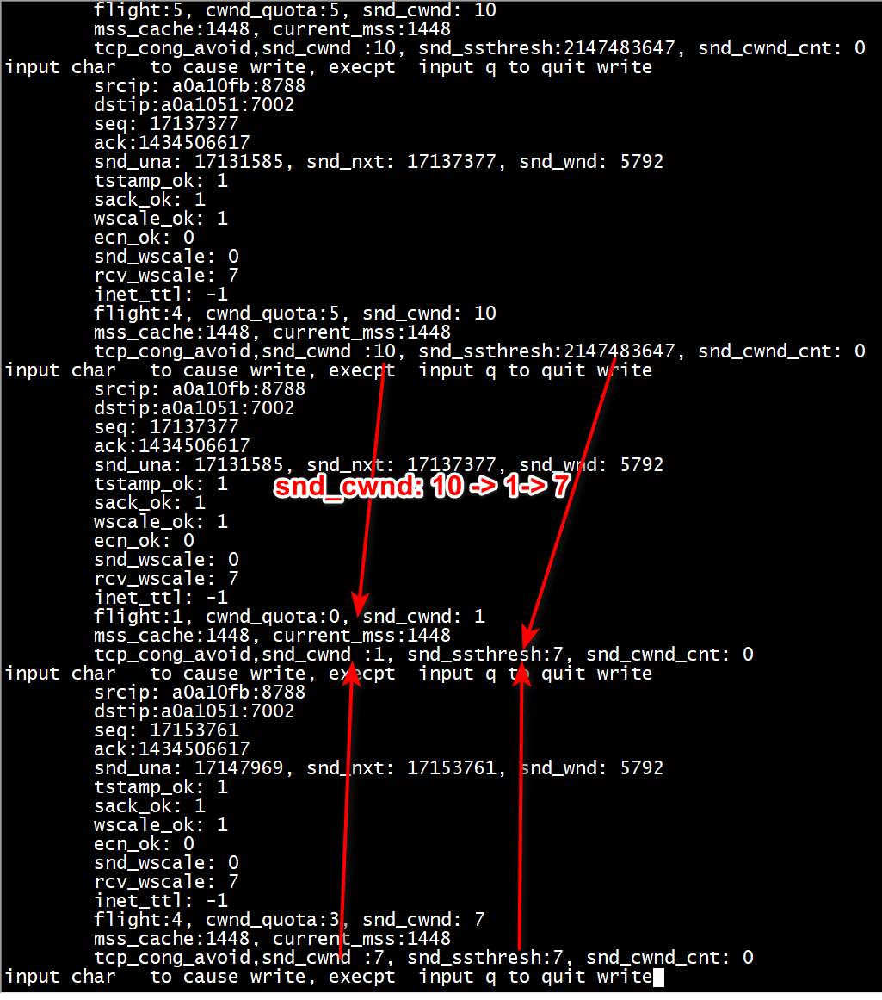
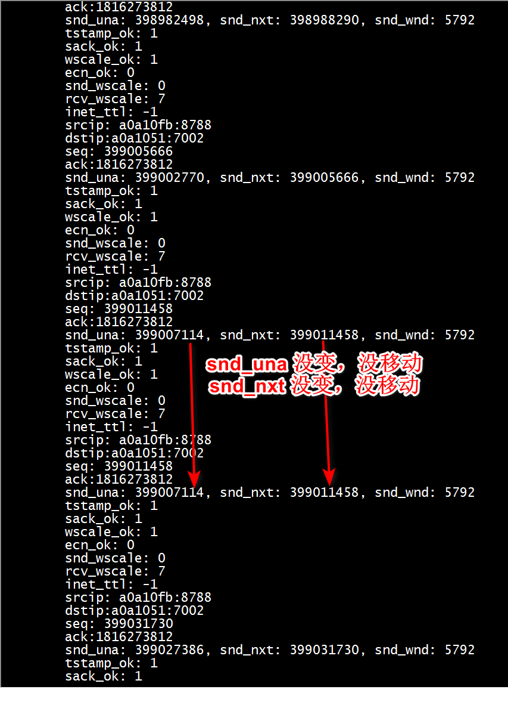
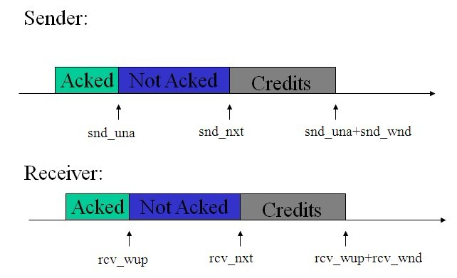
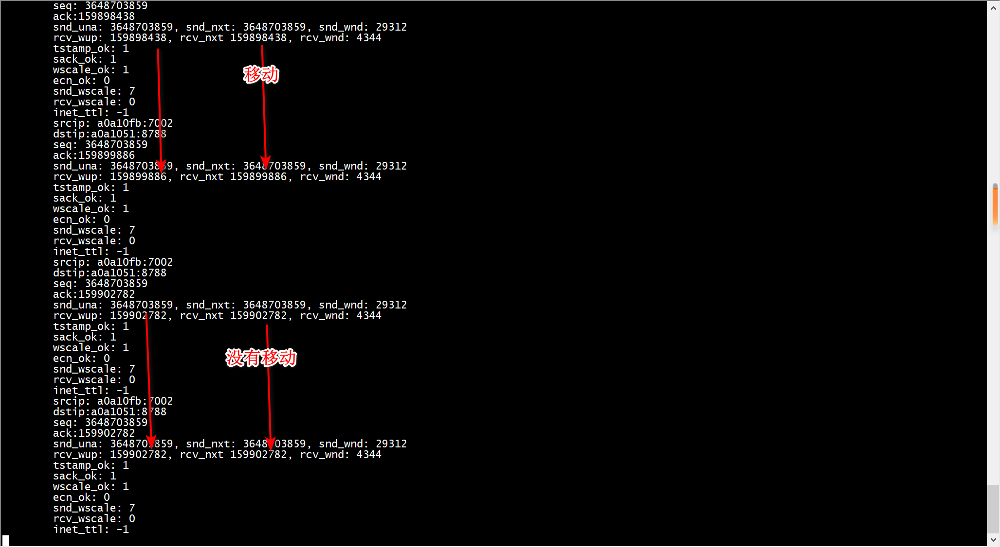

```
struct tcp_sock {
        /* inet_connection_sock has to be the first member of tcp_sock */
        struct inet_connection_sock     inet_conn;
        u16     tcp_header_len; /* Bytes of tcp header to send          */
        u16     gso_segs;       /* Max number of segs per GSO packet    */

/*
 *      Header prediction flags
 *      0x5?10 << 16 + snd_wnd in net byte order
 */
        __be32  pred_flags;

/*
 *      RFC793 variables by their proper names. This means you can
 *      read the code and the spec side by side (and laugh ...)
 *      See RFC793 and RFC1122. The RFC writes these in capitals.
 */
        u64     bytes_received; /* RFC4898 tcpEStatsAppHCThruOctetsReceived
                                 * sum(delta(rcv_nxt)), or how many bytes
                                 * were acked.
                                 */
        u32     segs_in;        /* RFC4898 tcpEStatsPerfSegsIn
                                 * total number of segments in.
                                 */
        u32     data_segs_in;   /* RFC4898 tcpEStatsPerfDataSegsIn
                                 * total number of data segments in.
                                 */
        u32     rcv_nxt;        /* What we want to receive next         */
        u32     copied_seq;     /* Head of yet unread data              */
        u32     rcv_wup;        /* rcv_nxt on last window update sent   */
        u32     snd_nxt;        /* Next sequence we send                */
        u32     segs_out;       /* RFC4898 tcpEStatsPerfSegsOut
                                 * The total number of segments sent.
                                 */
        u32     data_segs_out;  /* RFC4898 tcpEStatsPerfDataSegsOut
                                 * total number of data segments sent.
                                 */
        u64     bytes_acked;    /* RFC4898 tcpEStatsAppHCThruOctetsAcked
                                 * sum(delta(snd_una)), or how many bytes
                                 * were acked.
                                 */
        u32     snd_una;        /* First byte we want an ack for        */
        u32     snd_sml;        /* Last byte of the most recently transmitted small packet */
        u32     rcv_tstamp;     /* timestamp of last received ACK (for keepalives) */
        u32     lsndtime;       /* timestamp of last sent data packet (for restart window) */
        u32     last_oow_ack_time;  /* timestamp of last out-of-window ACK */

        u32     tsoffset;       /* timestamp offset */


        struct list_head tsq_node; /* anchor in tsq_tasklet.head list */

        u32     snd_wl1;        /* Sequence for window update           */
        u32     snd_wnd;        /* The window we expect to receive      */
        u32     max_window;     /* Maximal window ever seen from peer   */
        u32     mss_cache;      /* Cached effective mss, not including SACKS */

        u32     window_clamp;   /* Maximal window to advertise          */
        u32     rcv_ssthresh;   /* Current window clamp                 */
```

# test
+ client
```
insmod  forge_socket.ko 
./client_win 
```

# 拥塞控制

+ 拥塞窗口--避免把网络塞满；  
+ 滑动窗口--避免把接收端塞满  

+ tcp_write_xmit()
   使用tcp_cwnd_test()检查拥塞窗口是否还有空间。  
   使用tcp_snd_wnd_test()检查滑动窗口是否还有空间。   
   使用tcp_transmit_skb()发送当前skb.   
   使用tcp_event_new_data_sent()递增packets_out.   

```
struct tcp_sock {
        /* inet_connection_sock has to be the first member of tcp_sock */
        struct inet_connection_sock     inet_conn;
        u16     tcp_header_len; /* Bytes of tcp header to send          */
        u16     gso_segs; 
/*
 *      Slow start and congestion control (see also Nagle, and Karn & Partridge)
 */
        u32     snd_ssthresh;   /* Slow start size threshold            */
        u32     snd_cwnd;       /* Sending congestion window            */
        u32     snd_cwnd_cnt;   /* Linear increase counter              */
        u32     snd_cwnd_clamp; /* Do not allow snd_cwnd to grow above this */
        u32     snd_cwnd_used;
        u32     snd_cwnd_stamp;
        u32     prior_cwnd;     /* cwnd right before starting loss recovery */
        u32     prr_delivered;  /* Number of newly delivered packets to
                                 * receiver in Recovery. */
        u32     prr_out;        /* Total number of pkts sent during Recovery. */
        u32     delivered;      /* Total data packets delivered incl. rexmits */
        u32     lost;           /* Total data packets lost incl. rexmits */
        u32     app_limited;    /* limited until "delivered" reaches this val */
        u64     first_tx_mstamp;  /* start of window send phase */
        u64     delivered_mstamp; /* time we reached "delivered" */
        u32     rate_delivered;    /* saved rate sample: packets delivered */
        u32     rate_interval_us;  /* saved rate sample: time elapsed */

        u32     rcv_wnd;        /* Current receiver window              */
        u32     write_seq;      /* Tail(+1) of data held in tcp send buffer */
        u32     notsent_lowat;  /* TCP_NOTSENT_LOWAT */
        u32     pushed_seq;     /* Last pushed seq, required to talk to windows */
        u32     lost_out;       /* Lost packets                 */
        u32     sacked_out;     /* SACK'd packets                       */
        u32     fackets_out;    /* FACK'd packets                       */

```
> ##  发送端： 拥塞窗口和发送窗口怎么限制发送
在一次sendMsg调用中：  

```C
基于5.13.1：
int tcp_sendmsg_locked(struct sock *sk, struct msghdr *msg, size_t size)
前面分析了流程：
4 调用tcp_write_xmit()，循环从队列中拿skb：
中：
        //先检查拥塞窗口
        cwnd_quota = tcp_cwnd_test(tp, skb);
		if (!cwnd_quota) {
			if (push_one == 2)
				/* Force out a loss probe pkt. */
				cwnd_quota = 1;
			else
				break;//拥塞窗口检查返回不能发送+push_one不为2
		}
        //接着检查发送窗口(对端接收窗口)
		if (unlikely(!tcp_snd_wnd_test(tp, skb, mss_now))) {
			is_rwnd_limited = true;//发送窗口限制
			break;
		}
        
--------------------------------------------------------------
具体检查：
/* Can at least one segment of SKB be sent right now, according to the
 * congestion window rules?  If so, return how many segments are allowed.
 */
static inline unsigned int tcp_cwnd_test(const struct tcp_sock *tp,
					 const struct sk_buff *skb)
{
	u32 in_flight, cwnd, halfcwnd;

	/* Don't be strict about the congestion window for the final FIN.  */
	if ((TCP_SKB_CB(skb)->tcp_flags & TCPHDR_FIN) &&
	    tcp_skb_pcount(skb) == 1) //对fin包且是gso段，不检查返回可发送
		return 1;

	in_flight = tcp_packets_in_flight(tp);//在空中的tcp包数
	cwnd = tp->snd_cwnd; //获取当前拥塞窗口大小
	if (in_flight >= cwnd) //如果当前在网络上的>=拥塞控制窗口大小
		return 0; //不能发送了

	/* For better scheduling, ensure we have at least
	 * 2 GSO packets in flight.
	 */
	halfcwnd = max(cwnd >> 1, 1U);//否则，先取得拥塞窗口一半大小
	return min(halfcwnd, cwnd - in_flight);//返回一半大小和拥塞窗口-空中包数之间的最小值。作为现在能立刻发送的段数量。
}

涉及的函数解释：
/* This determines how many packets are "in the network" to the best
 * of our knowledge.  In many cases it is conservative, but where
 * detailed information is available from the receiver (via SACK
 * blocks etc.) we can make more aggressive calculations.
 *
 * Use this for decisions involving congestion control, use just
 * tp->packets_out to determine if the send queue is empty or not.
 *
 * Read this equation as:
 *
 *	"Packets sent once on transmission queue" MINUS  从发送队列发出但还没得到确认的tcp段数量-
 *	"Packets left network, but not honestly ACKed yet" PLUS  已经发送，但至今还没确认的(表明丢失的)段数量+
 *	"Packets fast retransmitted"    已被快速重传的段数
 */
static inline unsigned int tcp_packets_in_flight(const struct tcp_sock *tp)
{
	return tp->packets_out - tcp_left_out(tp) + tp->retrans_out;
}
```


接收方窗口限制检查：
在 tcp_snd_wnd_test 函数中，会判断 sk_buff 中的 end_seq 和 tcp_wnd_end(tp) 之间的关系，也即这个 sk_buff 是否在滑动窗口的允许范围之内。如果不在范围内，说明发送要受限制了，我们就要把 is_rwnd_limited 设置为 true。
```
/* Does at least the first segment of SKB fit into the send window? */
static bool tcp_snd_wnd_test(const struct tcp_sock *tp,
			     const struct sk_buff *skb,
			     unsigned int cur_mss)
{
	u32 end_seq = TCP_SKB_CB(skb)->end_seq;

	if (skb->len > cur_mss)
		end_seq = TCP_SKB_CB(skb)->seq + cur_mss;//注意这里是加了cur_mss

	return !after(end_seq, tcp_wnd_end(tp));//且是和end_seq做对比，说明它的单位是seqnum,和拥塞控制窗口意义不同。
}

/* Returns end sequence number of the receiver's advertised window */
static inline u32 tcp_wnd_end(const struct tcp_sock *tp)
{
	return tp->snd_una + tp->snd_wnd;//在收到ack确认后，snd_una会递增，所以这个值在snd_wnd
    //保持不变时会一直增长。
}
```
至此，知道了拥塞窗口和接收窗口如何影响当次sendmsg的数据发送量，有个疑问，如果是依赖上层调用sendMsg来驱动发送，那会有一些包遗留着一直进不去窗口来发送如果
上层之后不再调用sendMsg, 故，这里sendMsg会把包放到发送队列，在收到ack后，会驱动去判断队列是否还有包，有则发送。

详细看这个函数的调用流程：


```
static inline void tcp_data_snd_check(struct sock *sk)
{
	tcp_push_pending_frames(sk);
	tcp_check_space(sk);
}
```
>> ### tcp_current_mss
```
/* Compute the current effective MSS, taking SACKs and IP options,
 * and even PMTU discovery events into account.
 */
unsigned int tcp_current_mss(struct sock *sk)
{
        ...
	mss_now = tp->mss_cache;

        ...
        //这里计算当前的TCP总的选项长度+tcp头固定部分长度作为TCP的头的总长度
	header_len = tcp_established_options(sk, NULL, &opts, &md5) +
		     sizeof(struct tcphdr);
	/* The mss_cache is sized based on tp->tcp_header_len, which assumes
	 * some common options. If this is an odd packet (because we have SACK
	 * blocks etc) then our calculated header_len will be different, and
	 * we have to adjust mss_now correspondingly */
        
       // tp->tcp_header_len 是包括了tcp头固定部分长度+除SACK之外选项的长度，
      //如果跟上面算出来的当前加了SACK选项的不相等，说明现在时刻有了SACK选项，
      //mss_now需要把这部分delta给剪掉，
	if (header_len != tp->tcp_header_len) {
		int delta = (int) header_len - tp->tcp_header_len;
                //这时mss_now就不包括选项了
		mss_now -= delta;
	}

	return mss_now;
}
```

```
unsigned int test_tcp_current_mss(struct sock *sk)
{
        const struct tcp_sock *tp = tcp_sk(sk);
        const struct dst_entry *dst = __sk_dst_get(sk);
        u32 mss_now;

        mss_now = tp->mss_cache;

        if (dst) {
                u32 mtu = dst_mtu(dst);
                if (mtu != inet_csk(sk)->icsk_pmtu_cookie)
                        mss_now = tcp_sync_mss(sk, mtu);
        }
        return mss_now;
}
```
> ## 拥塞窗口测试

+ 1  发送端三次握手成功后，在接收端执行    
```
iptables -A INPUT -i enahisic2i0  -p tcp --dport 7002  -m state --state   ESTABLISHED -j DROP
```


> ##  拥塞避免测试 
简单算法：   
```
void tcp_cong_avoid(struct send_queue* sq)
{
	/* In saft area, increase*/
	if (sq->snd_cwnd <= sq->snd_ssthresh){
		if (sq->snd_cwnd < sq->snd_cwnd_clamp)
			sq->snd_cwnd++;
	}
	else{ 
		/* In theory this is tp->snd_cwnd += 1 / tp->snd_cwnd */
		if (sq->snd_cwnd_cnt >= sq->snd_cwnd) {
			if (sq->snd_cwnd < sq->snd_cwnd_clamp)
				sq->snd_cwnd++;
			sq->snd_cwnd_cnt = 0;
		} else
			sq->snd_cwnd_cnt++;
	} 
}
```
+ 1  发送端三次握手成功后，在接收端执行    
```
iptables -A INPUT -i enahisic2i0  -p tcp --dport 7002  -m state --state   ESTABLISHED -j DROP
```

snd_wnd: 2896 没有变化   

>> ### 拥塞恢复
+ 1server
```
[root@bogon socket6]# ./server_ip4_cong_avoid 
New connection from: 10.10.16.251:8788 ...
```

+ 2  发送端三次握手成功后，在接收端执行    
```
iptables -A INPUT -i enahisic2i0  -p tcp --dport 7002  -m state --state   ESTABLISHED -j DROP
```

+ 3  出现拥塞后，删除drop策略   
```
iptables -F
```



>>  snd_una 、 snd_nxt 移动

+ server  

```
[root@bogon socket6]# ./server_ip4_cong_avoid 
New connection from: 10.10.16.251:8788 ...
```
+ client

```
 ./client_win3
```
+ server对客户端的报文进行随机drop丢包
```
iptables -A INPUT -i enahisic2i0  -p tcp --dport 7002  -m statisitc --mode random  --probability 0.6 -j DROP
```

> ## 接收方窗口更新



```
static int tcp_ack(struct sock *sk, const struct sk_buff *skb, int flag)
   --> 慢速路径下；
   flag |= tcp_ack_update_window(sk, skb, ack, ack_seq);
   u32 nwin = ntohs(tcp_hdr(skb)->window);//ack是携带接收方窗口的

	if (likely(!tcp_hdr(skb)->syn))
		nwin <<= tp->rx_opt.snd_wscale;//不是syn段，由窗口扩大因子计算出接收窗口的字节数
    //满足三个条件之一可以更新发送窗口：1)确认的序号在snd_una->snd_nxt之间，
    //2)ack段的seq是最新的 3) 收到重复的ack且接收方窗口大于发送方窗口
	if (tcp_may_update_window(tp, ack, ack_seq, nwin)) {
		flag |= FLAG_WIN_UPDATE;//标记为更新窗口了
		tcp_update_wl(tp, ack_seq);//记录当前收到的ack的seq

		if (tp->snd_wnd != nwin) {//和接收方窗口不同，更新发送方窗口
			tp->snd_wnd = nwin;

        所以可以看出，snd_wnd是seq维度的。
```

```
struct tcp_sock {  
	...  
	/* 最早接收但未确认的段的序号，即当前接收窗口的左端*/  
	u32 rcv_wup; /* rcv_nxt on last window update sent */  
	u16 advmss; /* Advertised MSS. 本端能接收的MSS上限，建立连接时用来通告对端*/  
	u32 rcv_ssthresh; /* Current window clamp. 当前接收窗口大小的阈值*/  
	u32 rcv_wnd; /* Current receiver window，当前的接收窗口大小*/  
	u32 window_clamp; /* 接收窗口的最大值，这个值也会动态调整*/  
	...  
}
```

>>> ## 接收窗口测试

+  1 接收端，./server_rcv_win   

+  2 发送端，./client_rcv_win    

+  3 `接收端执行drop`

```
iptables -A INPUT -i  enp125s0f0  -p tcp --dport 7002  -m statistic --mode random  --probability 0.6 -j DROP
```



# 乱序

```
struct sk_buff_head out_of_order_queue; // 乱序的TCP报都存放在该队列中  
```


```
static void tcp_update_reordering(struct sock *sk, const int metric,
									   const int ts)
{
	struct tcp_sock *tp = tcp_sk(sk);

	if (metric > tp->reordering) {
		int mib_idx;
		/* 更新reordering的值，取其小者*/
		tp->reordering = min(TCP_MAX_REORDERING, metric);

		if (ts)
			mib_idx = LINUX_MIB_TCPTSREORDER;
		else if (tcp_is_reno(tp))
			mib_idx = LINUX_MIB_TCPRENOREORDER;
		else if (tcp_is_fack(tp))
			mib_idx = LINUX_MIB_TCPFACKREORDER;
		else
			mib_idx = LINUX_MIB_TCPSACKREORDER;

		NET_INC_STATS_BH(sock_net(sk), mib_idx);
#if FASTRETRANS_DEBUG > 1
		printk(KERN_DEBUG "Disorder%d %d %u f%u s%u rr%d\n",
				   tp->rx_opt.sack_ok, inet_csk(sk)->icsk_ca_state,
				   tp->reordering, tp->fackets_out, tp->sacked_out,
				   tp->undo_marker ? tp->undo_retrans : 0);
#endif
		tcp_disable_fack(tp); /* 出现了reorder，再用fack就太激进了*/
	}
}
```