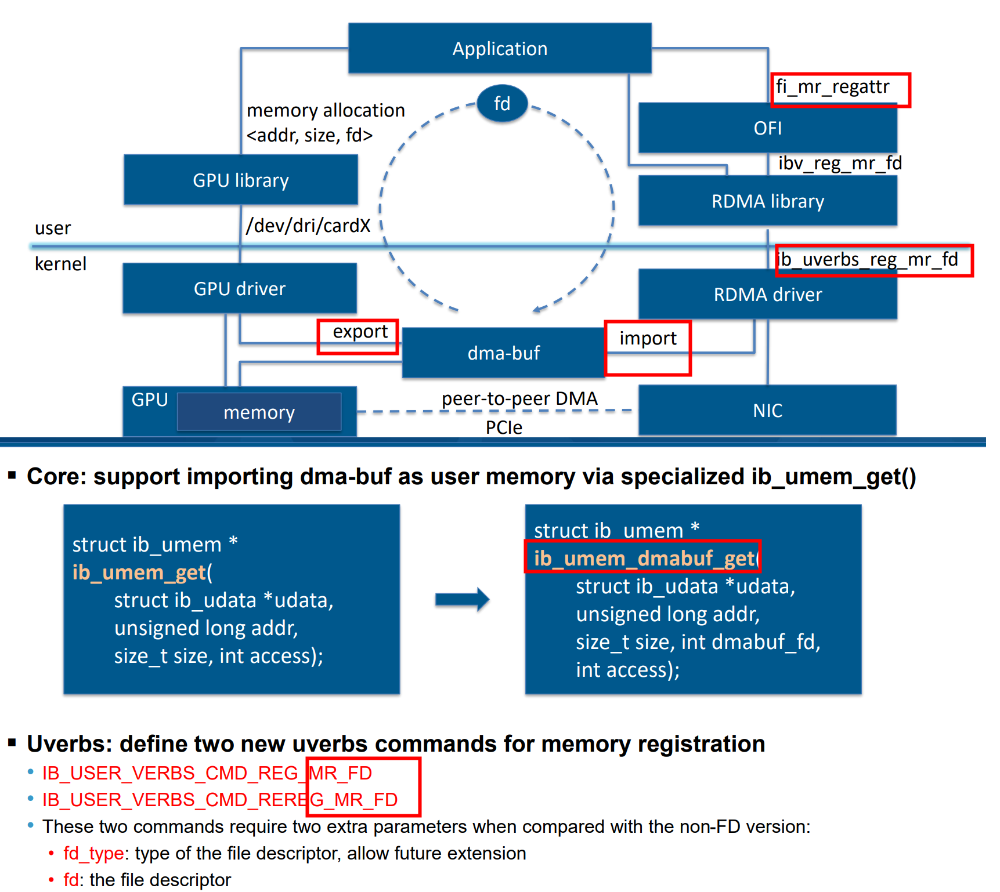

# DRM_IOCTL_MODE_CREATE_DUMB

```
物理内存分配
CMA（Contiguous Memory Allocator）是linux系统早期启动时，预留的一段内存池。
CMA用于分配大块的、连续的物理内存。
当GPU或display模块不支持MMU时，使用CMA来分配内存是不错的选择。
 
CMA作为GEM对象的内存分配：
struct drm_gem_cma_object {
  struct drm_gem_object base;
  dma_addr_t paddr;
  struct sg_table *sgt;
  void *vaddr;
};
```
 
base：GEM对象   
paddr：分配的内存物理地址    
sgt：通过PRIME导入的scatter/gather table，这个table上的物理地址必须保证是连续的。   
vaddr：分配的内存虚拟地址   
 


+ drm_gem_cma_create有两个作用    

+ 创建drm_gem_cma_object对象并初始化其中的drm_gem_object
+  使用dma_alloc_wc分配内存并将物理地址存入paddr，虚拟地址存入vaddr
```
struct drm_gem_cma_object *drm_gem_cma_create(struct drm_device *drm,
  size_t size)
{
	struct drm_gem_cma_object *cma_obj;
 
	size = round_up(size, PAGE_SIZE);
 
	cma_obj = __drm_gem_cma_create(drm, size);
	if (IS_ERR(cma_obj))
		return cma_obj;
 
	cma_obj->vaddr = dma_alloc_wc(drm->dev, size, &cma_obj->paddr,
				      GFP_KERNEL | __GFP_NOWARN);
 
	return cma_obj;
```

#   ib_umem_dmabuf_map_pages 调用 dma_buf_map_attachment
```
int ib_umem_dmabuf_map_pages(struct ib_umem_dmabuf *umem_dmabuf)
{
	struct sg_table *sgt;
	struct scatterlist *sg;
	unsigned long start, end, cur = 0;
	unsigned int nmap = 0;
	long ret;
	int i;

	dma_resv_assert_held(umem_dmabuf->attach->dmabuf->resv);

	if (umem_dmabuf->sgt)
		goto wait_fence;

	sgt = dma_buf_map_attachment(umem_dmabuf->attach,
				     DMA_BIDIRECTIONAL);
	if (IS_ERR(sgt))
		return PTR_ERR(sgt);

	/* modify the sg list in-place to match umem address and length */

	start = ALIGN_DOWN(umem_dmabuf->umem.address, PAGE_SIZE);
	end = ALIGN(umem_dmabuf->umem.address + umem_dmabuf->umem.length,
		    PAGE_SIZE);
	for_each_sgtable_dma_sg(sgt, sg, i) {
		if (start < cur + sg_dma_len(sg) && cur < end)
			nmap++;
		if (cur <= start && start < cur + sg_dma_len(sg)) {
			unsigned long offset = start - cur;

			umem_dmabuf->first_sg = sg;
			umem_dmabuf->first_sg_offset = offset;
			sg_dma_address(sg) += offset;
			sg_dma_len(sg) -= offset;
			cur += offset;
		}
		if (cur < end && end <= cur + sg_dma_len(sg)) {
			unsigned long trim = cur + sg_dma_len(sg) - end;

			umem_dmabuf->last_sg = sg;
			umem_dmabuf->last_sg_trim = trim;
			sg_dma_len(sg) -= trim;
			break;
		}
		cur += sg_dma_len(sg);
	}

	umem_dmabuf->umem.sgt_append.sgt.sgl = umem_dmabuf->first_sg;
	umem_dmabuf->umem.sgt_append.sgt.nents = nmap;
	umem_dmabuf->sgt = sgt;

wait_fence:
	/*
	 * Although the sg list is valid now, the content of the pages
	 * may be not up-to-date. Wait for the exporter to finish
	 * the migration.
	 */
	ret = dma_resv_wait_timeout(umem_dmabuf->attach->dmabuf->resv,
				     DMA_RESV_USAGE_KERNEL,
				     false, MAX_SCHEDULE_TIMEOUT);
	if (ret < 0)
		return ret;
	if (ret == 0)
		return -ETIMEDOUT;
	return 0;
}
EXPORT_SYMBOL(ib_umem_dmabuf_map_pages);
```

# dmabuf->ops->map_dma_buf

```
struct sg_table *dma_buf_map_attachment(struct dma_buf_attachment *attach,
                                        enum dma_data_direction direction)
{
        struct sg_table *sg_table;

        might_sleep();

        if (WARN_ON(!attach || !attach->dmabuf))
                return ERR_PTR(-EINVAL);

        sg_table = attach->dmabuf->ops->map_dma_buf(attach, direction);
        if (!sg_table)
                sg_table = ERR_PTR(-ENOMEM);

        return sg_table;
}
EXPORT_SYMBOL_GPL(dma_buf_map_attachment);
```


#  dmabuf->ops->unmap_dma_buf
```
void dma_buf_unmap_attachment(struct dma_buf_attachment *attach,
                                struct sg_table *sg_table,
                                enum dma_data_direction direction)
{
        might_sleep();

        if (WARN_ON(!attach || !attach->dmabuf || !sg_table))
                return;

        attach->dmabuf->ops->unmap_dma_buf(attach, sg_table,
                                                direction);
}
EXPORT_SYMBOL_GPL(dma_buf_unmap_attachment);
```

# attach and detach   
```


static int importer_test2(struct dma_buf *dmabuf)
{
        struct dma_buf_attachment *attachment;
        struct sg_table *table;
        struct device *dev;
        unsigned int reg_addr, reg_size;

        if (!dmabuf)
                return -EINVAL;

        dev = kzalloc(sizeof(*dev), GFP_KERNEL);
        if (!dev)
                return -ENOMEM;
        dev_set_name(dev, "importer");

        attachment = dma_buf_attach(dmabuf, dev);
        if (IS_ERR(attachment)) {
                pr_err("dma_buf_attach() failed\n");
                return PTR_ERR(attachment);
        }

        table = dma_buf_map_attachment(attachment, DMA_BIDIRECTIONAL);
        if (IS_ERR(table)) {
                pr_err("dma_buf_map_attachment() failed\n");
                dma_buf_detach(dmabuf, attachment);
                return PTR_ERR(table);
        }

        reg_addr = sg_dma_address(table->sgl);
        reg_size = sg_dma_len(table->sgl);
        pr_info("reg_addr = 0x%08x, reg_size = 0x%08x\n", reg_addr, reg_size);

        dma_buf_unmap_attachment(attachment, table, DMA_BIDIRECTIONAL);
        dma_buf_detach(dmabuf, attachment);

        return 0;
}

```

#  amdgpu dma memory

```
struct sg_table *amdgpu_gem_prime_get_sg_table(struct drm_gem_object *obj)
{
        struct amdgpu_bo *bo = gem_to_amdgpu_bo(obj);
        int npages = bo->tbo.num_pages;

        return drm_prime_pages_to_sg(bo->tbo.ttm->pages, npages);
}
struct sg_table *drm_prime_pages_to_sg(struct page **pages, unsigned int nr_pages)
{
        struct sg_table *sg = NULL;
        int ret;

        sg = kmalloc(sizeof(struct sg_table), GFP_KERNEL);
        if (!sg) {
                ret = -ENOMEM;
                goto out;
        }

        ret = sg_alloc_table_from_pages(sg, pages, nr_pages, 0,
                                nr_pages << PAGE_SHIFT, GFP_KERNEL);
        if (ret)
                goto out;

        return sg;
out:
        kfree(sg);
        return ERR_PTR(ret);
}
```

# test

## os

```
root@ubuntux86:# uname -a
Linux ubuntux86 5.13.0-39-generic #44~20.04.1-Ubuntu SMP Thu Mar 24 16:43:35 UTC 2022 x86_64 x86_64 x86_64 GNU/Linux
root@ubuntux86:#
```

## insmod 
```
root@ubuntux86:# cat /proc/devices  | grep kvmfr
510 kvmfr
```

```
root@ubuntux86:# mknod /dev/kvmfr0 c  510 0
root@ubuntux86:# ./test 
Size: 17592186044415 MiB
ioctl: Invalid argument
root@ubuntux86:# 
```

##  设置参数static_size_mb(PAGE_SIZE整数倍)

```
static int create_static_device_unlocked(int size_mb)
{
  struct kvmfr_dev * kdev;
  int ret = -ENODEV;

  kdev = kzalloc(sizeof(struct kvmfr_dev), GFP_KERNEL);
  if (!kdev)
    return -ENOMEM;

  kdev->size = size_mb * 1024 * 1024;
  kdev->type = KVMFR_TYPE_STATIC;
  kdev->addr = vmalloc_user(kdev->size);
}
```

```
root@ubuntux86:#  getconf PAGE_SIZE
4096
root@ubuntux86:# 
```
PAGE_SIZE大小 4096      


设置参数static_size_mb   
```
root@ubuntux86:# rmmod  kvmfr.ko 
root@ubuntux86:# insmod  kvmfr.ko static_size_mb=1,1,1,1,1,1,1,1,1,1
root@ubuntux86:# ./test 
Size: 1 MiB
Read string: Hello, world!
Read string: Hello, world!
Read string: Hello, world!
Index 1024: 0x6c6c6548
Index 1025: 0x77202c6f
Index 1026: 0x646c726f
Index 1027: 0xaaaa0021
root@ubuntux86:# 
```