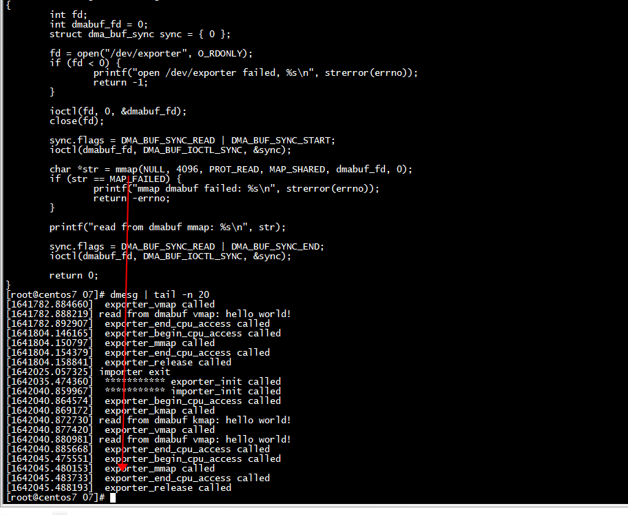

# insmod

```
[root@centos7 07]# insmod  importer-test.ko 
insmod: ERROR: could not insert module importer-test.ko: Unknown symbol in module
[root@centos7 07]# insmod  exporter-test.ko 
[root@centos7 07]# insmod  importer-test.ko 
[root@centos7 07]# 
[root@centos7 07]# make -C dmabuf-test/
```

# test

```
[root@centos7 07]# ./dmabuf-test/dmabuf_sync 
read from dmabuf mmap: hello world!
[root@centos7 07]# 
```

```
[1642035.474360]  *********** exporter_init called 
[1642040.859967]  *********** importer_init called 
[1642040.864574]  exporter_begin_cpu_access called 
[1642040.869172]  exporter_kmap called 
[1642040.872730] read from dmabuf kmap: hello world!
[1642040.877420]  exporter_vmap called 
[1642040.880981] read from dmabuf vmap: hello world!
[1642040.885668]  exporter_end_cpu_access called 
[1642045.475551]  exporter_begin_cpu_access called 
[1642045.480153]  exporter_mmap called 
[1642045.483733]  exporter_end_cpu_access called 
[1642045.488193]  exporter_release called  
[root@centos7 07]# 
```

importer-test:   
```text
1) dma_buf_begin_cpu_access 
2) dma_buf_end_cpu_access
```




```
        sync.flags = DMA_BUF_SYNC_READ | DMA_BUF_SYNC_START;
        ioctl(dmabuf_fd, DMA_BUF_IOCTL_SYNC, &sync);
```
          |
		  |
		  exporter_begin_cpu_access called 
		  
```
sync.flags = DMA_BUF_SYNC_READ | DMA_BUF_SYNC_END;
ioctl(dmabuf_fd, DMA_BUF_IOCTL_SYNC, &sync);
```
          |
		  |
		 exporter_end_cpu_access called 
 
#  rmmod

```
[root@centos7 07]# rmmod  exporter-test.ko 
rmmod: ERROR: Module exporter_test is in use by: importer_test
[root@centos7 07]# rmmod  importer-test.ko 
[root@centos7 07]# rmmod  exporter-test.ko 
[root@centos7 07]# 
```