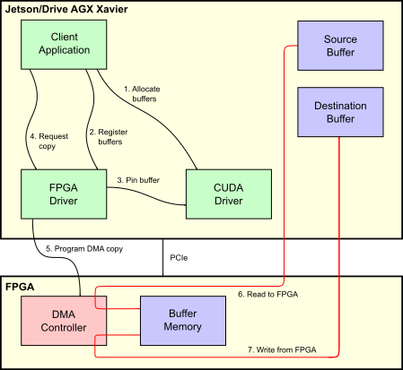
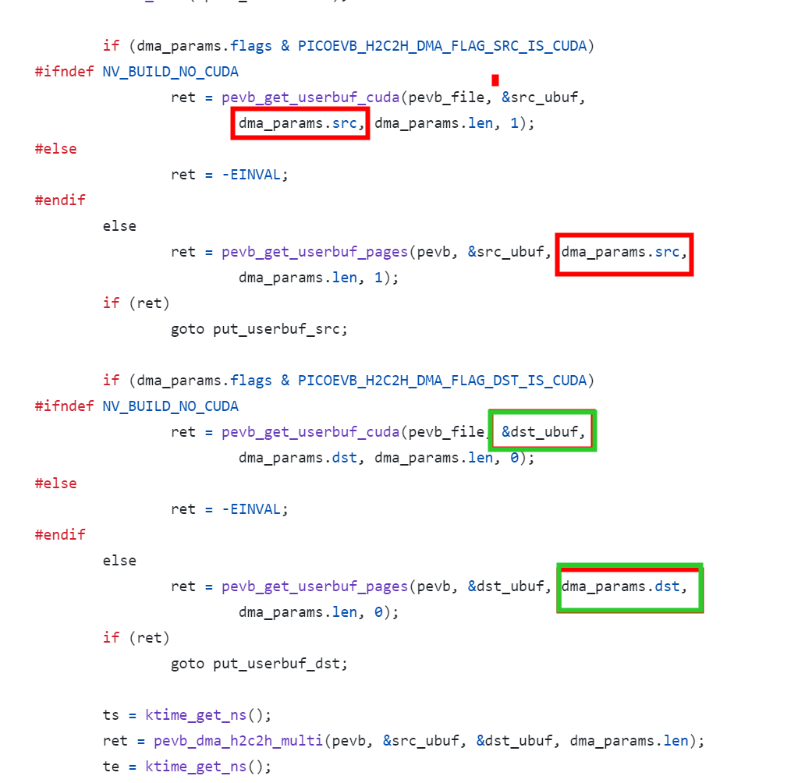

# Introduction

[jetson-rdma-picoevb](https://github.com/NVIDIA/jetson-rdma-picoevb)   

This repository provides a minimal hardware-based demonstration of GPUDirect
RDMA. This feature allows a PCIe device to directly access CUDA memory, thus
allowing zero-copy sharing of data between CUDA and a PCIe device.

The code supports:
* NVIDIA Jetson AGX Xavier (Jetson) running Linux for Tegra (L4T).
* NVIDIA Drive AGX Xavier running Embedded Linux.
* A PC running the NVIDIA CUDA drivers and containing a Quadro or Tesla GPU.

A graphical representation of the system configuration created by the software
in this repository, and the data flow between components, is shown below:



> ##  gpu 访问cpu内存(cudaHostRegister + cudaHostGetDevicePointer)   

The GPU CUDA Kernel is really not affected by the RDMA implementation. The Kernel receives a pointer to the pinned GPU memory and runs as needed. The only piece worth mentioning, in my opinion, is the option to map a region in the host’s physical address to be accessed directly by the GPU. I found this useful to create an IPC/Mailbox between the GPU and FPGA.   

I used a simple method (and surely not best practice). First, the host used mmap() “ /dev/mem” at the FPGA PCIe BAR address offset (0xb5c00000 in my example… Yes i know… i used a static address and it should be dynamically given by the PCIe driver but remember: “it was written with the sole intention of testing the hardware”) with the size of the BAR registers to get a virtual address of the FPGA BAR that can be accessed by the Host.   
```
fd_fpga = open(“/dev/mem”, O_RDWR|O_SYNC);
fpga_reg = (int *)mmap(0, 0x10000, PROT_READ|PROT_WRITE, MAP_SHARED, fd_fpga, 0xb5c00000);
```
After that, the CUDA code received the pointer to the mapped virtual address and used two functions, one to register the host memory address and a second to receive a pointer that can be directly used by the CUDA Kernel running on the GPU.    
```
checkCudaErrors(cudaHostRegister(fpga_reg, 0x10000, cudaHostRegisterIoMemory));
checkCudaErrors(cudaHostGetDevicePointer((void **)&d_fpga_reg, (void *)fpga_reg, 0));
```
I used this method to have the GPU directly write to the FPGA when certain events occurred i.e. when the first data word arrived, the last data word arrived or when the GPU processing has completed.

> ## 1 分配内存

```
cudamalloc(): 在GPU设备内存上分配内存。需要指定要分配的字节数。返回一个指向device内存的指针。
malloc():标准的C库函数,在主机(CPU)内存上分配内存。需要指定要分配的字节数。返回一个指向host内存的指针。
cudahostalloc(): 在主机(CPU)内存上分配页对齐的内存。需要指定要分配的字节数。返回一个指向host内存的指针。
cudamallochost(): 等同于cudahostalloc()。在主机(CPU)内存上分配页对齐的内存。
```

```
#ifdef NV_BUILD_DGPU
	ce = cudaMalloc(&src_d, SURFACE_SIZE * sizeof(*src_d));
#else
	ce = cudaHostAlloc(&src_d, SURFACE_SIZE * sizeof(*src_d),
		cudaHostAllocDefault);
#endif
	if (ce != cudaSuccess) {
		fprintf(stderr, "Allocation of src_d failed: %d\n", ce);
		return 1;
	}

	cr = cuPointerSetAttribute(&flag, CU_POINTER_ATTRIBUTE_SYNC_MEMOPS,
		(CUdeviceptr)src_d);
	if (cr != CUDA_SUCCESS) {
		fprintf(stderr, "cuPointerSetAttribute(src_d) failed: %d\n", cr);
		return 1;
	}
```
`CU_POINTER_ATTRIBUTE_SYNC_MEMOPS`

> ## 2 pin cuda memory

```
	pin_params_src.va = (__u64)src_d;
	pin_params_src.size = SURFACE_SIZE * sizeof(*src_d);
	ret = ioctl(fd, PICOEVB_IOC_PIN_CUDA, &pin_params_src);
	if (ret != 0) {
		fprintf(stderr, "ioctl(PIN_CUDA src) failed: ret=%d errno=%d\n", ret, errno);
		return 1;
	}
```
```
static int pevb_ioctl_pin_cuda(struct pevb_file *pevb_file, unsigned long arg)
{
	void __user *argp = (void __user *)arg;
	struct picoevb_rdma_pin_cuda pin_params;
	struct pevb_cuda_surface *cusurf;

	if (copy_from_user(&pin_params, argp, sizeof(pin_params)))

	cusurf = kzalloc(sizeof(*cusurf), GFP_KERNEL);
	cusurf->pevb_file = pevb_file;
	cusurf->va = pin_params.va & GPU_PAGE_MASK;
	cusurf->offset = pin_params.va & GPU_PAGE_OFFSET;
	cusurf->len = pin_params.size;
	aligned_len = (cusurf->offset + cusurf->len + GPU_PAGE_SIZE - 1) &
		GPU_PAGE_MASK;

	ret = nvidia_p2p_get_pages(
#ifdef NV_BUILD_DGPU
		0, 0,
#endif
		cusurf->va, aligned_len, &cusurf->page_table,
		pevb_p2p_free_callback, cusurf);
	if (ret < 0) {
		kfree(cusurf);
		return ret;
	}
	cusurf->handle = idr_alloc(&pevb_file->cuda_surfaces, cusurf, 0, 0,
		GFP_KERNEL);
	

	pin_params.handle = cusurf->handle;
	ret = copy_to_user(argp, &pin_params, sizeof(pin_params));
```
+  1 cusurf->va是cudaMalloc或cudaHostAlloc分配虚拟地址      

+  2 cusurf->handle  指向nvidia_p2p_get_pages分配的物理地址

> ## 3 cuda计算   

```
#if (SURFACE_W < 16) || (SURFACE_H < 16)
#error Grid and block sizes must be shrunk for small surfaces
#endif
#if (SURFACE_W & 15) || (SURFACE_H & 15)
#error Grid and block sizes are not a multiple of the surface size
#endif
	dim3 dimGrid(SURFACE_W / 16, SURFACE_H / 16);
	dim3 dimBlock(16, 16);
	fill_surface<<<dimGrid, dimBlock>>>(src_d, 0);
	fill_surface<<<dimGrid, dimBlock>>>(dst_d, 0xffffffffU);

	ce = cudaDeviceSynchronize();
	if (ce != cudaSuccess) {
		fprintf(stderr, "cudaDeviceSynchronize() failed: %d\n", ce);
		return 1;
	}
```

cudaDeviceSynchronize()：该方法将停止CPU端线程的执行，直到GPU端完成之前CUDA的任务，包括kernel函数、数据拷贝等   

> ## 4 执行PICOEVB_IOC_H2C2H_DMA

```
	dma_params.src = pin_params_src.handle;
	dma_params.dst = pin_params_dst.handle;
	dma_params.len = SURFACE_SIZE * sizeof(*src_d);
	dma_params.flags = PICOEVB_H2C2H_DMA_FLAG_SRC_IS_CUDA |
		PICOEVB_H2C2H_DMA_FLAG_DST_IS_CUDA;
	ret = ioctl(fd, PICOEVB_IOC_H2C2H_DMA, &dma_params);
	if (ret != 0) {
		fprintf(stderr, "ioctl(DMA) failed: %d\n", ret);
		return 1;
	}
```
 


> ### pevb_ioctl_h2c2h_dma  


pevb_get_userbuf_cuda -->   nvidia_p2p_dma_map_pages(pevb->pdev, cusurf->page_table）  -->    

nvidia_p2p_dma_map_pages从cusurf->page_table中获取pages，建立dma映射   


> ###  pevb_get_userbuf_cuda

+ 1 通过nvidia_p2p_dma_map_pages，建立nvidia_p2p_dma_map_pages的物理地址的dma映射   


       

```
static int pevb_get_userbuf_cuda(struct pevb_file *pevb_file,
	struct pevb_userbuf *ubuf, __u64 handle64, __u64 len, int to_dev)
{
	struct pevb *pevb = pevb_file->pevb;
	int id, ret, i;
	struct pevb_cuda_surface *cusurf;
	u64 offset, len_left;


	cusurf = idr_find(&pevb_file->cuda_surfaces, id);


#ifdef NV_BUILD_DGPU
	ret = nvidia_p2p_dma_map_pages(pevb->pdev, cusurf->page_table,
		&ubuf->priv.cuda.map);
#else
	ret = nvidia_p2p_dma_map_pages(&pevb->pdev->dev, cusurf->page_table,
		&ubuf->priv.cuda.map, to_dev ? DMA_TO_DEVICE : DMA_FROM_DEVICE);
#endif
	for (i = 0; i < ubuf->priv.cuda.map->entries; i++) {
#ifdef NV_BUILD_DGPU
		dma_addr_t dma_this = ubuf->priv.cuda.map->dma_addresses[i];
		u64 len_this = min(GPU_PAGE_SIZE - offset, len_left);
#else
		dma_addr_t dma_this = ubuf->priv.cuda.map->hw_address[i];
		u64 len_this = ubuf->priv.cuda.map->hw_len[i];
#endif

		dma_this += offset;
		pevb_userbuf_add_dma_chunk(ubuf, dma_this, len_this);
```


> ####  nvidia_p2p_dma_map_pages


[os-nvidia-open-gpu-kernel-modules](https://github.com/pexip/os-nvidia-open-gpu-kernel-modules/blob/ad486d664dbabee7760eab1170e536dca84403e6/src/nvidia/arch/nvalloc/unix/src/osapi.c#L3993)

```
int nvidia_p2p_dma_map_pages(
    struct pci_dev *peer,
    struct nvidia_p2p_page_table *page_table,
    struct nvidia_p2p_dma_mapping **dma_mapping
)
{
    for (i = 0; i < page_count; i++)
    {
        dma_addresses[i] = page_table->pages[i]->physical_address;
    }
	peer_dma_dev.dev = &peer->dev;
    peer_dma_dev.addressable_range.limit = peer->dma_mask;
	status = rm_p2p_dma_map_pages(sp, &peer_dma_dev,
            page_table->gpu_uuid, page_size, page_count, dma_addresses, &priv);
			
	(*dma_mapping)->version = NVIDIA_P2P_DMA_MAPPING_VERSION;
    (*dma_mapping)->page_size_type = page_size_type;
    (*dma_mapping)->entries = page_count;
    (*dma_mapping)->dma_addresses = dma_addresses;
    (*dma_mapping)->private = priv;
    (*dma_mapping)->pci_dev = peer;

    /*
     * All success, it is safe to insert dma_mapping now.
     */
    status = nv_p2p_insert_dma_mapping(mem_info, *dma_mapping);

```

+ 设置每个page的dma地址 dma_addresses[i] = page_table->pages[i]->physical_address;   


> #### rm_p2p_dma_map_pages 分配peer物理内存

+ 1 PDB_PROP_GPU_COHERENT_CPU_MAPPING 从cpu分配内存os_alloc_mem   
```
NV_STATUS NV_API_CALL rm_p2p_dma_map_pages(
if (pGpu->getProperty(pGpu, PDB_PROP_GPU_COHERENT_CPU_MAPPING))
            {
                NV_ASSERT(pageSize == os_page_size);

                rmStatus = nv_dma_map_alloc(peer, pageCount, pDmaAddresses,
                                            NV_FALSE, ppPriv);
            }
            else
            {
                nv_state_t *nv = NV_GET_NV_STATE(pGpu);
                for (i = 0; i < pageCount; i++)
                {
                    // Peer mappings through this API are always via BAR1
                    rmStatus = nv_dma_map_peer(peer, nv->dma_dev, 0x1,
                                               pageSize / os_page_size,
                                               &pDmaAddresses[i]);
                    if ((rmStatus != NV_OK) && (i > 0))
                    {
                        NvU32 j;
                        for (j = i - 1; j < pageCount; j--)
                        {
                            nv_dma_unmap_peer(peer, pageSize / os_page_size,
                                              pDmaAddresses[j]);
                        }
                    }
                }
            }
        }
```

```
/* DMA-map a peer PCI device's BAR for peer access. */
NV_STATUS NV_API_CALL nv_dma_map_peer
(
    nv_state_t *nv,
    nv_state_t *peer,
    NvU8        bar_index,
    NvU64       page_count,
    NvU64      *va
)
{
    nv_linux_state_t *nvl = NV_GET_NVL_FROM_NV_STATE(nv);
    nv_linux_state_t *nvlpeer = NV_GET_NVL_FROM_NV_STATE(peer);
    struct resource *res;
    NV_STATUS status;

    BUG_ON(bar_index >= NV_GPU_NUM_BARS);
    res = &nvlpeer->pci_dev->resource[bar_index];
    if (res->start == 0)
    {
        NV_DEV_PRINTF(NV_DBG_ERRORS, nv,
                "Resource %u not valid",
                bar_index);
        return NV_ERR_INVALID_REQUEST;
    }

    if ((*va < res->start) || ((*va + (page_count * PAGE_SIZE)) > res->end))
    {
        NV_DEV_PRINTF(NV_DBG_ERRORS, nv,
                "Mapping requested (start = 0x%llx, page_count = 0x%llx)"
                " outside of resource bounds (start = 0x%llx, end = 0x%llx)\n",
                *va, page_count, res->start, res->end);
        return NV_ERR_INVALID_REQUEST;
    }

    if (nv_dma_is_map_resource_implemented(nvl))
    {
        status = nv_dma_map_mmio(nv, page_count, va);
    }
    else
    {
        /*
         * Best effort - can't map through the iommu but at least try to
         * convert to a bus address.
         */
        NvU64 offset = *va - res->start;
        *va = nv_pci_bus_address(nvlpeer, bar_index) + offset;
        status = NV_OK;
    }

    return status;
}

NV_STATUS NV_API_CALL nv_dma_map_alloc
(
    nv_state_t *nv,
    NvU64       page_count,
    NvU64      *va_array,
    NvBool      contig,
    void      **priv
)
{
    NV_STATUS status;
    NvU64 i;
    nv_alloc_t *at = *priv;
    struct page **pages = NULL;
    NvU64 pages_size = sizeof(struct page *) * (contig ? 1 : page_count);

    /*
     * Convert the nv_alloc_t into a struct page * array for
     * nv_dma_map_pages().
     */
    status = os_alloc_mem((void **)&pages, pages_size);
    if (status != NV_OK)
    {
        NV_DEV_PRINTF(NV_DBG_ERRORS, nv,
                "Failed to allocate page array for DMA mapping!\n");
        return status;
    }

    os_mem_set(pages, 0, pages_size);

    if (at != NULL)
    {
        WARN_ON(page_count != at->num_pages);

        if (NV_ALLOC_MAPPING_USER(at->flags))
        {
            pages[0] = at->user_pages[0];
            if (!contig)
            {
                for (i = 1; i < page_count; i++)
                {
                    pages[i] = at->user_pages[i];
                }
            }
        }
    }

    if ((at == NULL) || !(NV_ALLOC_MAPPING_USER(at->flags)))
    {
        pages[0] = NV_GET_PAGE_STRUCT(va_array[0]);
        if (!contig)
        {
            for (i = 1; i < page_count; i++)
            {
                pages[i] = NV_GET_PAGE_STRUCT(va_array[i]);
            }
        }
    }

    *priv = pages;
    status = nv_dma_map_pages(nv, page_count, va_array, contig, priv);
    if (status != NV_OK)
    {
        *priv = at;
        os_free_mem(pages);
    }

    return status;
}

```
# The Linux Kernel Driver
[RDMA from Xilinx FPGA to Nvidia GPUs — Part 1](https://giladkru.medium.com/rdma-from-xilinx-fpga-to-nvidia-gpus-part-1-da9ef91e38ed)    
For this experiment I have found the following sources useful and would like to thank and credit their authors:  

Bluespec PCIe library   
https://github.com/sangwoojun/bluespecpcie/blob/master/distribute/driver/bdbmpcie.c  
This link contains a nice example of a PCIe driver source code for a Xilinx FPGA  
GPUDirect RDMA example    
https://github.com/karakozov/gpudma   
This link contains the best example I found online for an RDMA driver  
Developing a Linux Kernel Module using GPUDirect RDMA   
https://docs.nvidia.com/cuda/gpudirect-rdma/index.html   
This link contains the formal RDMA driver documentation from Nvidia    
