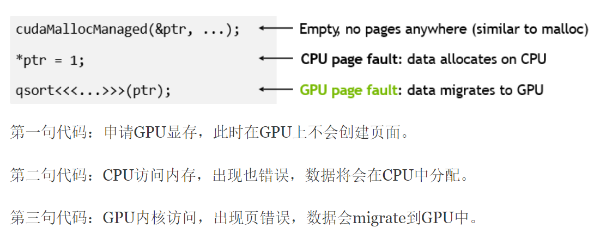

Memory Manager
+ 存储区域   

SYSTEM域：位于系统内存，CPU可以直接访问，GPU不可访问   
GTT域：位于系统内存，CPU可以直接访问，GPU通过GART表访问（ring buffer就在这里）   
VRAM域：位于显存，CPU通过I/O映射访问，GPU可以直接访问，也称local,(顶点一般放这，纹理GTT和VRAM皆可)   
+  GPUVM:   
​ 是GPU提供的MMU功能，类似GART， 每一个GPU 进程有一份GPU页表，一般最多16个，在提交Command的时候GPU驱动会把进程对应的GPU页表设置到硬件寄存器中，在细节上GPU的地址分配和映射和CPU稍有不同。     和GART区别是，GART只支持一个地址空间，而GPUVM支持多个地址空间，用VMID来标识。   

​ GPUVM不仅可以映射系统内存还可以映射显存，也就是说将系统内存和显存放在统一的地址空间中管理。还可以映射为snooped/nonsnoop(cache/uncache system page)   

​ 在执行cmd buffer的时候，内核应该告诉engine使用使用的cmd buffer的VMID，VMID是在Submit时候动态分配的。   

​ GPUVM由1-2或1-5级页表表示，具体取决于chip,它也支持RWX属性或其他属性，比如加密和caching 属性  

​ 在AMD显卡中，VMID0是给内核驱动预留的，除了page table管理的apertures,vmid0还有其他apertures,有一个apertures用来直接访问VRAM，还有一个旧的AGP aperature仅仅将（memory）访问直接转发到system physical address(或当IOMMU存在时的IOVA)，（这个应该说的是旧的PA模式）这些aperature提供了对这些内存的直接访问，而没有页表的开销，VIMD0由KMD用于内存管理等任务   

​ GPU clients(engines),即每个APP都有自己唯一的地址空间，KMD管理每个进程的GPU VM page Table，当访问的无效页面时，会触发Page Fault    

+ 共享显存

一般在核显中常见，当作VRAM去处理，而不是GART，CPU需要IO映射才能访问，这种也叫UMA
 

# svm_migrate_copy_to_vram （migrate to gpu vram ）      

```
svm_migrate_copy_to_vram  --> 
svm_migrate_copy_memory_gart  --> amdgpu_copy_buffer
```


vram物理页    

+  amdgpu_res_first 获取cursor

+   migrate->dst[i] = svm_migrate_addr_to_pfn(adev, dst[i])   
```
	amdgpu_res_first(prange->ttm_res, ttm_res_offset,
			 npages << PAGE_SHIFT, &cursor);
	for (i = j = 0; i < npages; i++) {
		struct page *spage;

		dst[i] = cursor.start + (j << PAGE_SHIFT);
		migrate->dst[i] = svm_migrate_addr_to_pfn(adev, dst[i]);
```

#  gart table  

[GPU体系架构(二)：GPU存储体系](https://www.cnblogs.com/hellobb/p/11023873.html)   


AGP(Accelerated Graphics Port)   

一种高速总线，允许图形卡从系统内存读数据，基于GART使不连续的内存在图形卡眼中作为连续处理，并使用DMA传输(还记着scatter-gather模式)。   

GART(Graphics Address Re-Mapping Table)  
我的理解就是IOMMU/SMMU之类的东西，外设的页表，然后外设可以访问不连续内存。   

GTT   
Global Graphics Translation Table，负责GPU虚拟地址空间到物理地址空间的映射，好像是intel来的   
 
 
 对于integrated gpu而言，因为GPU和CPU处于同一die中，所以GPU和CPU很多时候是共享总线的。除了GPU自己的local memory之外，CPU和GPU之间有时候需要共享一些数据，例如在渲染的时候，CPU将顶点数据放入主存当中，供GPU使用。由于主存的内容对GPU来说是不可见的，所以GPU是不能直接访问这些数据的。为了让GPU访问CPU主存的内容，业界引入了一个叫GART（即Graphic Address Remapping Table）的技术。GART是一个 I/O memory management unit (IOMMU) ，说白了就是一个内存地址的映射表，可以将CPU的内存地址重新映射到GPU的地址空间，这样就可以让显卡直接访问(DMA,direct memory access)host system memory。   
 
 
# 华为昇腾Ascend uvm


[华为昇腾Ascend uvm](https://zhuanlan.zhihu.com/p/679635240)   

[源码](https://github.com/apulis/Apulis-AI-Platform/blob/2cf1fbb50e08b477940f5f336b1b897a49608b72/src/ClusterBootstrap/test_npu/driver/kernel/devmmcommon/devmm_dev.c)    



```
STATIC int devmm_svm_vm_fault_host_proc(struct devmm_svm_process *svm_proc,
    struct vm_area_struct *vma, struct vm_fault *vmf)
{


    page_map_info.nid = NUMA_NO_NODE;
    page_map_info.page_num = page_num;
    page_map_info.inpages = pages;
    ret = devmm_alloc_pages(&page_map_info, svm_proc);  /*申请物理内存*
	ret = devmm_page_fault_h2d_sync(svm_id, pages, start, adjust_order, heap); /*发送页信息到device*/
	ret = devmm_pages_remap(svm_proc, start, 1ULL << adjust_order, pages); /*建立映射*/
```
+ devmm_alloc_pages函数会在主机端申请物理页。在不使用大页或者巨页的情况下，每次缺页中断会申请一个页，devmm_alloc_pages最终会调用numa的page申请接口alloc_pages_node申请物理内存。    
+ devmm_page_fault_h2d_sync会将申请到的页信息发送到device，device会使用得到的页面信息做dma拷贝    

 devmm_insert_pages_to_vma --> devmm_insert_pages_range_to_vma -->  remap_pfn_range
+   devmm_pages_remap会调用remap_pfn_range函数为申请到的物理地址建立页表并将vma插入自己的进程空间中。同时会调用get_page函数锁住这个页面    


> ##  devmm_page_fault_h2d_sync 传递给设备的信息

devmm_page_fault_h2d_sync(svm_id, pages, start, adjust_order, heap); /*发送页信息到device*/   
两部分信息     
+ 1  blks = fault_msg->blks  
  va是虚拟地址信息   
+ 2 devmm_fill_page_fault_msg(dev_id, va, adjust_order, DEVMM_CHAN_PAGE_FAULT_H2D_ID, fault_msg);


> ## devmm_chan_page_fault_d2h_process_copy


+ 1 devmm_va_to_palist 怎么获取host侧物理地址？ 直接查页表      


> ## svm mmap(cpu访问触发pagefault)   

```
STATIC struct vm_operations_struct devmm_vm_ops_managed = {
#if LINUX_VERSION_CODE >= KERNEL_VERSION(4, 14, 4)
    .split = devmm_svm_vm_split,
#endif
};
```

```
STATIC void devmm_init_svm_process(struct devmm_svm_process *process, struct vm_area_struct *vma)
{
    u32 i;

    process->normal_exited = DEVMM_SVM_ABNORMAL_EXITED_FLAG;
    process->start_addr = DEVMM_SVM_MEM_START;
    process->end_addr = DEVMM_SVM_MEM_START + DEVMM_SVM_MEM_SIZE - 1;
```

start_addr 和 end_addr    
```
STATIC int devmm_svm_mmap(struct file *file, struct vm_area_struct *vma)
{
    struct devmm_svm_process *svm_process = NULL;

    if ((vma->vm_start != DEVMM_SVM_MEM_START) || (vma->vm_end != (DEVMM_SVM_MEM_START + DEVMM_SVM_MEM_SIZE))) {
        devmm_drv_err("svm map err. vm_start=0x%lx,vm_end=0x%lx,vm_pgoff=0x%lx, vm_flags=0x%lx.\n", vma->vm_start,
                      vma->vm_end, vma->vm_pgoff, vma->vm_flags);
        return -ESRCH;
    }

    svm_process = devmm_svm_mmap_init_struct(&devmm_vm_ops_managed, vma);
    if (svm_process == NULL) {
        devmm_drv_err("svm map init_struct err.vm_start=0x%lx,vm_end=0x%lx,vm_pgoff=0x%lx, vm_flags=0x%lx.\n",
                      vma->vm_start, vma->vm_end, vma->vm_pgoff, vma->vm_flags);
        return -ESRCH;
    }
    /* init vma */
    svm_process->vma = vma;
    vma->vm_ops = &devmm_vm_ops_managed;
    vma->vm_flags |= VM_LOCKED;
    vma->vm_flags |= VM_DONTEXPAND;
    vma->vm_flags |= VM_PFNMAP;
    vma->vm_flags |= VM_WRITE;
    vma->vm_flags |= VM_DONTDUMP;

    file->private_data = kzalloc(sizeof(struct devmm_private_data), GFP_KERNEL);
    if (file->private_data == NULL) {
        devmm_drv_err("kzalloc devmm_private_data fail."
                      "vm_start=0x%lx,vm_end=0x%lx,vm_pgoff=0x%lx,vm_flags=0x%lx.\n",
                      vma->vm_start, vma->vm_end, vma->vm_pgoff, vma->vm_flags);
        return -ENOMEM;
    }

    ((struct devmm_private_data *)file->private_data)->process = svm_process;

    devmm_drv_switch("vm_start=0x%lx,vm_end=0x%lx,vm_pgoff=0x%lx,vm_flags=0x%lx\n", vma->vm_start, vma->vm_end,
                     vma->vm_pgoff, vma->vm_flags);

    devmm_init_svm_process(svm_process, vma);

    return 0;
}

```

>  ##  pagefault    devmm_svm_vm_fault_host   
```
struct devmm_svm_process *devmm_svm_mmap_init_struct(struct vm_operations_struct *ops_managed,
                                                     struct vm_area_struct *vma)
{
    struct devmm_svm_process *svm_proc = NULL;
    if (devmm_get_pro_by_pid(devmm_get_current_pid(), DEVMM_SVM_INITED_FLAG, DEVMM_END_HOST) != NULL) {
        devmm_drv_err("svm process remap err.\n");
        return NULL;
    }

#if LINUX_VERSION_CODE >= KERNEL_VERSION(4, 11, 0)
    ops_managed->fault = devmm_svm_vmf_fault_host;
#else
    ops_managed->fault = devmm_svm_vm_fault_host;
#endif
    svm_proc = devmm_get_idle_process_set_init(devmm_get_current_pid(), DEVMM_SVM_INVALID_PID,
                                               DEVMM_SVM_INITING_FLAG);
    return svm_proc;
}
```


```
STATIC int devmm_svm_vm_fault_host(struct vm_area_struct *vma, struct vm_fault *vmf)
{
 ret = devmm_alloc_pages(NUMA_NO_NODE, 0, page_num, pages, svm_process);
 ret = devmm_page_fault_h2d_sync(dev_id, pages, start, adjust_order, heap);
 ret = devmm_insert_pages_to_vma(svm_process, start, adjust_order, pages);
}
```
 
# references

[openEuler Kernel 技术解读 | UADK框架介绍](https://ost.51cto.com/posts/15214)   