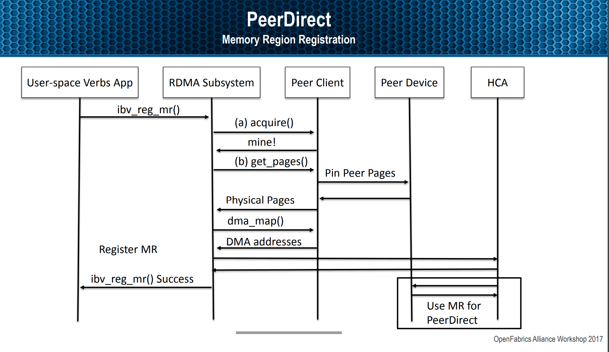
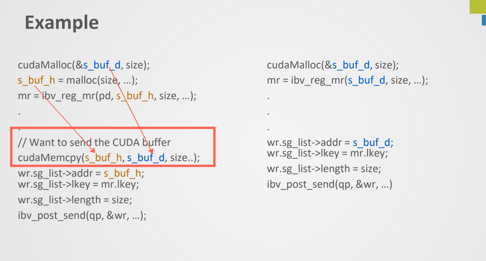
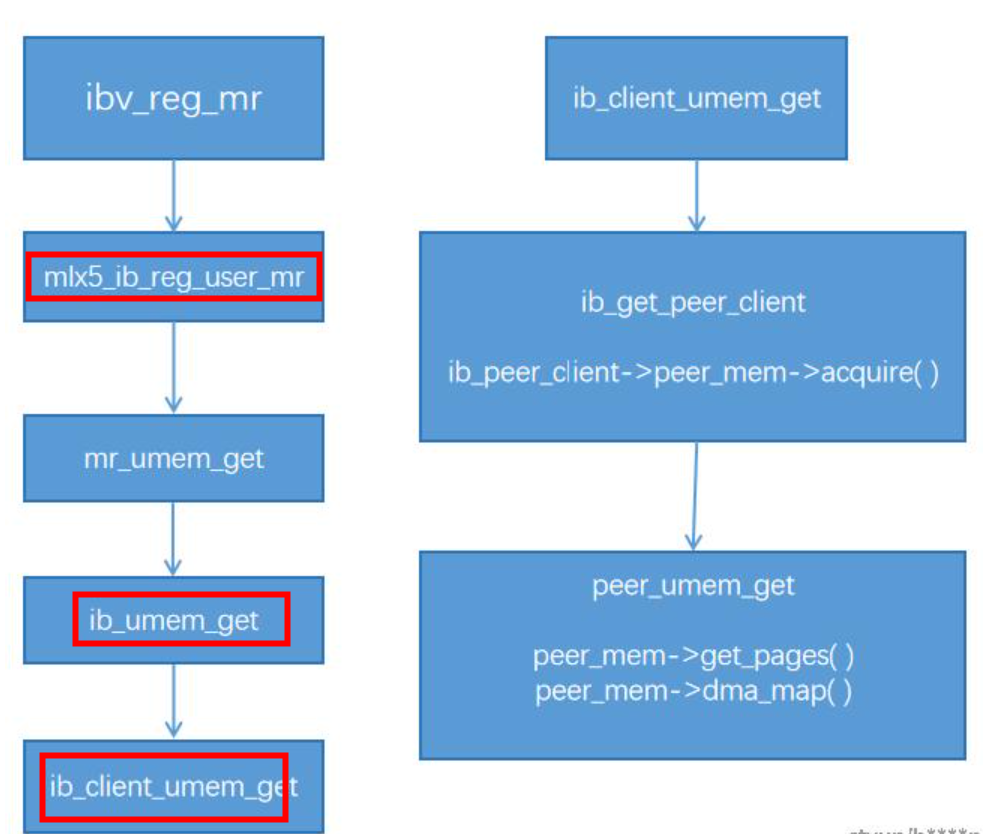
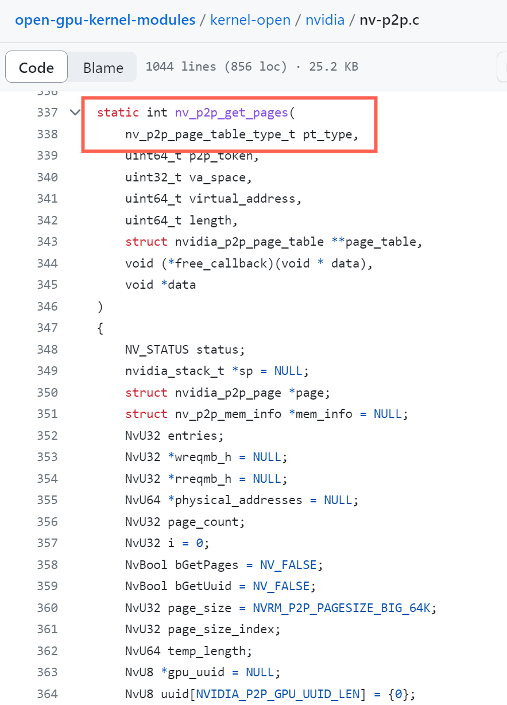
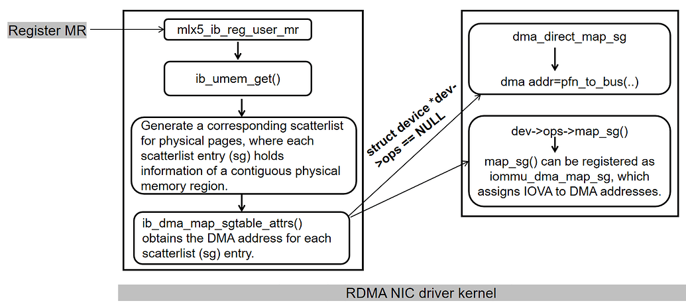
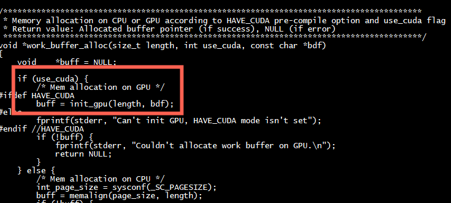

How does it work ?   
+ 1 Allow ibv_reg_mr() to register peer memory.   
▪ Peer devices implement new kernel module – io_peer_mem   
▪ Register with RDMA subsystem - ib_register_peer_memory_client()   
+ 2  io_peer_mem implements the following callbacks :    
▪ acquire() – detects whether a virtual memory range belongs to the peer   
▪ get_pages() – asks the peer for the physical memory addresses matching the memory region   
▪ dma_map() – requests the bus addresses for the memory region   
▪ Matching callbacks for release: dma_unmap(), put_pages() and release()   

**mlnx-ofa_kernel-4.6-1.0.1.1-rhel7.3源码**    
[mlnx-ofa_kernel-4.6-1.0.1.1-rhel7.3](https://github.com/Shun-Hao/mlnx-ofa_kernel-4.6-1.0.1.1-rhel7.3/blob/de3d66766e0eb5eab9db813b667c7c70eab4c534/drivers/infiniband/core/umem.c#L170)    

[CUDA中的UM机制与GDR实现](https://www.ctyun.cn/developer/article/465119451353157)   

mlx5_ib_rereg_user_mr --> mlx5_ib_reg_user_mr  --> ib_umem_get --> ib_client_umem_get  --> peer_umem_get      



```
	/* For known peer context move directly to peer registration handling */
	if (context->peer_mem_private_data &&
	    (peer_mem_flags & IB_PEER_MEM_ALLOW)) {
		ret = ib_client_umem_get(context, addr, size,
					 peer_mem_flags, umem, dmasync);
		if (!ret)
			return umem;
	}
```

# gpu_direct_rdma_access example

[gpu_direct_rdma_access](https://github.com/Mellanox/gpu_direct_rdma_access)     


```
struct rdma_buffer *rdma_buffer_reg(struct rdma_device *rdma_dev, void *addr, size_t length)
{
    struct rdma_buffer *rdma_buff;
    int    ret_val;

    rdma_buff = calloc(1, sizeof *rdma_buff);
    if (!rdma_buff) {
        fprintf(stderr, "rdma_buff memory allocation failed\n");
        return NULL;
    }

    enum ibv_access_flags access_flags = IBV_ACCESS_LOCAL_WRITE | IBV_ACCESS_REMOTE_READ | IBV_ACCESS_REMOTE_WRITE;
    /*In the case of local buffer we can use IBV_ACCESS_LOCAL_WRITE only flag*/
    DEBUG_LOG("ibv_reg_mr(pd %p, buf %p, size = %lu, access_flags = 0x%08x\n",
               rdma_dev->pd, addr, length, access_flags);
    rdma_buff->mr = ibv_reg_mr(rdma_dev->pd, addr, length, access_flags);
    if (!rdma_buff->mr) {
        fprintf(stderr, "Couldn't register GPU MR\n");
        goto clean_rdma_buff;
    }
    DEBUG_LOG("ibv_reg_mr completed: buf %p, size = %lu, rkey = 0x%08x\n",
               addr, length, rdma_buff->mr->rkey);

    rdma_buff->buf_addr = addr;
    rdma_buff->buf_size = length;
    rdma_buff->rkey     = rdma_buff->mr->rkey; /*not used for local buffer case*/
    rdma_buff->rdma_dev = rdma_dev;
    rdma_dev->rdma_buff_cnt++;

    return rdma_buff;

clean_rdma_buff:
    /* We don't decrement device rdma_buff_cnt because we still did not increment it,
    we just free the allocated for rdma_buff memory. */
    free(rdma_buff);
    
    return NULL;
}
```


#  nvidia-peermem.ko
The NVIDIA GPU driver package provides a kernel module, nvidia-peermem.ko, which provides Mellanox InfiniBand based HCAs (Host Channel Adapters) direct peer-to-peer read and write access to the NVIDIA GPU's video memory. It allows GPUDirect RDMA-based applications to use GPU computing power with the RDMA interconnect without needing to copy data to host memory.


##  open-gpu-kernel-modules 

[open-gpu-kernel-modules](https://github.com/NVIDIA/open-gpu-kernel-modules)



```Text
int nvidia_p2p_get_pages(
    uint64_t p2p_token,
    uint32_t va_space,
    uint64_t virtual_address,
    uint64_t length,
    struct nvidia_p2p_page_table **page_table,
    void (*free_callback)(void * data),
    void *data
)

virtual_address : GPU内存buffer虚拟地址

length ： GPU内存buffer的长度

nvidia_p2p_page_table : 输出参数，返回映射的物理页的个数及每页的物理地址。（页大小为64KB）

nvidia_p2p_get_pages to pin the pre-allocated GPU memory and map the pinned GPU memory to the DMA address space for P2P
communication.   

free_callback : 回调函数，在nvidia_p2p_put_pages API函数中调用
int nvidia_p2p_put_pages(
    uint64_t p2p_token,
    uint32_t va_space,
    uint64_t virtual_address,
    struct nvidia_p2p_page_table *page_table
)
此API接口用来释放page_table指针所指向的物理页。
```
# nvidia_p2p_get_pages实现一
```
int nvidia_p2p_get_pages(u64 vaddr, u64 size,
		struct nvidia_p2p_page_table **page_table,
		void (*free_callback)(void *data), void *data)
{
    user_pages = get_user_pages_locked(vaddr & PAGE_MASK, nr_pages,
			FOLL_WRITE | FOLL_FORCE,
			pages, &locked);
	(*page_table)->version = NVIDIA_P2P_PAGE_TABLE_VERSION;
	(*page_table)->pages = pages;
	(*page_table)->entries = user_pages;
	(*page_table)->page_size = NVIDIA_P2P_PAGE_SIZE_4KB;
	(*page_table)->size = size;

	(*page_table)->mn.ops = &nvidia_p2p_mmu_ops;
	(*page_table)->mm = current->mm;
	(*page_table)->free_callback = free_callback;
	(*page_table)->data = data;
	(*page_table)->vaddr = vaddr;
	mutex_init(&(*page_table)->lock);
	(*page_table)->mapped = NVIDIA_P2P_PINNED;
	ret = mmu_notifier_register(&(*page_table)->mn, (*page_table)->mm);

}
```
##  page_table->free_callback
```
static void nvidia_p2p_mn_release(struct mmu_notifier *mn,
	struct mm_struct *mm)
{
	struct nvidia_p2p_page_table *page_table = container_of(mn,
						struct nvidia_p2p_page_table,
						mn);

	page_table->free_callback(page_table->data);
}
```
# mmu_notifier_ops
```
static struct mmu_notifier_ops nvidia_p2p_mmu_ops = {
	.release		= nvidia_p2p_mn_release,
	.invalidate_range_start	= nvidia_p2p_mn_invl_range_start,
};
```
# nvidia_p2p_get_pages实现二
```
int nvidia_p2p_get_pages(
    uint64_t p2p_token,
    uint32_t va_space,
    uint64_t virtual_address,
    uint64_t length,
    struct nvidia_p2p_page_table **page_table,
    void (*free_callback)(void * data),
    void *data
)
{
    NV_STATUS status;
    nvidia_stack_t *sp = NULL;
    struct nvidia_p2p_page *page;
    struct nv_p2p_mem_info *mem_info = NULL;
    NvU32 entries;
    NvU32 *wreqmb_h = NULL;
    NvU32 *rreqmb_h = NULL;
    NvU64 *physical_addresses = NULL;
    NvU32 page_count;
    NvU32 i = 0;
    NvBool bGetPages = NV_FALSE;
    NvU32 page_size = NVRM_P2P_PAGESIZE_BIG_64K;
    NvU32 page_size_index;
    NvU64 temp_length;
    NvU8 *gpu_uuid = NULL;
    int rc;

    rc = nv_kmem_cache_alloc_stack(&sp);
    if (rc != 0)
    {
        return rc;
    }

    *page_table = NULL;
    status = os_alloc_mem((void **)&mem_info, sizeof(*mem_info));
    if (status != NV_OK)
    {
        goto failed;
    }

    memset(mem_info, 0, sizeof(*mem_info));

    INIT_LIST_HEAD(&mem_info->dma_mapping_list.list_head);
    NV_INIT_MUTEX(&mem_info->dma_mapping_list.lock);

    *page_table = &(mem_info->page_table);

    //asign length to temporary variable since do_div macro does in-place division
    temp_length = length;
    do_div(temp_length, page_size);
    page_count = temp_length;

    if (length & (page_size - 1))
    {
        page_count++;
    }

    status = os_alloc_mem((void **)&physical_addresses,
            (page_count * sizeof(NvU64)));
    if (status != NV_OK)
    {
        goto failed;
    }
    status = os_alloc_mem((void **)&wreqmb_h, (page_count * sizeof(NvU32)));
    if (status != NV_OK)
    {
        goto failed;
    }
    status = os_alloc_mem((void **)&rreqmb_h, (page_count * sizeof(NvU32)));
    if (status != NV_OK)
    {
        goto failed;
    }

    status = rm_p2p_get_pages(sp, p2p_token, va_space,
            virtual_address, length, physical_addresses, wreqmb_h,
            rreqmb_h, &entries, &gpu_uuid, *page_table);
    if (status != NV_OK)
    {
        goto failed;
    }

    bGetPages = NV_TRUE;
    (*page_table)->gpu_uuid = gpu_uuid;

    status = os_alloc_mem((void *)&(*page_table)->pages,
             (entries * sizeof(page)));
    if (status != NV_OK)
    {
        goto failed;
    }

    (*page_table)->version = NVIDIA_P2P_PAGE_TABLE_VERSION;

    for (i = 0; i < entries; i++)
    {
        page = NV_KMEM_CACHE_ALLOC(nvidia_p2p_page_t_cache);
        if (page == NULL)
        {
            status = NV_ERR_NO_MEMORY;
            goto failed;
        }

        memset(page, 0, sizeof(*page));

        page->physical_address = physical_addresses[i];
        page->registers.fermi.wreqmb_h = wreqmb_h[i];
        page->registers.fermi.rreqmb_h = rreqmb_h[i];

        (*page_table)->pages[i] = page;
        (*page_table)->entries++;
    }

    status = nvidia_p2p_map_page_size(page_size, &page_size_index);
    if (status != NV_OK)
    {
        goto failed;
    }

    (*page_table)->page_size = page_size_index;

    os_free_mem(physical_addresses);
    os_free_mem(wreqmb_h);
    os_free_mem(rreqmb_h);

    mem_info->free_callback = free_callback;
    mem_info->data          = data;

    status = rm_p2p_register_callback(sp, p2p_token, virtual_address, length,
                                      *page_table, nv_p2p_mem_info_free_callback, mem_info);
    if (status != NV_OK)
    {
        goto failed;
    }

    nv_kmem_cache_free_stack(sp);

    return nvidia_p2p_map_status(status);

failed:
    if (physical_addresses != NULL)
    {
        os_free_mem(physical_addresses);
    }
    if (wreqmb_h != NULL)
    {
        os_free_mem(wreqmb_h);
    }
    if (rreqmb_h != NULL)
    {
        os_free_mem(rreqmb_h);
    }

    if (bGetPages)
    {
        (void)nv_p2p_put_pages(sp, p2p_token, va_space,
                               virtual_address, page_table);
    }

    if (*page_table != NULL)
    {
        nv_p2p_free_page_table(*page_table);
    }

    nv_kmem_cache_free_stack(sp);

    return nvidia_p2p_map_status(status);
}
```


# nv_p2p_put_pages
nv_mem_put_pages-->  nvidia_p2p_put_pages -->  nv_p2p_put_pages   
```
static NV_STATUS nv_p2p_put_pages(
    nv_p2p_page_table_type_t pt_type,
    nvidia_stack_t * sp,
    uint64_t p2p_token,
    uint32_t va_space,
    uint64_t virtual_address,
    struct nvidia_p2p_page_table **page_table
)
{
    NV_STATUS status;

    /*
     * rm_p2p_put_pages returns NV_OK if the page_table was found and
     * got unlinked from the RM's tracker (atomically). This ensures that
     * RM's tear-down path does not race with this path.
     *
     * rm_p2p_put_pages returns NV_ERR_OBJECT_NOT_FOUND if the page_table
     * was already unlinked.
     */
    if (pt_type == NV_P2P_PAGE_TABLE_TYPE_PERSISTENT)
    {
        struct nv_p2p_mem_info *mem_info = NULL;

        /*
         * It is safe to access persistent page_table as there is no async
         * callback which can free it unlike non-persistent page_table.
         */
        mem_info = container_of(*page_table, nv_p2p_mem_info_t, page_table);
        status = rm_p2p_put_pages_persistent(sp, mem_info->private, *page_table);
    }
    else
    {
        status = rm_p2p_put_pages(sp, p2p_token, va_space,
                                  virtual_address, *page_table);
    }

    if (status == NV_OK)
    {
        nv_p2p_free_page_table(*page_table);
        *page_table = NULL;
    }
    else if ((pt_type == NV_P2P_PAGE_TABLE_TYPE_NON_PERSISTENT) &&
             (status == NV_ERR_OBJECT_NOT_FOUND))
    {
        status = NV_OK;
        *page_table = NULL;
    }
    else
    {
        WARN_ON(status != NV_OK);
    }

    return status;
}

```


```
kernel BUG at mm/slab.c:524!
-    2.6.32-642.11.1.el6.x86_64
Call Trace:
[<ffffffff8113ca60>] ? __free_pages+0x60/0xa0
[<ffffffff812aa1d0>] ? sg_kfree+0x0/0x30
[<ffffffff812aa1e1>] sg_kfree+0x11/0x30
[<ffffffff812a98a0>] __sg_free_table+0x60/0x80
[<ffffffff812aa1d0>] ? sg_kfree+0x0/0x30
[<ffffffff812a9fe1>] sg_alloc_table+0x41/0x50
[<ffffffffa0421731>] ib_get_umem+0x231/0x5e0 [ib_core]
[<ffffffffa0139ccd>] ? mlx5_cmd_exec+0x1d/0x20 [mlx5_core]
[<ffffffffa0421b20>] ib_umem_get+0x40/0x44 [ib_core]
[<ffffffffa0505a90>] mlx5_ib_reg_user_mr+0x60/0x6b0 [mlx5_ib]
[<ffffffffa051f9dd>] ? __idr_get_uobj+0x7d/0x90 [ib_uverbs]
[<ffffffffa052436a>] ib_uverbs_reg_mr+0x16a/0x2b0 [ib_uverbs]
[<ffffffffa051e6a2>] ib_uverbs_write+0x2f2/0x330 [ib_uverbs]
[<ffffffff811e2074>] ? ep_poll+0x314/0x350
[<ffffffff81151d1c>] ? sys_madvise+0x2fc/0x790
[<ffffffff812390f6>] ? security_file_permission+0x16/0x20
[<ffffffff8119801d>] ? rw_verify_area+0x5d/0xc0
[<ffffffff81198138>] vfs_write+0xb8/0x1a0
[<ffffffff81199626>] ? fget_light_pos+0x16/0x50
[<ffffffff81198c71>] sys_write+0x51/0xb0
[<ffffffff8100b0d2>] system_call_fastpath+0x16/0x1b
RIP  [<ffffffff8117fe0c>] kfree+0x29c/0x320
```



mlx5_ib_reg_user_mr -->  ib_umem_get  -->  ib_dma_map_sgtable_attrs

#  peer_mem.c

mlx5_ib_reg_user_mr --> ib_umem_get_peer --> __ib_umem_get --> ib_peer_umem_get  

```C
struct ib_umem *ib_peer_umem_get(struct ib_umem *old_umem, int old_ret,
				 unsigned long peer_mem_flags)
{
	/*
	 * We always request write permissions to the pages, to force breaking
	 * of any CoW during the registration of the MR. For read-only MRs we
	 * use the "force" flag to indicate that CoW breaking is required but
	 * the registration should not fail if referencing read-only areas.
	 */
	ret = ib_peer_client->peer_mem->get_pages(umem_p->umem.address,
						  umem_p->umem.length, 1,
						  !umem_p->umem.writable, NULL,
						  peer_client_context,
						  umem_p->xa_id);
	if (ret)
		goto err_xa;
	ret = ib_peer_client->peer_mem->dma_map(&umem_p->umem.sg_head,
						peer_client_context,
						umem_p->umem.ibdev->dma_device,
						0, &umem_p->umem.nmap);
	if (ret)
		goto err_pages;
	peer_page_size = ib_peer_client->peer_mem->get_page_size(peer_client_context);
	if (peer_page_size != PAGE_SIZE)
		fix_peer_sgls(umem_p, peer_page_size);
}
```

```C
static struct ib_peer_memory_client *
ib_get_peer_client(unsigned long addr, size_t size,
		   unsigned long peer_mem_flags, void **peer_client_context)
{
	struct ib_peer_memory_client *ib_peer_client;
	int ret = 0;
	mutex_lock(&peer_memory_mutex);
	list_for_each_entry(ib_peer_client, &peer_memory_list,
			    core_peer_list) {
		if (ib_peer_client->invalidation_required &&
		    (!(peer_mem_flags & IB_PEER_MEM_INVAL_SUPP)))
			continue;
		ret = ib_peer_client->peer_mem->acquire(addr, size, NULL, NULL,
							peer_client_context);
		if (ret > 0) {
			refcount_inc(&ib_peer_client->usecnt);
			mutex_unlock(&peer_memory_mutex);
			return ib_peer_client;
		}
	}
	mutex_unlock(&peer_memory_mutex);
	return NULL;
}
```

# nvidia_p2p_dma_map_pages

```
int nvidia_p2p_dma_map_pages(struct device *dev,
		struct nvidia_p2p_page_table *page_table,
		struct nvidia_p2p_dma_mapping **dma_mapping,
		enum dma_data_direction direction)
{
	struct sg_table *sgt = NULL;
	struct scatterlist *sg;
	struct page **pages = NULL;
	u32 nr_pages = 0;
	int ret = 0;
	int i, count;

	if (!page_table) {
		return -EINVAL;
	}

	mutex_lock(&page_table->lock);

	pages = page_table->pages;
	nr_pages = page_table->entries;
	if (nr_pages <= 0) {
		mutex_unlock(&page_table->lock);
		return -EINVAL;
	}

	*dma_mapping = kzalloc(sizeof(**dma_mapping), GFP_KERNEL);
	if (!*dma_mapping) {
		mutex_unlock(&page_table->lock);
		return -ENOMEM;
	}
	sgt = kzalloc(sizeof(*sgt), GFP_KERNEL);
	if (!sgt) {
		ret = -ENOMEM;
		goto free_dma_mapping;
	}
	ret = sg_alloc_table_from_pages(sgt, pages,
				nr_pages, 0, page_table->size, GFP_KERNEL);
	if (ret) {
		goto free_sgt;
	}

	(*dma_mapping)->version = NVIDIA_P2P_DMA_MAPPING_VERSION;
	(*dma_mapping)->sgt = sgt;
	(*dma_mapping)->dev = dev;
	(*dma_mapping)->direction = direction;
	(*dma_mapping)->page_table = page_table;

	count = dma_map_sg(dev, sgt->sgl, sgt->nents, direction);
	if (count < 1) {
		goto free_sg_table;
	}

	(*dma_mapping)->entries = count;

	(*dma_mapping)->hw_address = kcalloc(count, sizeof(u64), GFP_KERNEL);
	if (!((*dma_mapping)->hw_address)) {
		ret = -ENOMEM;
		goto unmap_sg;
	}
	(*dma_mapping)->hw_len = kcalloc(count, sizeof(u64), GFP_KERNEL);
	if (!((*dma_mapping)->hw_len)) {
		ret = -ENOMEM;
		goto free_hw_address;
	}

	for_each_sg(sgt->sgl, sg, count, i) {
		(*dma_mapping)->hw_address[i] = sg_dma_address(sg);
		(*dma_mapping)->hw_len[i] = sg_dma_len(sg);
	}
	(*dma_mapping)->page_table->mapped |= NVIDIA_P2P_MAPPED;
	mutex_unlock(&page_table->lock);

	return 0;
free_hw_address:
	kfree((*dma_mapping)->hw_address);
unmap_sg:
	dma_unmap_sg(dev, sgt->sgl,
		sgt->nents, direction);
free_sg_table:
	sg_free_table(sgt);
free_sgt:
	kfree(sgt);
free_dma_mapping:
	kfree(*dma_mapping);
	*dma_mapping = NULL;
	mutex_unlock(&page_table->lock);

	return ret;
}
EXPORT_SYMBOL(nvidia_p2p_dma_map_pages);
```
#  nv_mem_dummy_callback
```
/* At that function we don't call IB core - no ticket exists */
static void nv_mem_dummy_callback(void *data)
{
	struct nv_mem_context *nv_mem_context = (struct nv_mem_context *)data;
	int ret = 0;

	__module_get(THIS_MODULE);

	ret = nvidia_p2p_free_page_table(nv_mem_context->page_table);
	if (ret)
		peer_err("nv_mem_dummy_callback -- error %d while calling nvidia_p2p_free_page_table()\n", ret);

	module_put(THIS_MODULE);
	return;
}
```
#  nv_get_p2p_free_callback

```
static void nv_get_p2p_free_callback(void *data)
{
	int ret = 0;
	struct nv_mem_context *nv_mem_context = (struct nv_mem_context *)data;
	struct nvidia_p2p_page_table *page_table = NULL;
#if NV_DMA_MAPPING
	struct nvidia_p2p_dma_mapping *dma_mapping = NULL;
#endif

	__module_get(THIS_MODULE);
	if (!nv_mem_context) {
		peer_err("nv_get_p2p_free_callback -- invalid nv_mem_context\n");
		goto out;
	}

	if (!nv_mem_context->page_table) {
		peer_err("nv_get_p2p_free_callback -- invalid page_table\n");
		goto out;
	}

	/* Save page_table locally to prevent it being freed as part of nv_mem_release
	    in case it's called internally by that callback.
	*/
	page_table = nv_mem_context->page_table;

#if NV_DMA_MAPPING
	if (!nv_mem_context->dma_mapping) {
		peer_err("nv_get_p2p_free_callback -- invalid dma_mapping\n");
		goto out;
	}
	dma_mapping = nv_mem_context->dma_mapping;
#endif

	/* For now don't set nv_mem_context->page_table to NULL, 
	  * confirmed by NVIDIA that inflight put_pages with valid pointer will fail gracefully.
	*/

	WRITE_ONCE(nv_mem_context->is_callback, 1);
	(*mem_invalidate_callback) (reg_handle, nv_mem_context->core_context);
#if NV_DMA_MAPPING
	ret = nvidia_p2p_free_dma_mapping(dma_mapping); 
	if (ret)
                peer_err("nv_get_p2p_free_callback -- error %d while calling nvidia_p2p_free_dma_mapping()\n", ret);
#endif
	ret = nvidia_p2p_free_page_table(page_table);
	if (ret)
		peer_err("nv_get_p2p_free_callback -- error %d while calling nvidia_p2p_free_page_table()\n", ret);

out:
	module_put(THIS_MODULE);
	return;

}
```

#  nv_p2p_mem_info_free_callback
```C
static void nv_p2p_mem_info_free_callback(void *data)
{
    nv_p2p_mem_info_t *mem_info = (nv_p2p_mem_info_t*) data;

    mem_info->free_callback(mem_info->data);

    nv_p2p_free_platform_data(&mem_info->page_table);
}
```
#  gpu_direct_rdma_access demo

+ 1.Enable Host Mapping*   

Runtime: cudaSetDeviceFlags() with cudaDeviceMapHost flag  
Driver : cuCtxCreate() with CU_CTX_MAP_HOST  
+ 2.Allocate pinned CPU memory

Runtime: cudaHostAlloc(), use cudaHostAllocMapped flag  
Driver : cuMemHostAlloc()use CUDA_MEMHOSTALLOC_DEVICEMAP  
+ 3.Get a CUDA device pointer to this memory  

Runtime: cudaHostGetDevicePointer()  
Driver : cuMemHostGetDevicePointer()  

## ibv_reg_mr 
```
  /* Local memory buffer allocation */
    /* On the server side, we allocate buffer on CPU and not on GPU */
    void *buff = work_buffer_alloc(usr_par.size, 0 /*use_cuda*/, NULL);
    if (!buff) {
        ret_val = 1;
        goto clean_device;
    }

    /* RDMA buffer registration */
    struct rdma_buffer *rdma_buff;

    rdma_buff = rdma_buffer_reg(rdma_dev, buff, usr_par.size);
    if (!rdma_buff) {
        ret_val = 1;
        goto clean_mem_buff;
    }
```
+ 1） work_buffer_alloc 调用init_gpu从cuda分配内存,采用CU_CTX_MAP_HOST  
```
  cu_result = cuCtxCreate(&cuContext, CU_CTX_MAP_HOST, cu_dev);
  cu_result = cuMemAlloc(&d_A, aligned_size);
```


+ 2） rdma_buffer_reg 调用 ibv_reg_mr   

```
    rdma_buff->mr = ibv_reg_mr(rdma_dev->pd, addr, length, access_flags);
    if (!rdma_buff->mr) {
        fprintf(stderr, "Couldn't register GPU MR\n");
        goto clean_rdma_buff;
    }
    rdma_buff->buf_addr = addr;
    rdma_buff->buf_size = length;
    rdma_buff->rkey     = rdma_buff->mr->rkey; /*not used for local buffer case*/
    rdma_buff->rdma_dev = rdma_dev;
    rdma_dev->rdma_buff_cnt++;
```

#  trex-core  cuda direct rdma

```
	res = pfn_cuDeviceGetAttribute(&(private->gdr_supported),
			CU_DEVICE_ATTRIBUTE_GPU_DIRECT_RDMA_SUPPORTED,
			cu_dev_id);
	if (res != 0) {
		pfn_cuGetErrorString(res, &(err_string));
		rte_cuda_log(ERR, "cuDeviceGetAttribute failed with %s",
				err_string);
		rte_errno = EPERM;
		return -rte_errno;
	}
```

## CU_MEMHOSTREGISTER_DEVICEMAP

```
#define CU_MEMHOSTREGISTER_DEVICEMAP 0x02
If set, host memory is mapped into CUDA address space and cuMemHostGetDevicePointer() may be called on the host pointer. Flag for cuMemHostRegister()
```

```
static int
cuda_mem_register(struct rte_gpu *dev, size_t size, void *ptr)
{
res = pfn_cuMemHostRegister(mem_alloc_list_tail->ptr_h,
			mem_alloc_list_tail->size,
			CU_MEMHOSTREGISTER_PORTABLE |
			CU_MEMHOSTREGISTER_DEVICEMAP);
}
```

# PeerDirect Async Experimental Verbs

```

ibv_exp_create_cq
ibv_exp_peer_direct_attr
ibv_exp_create_qp
ibv_exp_peer_direct_attr
ibv_exp_peer_commit_qp
ibv_exp_rollback_qp
ibv_exp_peer_peek_cq
ibv_exp_peer_abort_peek_cq
Any verb in the header file peer_ops.h
```

# nvidia-uvm

```
ls /dev/nvidia-uvm
```

```C
#include <stdio.h>

#define LEN sizeof(int)

__global__ void
compute_this(int *pDataFromCpu)
{
    atomicAdd(pDataFromCpu, 1);
}

int main(void)
{
    int *pData = (int*)malloc(LEN);
    *pData = 0;

    // Run on GPU:
    compute_this<<<512,1000>>>(pData);

    cudaDeviceSynchronize();

    printf("Results: %d\n", *pData);

    free(pData);
    return 0;
}
```

# The Linux Kernel Driver

For this experiment I have found the following sources useful and would like to thank and credit their authors:   

+ Bluespec PCIe library  
https://github.com/sangwoojun/bluespecpcie/blob/master/distribute/driver/bdbmpcie.c   
This link contains a nice example of a PCIe driver source code for a Xilinx FPGA   
+ GPUDirect RDMA example   
https://github.com/karakozov/gpudma   
This link contains the best example I found online for an RDMA driver   
+ Developing a Linux Kernel Module using GPUDirect RDMA  
https://docs.nvidia.com/cuda/gpudirect-rdma/index.html   
This link contains the formal RDMA driver documentation from Nvidia  

# references
[浅析nv_peer_memory的实现](https://zhuanlan.zhihu.com/p/439280640)  
[nv_peer_memory]( https://github.com/Mellanox/nv_peer_memory)   

[gpu_direct_rdma_access demo](https://github.com/Mellanox/gpu_direct_rdma_access/blob/a99d5069a89ff39f746bb869729abf0cfe7c2737/gpu_direct_rdma_access.c#L1168)

[gpu_direct_rdma_access demo 二](https://github.com/axboe/fio/blob/master/memory.c)  

[ trex-core](https://github.com/cisco-system-traffic-generator/trex-core/blob/c38790f7765a0c0fe7f4c79307f841a9ab71685e/src/dpdk/drivers/gpu/cuda/cuda.c#L1206)

[CUDA_主机内存](https://www.cnblogs.com/TonvyLeeBlogs/p/13951385.html)   
[浅谈GPU通信和PCIe P2P DMA](https://zhuanlan.zhihu.com/p/430101220?utm_medium=social&utm_oi=672065854548742144)    

[GDRCopy](https://github.com/NVIDIA/gdrcopy)   
[实现一](https://github.com/eli-davis/linux_nvidia_jetson/blob/60f8306c5abe91d996a5eee7dbcc26ac7c4f7cda/kerneltree/kernel/nvgpu/drivers/gpu/nvgpu/os/linux/nvidia_p2p.c#L26)  
[实现二-- HUVM - Memory Harvesting in Multi-GPU Systems with Hierarchical Unified Virtual Memory (USENIX ATC 2022)](https://github.com/casys-kaist/HUVM/blob/4528f10218bdcfa62128cba87ee566f97fc6cd1b/driver/nvidia/nv-p2p.c#L474)