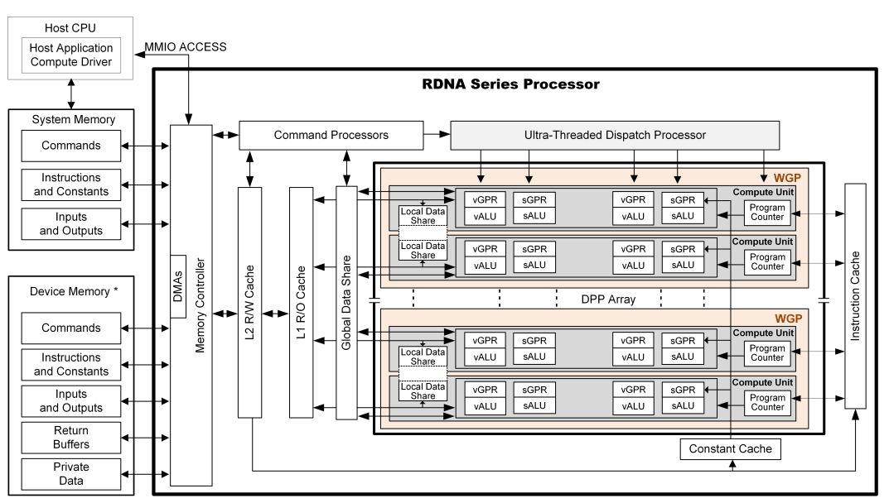
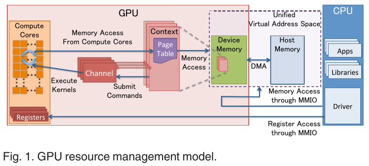
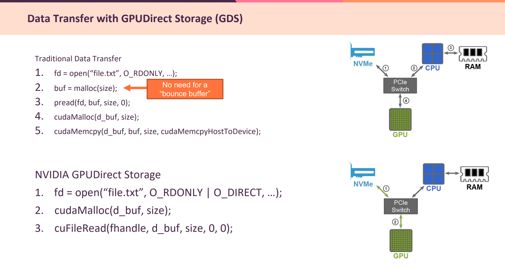

# CPU和GPU通信
 
 
      
 如果我们把它抽象下，一般可以看成下面的模型：   
   
+ GPU context   
GPU context代表GPU当前状态，每个context有自己的page table，多个context可以同时共存   

+ GPU Channel   
每个GPU context都有一个或者多个GPU Channel，CPU发给GPU的命令通过GPU Channel传递，
一般GPU Channel是一个软件概念，通常是一个ring buffer    

CPU和GPU通信主要有几下几种方式：   

+ 通过PCIe BAR空间映射出来的寄存器    
+ 通过PCIe BAR空间把GPU的内存映射到CPU的地址空间中   
+ 通过GPU的页表把CPU的系统内存映射到GPU的地址空间中   
+ 通过MSI中断 
# sendfile


[senfile](https://blog.csdn.net/weixin_46381158/article/details/129094170)   

```
init_sync_kiocb
```


# gds write read (类似sendfile)

       

```
int fd = open(file_name, O_DIRECT,...)
CUFileHandle_t *fh; 
CUFileDescr_t desc; 
desc.type=CU_FILE_HANDLE_TYPE_OPAQUE_FD;
desc.handle.fd = fd;
cuFileHandleRegister(&fh, &desc);
void *gpumem_buf;
cudaMalloc(gpumem_buf, buf_size);
cuFileRead(&fh, gpumem_buf, buf_size, …);
doit<<<gpumem_buf, …>>>
```
[gpu-direct](https://joyxu.github.io/2022/06/06/gpu-direct/)    
其中cudaMalloc/cuFileBufRegister会从GPU内存分配，并调用nvidia-fs.ko做映射，得到一个va和gpu pa/dma、cpu pa的映射，
后面再调用cuFileRead/cuFileWrite的时候把这个va传递给虚拟文件系统VFS，并通过kernel的call_write_iter/call_read_iter
函数进行文件读写，之后底层sas控制器或者nvme控制器的驱动通过dma_map相关函数把这个va又转换成具体的pa，把内容读或者
写到这块地址中，具体流程如下：
```
nvfs_open
 nvfs_blk_register_dma_ops
  register nvfs_dma_rw_ops 
```
NVFS_IOCTL_READ、NVFS_IOCTL_MAP 、NVFS_IOCTL_WRITE        
```
cuFileRead/cuFileWrite
 nvfs_ioctl
  nvfs_start_io_op
   nvfs_direct_io
    call_write_iter/call_read_iter
     blk_mq_ops.queue_rq
      nvme_queue_rq
       nvme_map_data
        dma_map_bvec
     call nvfs register dma callback
```

> ## input_param->cpuvaddr 怎么获取   

获取input_param->cpuvaddr地址参考 [gpu-direct-rdma](https://github.com/karakozov/gpudma/blob/7ecec64b69549a3f36b248340f449bd5e1457158/module/gpumemdrv.c)    
```
   size_t size = 0x100000;
    CUdeviceptr dptr = 0;
    unsigned int flag = 1;
    unsigned char *h_odata = NULL;
    h_odata = (unsigned char *)malloc(size);

    CUresult status = cuMemAlloc(&dptr, size);
	// TODO: add kernel driver interaction...
    lock.addr = dptr;
    lock.size = size;
    res = ioctl(fd, IOCTL_GPUMEM_LOCK, &lock);
```
1 malloc(size)    

2 cuMemAlloc(&dptr, size),没有采用cudaMallocManaged   

3 ioctl(fd, IOCTL_GPUMEM_LOCK, &lock)   

4 ioctl(fd, IOCTL_GPUMEM_STATE, state)   

5 cpu虚拟地址：   
mmap(0, state->page_size, PROT_READ|PROT_WRITE, MAP_SHARED, fd, (off_t)state->pages[i])   

> ## get_user_pages_fast    


 nvfs_mgroup_pin_shadow_pages -->  get_user_pages_fast( pin_user_pages_fast)   
 
 
Linux kernel get_user_pages_fast   is used to pin shadow pages.

> ## cuFileBufRegister(NVFS_IOCTL_MAP) and nvidia_p2p_get_pages   
The cuFileBufRegister function makes the pages that underlie a range of GPU virtual
memory accessible to a third-party device. This process is completed by pinning the GPU
device memory in the BAR space, which is an expensive operation and can take up to a
few milliseconds.    
cuFileBufRegister invokes nvidia_p2p_get_pages NVIDIA driver function to pin
GPU device memory in the BAR space. This information is obtained by running $ perf
top -g and getting the call graph of cuFileBufRegister    


>  ### nvfs_map

 nvfs_map_gpu_info
+ 调用 nvfs_get_endfence_page  ,pin end_fence_addr     
```
end_fence = (void *)input_param->end_fence_addr;
#ifdef HAVE_PIN_USER_PAGES_FAST
		ret = pin_user_pages_fast((unsigned long) end_fence, 1, 1,
			&gpu_info->end_fence_page);
#else
		ret = get_user_pages_fast((unsigned long) end_fence, 1, 1,
			&gpu_info->end_fence_page);
#endif
```
+ 调用  nvfs_pin_gpu_pages ，nvfs_nvidia_p2p_get_pages    
nvfs_nvidia_p2p_get_pages获取的物理地址page_table通过nvfs_mgroup_get_gpu_physical_address 被使用            
```
uint64_t nvfs_mgroup_get_gpu_physical_address(nvfs_mgroup_ptr_t nvfs_mgroup, struct page* page)
{
	struct nvfs_gpu_args *gpu_info = &nvfs_mgroup->gpu_info;
	unsigned long gpu_page_index = ULONG_MAX;
	pgoff_t pgoff = 0;
	dma_addr_t phys_base_addr, phys_start_addr;

	nvfs_mgroup_get_gpu_index_and_off(nvfs_mgroup, page,
			&gpu_page_index, &pgoff);

	phys_base_addr = gpu_info->page_table->pages[gpu_page_index]->physical_address;
	phys_start_addr = phys_base_addr + pgoff;

	return phys_start_addr;
}
```


## nvfs register dma callback

 
```
static int nvme_rdma_nvfs_map_data(struct ib_device *ibdev, struct request *rq, bool *is_nvfs_io, int* count)
{
		// associates bio pages to scatterlist
		*count = nvfs_ops->nvfs_blk_rq_map_sg(rq->q, rq , req->data_sgl.sg_table.sgl);
	 

		*count = nvfs_ops->nvfs_dma_map_sg_attrs(ibdev->dma_device,
				req->data_sgl.sg_table.sgl,
				req->data_sgl.nents,
				dma_dir,
				DMA_ATTR_NO_WARN);
 

```
 
#  struct file_operations nvfs_dev_fops

没有read、write     
```
struct file_operations nvfs_dev_fops = {
	.compat_ioctl = nvfs_ioctl,
	.unlocked_ioctl = nvfs_ioctl,
	.open = nvfs_open,
	.release = nvfs_close,
        .mmap = nvfs_mgroup_mmap,
        .owner = THIS_MODULE,
};
```
#  const struct vm_operations_struct nvfs_mmap_ops

```
static const struct vm_operations_struct nvfs_mmap_ops = {
	.open = nvfs_vma_open,
#ifdef HAVE_VM_OPS_SPLIT
	.split = nvfs_vma_split,
#else
	.may_split = nvfs_vma_split,
#endif
	.mremap = nvfs_vma_mremap,
	.close = nvfs_vma_close,
        .fault = nvfs_vma_fault,
        .pfn_mkwrite = nvfs_pfn_mkwrite,
        .page_mkwrite = nvfs_page_mkwrite,
};
```
+ nvfs_mgroup->nvfs_ppages[j] = alloc_page(GFP_USER|__GFP_ZERO);没有采用nvidia_p2p_get_pages(0, 0, map->vaddr, GPU_PAGE_SIZE * map->n_addrs, &gd->pages, 
            (void (*)(void*)) force_release_gpu_memory, map)        
```
static int nvfs_mgroup_mmap_internal(struct file *filp, struct vm_area_struct *vma)
{
for (i = 0; i < nvfs_blocks_count; i++) {
		j = i / nvfs_block_count_per_page;
		if (nvfs_mgroup->nvfs_ppages[j] == NULL) {
	                nvfs_mgroup->nvfs_ppages[j] = alloc_page(GFP_USER|__GFP_ZERO);
	                if (nvfs_mgroup->nvfs_ppages[j]) {
	                        nvfs_mgroup->nvfs_ppages[j]->index = (base_index * NVFS_MAX_SHADOW_PAGES) + j;
#ifdef CONFIG_FAULT_INJECTION
				if (nvfs_fault_trigger(&nvfs_vm_insert_page_error)) {
					ret = -EFAULT;
				}
				else
#endif
				{	
					// This will take a page reference which is released in mgroup_put
                        		ret = vm_insert_page(vma, vma->vm_start + j * PAGE_SIZE,
						nvfs_mgroup->nvfs_ppages[j]);
				}

	                        nvfs_dbg("vm_insert_page : %d pages: %lx mapping: %p, "
					  "index: %lx (%lx - %lx) ret: %d  \n",
                	                        j, (unsigned long)nvfs_mgroup->nvfs_ppages[j],
						nvfs_mgroup->nvfs_ppages[j]->mapping,
						nvfs_mgroup->nvfs_ppages[j]->index,
        	                                vma->vm_start + (j * PAGE_SIZE) ,
						vma->vm_start + (j + 1) * PAGE_SIZE,
						ret);
        	                if (ret) {
                	                nvfs_mgroup->nvfs_blocks_count = (j+1) * nvfs_block_count_per_page;
                        	        nvfs_mgroup_put(nvfs_mgroup);
					ret = -ENOMEM;
        				goto error;
                        	}
                	} else {
                        	nvfs_mgroup->nvfs_blocks_count = j * nvfs_block_count_per_page;
	                        nvfs_mgroup_put(nvfs_mgroup);
				ret = -ENOMEM;
        			goto error;
                	}
		}
                //fill the nvfs metadata header
                nvfs_mgroup->nvfs_metadata[i].nvfs_start_magic = NVFS_START_MAGIC;
                nvfs_mgroup->nvfs_metadata[i].nvfs_state = NVFS_IO_ALLOC;
                nvfs_mgroup->nvfs_metadata[i].page = nvfs_mgroup->nvfs_ppages[j];
        }
}
```

#  nvidia_p2p_get_pages
NVFS_IOCTL_MAP --> nvfs_map -->
nvfs_map_gpu_info  -->  nvfs_pin_gpu_pages

```
static int nvfs_pin_gpu_pages(nvfs_ioctl_map_t *input_param,
		struct nvfs_gpu_args *gpu_info)
{
	ret = nvfs_nvidia_p2p_get_pages(0, 0, gpu_virt_start, rounded_size,
			       &gpu_info->page_table,
                               nvfs_get_pages_free_callback, nvfs_mgroup);
}
```

#  nvfs_direct_io


```
ret = nvfs_direct_io(op, f,
                                        nvfsio->cpuvaddr,
                                        bytes_issued,
                                        fd_offset,
                                        nvfsio);
```

```
/*
 * Start IO operation
 */
static ssize_t
nvfs_direct_io(int op, struct file *filp, char __user *buf,
		size_t len, loff_t ppos, nvfs_io_t* nvfsio)
{
        struct iovec iov = { .iov_base = buf, .iov_len = len };
        struct iov_iter iter;
        ssize_t ret;

	init_sync_kiocb(&nvfsio->common, filp);
        nvfsio->common.ki_pos = ppos;
	nvfsio->common.private = NULL;

#ifdef HAVE_KI_COMPLETE
	if(nvfsio->sync) {
                nvfsio->common.ki_complete = NULL;
        } else {
                nvfsio->common.ki_complete = nvfs_io_complete;
        }
#else
	nvfsio->sync = true;
#endif

#ifdef CONFIG_FAULT_INJECTION
        if (nvfs_fault_trigger(&nvfs_rw_verify_area_error)) {
                ret = -EFAULT;
        }
        else
#endif
        {
		ret = nvfs_rw_verify_area(op, filp, buf, &ppos, len);
		#ifdef SIMULATE_BUG_RW_VERIFY_FAILURE
		ret = -EINVAL;
		#endif
	}

	if (ret) {
		nvfs_err("rw_verify_area failed with %zd\n", ret);
		// reset attached mgroup state for failed IO.
		nvfs_io_ret(&nvfsio->common, ret);
		return ret;
	}

        iov_iter_init(&iter, op, &iov, 1, len);

//TODO: If the config is not present fallback to vfs_read/vfs_write
#ifdef HAVE_CALL_READ_WRITE_ITER
        if(op == WRITE) {
                set_write_flag(&nvfsio->common);
                file_start_write(filp);

                ret = nvfs_io_ret(&nvfsio->common,
				call_write_iter(filp, &nvfsio->common, &iter));
                if (S_ISREG(file_inode(filp)->i_mode))
                        __sb_writers_release(file_inode(filp)->i_sb,
				SB_FREEZE_WRITE);
        } else {
                ret = nvfs_io_ret(&nvfsio->common,
				call_read_iter(filp, &nvfsio->common, &iter));
        }
#endif

        nvfs_dbg("nvfs_direct_io : ret = %ld len = %lu\n" , ret, len);
        if (ret == -EIOCBQUEUED) {
                BUG_ON(nvfsio->sync);
                nvfs_dbg("%s queued\n", opstr(op));
        }
        return ret;
}
```

init_sync_kiocb -->  call_read_iter    

> ## new_sync_read   


```

static ssize_t new_sync_read(struct file *filp, char __user *buf, size_t len, loff_t *ppos)
{
        struct iovec iov = { .iov_base = buf, .iov_len = len };
        struct kiocb kiocb;
        struct iov_iter iter;
        ssize_t ret; 

        init_sync_kiocb(&kiocb, filp);
        kiocb.ki_pos = (ppos ? *ppos : 0);
        iov_iter_init(&iter, READ, &iov, 1, len);

        ret = call_read_iter(filp, &kiocb, &iter);
        BUG_ON(ret == -EIOCBQUEUED);
        if (ppos)
                *ppos = kiocb.ki_pos;
        return ret; 
}
```

# references

[gpu-direct](https://joyxu.github.io/2022/06/06/gpu-direct/)       