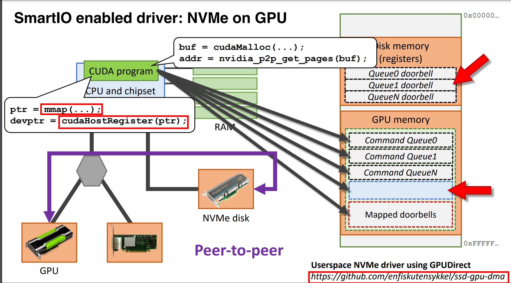

 
 
 
 
#  gpu 访问cpu内存(cudaHostRegister + cudaHostGetDevicePointer)   

The GPU CUDA Kernel is really not affected by the RDMA implementation. The Kernel receives a pointer to the pinned GPU memory and runs as needed. The only piece worth mentioning, in my opinion, is the option to map a region in the host’s physical address to be accessed directly by the GPU. I found this useful to create an IPC/Mailbox between the GPU and FPGA.   

I used a simple method (and surely not best practice). First, the host used mmap() “ /dev/mem” at the FPGA PCIe BAR address offset (0xb5c00000 in my example… Yes i know… i used a static address and it should be dynamically given by the PCIe driver but remember: “it was written with the sole intention of testing the hardware”) with the size of the BAR registers to get a virtual address of the FPGA BAR that can be accessed by the Host.   
```
fd_fpga = open(“/dev/mem”, O_RDWR|O_SYNC);
fpga_reg = (int *)mmap(0, 0x10000, PROT_READ|PROT_WRITE, MAP_SHARED, fd_fpga, 0xb5c00000);
```
After that, the CUDA code received the pointer to the mapped virtual address and used two functions, one to register the host memory address and a second to receive a pointer that can be directly used by the CUDA Kernel running on the GPU.    
```
checkCudaErrors(cudaHostRegister(fpga_reg, 0x10000, cudaHostRegisterIoMemory));
checkCudaErrors(cudaHostGetDevicePointer((void **)&d_fpga_reg, (void *)fpga_reg, 0));
```
I used this method to have the GPU directly write to the FPGA when certain events occurred i.e. when the first data word arrived, the last data word arrived or when the GPU processing has completed.


#  NV_PIN_GPU_MEMORY |  NV_UNPIN_GPU_MEMORY
```
static int pin(struct pin_buf_priv *pb)
{
    struct nv_gpu_mem gpumem = {
        .address = (__u64) pb->pub.address,
        .size = pb->pub.bufsize,
        .p2pToken = pb->tokens.p2pToken,
        .vaSpaceToken = pb->tokens.vaSpaceToken,
    };

    int ret = ioctl(devfd, NV_PIN_GPU_MEMORY, &gpumem);

    pb->pub.handle = gpumem.handle;

    return ret;
}

static int unpin(struct pin_buf_priv *pb)
{
    struct nv_gpu_mem gpumem = {
        .address = (__u64) pb->pub.address,
        .size = pb->pub.bufsize,
        .p2pToken = pb->tokens.p2pToken,
        .vaSpaceToken = pb->tokens.vaSpaceToken,
    };

    int ret = ioctl(devfd, NV_UNPIN_GPU_MEMORY, &gpumem);

    return ret;
}
```

init_pin_buf  -->   pin(pb)   

```

static int init_pin_buf(struct pin_buf_priv *pb, size_t bufsize)
{
    pb->pub.mmap = NULL;
    pb->pub.bufsize = bufsize;
    int err;
    if ((err = cudaMalloc(&pb->pub.address, bufsize)) != cudaSuccess) {
        errno = ENOMEM;
//        fprintf(stderr, "cudaMalloc failed %s\n",  cudaGetErrorString(err));
        return -ENOMEM;
    }

    if (cuPointerGetAttribute(&pb->tokens, CU_POINTER_ATTRIBUTE_P2P_TOKENS,
                              (CUdeviceptr) pb->pub.address) != CUDA_SUCCESS)
    {
        errno = EIO;
        goto free_buf;
    }

    if (pin(pb))
        goto free_buf;

    return 0;

free_buf:
    cudaFree(pb->pub.address);
//    fprintf(stderr, "free cuda pinned memory\n");
    return -errno;
}
```